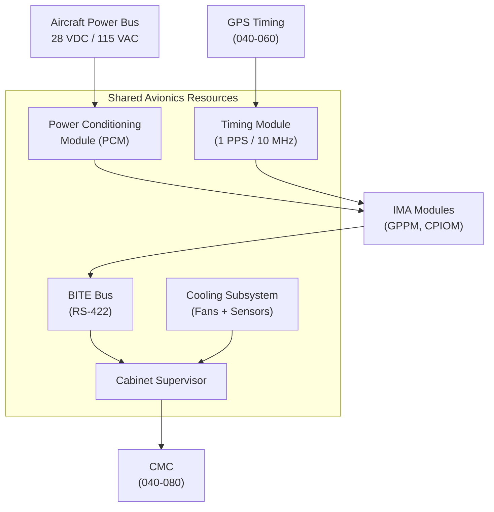
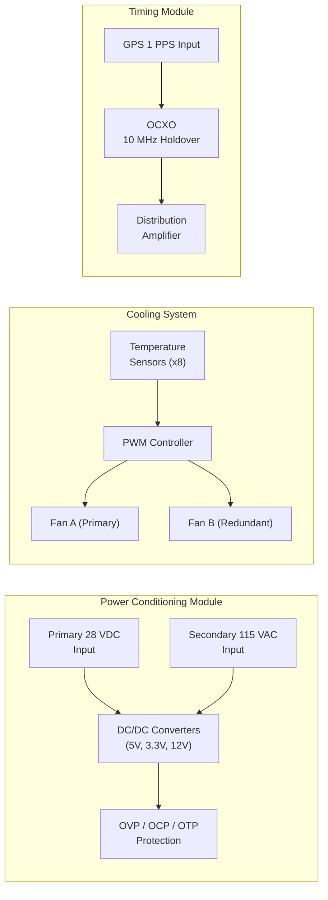
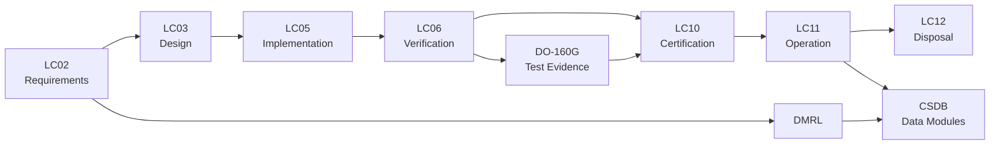

# ATLAS 040-049 · Section 04 · Subsection 040 · 050 — Shared Avionics Resources and Services

## 0. Hyperlink Policy

All linkable content in this file shall be expressed as Markdown links where a stable target exists.
Use relative links for repository-internal content; anchor links for headings, diagrams, glossary terms, citations, references, and footprint entries.
Use `TBD` as placeholder where no stable target yet exists.
Parent context: [040-000 Multisystem General](./040-000-Multisystem-General.md).

---

## 1. Purpose

This document defines the shared avionics resources and services architecture for the AMPEL360E. It covers the shared BITE bus, shared power distribution, shared cooling management, shared timing reference, resource arbitration, and service APIs exposed to hosted applications. Environmental qualification references [DO-160G](#ref-do-160g). It is the primary reference for avionics system architects, power and thermal engineers, and hosted application developers.

---

## 2. Applicability

| Attribute | Value |
|-----------|-------|
| Aircraft Model | AMPEL360E (all variants) |
| ATA Reference | [ATA iSpec 2200](#ref-ata-ispec-2200) — Chapter 040 |
| Environmental Standard | [DO-160G](#ref-do-160g) |
| Development Assurance | [DO-178C](#ref-do-178c), [DO-254](#ref-do-254) |
| Applicability Code | All S/N unless superseded by service bulletin |

---

## 3. System / Function Overview

Shared resources in the IMA architecture include: a cabinet-level BITE bus aggregating module health status; a shared 28 VDC / 115 VAC power distribution network with contactors and protection; a liquid-cooled (or forced-air) thermal management system per cabinet; and a shared timing reference distributed to all modules. Resource arbitration is enforced by the IMA OS/E for CPU and memory, and by dedicated hardware for power and cooling. Service APIs provide hosted applications with standardised access to shared resources without direct hardware dependency.

---

## 4. Scope

### 4.1 Included

- Shared BITE bus architecture (cabinet-level aggregation)
- Avionics power distribution (primary + emergency, contactors, protection)
- Cooling management (forced-air or liquid cooling per cabinet)
- Shared timing reference distribution (see also [040-060](./040-060-Time-Synchronization-and-Data-Integrity.md))
- Resource arbitration policies (CPU, memory, I/O bandwidth)
- Service APIs for power, thermal, and timing services
- DO-160G compliance scope

### 4.2 Excluded

- Aircraft-level power generation (ATA Chapter 024)
- Environmental control system for cabin (ATA Chapter 021)
- Detailed timing protocol (see [040-060](./040-060-Time-Synchronization-and-Data-Integrity.md))

---

## 5. Architecture Description

**Shared BITE Bus**: A dedicated low-bandwidth serial bus (RS-422) connects all IMA modules to a cabinet supervisor. The supervisor aggregates BITE status and forwards to [CMC](./040-080-Multisystem-Monitoring-Diagnostics-and-Control-Interfaces.md).

**Shared Power Distribution**: Each IMA cabinet has a Power Conditioning Module (PCM) receiving 28 VDC primary and 115 VAC secondary from the aircraft bus. PCM distributes regulated voltages to all modules via a protected backplane; individual module power is switchable by the supervisor.

**Shared Cooling**: Forced-air cooling with redundant fans and temperature sensors per cabinet. Cabinet supervisor monitors temperatures; fan speed is adjusted via PWM control. Overtemperature triggers shutdown of non-essential modules.

**Shared Timing**: A cabinet-level timing module distributes a 1 PPS and 10 MHz reference to all modules. The timing source is GPS-disciplined via [040-060](./040-060-Time-Synchronization-and-Data-Integrity.md).

---

## 6. Functional Breakdown

| Function ID | Function Name | Description | Allocated To | DAL |
|-------------|---------------|-------------|-------------|-----|
| F-001 | BITE Bus Aggregation | Collect and forward module health status to cabinet supervisor | Cabinet Supervisor | B |
| F-002 | Power Distribution | Regulate and distribute 28 VDC and 5 VDC to IMA modules | PCM | B |
| F-003 | Overtemperature Protection | Monitor temperatures; shed non-essential loads on overtemperature | Cabinet Supervisor | B |
| F-004 | Cooling Fan Management | PWM fan speed control based on thermal sensors | Cabinet Supervisor | B |
| F-005 | Timing Reference Distribution | Distribute 1 PPS and 10 MHz to all modules | Timing Module | A |
| F-006 | Resource Arbitration | Priority-based access arbitration for shared I/O and bus bandwidth | IMA OS/E + Hardware | A |
| F-007 | Service API | Expose power, thermal, and timing status to hosted applications via APEX ports | IMA OS/E | B |

---

## 7. Mermaid — System Context Diagram

---

## 8. Mermaid — Internal Functional Architecture

---

## 9. Mermaid — Lifecycle Traceability

---

## 10. Interfaces

| Interface ID | From | To | Protocol / Standard | Direction | Notes |
|-------------|------|----|---------------------|-----------|-------|
| IF-050-01 | Aircraft Power Bus | PCM | 28 VDC / 115 VAC | Input | MIL-STD-704F |
| IF-050-02 | PCM | IMA Modules | Backplane regulated voltages | Output | Per module power budget |
| IF-050-03 | IMA Modules | BITE Bus | RS-422 serial | Output | Module health status |
| IF-050-04 | Cabinet Supervisor | CMC | AFDX / ARINC 429 | Output | Aggregated health data |
| IF-050-05 | Timing Module | IMA Modules | 1 PPS + 10 MHz coax | Output | Precision timing reference |
| IF-050-06 | GPS (040-060) | Timing Module | 1 PPS + serial NMEA | Input | GPS discipline signal |
| IF-050-07 | APEX Service API | Hosted Applications | APEX ports (ARINC 653) | Bidirectional | Power/thermal/timing services |

---

## 11. Operating Modes

| Mode | Description | Trigger | System Response |
|------|-------------|---------|-----------------|
| Normal | All resources available; redundant fans operational | Nominal power-up | Full service to all modules |
| Degraded | One fan or one power converter failed | BITE detects failure | Remaining fan at full speed; power re-routed; alert to CMC |
| Maintenance | Cabinet powered but modules in ground-test mode | AMT command | Resource API available for diagnostics |
| Failure/Safe State | PCM or cooling total failure | Hardware fault | Cabinet powered down; cross-cabinet failover |

---

## 12. Monitoring and Diagnostics

- BITE bus continuously collects module-level health status; supervisor aggregates and forwards to CMC.
- Temperature sensors (8 per cabinet) monitored at 1 Hz; threshold alerts at 75°C and 85°C.
- Fan speed and current monitored; failure detected within 5 s.
- PCM output voltages monitored; out-of-tolerance condition (±5%) triggers module power alert.
- All shared resource telemetry available via [ARINC 615A download](./040-070-Configuration-Software-and-Data-Loading.md).

---

## 13. Maintenance Concept

| Task | Interval | Access | Tooling |
|------|----------|--------|---------|
| Fan filter cleaning | 500 FH | Cabinet access panel | Vacuum + cloth |
| Fan LRU swap | On condition | Cabinet access | Standard avionics tools |
| PCM LRU swap | On condition | E/E Bay | Standard avionics tools |
| Temperature sensor calibration | Per maintenance cycle | AMT / BITE | Calibration equipment |
| BITE bus health download | Per maintenance cycle | ARINC 615A | Ground data loader |

---

## 14. S1000D / CSDB Mapping

| Document Type | Data Module Code (DMC) | Info Code | Title |
|---------------|----------------------|-----------|-------|
| System Description | DMC-AMPEL360E-EWTW-040-050-00A-040A-A | 040 | Shared Resources Description |
| Maintenance Procedures | DMC-AMPEL360E-EWTW-040-050-00A-300A-A | 300 | Shared Resources Fault Isolation |
| BITE/Test | DMC-AMPEL360E-EWTW-040-050-00A-400A-A | 400 | BITE and Test Procedures |
| Wiring Data | DMC-AMPEL360E-EWTW-040-050-00A-520A-A | 520 | Power and BITE Bus Wiring |
| IPD | DMC-AMPEL360E-EWTW-040-050-00A-941A-A | 941 | Shared Resources LRU Parts |
| Software Desc | DMC-AMPEL360E-EWTW-040-050-00A-720A-A | 720 | Service API and Supervisor SW |

### Recommended Data Module Set

| Info Code | Publication | Applicability |
|-----------|-------------|---------------|
| 040 | AMM — System Description | All variants |
| 300 | FIM — Fault Isolation | All variants |
| 400 | TSM — BITE Procedures | All variants |
| 520 | AMM — Wiring Data | All variants |
| 720 | SRM — Software/API | All variants |
| 941 | IPD — Parts Data | All variants |

---

## 15. Footprints

### 15.1 Physical

| Item | Dimension (mm) | Mass (kg) | Location |
|------|---------------|-----------|----------|
| Power Conditioning Module | 222 × 194 × 25 | 1.5 | IMA Cabinet slot |
| Cabinet Supervisor Module | 222 × 194 × 25 | 1.2 | IMA Cabinet slot |
| Cooling Fan Assembly | 150 × 150 × 60 | 0.5 | Cabinet rear panel |
| Timing Module | 222 × 194 × 25 | 1.0 | IMA Cabinet slot |

### 15.2 Electrical / Data

| Interface | Standard | Bandwidth / Power |
|-----------|----------|-------------------|
| Primary Power Input | 28 VDC MIL-STD-704F | 400 W per cabinet |
| Secondary Power Input | 115 VAC 400 Hz | 200 VA per cabinet |
| BITE Bus | RS-422 | 115.2 kbps |
| Timing Reference | 1 PPS + 10 MHz coax | < 50 ns jitter |

### 15.3 Maintenance

| Task | Man-Hours | Skill Level | Access |
|------|-----------|-------------|--------|
| Fan swap | 0.3 | Avionics tech | Cabinet panel |
| PCM swap | 0.5 | Avionics tech | E/E Bay |
| Timing module swap | 0.5 | Avionics tech | E/E Bay |

### 15.4 Data

| Data Item | Volume | Storage | Retention |
|-----------|--------|---------|-----------|
| Thermal telemetry log | 32 MB | Supervisor NVM | 500 FH rolling |
| Power quality log | 16 MB | PCM NVM | 500 FH rolling |
| BITE aggregated log | 64 MB | Supervisor NVM | 500 FH rolling |

---

## 16. Safety and Certification Considerations

- DO-160G qualification required for PCM, fans, and timing module (temperature, vibration, EMI, humidity).
- Common-mode failure analysis required for shared power and cooling (no single failure shall cause loss of both cabinets).
- Power bus filter design must meet DO-160G Section 16 (power input) and Section 17 (voltage spike).
- Timing distribution accuracy must meet requirements of [040-060](./040-060-Time-Synchronization-and-Data-Integrity.md) for all DAL A applications.
- Resource arbitration algorithm must be analysed to demonstrate no resource starvation of DAL A partitions.

---

## 17. Verification and Validation

| V&V ID | Requirement | Method | Success Criteria | Status |
|--------|-------------|--------|-----------------|--------|
| VV-050-01 | PCM output voltage tolerance | Bench test | ±5% under all load conditions |  |
| VV-050-02 | Fan failure detection | Fault injection | Detected within 5 s |  |
| VV-050-03 | DO-160G temperature qualification | Environmental lab | Pass per DO-160G Section 4 |  |
| VV-050-04 | Timing jitter | Bench measurement | < 50 ns at module input |  |
| VV-050-05 | BITE bus aggregation | Integration test | All module status correctly aggregated |  |

---

## 18. Glossary

| Term/Acronym | Definition | Link |
|-------------|-----------|------|
| PCM | Power Conditioning Module — provides regulated power to IMA modules | [§5](#5-architecture-description) |
| OCXO | Oven-Controlled Crystal Oscillator — precision 10 MHz reference with holdover | [§5](#5-architecture-description) |
| PWM | Pulse-Width Modulation — fan speed control technique | [§6](#6-functional-breakdown) |
| BITE Bus | Built-In Test Equipment Bus — shared serial bus aggregating module health status | [§5](#5-architecture-description) |
| OVP | Over-Voltage Protection — circuit preventing module damage from excessive voltage | [§6](#6-functional-breakdown) |
| OCP | Over-Current Protection — circuit limiting current to safe levels | [§6](#6-functional-breakdown) |
| OTP | Over-Temperature Protection — thermal shutdown circuit | [§6](#6-functional-breakdown) |
| DO-160G | RTCA DO-160G — Environmental Conditions and Test Procedures | [§16](#16-safety-and-certification-considerations) |
| 1 PPS | One Pulse Per Second — precision timing signal from GPS | [§5](#5-architecture-description) |
| ppm | Parts Per Million — frequency accuracy metric for oscillators | [§15](#15-footprints) |
| RS-422 | EIA RS-422 — balanced differential serial communication standard | [§5](#5-architecture-description) |
| LRU | Line Replaceable Unit — modular unit replaceable at line maintenance | [§13](#13-maintenance-concept) |

---

## 19. Citations

| Ref | Citation | Use | Link |
|-----|---------|-----|------|
| DO-160G | RTCA DO-160G — Environmental Conditions and Test Procedures | Environmental qualification |  |
| DO-178C | RTCA DO-178C | Software assurance |  |
| DO-254 | RTCA DO-254 | Hardware assurance |  |
| GOV | Q+ATLANTIDE Governance Framework | Document governance | [Q+ATLANTIDE.md](../../../../organization/Q+ATLANTIDE.md) |
| S1000D | S1000D Issue 5.0 | CSDB mapping |  |
| ATA iSpec 2200 | ATA iSpec 2200 | ATA chapter alignment |  |

---

## 20. References

| Ref | Document | Identifier | Revision | Status | Link |
|-----|---------|-----------|---------|--------|------|
| REF-050-01 | Multisystem General | QATL-ATLAS-1000-ATLAS-040-049-04-040-000 | 1.0.0 | Active | [040-000](./040-000-Multisystem-General.md) |
| REF-050-02 | IMA Platform | QATL-ATLAS-1000-ATLAS-040-049-04-040-010 | 1.0.0 | Active | [040-010](./040-010-Integrated-Modular-Avionics-IMA.md) |
| REF-050-03 | Time Synchronisation | QATL-ATLAS-1000-ATLAS-040-049-04-040-060 | 1.0.0 | Active | [040-060](./040-060-Time-Synchronization-and-Data-Integrity.md) |
| REF-050-04 | RTCA DO-160G | DO-160G | G | Normative |  |

---

## 21. Open Issues

| ID | Issue | Owner | Status | Link |
|----|-------|-------|--------|------|
| OI-050-01 | Liquid vs forced-air cooling trade study pending | Q-AIR | Open |  |
| OI-050-02 | BITE bus bandwidth adequacy analysis for extended module count | Q-HPC | Open |  |
| OI-050-03 | DO-160G qualification test plan to be developed | Q-DATAGOV | Open |  |

---

## 22. Change Log

| Version | Date | Author | Change | Link |
|---------|------|--------|--------|------|
| 1.0.0 | 2026-05-09 | Q+ Team/Amedeo Pelliccia + AI | Initial creation with full 22-section template |  |
