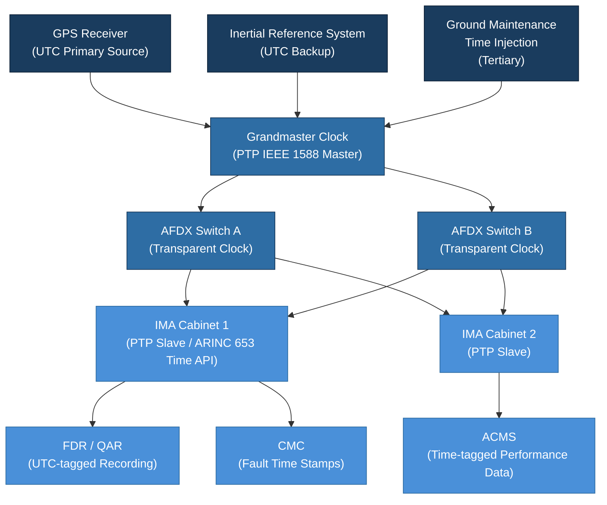

# ATLAS 040-049 · Section 04 · Subsection 040 · 060 — Time Synchronization and Data Integrity

## 1. Purpose

This document defines the **Time Synchronisation and Data Integrity** framework within the ATLAS 040 Multisystem domain. Time synchronisation is a foundational multisystem service: all avionics systems that exchange time-tagged data — navigation, flight management, engine control, maintenance recording — must share a common, accurate, and traceable time reference. Similarly, data integrity mechanisms ensure that information traversing shared networks and computing platforms is not corrupted, replayed, or used beyond its valid temporal window.

Within the Q+ATLANTIDE baseline, time synchronisation is classified as a safety-relevant service, subject to design assurance commensurate with the highest DAL of any system that depends on synchronised time for safety-critical decisions. This document establishes the time distribution architecture, accuracy requirements, GPS-based primary reference, and NTP adaptation methodology used in the ATLAS 040 framework.

## 2. Scope

This document covers:

- **Time reference architecture**: GPS-derived UTC as the primary aircraft time reference; Inertial Reference System (IRS) as a backup; ground maintenance time injection as a tertiary source;
- **Time Distribution Network (TDN)**: the mechanisms by which the primary time reference is distributed to all IMA partitions, LRUs, and data recorders across the AFDX network[^ref1];
- **IEEE 1588 / Precision Time Protocol (PTP) adaptation** for avionics: grandmaster clock selection, transparent clock switches, and accuracy budgets;
- **ARINC 653 time epoch management**: partition-level time API, relationship between wall-clock time and ARINC 653 scheduling time, and health monitoring of time source validity;
- **Data integrity mechanisms**: CRC validation on AFINC 429 and AFDX frames, sequence number management, freshness monitoring, and stale-data rejection policies;
- **Fault-tolerant time synchronisation**: redundant time masters, Byzantine fault containment, and switchover latency requirements;
- **Data age monitoring**: maximum allowable data age (MADA) definitions per data parameter type and the actions triggered when data age limits are exceeded;
- **Flight Data Recorder (FDR) time correlation**: ensuring that FDR time stamps are traceable to GPS UTC within ±1 second per applicable regulations[^ref2].

## 3. Glossary

| Term / Acronym | Definition |
|---|---|
| **UTC** | Coordinated Universal Time — the primary international time standard; GPS satellites broadcast UTC, which is used as the aircraft master time reference. |
| **PTP** | Precision Time Protocol (IEEE 1588) — a protocol for distributing sub-microsecond accuracy time over Ethernet networks, adapted for avionics AFDX environments. |
| **TDN** | Time Distribution Network — the logical and physical infrastructure for distributing the primary time reference to all avionics network nodes. |
| **Grandmaster Clock** | In PTP, the network node elected as the primary time source from which all other nodes synchronise; typically the GPS receiver or IRS in avionics applications. |
| **CRC** | Cyclic Redundancy Check — a mathematical error-detection code appended to data frames to detect transmission errors; mandatory on ARINC 429 and AFDX data. |
| **MADA** | Maximum Allowable Data Age — the maximum elapsed time since a data parameter was refreshed, beyond which the data is declared stale and may not be used for safety-critical decisions. |
| **Freshness Monitor** | A software or hardware function that tracks the age of received parameters and asserts a data-invalid flag when MADA is exceeded. |
| **IRS** | Inertial Reference System — provides an independent time reference and navigation data; used as backup time source when GPS is unavailable. |
| **FDR** | Flight Data Recorder — the mandatory crash-survivable recorder; its time stamps must be traceable to UTC to support accident investigation. |

## 4. Diagram

## 5. Footprint

| Metric | Value |
|---|---|
| Architecture | `ATLAS` — Aircraft Top Level Architecture Schema/System (controlled term) |
| Master range | `000–099` |
| Code range | `040-049` |
| Section | `04` — Aviónica, Información & APU |
| Subsection | `040` — Multisystem |
| Subsubject | `060` — Time Synchronization and Data Integrity |
| Primary Q-Division | Q-DATAGOV[^qdiv] |
| Support Q-Divisions | Q-AIR, Q-SPACE, Q-HPC |
| ORB support | ORB-PMO, ORB-LEG |
| Governance class | `baseline`[^gov] |
| Folder path | `Q+ATLANTIDE/000-099_ATLAS/040-049_Avionica-Informacion-y-APU/040_Multisystem/` |
| Document | `040-060-Time-Synchronization-and-Data-Integrity.md` (this file) |
| Parent subsection | [`README.md`](./README.md) |
| Parent section | [`../../README.md`](../../README.md) |
| Parent architecture | [`../../../README.md`](../../../README.md) |
| Parent baseline | [`organization/Q+ATLANTIDE.md`](../../../../organization/Q+ATLANTIDE.md) |

## 6. References & Citations

[^baseline]: **Q+ATLANTIDE controlled baseline (v1.0.0)** — [`organization/Q+ATLANTIDE.md`](../../../../organization/Q+ATLANTIDE.md).
[^qdiv]: **Q-Division authority** — [`organization/Q-Divisions/`](../../../../organization/Q-Divisions/).
[^gov]: **Governance class** — `baseline` denotes documents under controlled change management.
[^n001]: **Note N-001** — Q+ATLANTIDE is a taxonomy and traceability ecosystem. See [`organization/Q+ATLANTIDE.md` §4](../../../../organization/Q+ATLANTIDE.md#4-notes).
[^ref1]: **ARINC 664 Part 7** — Aircraft Data Network, AFDX. The AFDX switch fabric provides the physical medium for PTP grandmaster-to-slave time distribution; transparent clock implementations in AFDX switches correct residence time to maintain synchronisation accuracy.
[^ref2]: **CS-25 Appendix M / FAR Part 125** — Flight recorder regulations mandating UTC time correlation within ±1 second for all FDR time stamps.
[^ref3]: **IEEE 1588-2019** — Precision Clock Synchronization Protocol for Networked Measurement and Control Systems. Provides the PTP protocol specification adapted for avionics use; accuracy of <1 µs achievable with hardware timestamping in AFDX end systems.
[^ref4]: **ARINC 653** — Avionics Application Software Standard Interface. The APEX `GET_TIME` service provides partitions with access to the platform-level time, which must be synchronised to the aircraft time distribution network.
[^ref5]: **RTCA DO-178C / EUROCAE ED-12C** — Software Considerations. Time-tagged data processing and data age monitoring functions hosted on IMA platforms must be developed to the appropriate DAL with structural coverage verification.
[^ref6]: **EUROCAE ED-94C / RTCA DO-229** — GNSS receiver standards applicable to the GPS receiver providing the UTC primary reference; defines integrity and accuracy requirements for aviation-grade GPS time outputs.
