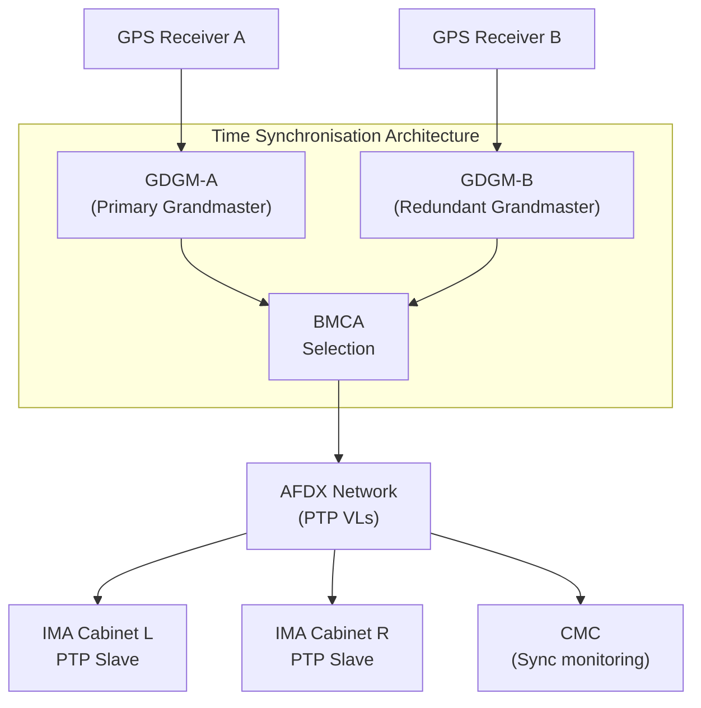
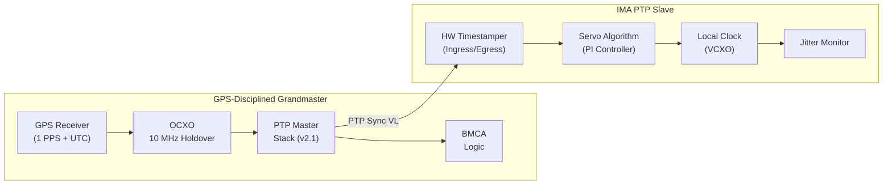
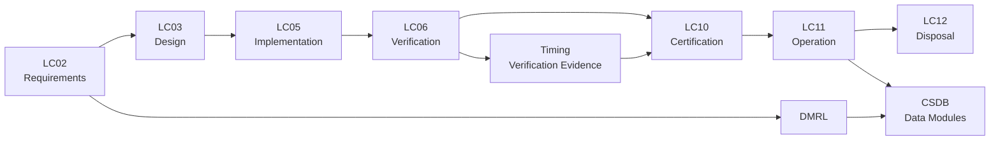

# ATLAS 040-049 · Section 04 · Subsection 040 · 060 — Time Synchronization and Data Integrity

## 0. Hyperlink Policy

All linkable content in this file shall be expressed as Markdown links where a stable target exists.
Use relative links for repository-internal content; anchor links for headings, diagrams, glossary terms, citations, references, and footprint entries.
Use `TBD` as placeholder where no stable target yet exists.
Parent context: [040-000 Multisystem General](./040-000-Multisystem-General.md) | Shared Resources: [040-050](./040-050-Shared-Avionics-Resources-and-Services.md).

---

## 1. Purpose

This document defines the time synchronisation and data integrity architecture for the AMPEL360E avionics multisystem. It covers IEEE 1588 Precision Time Protocol (PTP) over AFDX, GPS-disciplined grandmaster clocks, OCXO holdover, time distribution accuracy, TDMA scheduling dependency, jitter requirements, synchronisation monitoring, and failure detection. It is the primary reference for avionics timing engineers, network architects, and certification authorities.

---

## 2. Applicability

| Attribute | Value |
|-----------|-------|
| Aircraft Model | AMPEL360E (all variants) |
| ATA Reference | [ATA iSpec 2200](#ref-ata-ispec-2200) — Chapter 040 |
| Time Protocol | [IEEE 1588-2019](#ref-ieee1588) (PTP v2.1) over AFDX |
| GPS Standard | RTCA DO-316 / TSO-C145 |
| Development Assurance | [DO-178C](#ref-do-178c), [DO-254](#ref-do-254) |
| Applicability Code | All S/N unless superseded by service bulletin |

---

## 3. System / Function Overview

The AMPEL360E time synchronisation architecture uses IEEE 1588 PTP over the AFDX network to distribute a common time base to all avionics end-systems. A GPS-disciplined grandmaster clock (GDGM) provides UTC-traceable time with < 100 ns accuracy to UTC. In the event of GPS signal loss, an OCXO provides holdover with < 1 µs drift over 1 hour. PTP slave clocks in each IMA module synchronise to the grandmaster; jitter at any slave is < 1 µs. The common time base enables TDMA scheduling, correlated fault logging, and data validity timestamping.

---

## 4. Scope

### 4.1 Included

- IEEE 1588 PTP grandmaster and slave architecture over AFDX
- GPS-disciplined grandmaster clock (GDGM) design
- OCXO holdover specification and monitoring
- Time distribution accuracy and jitter requirements
- TDMA dependency on synchronised time base
- Synchronisation monitoring and failure detection
- Data integrity through time-stamping

### 4.2 Excluded

- GPS receiver hardware design (ATA Chapter 034)
- AFDX network topology (see [040-030](./040-030-Avionics-Networks-and-Data-Buses.md))
- Shared timing reference hardware distribution (see [040-050](./040-050-Shared-Avionics-Resources-and-Services.md))

---

## 5. Architecture Description

**Grandmaster Clock**: Dual GPS-Disciplined Grandmaster clocks (GDGM-A, GDGM-B) connected to independent GPS receivers. Best Master Clock Algorithm (BMCA) selects the active grandmaster. Each GDGM contains an OCXO for holdover.

**PTP over AFDX**: PTP messages are transmitted as AFDX VLs (dedicated sync VL, follow-up VL, delay request/response VLs). AFDX switch transparency ensures bounded message latency, enabling sub-microsecond synchronisation at slave clocks.

**Slave Clocks**: Each IMA GPPM/CPIOM contains a PTP slave hardware timestamper. Servo algorithm adjusts local clock to track grandmaster. Time accuracy at slave: < 1 µs of UTC.

**Data Integrity**: All AFDX frames carry an ARINC 664 sequence number. ARINC 429 words carry parity. Hosted applications timestamp incoming data with local PTP time for validity window checking.

---

## 6. Functional Breakdown

| Function ID | Function Name | Description | Allocated To | DAL |
|-------------|---------------|-------------|-------------|-----|
| F-001 | GPS Time Acquisition | Receive GPS signals; compute UTC time; discipline OCXO | GDGM | B |
| F-002 | PTP Grandmaster | Transmit PTP Sync/Announce/Follow-Up messages | GDGM | A |
| F-003 | BMCA Selection | Elect active grandmaster from available GDGM candidates | GDGM + Slaves | A |
| F-004 | OCXO Holdover | Maintain < 1 µs/hr drift during GPS signal loss | GDGM OCXO | A |
| F-005 | PTP Slave Servo | Adjust local clock phase and frequency to track grandmaster | IMA Module (HW) | A |
| F-006 | Jitter Monitoring | Measure and log PTP sync deviation at each slave | IMA Module | B |
| F-007 | Data Integrity Timestamping | Append PTP timestamp to all incoming data frames for validity checking | IMA OS/E | B |

---

## 7. Mermaid — System Context Diagram

---

## 8. Mermaid — Internal Functional Architecture

---

## 9. Mermaid — Lifecycle Traceability

---

## 10. Interfaces

| Interface ID | From | To | Protocol / Standard | Direction | Notes |
|-------------|------|----|---------------------|-----------|-------|
| IF-060-01 | GPS Receiver A/B | GDGM A/B | 1 PPS + RS-422 NMEA | Input | UTC time reference |
| IF-060-02 | GDGM A/B | AFDX Network | PTP VLs (IEEE 1588 / ARINC 664) | Output | Sync, Follow-Up, Announce messages |
| IF-060-03 | AFDX Network | IMA PTP Slaves | PTP VLs | Input | Grandmaster sync messages |
| IF-060-04 | GDGM | Shared Timing Module (040-050) | 1 PPS + 10 MHz coax | Output | Hardware timing reference |
| IF-060-05 | IMA PTP Slave | IMA OS/E | Internal bus | Output | Synchronised time for APEX |
| IF-060-06 | Jitter Monitor | CMC | AFDX management VL | Output | Synchronisation health telemetry |

---

## 11. Operating Modes

| Mode | Description | Trigger | System Response |
|------|-------------|---------|-----------------|
| Normal | GPS-locked grandmaster; all slaves synchronised within 1 µs | GPS locked | Full PTP synchronisation operational |
| Holdover | GPS signal lost; OCXO maintains time | GPS signal loss detected | OCXO holdover active; alert to CMC; accuracy degrades over time |
| Degraded | One GDGM failed; single grandmaster operation | GDGM failure | BMCA selects surviving GDGM; advisory to crew |
| Failure/Safe State | Both GDGMs failed; PTP unavailable | Double GDGM failure | TDMA-dependent functions enter safe state; fault logged |

---

## 12. Monitoring and Diagnostics

- PTP slave continuously measures offset from grandmaster; 1 Hz logging of mean path delay and offset.
- Jitter threshold alert if slave offset exceeds 1 µs for > 5 consecutive sync intervals.
- GPS lock status forwarded to CMC via dedicated AFDX management VL.
- OCXO holdover drift computed and projected; alert if projected drift will exceed 10 µs within 30 min.
- BITE tests OCXO output frequency at power-up and hourly.

---

## 13. Maintenance Concept

| Task | Interval | Access | Tooling |
|------|----------|--------|---------|
| GDGM BITE check | Power-up | CMC display | None |
| GDGM LRU swap | On condition | E/E Bay | Standard avionics tools |
| GPS antenna inspection | Per maintenance cycle | External antenna location | Visual inspection |
| PTP synchronisation log download | Per maintenance cycle | ARINC 615A | Ground data loader |
| OCXO aging calibration | 5000 FH | Engineering calibration | Frequency standard |

---

## 14. S1000D / CSDB Mapping

| Document Type | Data Module Code (DMC) | Info Code | Title |
|---------------|----------------------|-----------|-------|
| System Description | DMC-AMPEL360E-EWTW-040-060-00A-040A-A | 040 | Time Synchronisation Description |
| Maintenance Procedures | DMC-AMPEL360E-EWTW-040-060-00A-300A-A | 300 | GDGM Fault Isolation |
| BITE/Test | DMC-AMPEL360E-EWTW-040-060-00A-400A-A | 400 | Timing BITE Procedures |
| Wiring Data | DMC-AMPEL360E-EWTW-040-060-00A-520A-A | 520 | Timing Wiring and Connector Data |
| IPD | DMC-AMPEL360E-EWTW-040-060-00A-941A-A | 941 | GDGM Illustrated Parts |
| Software Desc | DMC-AMPEL360E-EWTW-040-060-00A-720A-A | 720 | PTP Stack and Servo SW Description |

### Recommended Data Module Set

| Info Code | Publication | Applicability |
|-----------|-------------|---------------|
| 040 | AMM — System Description | All variants |
| 300 | FIM — Fault Isolation | All variants |
| 400 | TSM — BITE Procedures | All variants |
| 520 | AMM — Wiring Data | All variants |
| 720 | SRM — Software Description | All variants |
| 941 | IPD — Parts Data | All variants |

---

## 15. Footprints

### 15.1 Physical

| Item | Dimension (mm) | Mass (kg) | Location |
|------|---------------|-----------|----------|
| GDGM-A | 222 × 194 × 50 | 1.8 | IMA Cabinet Left |
| GDGM-B | 222 × 194 × 50 | 1.8 | IMA Cabinet Right |
| GPS Antenna A | 80 × 80 × 30 | 0.2 | Fuselage top — forward |
| GPS Antenna B | 80 × 80 × 30 | 0.2 | Fuselage top — aft |

### 15.2 Electrical / Data

| Interface | Standard | Bandwidth / Power |
|-----------|----------|-------------------|
| GPS Antenna cable | TNC coax | N/A |
| PTP VL over AFDX | ARINC 664 Part 7 | < 1 Mbps |
| GDGM power | 28 VDC | 15 W per GDGM |
| 1 PPS output | RS-422 | < 50 ns rise time |

### 15.3 Maintenance

| Task | Man-Hours | Skill Level | Access |
|------|-----------|-------------|--------|
| GDGM swap | 0.5 | Avionics tech | E/E Bay |
| GPS antenna swap | 0.5 | Avionics tech | Fuselage exterior |
| Log download | 0.25 | Avionics tech | AMT |

### 15.4 Data

| Data Item | Volume | Storage | Retention |
|-----------|--------|---------|-----------|
| PTP synchronisation log | 64 MB | GDGM NVM | 500 FH rolling |
| OCXO drift history | 16 MB | GDGM NVM | Life of equipment |
| GPS lock/unlock events | 8 MB | GDGM NVM | 500 FH rolling |

---

## 16. Safety and Certification Considerations

- Dual GDGM architecture provides single-failure tolerance for time distribution.
- OCXO holdover ensures time availability during GPS outages consistent with flight crew alerting requirements.
- PTP servo algorithm must be qualified per [DO-178C](#ref-do-178c) DAL A (timing is safety-critical for TDMA-scheduled systems).
- IEEE 1588 profile used must be defined and frozen in the NDF; deviation requires re-qualification.
- Data integrity timestamping must satisfy maximum age requirements of each hosted application.
- GPS spoofing detection capability is a future requirement (quantum-enhanced PNT study under [Q-SPACE](../../../../organization/Q-Divisions/Q-SPACE.md)).

---

## 17. Verification and Validation

| V&V ID | Requirement | Method | Success Criteria | Status |
|--------|-------------|--------|-----------------|--------|
| VV-060-01 | PTP slave accuracy | Lab measurement (vs GPS reference) | < 1 µs offset under normal conditions |  |
| VV-060-02 | OCXO holdover | Lab test — GPS signal removed for 1 hr | < 1 µs drift after 1 hr |  |
| VV-060-03 | BMCA failover | Fault injection — primary GDGM removed | Secondary GDGM assumes master within 3 s |  |
| VV-060-04 | Jitter monitoring alert | Induced sync jitter > 1 µs | Alert to CMC within 5 sync intervals |  |
| VV-060-05 | DO-178C DAL A PTP servo | Design review + structural coverage | All objectives satisfied |  |

---

## 18. Glossary

| Term/Acronym | Definition | Link |
|-------------|-----------|------|
| PTP | Precision Time Protocol — IEEE 1588 protocol for sub-microsecond network time synchronisation | [§3](#3-system--function-overview) |
| GDGM | GPS-Disciplined Grandmaster — PTP grandmaster clock disciplined by GPS receiver | [§5](#5-architecture-description) |
| BMCA | Best Master Clock Algorithm — IEEE 1588 algorithm for grandmaster election | [§5](#5-architecture-description) |
| OCXO | Oven-Controlled Crystal Oscillator — precision frequency reference with thermal stabilisation | [§5](#5-architecture-description) |
| UTC | Coordinated Universal Time — international atomic time standard | [§3](#3-system--function-overview) |
| TDMA | Time Division Multiple Access — scheduled communication dependent on synchronised time | [§3](#3-system--function-overview) |
| Servo | PTP servo algorithm — PI controller adjusting local clock phase/frequency | [§6](#6-functional-breakdown) |
| VCXO | Voltage-Controlled Crystal Oscillator — adjustable frequency reference in PTP slave | [§8](#8-mermaid--internal-functional-architecture) |
| 1 PPS | One Pulse Per Second — precision GPS-sourced timing signal | [§5](#5-architecture-description) |
| PNT | Positioning, Navigation, and Timing — integrated capability including GPS | [§16](#16-safety-and-certification-considerations) |
| Holdover | Period during which OCXO maintains accurate time without GPS reference | [§5](#5-architecture-description) |
| Jitter | Random variation in signal timing; measured as standard deviation of PTP offset | [§12](#12-monitoring-and-diagnostics) |

---

## 19. Citations

| Ref | Citation | Use | Link |
|-----|---------|-----|------|
| IEEE 1588 | IEEE 1588-2019 — Precision Clock Synchronization Protocol for Networked Measurement and Control Systems | PTP standard |  |
| DO-178C | RTCA DO-178C | Software assurance |  |
| DO-254 | RTCA DO-254 | Hardware assurance |  |
| GOV | Q+ATLANTIDE Governance Framework | Document governance | [Q+ATLANTIDE.md](../../../../organization/Q+ATLANTIDE.md) |
| S1000D | S1000D Issue 5.0 | CSDB mapping |  |
| ATA iSpec 2200 | ATA iSpec 2200 | ATA chapter alignment |  |

---

## 20. References

| Ref | Document | Identifier | Revision | Status | Link |
|-----|---------|-----------|---------|--------|------|
| REF-060-01 | Multisystem General | QATL-ATLAS-1000-ATLAS-040-049-04-040-000 | 1.0.0 | Active | [040-000](./040-000-Multisystem-General.md) |
| REF-060-02 | Shared Resources | QATL-ATLAS-1000-ATLAS-040-049-04-040-050 | 1.0.0 | Active | [040-050](./040-050-Shared-Avionics-Resources-and-Services.md) |
| REF-060-03 | Avionics Networks | QATL-ATLAS-1000-ATLAS-040-049-04-040-030 | 1.0.0 | Active | [040-030](./040-030-Avionics-Networks-and-Data-Buses.md) |
| REF-060-04 | IEEE 1588-2019 | IEEE 1588 | 2019 | Normative |  |

---

## 21. Open Issues

| ID | Issue | Owner | Status | Link |
|----|-------|-------|--------|------|
| OI-060-01 | IEEE 1588 profile definition (transport-specific, domain number) to be agreed | Q-DATAGOV | Open |  |
| OI-060-02 | GPS spoofing detection requirement pending Q-SPACE study | Q-SPACE | Open |  |
| OI-060-03 | OCXO holdover specification (1 µs/hr vs 10 µs/hr) to be agreed with certification authority | Q-AIR | Open |  |

---

## 22. Change Log

| Version | Date | Author | Change | Link |
|---------|------|--------|--------|------|
| 1.0.0 | 2026-05-09 | Q-DATAGOV / Copilot | Initial creation with full 22-section template |  |
