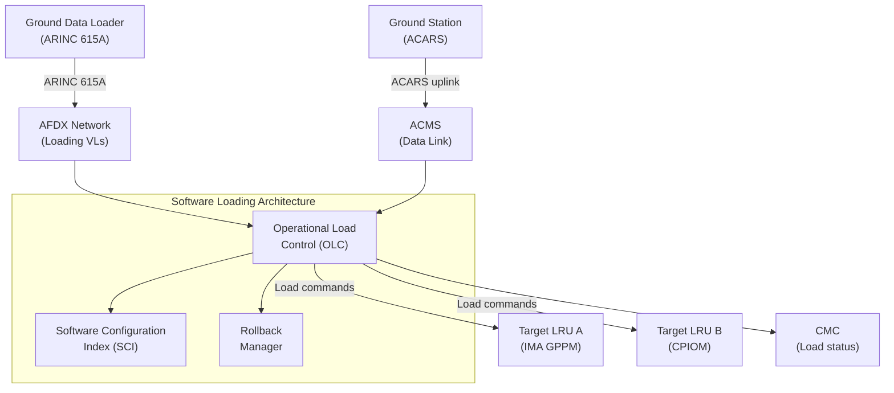
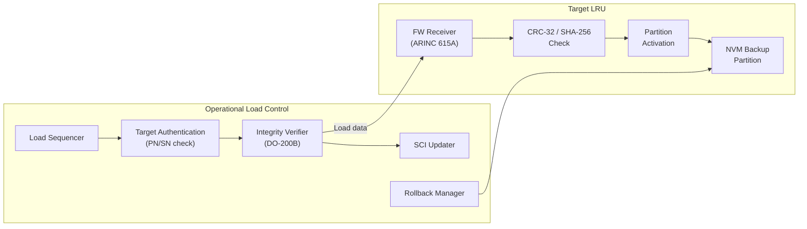
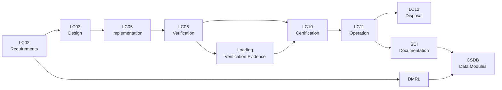

# ATLAS 040-049 · Section 04 · Subsection 040 · 070 — Configuration, Software and Data Loading

## 0. Hyperlink Policy

All linkable content in this file shall be expressed as Markdown links where a stable target exists.
Use relative links for repository-internal content; anchor links for headings, diagrams, glossary terms, citations, references, and footprint entries.
Use `TBD` as placeholder where no stable target yet exists.
Parent context: [040-000 Multisystem General](./040-000-Multisystem-General.md) | Related: [040-060 Time Synchronization](./040-060-Time-Synchronization-and-Data-Integrity.md).

---

## 1. Purpose

This document defines the configuration, software and data loading architecture for the AMPEL360E avionics multisystem. It covers ARINC 615A data loading over AFDX, DO-200B data integrity controls, the software configuration index (SCI), operational load control procedures, post-load verification, rollback mechanisms, ACARS-triggered loading, and compliance with EASA AMC 20-21. It is the primary reference for software loading engineers, avionics configuration managers, and certification authorities.

---

## 2. Applicability

| Attribute | Value |
|-----------|-------|
| Aircraft Model | AMPEL360E (all variants) |
| ATA Reference | [ATA iSpec 2200](#ref-ata-ispec-2200) — Chapter 040 |
| Loading Protocol | ARINC 615A over AFDX |
| Data Integrity Standard | [DO-200B](#ref-do-200b) |
| Development Assurance | [DO-178C](#ref-do-178c), [DO-254](#ref-do-254) |
| Regulatory Compliance | [EASA AMC 20-21](#ref-easa-amc-20-21) |
| Applicability Code | All S/N unless superseded by service bulletin |

---

## 3. System / Function Overview

The AMPEL360E software and data loading architecture uses ARINC 615A as the ground-to-avionics data transfer protocol over the AFDX network. A dedicated Operational Load Control (OLC) function manages load sequencing, target identification, and post-load verification. DO-200B-compliant data integrity checks (CRC-32 and hash validation) are applied to all loadable software parts (LSP) and loadable data parts (LDP). The Software Configuration Index (SCI) records the configuration state of all hosted partitions following each loading event. ACARS-triggered loading allows remote-initiated updates from ground operations via the ACMS data link. Rollback to a previously certified configuration is supported for any failed loading event.

---

## 4. Scope

### 4.1 Included

- ARINC 615A data loading protocol over AFDX
- DO-200B data integrity controls (CRC-32, hash, digital signature)
- Software Configuration Index (SCI) management
- Operational Load Control (OLC) function
- Post-load verification and go/no-go criteria
- Rollback to prior certified configuration
- ACARS-triggered remote loading via ACMS data link
- EASA AMC 20-21 compliance framework

### 4.2 Excluded

- GPS receiver firmware loading (ATA Chapter 034)
- Engine FADEC software loading (ATA Chapter 073)
- In-flight entertainment content loading (ATA Chapter 044)
- Ground support equipment (GSE) software supply chain management

---

## 5. Architecture Description

**ARINC 615A over AFDX**: The Data Loader (DL) function communicates with avionics target Line Replaceable Units (LRUs) using ARINC 615A protocol encapsulated within AFDX VLs. A dedicated loading AFDX VL set is allocated to prevent interference with operational traffic. The Ground Data Loader (GDL) connects to the aircraft via the ARINC 615A port on the Aircraft Interface Panel (AIP).

**Operational Load Control (OLC)**: The OLC function, hosted in the IMA Core Processing Module, arbitrates loading requests, verifies target LRU identity (part number, serial number), sequences multi-target loads, and enforces the loading inhibit window during flight. The OLC reports status to the CMC.

**Software Configuration Index (SCI)**: Following each successful loading event, the SCI is updated with the new part number, version, and DO-200B integrity checksum for each loaded partition. The SCI is stored in non-volatile memory and transmitted to the CMC and maintenance terminal.

**DO-200B Integrity**: All loadable software parts (LSP) and loadable data parts (LDP) carry a DO-200B compliant integrity envelope: CRC-32 for block-level checking and SHA-256 digital signature for end-to-end authenticity. Target LRUs verify both checks before activating new software.

**ACARS-Triggered Loading**: A secure ACARS uplink from ground operations can initiate loading of approved database updates (e.g., navigation database). The ACMS validates the uplink, creates a loading request to the OLC, and logs the event in the ACARS journal.

**Rollback**: If post-load verification fails or crew/maintenance requests rollback, the OLC restores the previous software version from protected NVM backup partition and updates the SCI accordingly.

---

## 6. Functional Breakdown

| Function ID | Function Name | Description | Allocated To | DAL |
|-------------|---------------|-------------|-------------|-----|
| F-001 | ARINC 615A Data Transfer | Execute ARINC 615A protocol for software/data transfer to target LRUs | OLC / IMA | B |
| F-002 | DO-200B Integrity Verification | Verify CRC-32 and SHA-256 signature on all LSP/LDP before activation | Target LRU FW | B |
| F-003 | SCI Management | Record and maintain Software Configuration Index for all partitions | OLC | B |
| F-004 | Load Sequencing and Control | Sequence multi-target loads, enforce flight inhibit, report status | OLC | B |
| F-005 | Post-Load Verification | Execute operational readiness test on loaded software before activation | Target LRU + OLC | B |
| F-006 | Rollback Execution | Restore prior certified configuration from NVM backup on failure | OLC | B |
| F-007 | ACARS-Triggered Loading | Receive and validate ACARS uplink loading requests; forward to OLC | ACMS | C |

---

## 7. Mermaid — System Context Diagram

---

## 8. Mermaid — Internal Functional Architecture

---

## 9. Mermaid — Lifecycle Traceability

---

## 10. Interfaces

| Interface ID | From | To | Protocol / Standard | Direction | Notes |
|-------------|------|----|---------------------|-----------|-------|
| IF-070-01 | Ground Data Loader (GDL) | Aircraft Interface Panel (AIP) | ARINC 615A / Ethernet | Input | Primary ground loading connection |
| IF-070-02 | AIP | AFDX Network | ARINC 664 Part 7 | Bidirectional | Loading VLs dedicated to OLC |
| IF-070-03 | ACARS Ground Station | ACMS | ACARS ARINC 618 | Input | Remote database update triggers |
| IF-070-04 | OLC | Target LRUs | ARINC 615A over AFDX | Output | Software/data transfer to LRUs |
| IF-070-05 | Target LRU | OLC | ARINC 615A status | Output | Load accept/reject/status |
| IF-070-06 | OLC | CMC | AFDX management VL | Output | Load status, SCI delta report |
| IF-070-07 | OLC | SCI Database (NVM) | Internal bus | Bidirectional | SCI read/write after loading |

---

## 11. Operating Modes

| Mode | Description | Trigger | System Response |
|------|-------------|---------|-----------------|
| Standby | OLC initialised; no loading in progress | Aircraft powered, no load request | OLC monitors for load requests; SCI available |
| Loading | Active ARINC 615A transfer to target LRU | GDL or ACARS load request accepted | OLC sequences transfer; flight inhibit active |
| Verifying | Post-load operational readiness test execution | Transfer complete | Target LRU executes self-test; OLC awaits result |
| Committed | Loaded software activated; SCI updated | Verification passed | New software active; SCI committed; NVM backup updated |
| Rollback | Prior software restored from NVM backup | Verification failed or crew request | OLC restores backup; SCI updated; alert to CMC |
| Inhibited | Loading blocked during flight | WOW = air | All load requests rejected; advisory logged |

---

## 12. Monitoring and Diagnostics

- OLC reports loading progress (percentage complete) to CMC at 1 Hz during active transfer.
- Transfer errors (CRC failures, ARINC 615A protocol errors) are logged with LRU ID, timestamp, and error code.
- SCI delta report generated and transmitted to CMC after each committed load.
- Post-load verification failures trigger a BITE fault record in the target LRU fault log.
- ACARS-triggered loading events are logged in the ACMS journal with uplink message ID and completion status.
- WOW-based flight inhibit status is continuously monitored; any inhibit override attempt is flagged as a maintenance event.

---

## 13. Maintenance Concept

| Task | Interval | Access | Tooling |
|------|----------|--------|---------|
| SCI verification (read) | Pre/post maintenance | CMC display or AMT | None |
| Software load (scheduled update) | Per service bulletin | Aircraft Interface Panel (AIP) | ARINC 615A ground data loader |
| Navigation database update | Per AIRAC cycle (28 days) | ACARS or AIP | GDL or ACARS uplink |
| Post-load verification review | After each load | CMC / AMT | None |
| Rollback execution | On condition | CMC / AMT | None |
| OLC BITE check | Power-up | CMC display | None |

---

## 14. S1000D / CSDB Mapping

| Document Type | Data Module Code (DMC) | Info Code | Title |
|---------------|----------------------|-----------|-------|
| System Description | DMC-AMPEL360E-EWTW-040-070-00A-040A-A | 040 | Configuration and Software Loading Description |
| Maintenance Procedures | DMC-AMPEL360E-EWTW-040-070-00A-300A-A | 300 | Software Load Fault Isolation |
| Loading Procedures | DMC-AMPEL360E-EWTW-040-070-00A-310A-A | 310 | ARINC 615A Ground Data Loading Procedure |
| BITE/Test | DMC-AMPEL360E-EWTW-040-070-00A-400A-A | 400 | OLC BITE Procedures |
| Wiring Data | DMC-AMPEL360E-EWTW-040-070-00A-520A-A | 520 | AIP Wiring and Connector Data |
| Software Desc | DMC-AMPEL360E-EWTW-040-070-00A-720A-A | 720 | OLC and SCI Software Description |

### Recommended Data Module Set

| Info Code | Publication | Applicability |
|-----------|-------------|---------------|
| 040 | AMM — System Description | All variants |
| 300 | FIM — Fault Isolation | All variants |
| 310 | AMM — Loading Procedures | All variants |
| 400 | TSM — BITE Procedures | All variants |
| 520 | AMM — Wiring Data | All variants |
| 720 | SRM — Software Description | All variants |

---

## 15. Footprints

### 15.1 Physical

| Item | Dimension (mm) | Mass (kg) | Location |
|------|---------------|-----------|----------|
| Aircraft Interface Panel (AIP) | 300 × 200 × 60 | 2.0 | E/E Bay — forward panel |
| OLC partition (hosted on IMA) | N/A (hosted) | N/A | IMA Cabinet Left |
| SCI NVM module | 50 × 30 × 10 | 0.1 | IMA Cabinet Left |

### 15.2 Electrical / Data

| Interface | Standard | Bandwidth / Power |
|-----------|----------|-------------------|
| AIP Ethernet port | ARINC 615A / 100BASE-TX | 100 Mbps |
| AFDX loading VLs | ARINC 664 Part 7 | < 50 Mbps allocated |
| AIP power | 28 VDC | 5 W |
| NVM power | Internal IMA bus | < 1 W |

### 15.3 Maintenance

| Task | Man-Hours | Skill Level | Access |
|------|-----------|-------------|--------|
| Scheduled software load | 1.0 | Avionics tech | E/E Bay / AIP |
| Navigation database update (ACARS) | 0.25 | Avionics tech | ACARS terminal |
| SCI verification | 0.25 | Avionics tech | AMT |
| OLC BITE check | 0.1 | Avionics tech | CMC display |

### 15.4 Data

| Data Item | Volume | Storage | Retention |
|-----------|--------|---------|-----------|
| Software Configuration Index (SCI) | 8 MB | IMA NVM | Life of aircraft |
| Loading event log | 32 MB | IMA NVM | 500 FH rolling |
| ACARS load journal | 16 MB | ACMS NVM | 500 FH rolling |
| NVM backup partition | 512 MB | IMA NVM | Per certified config |

---

## 16. Safety and Certification Considerations

- ARINC 615A loading is flight-inhibited via WOW; any override requires documented maintenance authority.
- DO-200B data integrity controls (CRC-32, SHA-256) ensure authenticity and completeness of all loaded software and data; classified as software assurance level consistent with target partition DAL.
- SCI must be verified by maintenance personnel before return to service; discrepancy between SCI and installed software is a non-dispatch condition.
- EASA AMC 20-21 compliance requires that all loadable software parts are produced under a DO-178C-qualified software development process and are identified in the aircraft type design.
- Rollback capability must be tested as part of the initial loading qualification test program.
- ACARS-triggered loading is restricted to Category A data (navigation databases) unless additional airworthiness review is completed.

---

## 17. Verification and Validation

| V&V ID | Requirement | Method | Success Criteria | Status |
|--------|-------------|--------|-----------------|--------|
| VV-070-01 | ARINC 615A protocol compliance | Protocol conformance test | All mandatory ARINC 615A services pass |  |
| VV-070-02 | DO-200B CRC-32 integrity | Fault injection — corrupted LSP load | Target LRU rejects corrupted load; rollback initiated |  |
| VV-070-03 | DO-200B SHA-256 signature | Fault injection — tampered LSP load | Target LRU rejects unsigned/invalid load |  |
| VV-070-04 | SCI update after load | Functional test | SCI reflects correct PN/SN/version post-load |  |
| VV-070-05 | Rollback execution | Functional test | Prior certified software restored; SCI updated |  |
| VV-070-06 | Flight inhibit (WOW) | Functional test | Load request rejected in air mode |  |
| VV-070-07 | EASA AMC 20-21 compliance | Design review + documentation audit | All AMC 20-21 objectives evidenced |  |

---

## 18. Glossary

| Term/Acronym | Definition | Link |
|-------------|-----------|------|
| ARINC 615A | ARINC Specification 615A — protocol for aircraft software loading via AFDX/Ethernet | [§5](#5-architecture-description) |
| DO-200B | RTCA DO-200B — Standards for Processing Aeronautical Data; defines data integrity controls | [§3](#3-system--function-overview) |
| SCI | Software Configuration Index — record of all loaded software part numbers, versions, and integrity values | [§5](#5-architecture-description) |
| OLC | Operational Load Control — IMA-hosted function that manages loading sequences and verification | [§5](#5-architecture-description) |
| LSP | Loadable Software Part — a software component that can be loaded onto an avionics LRU | [§5](#5-architecture-description) |
| LDP | Loadable Data Part — a data set (e.g., navigation database) that can be loaded onto an avionics LRU | [§5](#5-architecture-description) |
| GDL | Ground Data Loader — ground support equipment providing ARINC 615A loading capability | [§7](#7-mermaid--system-context-diagram) |
| AIP | Aircraft Interface Panel — physical panel providing ground access to ARINC 615A loading port | [§5](#5-architecture-description) |
| Rollback | Restoration of a previously certified software configuration following a failed loading event | [§5](#5-architecture-description) |
| AMC 20-21 | EASA Acceptable Means of Compliance 20-21 — defines requirements for aircraft software loading in service | [§16](#16-safety-and-certification-considerations) |
| AIRAC | Aeronautical Information Regulation And Control — 28-day cycle for navigation database updates | [§13](#13-maintenance-concept) |
| WOW | Weight on Wheels — discrete signal indicating aircraft is on the ground; used for loading inhibit | [§11](#11-operating-modes) |

---

## 19. Citations

| Ref | Citation | Use | Link |
|-----|---------|-----|------|
| ARINC 615A | ARINC Specification 615A — Airborne Computer Loading | Loading protocol |  |
| DO-200B | RTCA DO-200B — Standards for Processing Aeronautical Data | Data integrity |  |
| DO-178C | RTCA DO-178C — Software Considerations in Airborne Systems | Software assurance |  |
| DO-254 | RTCA DO-254 — Design Assurance Guidance for Airborne Electronic Hardware | Hardware assurance |  |
| EASA AMC 20-21 | EASA AMC 20-21 — Airworthiness Software Loading | Regulatory compliance |  |
| GOV | Q+ATLANTIDE Governance Framework | Document governance | [Q+ATLANTIDE.md](../../../../organization/Q+ATLANTIDE.md) |
| S1000D | S1000D Issue 5.0 | CSDB mapping |  |
| ATA iSpec 2200 | ATA iSpec 2200 | ATA chapter alignment |  |

---

## 20. References

| Ref | Document | Identifier | Revision | Status | Link |
|-----|---------|-----------|---------|--------|------|
| REF-070-01 | Multisystem General | QATL-ATLAS-1000-ATLAS-040-049-04-040-000 | 1.0.0 | Active | [040-000](./040-000-Multisystem-General.md) |
| REF-070-02 | Time Synchronization and Data Integrity | QATL-ATLAS-1000-ATLAS-040-049-04-040-060 | 1.0.0 | Active | [040-060](./040-060-Time-Synchronization-and-Data-Integrity.md) |
| REF-070-03 | Shared Avionics Resources | QATL-ATLAS-1000-ATLAS-040-049-04-040-050 | 1.0.0 | Active | [040-050](./040-050-Shared-Avionics-Resources-and-Services.md) |
| REF-070-04 | ARINC 615A | ARINC 615A | Current | Normative |  |
| REF-070-05 | DO-200B | RTCA DO-200B | Current | Normative |  |
| REF-070-06 | EASA AMC 20-21 | EASA AMC 20-21 | Current | Regulatory |  |

---

## 21. Open Issues

| ID | Issue | Owner | Status | Link |
|----|-------|-------|--------|------|
| OI-070-01 | SHA-256 signature key management infrastructure to be defined | Q-DATAGOV | Open |  |
| OI-070-02 | ACARS-triggered loading scope (Category B data inclusion) pending airworthiness review | Q-AIR | Open |  |
| OI-070-03 | SCI format and exchange schema with airline operations to be agreed | Q-DATAGOV | Open |  |
| OI-070-04 | WOW override authorisation procedure for ground testing to be documented | Q-AIR | Open |  |

---

## 22. Change Log

| Version | Date | Author | Change | Link |
|---------|------|--------|--------|------|
| 1.0.0 | 2026-05-09 | Q+ Team/Amedeo Pelliccia + AI | Initial creation with full 22-section template |  |
