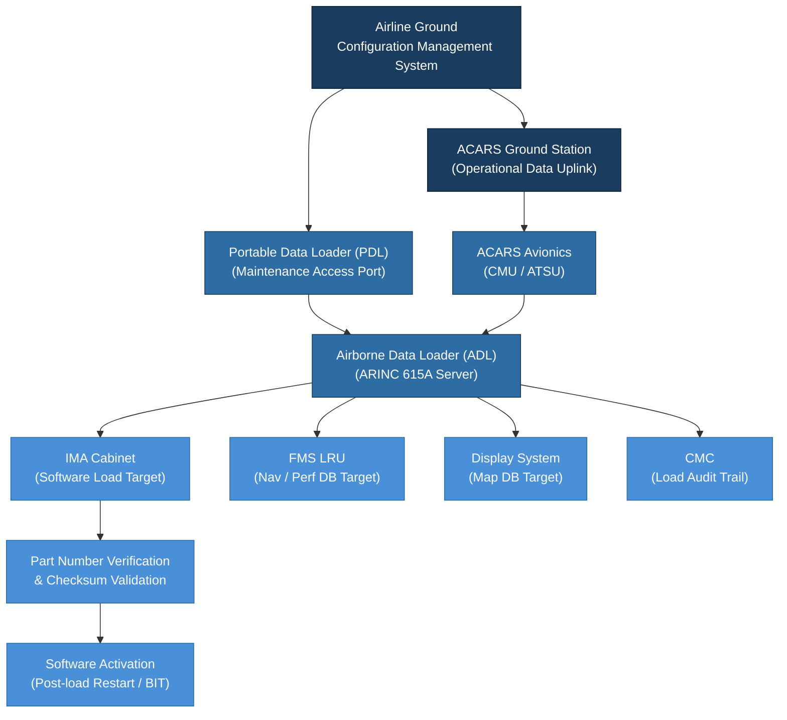

# ATLAS 040-049 · Section 04 · Subsection 040 · 070 — Configuration Software and Data Loading

## 1. Purpose

This document defines the **Configuration Management, Software, and Data Loading** framework for the ATLAS 040 Multisystem domain. It establishes the processes, tools, protocols, and standards governing the loading, verification, and version control of all software load images, configuration data files, and operational databases installed in avionics LRUs and IMA platforms.

Software Data Loading (SDL) is a multisystem function because the same data loading infrastructure — physical media, databus protocols, ground support equipment, and configuration management database — serves all avionics systems simultaneously. An error in the data loading process has the potential to affect multiple systems simultaneously, making rigorous control and verification essential. The Q+ATLANTIDE baseline adopts ARINC 615A[^ref1] as the primary protocol for airborne data loading and RTCA DO-200B[^ref2] as the aeronautical data process standard.

## 2. Scope

This document covers:

- **Software Configuration Management (SCM)**: version identification, baseline establishment, change control, and problem reporting per DO-178C[^ref3] Section 7;
- **ARINC 615A Airborne Data Loader (ADL)**: protocol specification, file format, target LRU addressing, load verification, and Loadable Software Aircraft Part (LSAP) management;
- **Portable Data Loader (PDL) and Network Data Loader (NDL)**: ground-based loading tools and their integration with the aircraft AFDX/ARINC 429 network;
- **ACARS-based data loading**: uplink of operational data (navigation databases, performance databases, route data) via the Aircraft Communication Addressing and Reporting System;
- **Loadable Software Aircraft Part (LSAP) classification**: operational program software (OPS), operational data (OD), and configuration data (CD) and their respective loading authority and verification requirements;
- **Part Number verification**: electronic part number (EPN) matching, checksum validation, and compatibility matrix checking before activation;
- **Loading audit trail**: automatic recording of load events, part numbers loaded, and operator identification in the Central Maintenance Computer (CMC) fault log;
- **Airworthiness implications**: the relationship between data loading activities and continued airworthiness per applicable EASA and FAA regulations.

## 3. Glossary

| Term / Acronym | Definition |
|---|---|
| **ARINC 615A** | Avionics Application Software Standard for Airborne Data Loading — defines the protocol and file structure for transferring software and data to avionics LRUs via ARINC 429 or AFDX. |
| **LSAP** | Loadable Software Aircraft Part — any software or data file that can be loaded into an aircraft avionics system; classified as OPS, OD, or CD. |
| **ADL** | Airborne Data Loader — the on-board hardware/software function that receives LSAP files and transfers them to target LRUs per ARINC 615A protocol. |
| **PDL** | Portable Data Loader — a ground maintenance tool (laptop or dedicated device) used to initiate ARINC 615A loading sessions via the aircraft maintenance access port. |
| **DO-200B** | RTCA DO-200B — Standards for Processing Aeronautical Data. Governs the quality assurance process for navigation databases, terrain databases, and other operational data files. |
| **SCM** | Software Configuration Management — the discipline of tracking and controlling changes to software, including version identification, baseline management, and change control. |
| **EPN** | Electronic Part Number — the machine-readable part number embedded in an LSAP file header, used for compatibility checking before loading. |
| **CMC** | Central Maintenance Computer — the avionics LRU that collects fault data, monitors BITE outputs, and records data loading audit trail entries. |
| **ACARS** | Aircraft Communication Addressing and Reporting System — the digital datalink used for ground-to-air communication, including uplink of operational databases and flight plans. |

## 4. Diagram

## 5. Footprint

| Metric | Value |
|---|---|
| Architecture | `ATLAS` — Aircraft Top Level Architecture Schema/System (controlled term) |
| Master range | `000–099` |
| Code range | `040-049` |
| Section | `04` — Aviónica, Información & APU |
| Subsection | `040` — Multisystem |
| Subsubject | `070` — Configuration Software and Data Loading |
| Primary Q-Division | Q-DATAGOV[^qdiv] |
| Support Q-Divisions | Q-AIR, Q-SPACE, Q-HPC |
| ORB support | ORB-PMO, ORB-LEG |
| Governance class | `baseline`[^gov] |
| Folder path | `Q+ATLANTIDE/000-099_ATLAS/040-049_Avionica-Informacion-y-APU/040_Multisystem/` |
| Document | `040-070-Configuration-Software-and-Data-Loading.md` (this file) |
| Parent subsection | [`README.md`](./README.md) |
| Parent section | [`../../README.md`](../../README.md) |
| Parent architecture | [`../../../README.md`](../../../README.md) |
| Parent baseline | [`organization/Q+ATLANTIDE.md`](../../../../organization/Q+ATLANTIDE.md) |

## 6. References & Citations

[^baseline]: **Q+ATLANTIDE controlled baseline (v1.0.0)** — [`organization/Q+ATLANTIDE.md`](../../../../organization/Q+ATLANTIDE.md).
[^qdiv]: **Q-Division authority** — [`organization/Q-Divisions/`](../../../../organization/Q-Divisions/).
[^gov]: **Governance class** — `baseline` denotes documents under controlled change management.
[^n001]: **Note N-001** — Q+ATLANTIDE is a taxonomy and traceability ecosystem. See [`organization/Q+ATLANTIDE.md` §4](../../../../organization/Q+ATLANTIDE.md#4-notes).
[^ref1]: **ARINC 615A** — Airborne Data Loading over ARINC 429 and ARINC 664/AFDX. Defines the file format (LSAP header), loading protocol (initiation, data transfer, status, abort), and LRU addressing scheme for all airborne data loading operations.
[^ref2]: **RTCA DO-200B / EUROCAE ED-76A** — Standards for Processing Aeronautical Data. Mandatory quality assurance standard for all navigation and terrain databases loaded via ACARS or ADL; requires traceability from source data to loaded file.
[^ref3]: **RTCA DO-178C / EUROCAE ED-12C** — Software Considerations in Airborne Systems and Equipment Certification. Section 7 defines Software Configuration Management requirements; Section 11 defines Software Load Control processes applicable to all IMA-hosted software.
[^ref4]: **ARINC 620** — Data Link Ground System Standard (DGSS). Defines the ACARS message format and routing applicable to operational data uplink to the aircraft.
[^ref5]: **ATA iSpec 2200** — Chapter 45 (Central Maintenance System) and Chapter 46 (Information Systems) provide maintenance documentation structure for data loading procedures, load status pages, and audit trail access.
[^ref6]: **EASA AMC 20-21** — Certification of Airborne Software. Requires that all software loading activities maintain traceability to the approved Software Accomplishment Summary (SAS) and that loaded part numbers match the approved Type Design.
