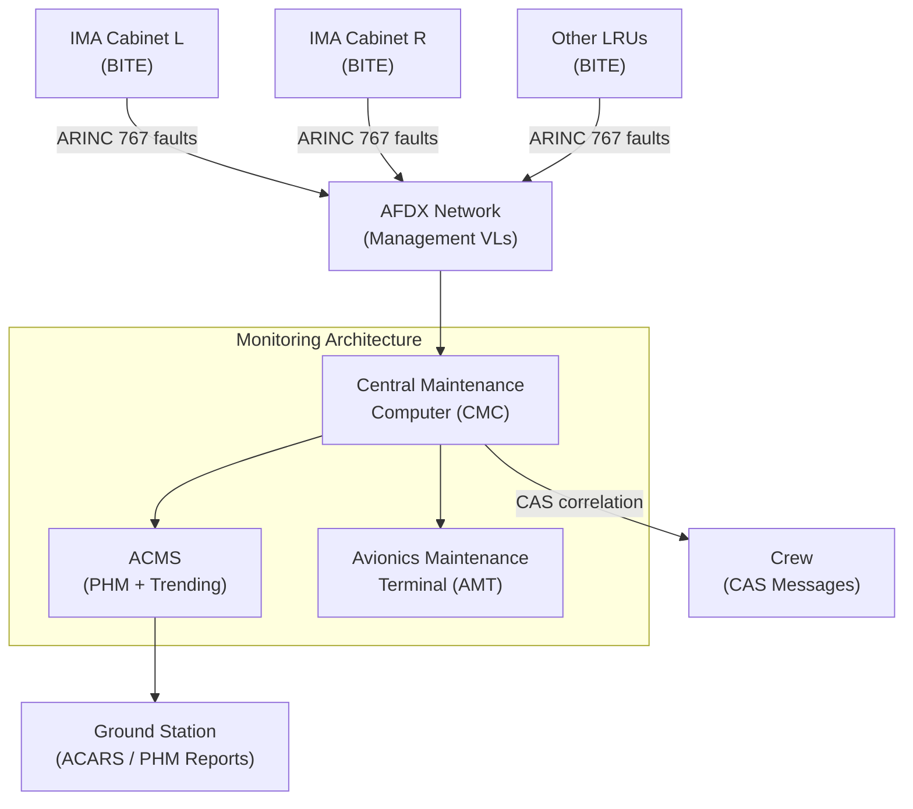
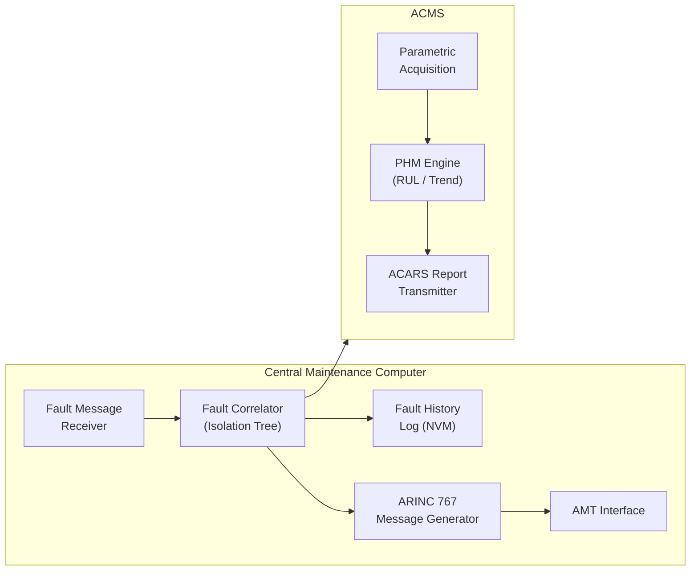
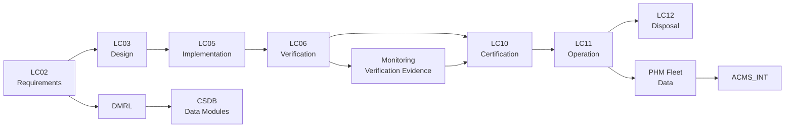

# ATLAS 040-049 · Section 04 · Subsection 040 · 080 — Multisystem Monitoring, Diagnostics and Control Interfaces

## 0. Hyperlink Policy

All linkable content in this file shall be expressed as Markdown links where a stable target exists.
Use relative links for repository-internal content; anchor links for headings, diagrams, glossary terms, citations, references, and footprint entries.
Use `TBD` as placeholder where no stable target yet exists.
Parent context: [040-000 Multisystem General](./040-000-Multisystem-General.md) | Related: [040-070 Configuration and Software Loading](./040-070-Configuration-Software-and-Data-Loading.md).

---

## 1. Purpose

This document defines the multisystem monitoring, diagnostics and control interface architecture for the AMPEL360E avionics multisystem. It covers the IMA Built-In Test Equipment (BITE) architecture, Central Maintenance Computer (CMC) integration, Aircraft Condition Monitoring System (ACMS), ARINC 767 maintenance messages, Prognostic Health Management (PHM), fault isolation procedures, and the Avionics Maintenance Terminal (AMT). It is the primary reference for avionics maintenance engineers, health management architects, and certification authorities.

---

## 2. Applicability

| Attribute | Value |
|-----------|-------|
| Aircraft Model | AMPEL360E (all variants) |
| ATA Reference | [ATA iSpec 2200](#ref-ata-ispec-2200) — Chapter 040 |
| Maintenance Protocol | [ARINC 767](#ref-arinc767) — Health and Usage Monitoring |
| CMC Standard | [ARINC 604A](#ref-arinc604a) |
| Development Assurance | [DO-178C](#ref-do-178c), [DO-254](#ref-do-254) |
| Applicability Code | All S/N unless superseded by service bulletin |

---

## 3. System / Function Overview

The AMPEL360E multisystem monitoring architecture integrates IMA BITE, the CMC, and the ACMS into a coherent health management framework. IMA partitions execute continuous BITE functions, reporting faults via ARINC 664 management VLs to the CMC. The CMC correlates fault messages from all avionics LRUs, executes fault isolation logic, generates maintenance messages per ARINC 767, and presents consolidated fault information on the Avionics Maintenance Terminal (AMT). The ACMS collects parametric data from hosted applications, applies PHM algorithms, and transmits trend reports to ground operations via ACARS. PHM enables predictive maintenance by detecting degradation trends before functional failure.

---

## 4. Scope

### 4.1 Included

- IMA BITE architecture (power-up BITE, continuous monitoring BITE, initiated BITE)
- CMC integration and fault message processing
- ARINC 767 maintenance message generation and formatting
- ACMS data acquisition and parametric trending
- Prognostic Health Management (PHM) algorithms
- Fault isolation logic and CAS/maintenance message correlation
- Avionics Maintenance Terminal (AMT) interface

### 4.2 Excluded

- Engine health monitoring (ATA Chapter 071 / ACARS engine reports)
- Structural health monitoring (ATA Chapter 051)
- Flight data recorder systems (ATA Chapter 031)
- Ground-based maintenance information systems (airline MRO systems)

---

## 5. Architecture Description

**IMA BITE Architecture**: Each IMA module (GPPM, CPIOM, RCIU) executes three BITE modes: Power-Up BITE (PUBIT) at initialisation, Continuous Monitoring BITE (CMBIT) during normal operation, and Initiated BITE (IBIT) on maintenance request. BITE results are encoded as ARINC 767 fault messages and transmitted to the CMC via dedicated AFDX management VLs.

**Central Maintenance Computer (CMC)**: The CMC is a dual-redundant hosted IMA partition. It receives fault messages from all avionics LRUs, correlates multi-source faults using a rule-based fault isolation tree, and assigns a Line Replaceable Unit (LRU) or shop replaceable unit (SRU) removal recommendation. The CMC maintains a fault history log in NVM accessible via the AMT.

**ACMS**: The Aircraft Condition Monitoring System collects parametric snapshots (exceedance data, flight phase data, trend parameters) from hosted applications and avionics LRUs. PHM algorithms process these data streams to compute degradation indicators and remaining useful life (RUL) estimates. Trend reports are transmitted to ground via ACARS.

**ARINC 767**: All maintenance messages (fault codes, CAS messages, BITE results) are formatted per ARINC 767. The CMC translates internal fault codes to ARINC 767 message set identifiers, enabling airline MRO systems to ingest structured maintenance data.

**Avionics Maintenance Terminal (AMT)**: The AMT provides maintenance personnel with a graphical interface for viewing CMC fault logs, executing IBIT, reviewing PHM trend reports, and initiating software loading requests. It communicates with the CMC via a dedicated AFDX management VL or direct Ethernet connection in the E/E bay.

---

## 6. Functional Breakdown

| Function ID | Function Name | Description | Allocated To | DAL |
|-------------|---------------|-------------|-------------|-----|
| F-001 | Power-Up BITE (PUBIT) | Execute self-test at module initialisation; report pass/fail to CMC | IMA Modules | B |
| F-002 | Continuous Monitoring BITE (CMBIT) | Monitor operational parameters continuously; detect anomalies | IMA Modules | B |
| F-003 | Initiated BITE (IBIT) | Execute deep diagnostic on maintenance request; report results to AMT | IMA Modules | C |
| F-004 | CMC Fault Correlation | Correlate multi-source fault messages; execute fault isolation tree | CMC | B |
| F-005 | ARINC 767 Message Generation | Format maintenance messages per ARINC 767 for MRO system ingestion | CMC | C |
| F-006 | ACMS Parametric Acquisition | Collect parametric snapshots from avionics partitions and LRUs | ACMS | C |
| F-007 | PHM Trend Analysis | Apply degradation models to parametric data; compute RUL estimates | ACMS | C |

---

## 7. Mermaid — System Context Diagram

---

## 8. Mermaid — Internal Functional Architecture

---

## 9. Mermaid — Lifecycle Traceability

---

## 10. Interfaces

| Interface ID | From | To | Protocol / Standard | Direction | Notes |
|-------------|------|----|---------------------|-----------|-------|
| IF-080-01 | IMA Modules (GPPM/CPIOM) | CMC | AFDX management VL / ARINC 767 | Output | BITE fault messages |
| IF-080-02 | Other LRUs | CMC | AFDX management VL / ARINC 767 | Output | LRU fault messages |
| IF-080-03 | CMC | AMT | AFDX management VL / Ethernet | Bidirectional | Fault log, IBIT requests, PHM display |
| IF-080-04 | ACMS | ACARS Ground Station | ACARS ARINC 618 | Output | PHM trend and exceedance reports |
| IF-080-05 | CMC | ACMS | Internal AFDX VL | Output | Correlated fault events for PHM |
| IF-080-06 | CMC | Crew (CAS) | AFDX / Display bus | Output | Correlated maintenance messages to CAS |
| IF-080-07 | AMT | IMA Modules | AFDX management VL | Output | IBIT initiation commands |

---

## 11. Operating Modes

| Mode | Description | Trigger | System Response |
|------|-------------|---------|-----------------|
| Normal | All BITE functions active; CMC monitoring operational | Aircraft powered | CMC correlates faults; PHM trending active |
| Maintenance | IBIT execution in progress | AMT-initiated IBIT request | Target module executes deep test; operational partitions may be affected |
| Degraded | CMC primary failed; secondary CMC active | CMC primary failure | Secondary CMC takes over; advisory to crew |
| Ground Downlink | PHM and fault log download to ground | Aircraft on ground; ACARS/AMT connected | Fault log and PHM reports transmitted |
| BITE Inhibited | BITE monitoring suppressed for maintenance | Maintenance override via AMT | BITE suppressed for specified LRU; logged |

---

## 12. Monitoring and Diagnostics

- CMC maintains a rolling fault history log with LRU ID, fault code, timestamp, and flight phase context.
- ACMS collects parametric data at configurable sampling rates (1 Hz to 64 Hz) per parameter group.
- PHM engine computes degradation indicators for key components (e.g., GDGM OCXO drift, IMA fan speed, PSU output voltage); RUL estimate updated at each flight.
- BITE thresholds are defined per module in the LRU configuration table; out-of-range readings trigger ARINC 767 fault messages.
- CMC fault isolation tree is loaded as a Loadable Data Part (LDP) per ARINC 615A and updated per service bulletin.
- AMT provides real-time display of active faults, fault history, and PHM trend graphs.

---

## 13. Maintenance Concept

| Task | Interval | Access | Tooling |
|------|----------|--------|---------|
| CMC fault log review | Pre/post flight or on condition | AMT or CMC display | None |
| IBIT execution | On condition or per maintenance schedule | AMT | None |
| PHM report download | Per flight or on condition | ACARS or AMT | None |
| Fault isolation tree update | Per service bulletin | ARINC 615A (GDL) | Ground data loader |
| CMC LRU swap | On condition | E/E Bay | Standard avionics tools |
| ACMS parametric threshold update | Per service bulletin | ARINC 615A (GDL) | Ground data loader |

---

## 14. S1000D / CSDB Mapping

| Document Type | Data Module Code (DMC) | Info Code | Title |
|---------------|----------------------|-----------|-------|
| System Description | DMC-AMPEL360E-EWTW-040-080-00A-040A-A | 040 | Monitoring and Diagnostics System Description |
| Maintenance Procedures | DMC-AMPEL360E-EWTW-040-080-00A-300A-A | 300 | CMC Fault Isolation Procedures |
| BITE/Test | DMC-AMPEL360E-EWTW-040-080-00A-400A-A | 400 | IBIT Procedures and BITE Results Interpretation |
| Wiring Data | DMC-AMPEL360E-EWTW-040-080-00A-520A-A | 520 | CMC/AMT Wiring and Connector Data |
| IPD | DMC-AMPEL360E-EWTW-040-080-00A-941A-A | 941 | CMC and AMT Illustrated Parts |
| Software Desc | DMC-AMPEL360E-EWTW-040-080-00A-720A-A | 720 | CMC and ACMS Software Description |

### Recommended Data Module Set

| Info Code | Publication | Applicability |
|-----------|-------------|---------------|
| 040 | AMM — System Description | All variants |
| 300 | FIM — Fault Isolation | All variants |
| 400 | TSM — BITE Procedures | All variants |
| 520 | AMM — Wiring Data | All variants |
| 720 | SRM — Software Description | All variants |
| 941 | IPD — Parts Data | All variants |

---

## 15. Footprints

### 15.1 Physical

| Item | Dimension (mm) | Mass (kg) | Location |
|------|---------------|-----------|----------|
| CMC (hosted partition) | N/A (hosted) | N/A | IMA Cabinet Left / Right |
| AMT display unit | 250 × 180 × 50 | 1.5 | E/E Bay maintenance panel |
| ACMS partition (hosted) | N/A (hosted) | N/A | IMA Cabinet Left |

### 15.2 Electrical / Data

| Interface | Standard | Bandwidth / Power |
|-----------|----------|-------------------|
| CMC management VLs | ARINC 664 Part 7 | < 10 Mbps |
| AMT Ethernet | 100BASE-TX | 100 Mbps |
| ACARS link | ARINC 618 / VHF | < 2.4 kbps |
| AMT power | 28 VDC | 25 W |

### 15.3 Maintenance

| Task | Man-Hours | Skill Level | Access |
|------|-----------|-------------|--------|
| Fault log review | 0.25 | Avionics tech | AMT |
| IBIT execution | 0.5 | Avionics tech | AMT |
| CMC swap | 0.5 | Avionics tech | E/E Bay |
| PHM report analysis | 0.5 | Avionics engineer | Ground workstation |

### 15.4 Data

| Data Item | Volume | Storage | Retention |
|-----------|--------|---------|-----------|
| CMC fault history log | 256 MB | CMC NVM | 2000 FH rolling |
| ACMS parametric data | 1 GB | ACMS NVM | 500 FH rolling |
| PHM degradation indicators | 64 MB | ACMS NVM | Life of component |
| Fault isolation tree (LDP) | 32 MB | CMC NVM | Per certified version |

---

## 16. Safety and Certification Considerations

- CMC fault correlation logic must be validated to ensure correct LRU removal recommendations; incorrect recommendations are a safety concern for dispatch decisions.
- BITE functions classified at DAL B must meet DO-178C DAL B objectives for software development.
- PHM algorithms are DAL C (monitoring only; no safety-critical control outputs); PHM outputs are advisory only.
- ACMS data transmission via ACARS must comply with data link security requirements (encryption and authentication) per the applicable security standard.
- Fault isolation tree updates (LDP) must comply with DO-200B data integrity requirements.
- CMC redundancy ensures single-failure tolerance for the maintenance monitoring function; both CMC partitions may share physical IMA module — single module failure must not cause loss of both CMC instances.

---

## 17. Verification and Validation

| V&V ID | Requirement | Method | Success Criteria | Status |
|--------|-------------|--------|-----------------|--------|
| VV-080-01 | PUBIT completeness | Test — all modules powered up | All BITE pass/fail results reported to CMC within 60 s |  |
| VV-080-02 | CMBIT fault detection | Fault injection — induced LRU anomaly | CMC receives ARINC 767 fault within 1 s |  |
| VV-080-03 | CMC fault isolation | Functional test — single LRU fault scenario | Correct LRU removal recommendation generated |  |
| VV-080-04 | ACMS parametric acquisition | Functional test — data sampling rate | Correct data at configured rate; no missing samples |  |
| VV-080-05 | PHM trend accuracy | Validation against known degradation scenario | PHM RUL within ±20% of reference |  |
| VV-080-06 | AMT display correctness | Functional test — fault display | AMT shows correct fault codes, timestamps, recommendations |  |
| VV-080-07 | CMC redundancy failover | Fault injection — primary CMC failure | Secondary CMC assumes role within 5 s |  |

---

## 18. Glossary

| Term/Acronym | Definition | Link |
|-------------|-----------|------|
| BITE | Built-In Test Equipment — hardware and software within an LRU that performs self-testing | [§5](#5-architecture-description) |
| PUBIT | Power-Up BITE — BITE executed at module initialisation | [§6](#6-functional-breakdown) |
| CMBIT | Continuous Monitoring BITE — BITE operating during normal system operation | [§6](#6-functional-breakdown) |
| IBIT | Initiated BITE — deep diagnostic BITE triggered on maintenance request | [§6](#6-functional-breakdown) |
| CMC | Central Maintenance Computer — avionics function that correlates and isolates faults from all LRUs | [§5](#5-architecture-description) |
| ACMS | Aircraft Condition Monitoring System — system that collects parametric data and generates health reports | [§5](#5-architecture-description) |
| PHM | Prognostic Health Management — algorithms that predict component degradation and remaining useful life | [§5](#5-architecture-description) |
| RUL | Remaining Useful Life — estimated time or cycles until a component is expected to reach failure threshold | [§5](#5-architecture-description) |
| AMT | Avionics Maintenance Terminal — ground maintenance interface for CMC and ACMS | [§5](#5-architecture-description) |
| ARINC 767 | ARINC Specification 767 — standard for health and usage monitoring maintenance messages | [§5](#5-architecture-description) |
| ARINC 604A | ARINC Specification 604A — guidance for design and use of CMC/CFDS systems | [§2](#2-applicability) |
| CAS | Crew Alerting System — flight deck display system for crew advisories and warnings | [§10](#10-interfaces) |

---

## 19. Citations

| Ref | Citation | Use | Link |
|-----|---------|-----|------|
| ARINC 767 | ARINC Specification 767 — Health and Usage Monitoring | Maintenance messaging |  |
| ARINC 604A | ARINC Specification 604A — Guidance for Design and Use of Built-In Test Systems | CMC design |  |
| DO-178C | RTCA DO-178C — Software Considerations in Airborne Systems | Software assurance |  |
| DO-254 | RTCA DO-254 — Design Assurance Guidance for Airborne Electronic Hardware | Hardware assurance |  |
| GOV | Q+ATLANTIDE Governance Framework | Document governance | [Q+ATLANTIDE.md](../../../../organization/Q+ATLANTIDE.md) |
| S1000D | S1000D Issue 5.0 | CSDB mapping |  |
| ATA iSpec 2200 | ATA iSpec 2200 | ATA chapter alignment |  |

---

## 20. References

| Ref | Document | Identifier | Revision | Status | Link |
|-----|---------|-----------|---------|--------|------|
| REF-080-01 | Multisystem General | QATL-ATLAS-1000-ATLAS-040-049-04-040-000 | 1.0.0 | Active | [040-000](./040-000-Multisystem-General.md) |
| REF-080-02 | Configuration and Software Loading | QATL-ATLAS-1000-ATLAS-040-049-04-040-070 | 1.0.0 | Active | [040-070](./040-070-Configuration-Software-and-Data-Loading.md) |
| REF-080-03 | Time Synchronization and Data Integrity | QATL-ATLAS-1000-ATLAS-040-049-04-040-060 | 1.0.0 | Active | [040-060](./040-060-Time-Synchronization-and-Data-Integrity.md) |
| REF-080-04 | ARINC 767 | ARINC 767 | Current | Normative |  |
| REF-080-05 | ARINC 604A | ARINC 604A | Current | Normative |  |

---

## 21. Open Issues

| ID | Issue | Owner | Status | Link |
|----|-------|-------|--------|------|
| OI-080-01 | PHM algorithm validation methodology and required fidelity to be agreed | Q-DATAGOV | Open |  |
| OI-080-02 | ACARS data link security requirements (encryption standard) to be defined | Q-AIR | Open |  |
| OI-080-03 | CMC fault isolation tree completeness review against all IMA fault modes to be completed | Q-DATAGOV | Open |  |
| OI-080-04 | AMT human factors review (display layout, alert priority) pending | Q-AIR | Open |  |

---

## 22. Change Log

| Version | Date | Author | Change | Link |
|---------|------|--------|--------|------|
| 1.0.0 | 2026-05-09 | Q+ Team/Amedeo Pelliccia + AI | Initial creation with full 22-section template |  |
