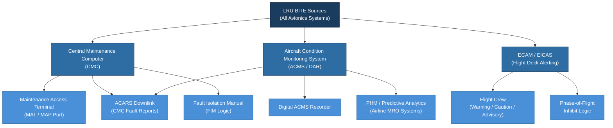

# ATLAS 040-049 · Section 04 · Subsection 040 · 080 — Multisystem Monitoring Diagnostics and Control Interfaces

## 1. Purpose

This document defines the **Multisystem Monitoring, Diagnostics, and Control Interfaces** architecture within the ATLAS 040 domain. Monitoring and diagnostics are inherently cross-system functions: the Central Maintenance Computer (CMC), Aircraft Condition Monitoring System (ACMS), and flight-deck advisory systems (ECAM/EICAS) must aggregate health, fault, and performance data from all avionics systems to provide a coherent operational and maintenance picture.

The Q+ATLANTIDE baseline treats monitoring and diagnostics as a dedicated service layer that spans the entire avionics system complement. This layer must be designed to DAL commensurate with its role in crew alerting (DAL B for ECAM/EICAS-displayed warnings) while also supporting lower-criticality maintenance functions (DAL D/E for CMC report generation). The architecture must prevent a monitoring system failure from masking real faults in monitored systems.

## 2. Scope

This document covers:

- **Built-In Test Equipment (BITE)** architecture: continuous monitoring BIT (CMBIT), power-on BIT (POBIT), initiated BIT (IBIT), and their interaction with the shared BITE service layer;
- **Central Maintenance Computer (CMC)**: fault collection, fault correlation, Fault Isolation Manual (FIM) logic, maintenance message generation, and maintenance access terminal (MAT) interface;
- **Aircraft Condition Monitoring System (ACMS)**: exceedance monitoring, performance trend analysis, Digital ACMS Recorder (DAR) data management, and ACARS downlink of condition reports;
- **ECAM/EICAS integration**: the interface between avionics system BITE outputs and the flight-deck alerting system, including warning, caution, and advisory generation, inhibit logic, and crew alert suppression during critical flight phases;
- **Health and Usage Monitoring System (HUMS)** for rotary-wing derivative platforms;
- **Prognostics and Health Management (PHM)**: predictive fault algorithms, remaining useful life (RUL) estimation, and integration with airline operations control;
- **Maintenance Access Port (MAP)** and Aircraft Interface Device (AID): physical and logical interface standards for ground maintenance tooling;
- **Fault message standardisation**: ATA MSG-3[^ref1] fault code structure, fault/warning correlation matrices, and dual-flag fault reporting.

## 3. Glossary

| Term / Acronym | Definition |
|---|---|
| **CMC** | Central Maintenance Computer — the avionics LRU that collects, correlates, and stores fault data from all BITE sources, and provides the maintenance crew with fault isolation guidance. |
| **ACMS** | Aircraft Condition Monitoring System — a monitoring and recording system that captures, stores, and transmits aircraft performance and condition data for trend analysis and predictive maintenance. |
| **ECAM** | Electronic Centralised Aircraft Monitor — the Airbus flight-deck system that processes and displays avionics system status, warnings, and procedures to the flight crew. |
| **EICAS** | Engine Indication and Crew Alerting System — the Boeing equivalent of ECAM, providing flight-deck crew alerting and engine indication functions. |
| **BITE** | Built-In Test Equipment — the hardware and software on-board each avionics LRU that performs self-test, fault detection, and fault reporting. |
| **FIM** | Fault Isolation Manual — a maintenance document providing step-by-step fault isolation procedures correlated to CMC fault codes. |
| **PHM** | Prognostics and Health Management — a system capability that uses sensor data and predictive algorithms to estimate component health and remaining useful life. |
| **MSG-3** | ATA Maintenance Steering Group 3 — the methodology used to derive aircraft maintenance tasks and intervals, providing the fault code structure standard for CMC messages. |
| **DAR** | Digital ACMS Recorder — a solid-state recorder used by the ACMS to store time-tagged performance data for download during ground maintenance. |

## 4. Diagram

## 5. Footprint

| Metric | Value |
|---|---|
| Architecture | `ATLAS` — Aircraft Top Level Architecture Schema/System (controlled term) |
| Master range | `000–099` |
| Code range | `040-049` |
| Section | `04` — Aviónica, Información & APU |
| Subsection | `040` — Multisystem |
| Subsubject | `080` — Multisystem Monitoring Diagnostics and Control Interfaces |
| Primary Q-Division | Q-DATAGOV[^qdiv] |
| Support Q-Divisions | Q-AIR, Q-SPACE, Q-HPC |
| ORB support | ORB-PMO, ORB-LEG |
| Governance class | `baseline`[^gov] |
| Folder path | `Q+ATLANTIDE/000-099_ATLAS/040-049_Avionica-Informacion-y-APU/040_Multisystem/` |
| Document | `040-080-Multisystem-Monitoring-Diagnostics-and-Control-Interfaces.md` (this file) |
| Parent subsection | [`README.md`](./README.md) |
| Parent section | [`../../README.md`](../../README.md) |
| Parent architecture | [`../../../README.md`](../../../README.md) |
| Parent baseline | [`organization/Q+ATLANTIDE.md`](../../../../organization/Q+ATLANTIDE.md) |

## 6. References & Citations

[^baseline]: **Q+ATLANTIDE controlled baseline (v1.0.0)** — [`organization/Q+ATLANTIDE.md`](../../../../organization/Q+ATLANTIDE.md).
[^qdiv]: **Q-Division authority** — [`organization/Q-Divisions/`](../../../../organization/Q-Divisions/).
[^gov]: **Governance class** — `baseline` denotes documents under controlled change management.
[^n001]: **Note N-001** — Q+ATLANTIDE is a taxonomy and traceability ecosystem. See [`organization/Q+ATLANTIDE.md` §4](../../../../organization/Q+ATLANTIDE.md#4-notes).
[^ref1]: **ATA MSG-3** — Operator/Manufacturer Scheduled Maintenance Development. Revision 2015 defines the fault classification hierarchy and fault code structure applied to CMC maintenance messages throughout ATLAS 040 Multisystem.
[^ref2]: **ATA iSpec 2200** — Chapter 45 (Central Maintenance System) and Chapter 31 (Indicating/Recording Systems). Provide the documentation structure for CMC and ACMS system descriptions, maintenance procedures, and wiring data.
[^ref3]: **RTCA DO-178C / EUROCAE ED-12C** — Software Considerations. ECAM/EICAS software generating crew warnings is subject to DAL B development assurance; CMC application software is typically DAL C; ACMS recording software is DAL D.
[^ref4]: **SAE ARP4754A** — Guidelines for Development of Civil Aircraft and Systems. Failure mode and effects analysis (FMEA) for the CMC must demonstrate that a CMC failure cannot mask a hazardous-level system failure from the flight crew.
[^ref5]: **ARINC 429** — The primary interface bus through which most avionics LRUs transmit BITE status words and fault flags to the CMC and ECAM system, using standardised label assignments.
[^ref6]: **EUROCAE ED-135** — Airworthiness Approval and Operational Criteria for Flight Data Monitoring (FDM/FOQA). Relevant to ACMS data recording architecture and data downlink requirements for airline safety programmes.
