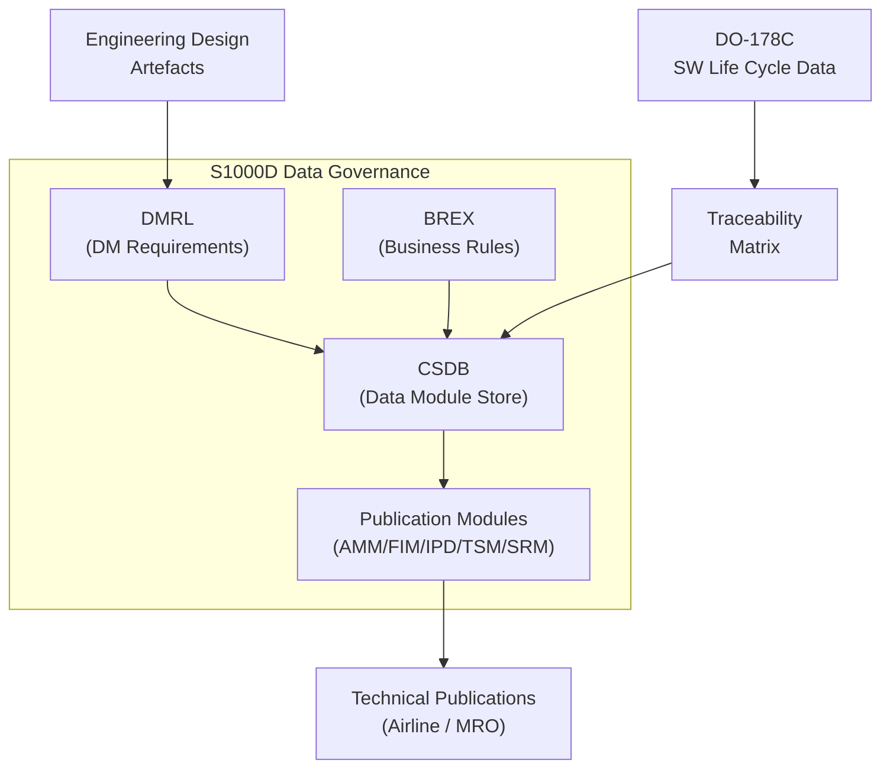
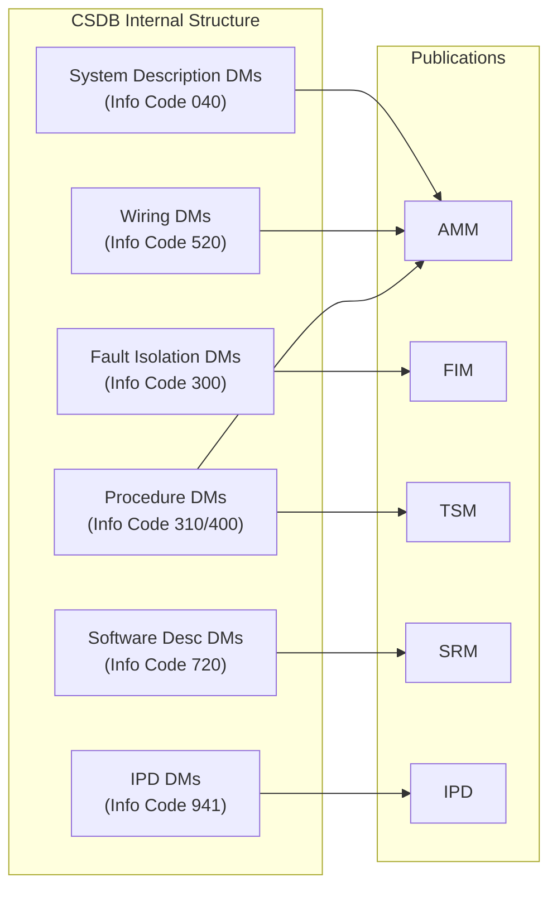
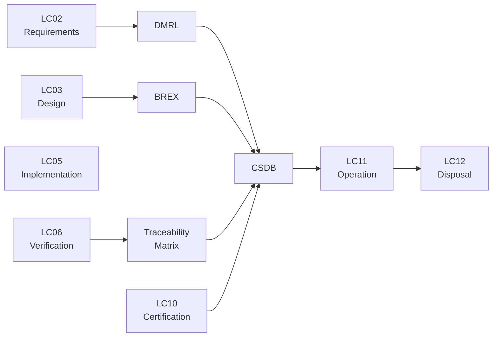

# ATLAS 040-049 · Section 04 · Subsection 040 · 090 — S1000D / CSDB Mapping and Traceability

## 0. Hyperlink Policy

All linkable content in this file shall be expressed as Markdown links where a stable target exists.
Use relative links for repository-internal content; anchor links for headings, diagrams, glossary terms, citations, references, and footprint entries.
Use `TBD` as placeholder where no stable target yet exists.
Parent context: [040-000 Multisystem General](./040-000-Multisystem-General.md) | Related: [040-080 Monitoring and Diagnostics](./040-080-Multisystem-Monitoring-Diagnostics-and-Control-Interfaces.md).

---

## 1. Purpose

This document defines the S1000D Issue 5.0 Data Module Code (DMC) structure, CSDB applicability rules, Data Module Requirements List (DMRL), Business Rules Exchange (BREX), publication types, DO-178C to Data Module (DM) traceability matrix, and SNS allocation for the AMPEL360E avionics multisystem (040 subsection). It is the primary reference for technical publications engineers, CSDB administrators, and certification authorities responsible for S1000D data governance.

---

## 2. Applicability

| Attribute | Value |
|-----------|-------|
| Aircraft Model | AMPEL360E (all variants) |
| ATA Reference | [ATA iSpec 2200](#ref-ata-ispec-2200) — Chapter 040 |
| S1000D Issue | [S1000D Issue 5.0](#ref-s1000d) |
| CSDB Platform |  |
| SNS Base | 040 (Multisystem) |
| Publication Types | AMM, FIM, IPD, TSM, SRM |
| Applicability Code | All S/N unless superseded by service bulletin |

---

## 3. System / Function Overview

The AMPEL360E S1000D data governance for the 040 Multisystem subsection provides a structured mapping between engineering design artefacts, software assurance evidence (DO-178C), and S1000D data modules stored in the Common Source Database (CSDB). The DMC structure follows S1000D Issue 5.0 conventions with the model identification code AMPEL360E, system difference code EWTW, and SNS codes aligned to the 040 subsection. The DMRL is maintained as the authoritative list of all required data modules. BREX rules enforce schema constraints. Publication modules (PMC) aggregate data modules into AMM, FIM, IPD, TSM, and SRM publications. DO-178C software life cycle data items are cross-referenced to data modules via a traceability matrix.

---

## 4. Scope

### 4.1 Included

- S1000D Issue 5.0 DMC structure and naming convention for SNS 040
- CSDB applicability rules and effectivity coding
- Data Module Requirements List (DMRL) for 040 subsection
- Business Rules Exchange (BREX) constraints for AMPEL360E CSDB
- Publication types: AMM, FIM, IPD, TSM, SRM
- DO-178C life cycle data item to DM traceability matrix
- SNS allocation across 040-000 to 040-090

### 4.2 Excluded

- S1000D mapping for other subsections (041, 042, etc.)
- CSDB tool configuration and administration procedures
- Illustrated Parts Data (IPD) part number sourcing
- Technical publications production workflow (publishing chain)

---

## 5. Architecture Description

**DMC Structure**: Each data module for the 040 subsection follows the pattern:
`DMC-AMPEL360E-EWTW-040-{SNS3}-00A-{InfoCode}-A`
where:
- Model Identification Code: `AMPEL360E`
- System Difference Code: `EWTW`
- SNS: `040-{SNS3}` (e.g., 040-010, 040-060)
- Sub-Sub-System / Sub-Sub-Assembly: `00A`
- Information Code: per S1000D information code set (040=description, 300=FI, 310=procedure, 400=BITE, 520=wiring, 720=SW desc, 941=IPD)
- Information Code Variant: `A`

**CSDB Applicability**: Applicability is coded using the AMPEL360E product attribute `AC-VAR` (aircraft variant). All 040 subsection data modules are applicable to all variants unless an applicability annotation restricts to a specific variant.

**DMRL**: The DMRL is a structured list of all required data modules for the 040 subsection, derived from the design documentation, maintenance task analysis, and DO-178C traceability requirements. The DMRL drives CSDB data module creation and status tracking.

**BREX**: The AMPEL360E BREX (Business Rules Exchange) document constrains allowed S1000D schema elements, attribute values, and applicability expressions within the CSDB. BREX violations are flagged during CSDB validation.

**DO-178C to DM Traceability**: Each DO-178C Plan for Software Aspects of Certification (PSAC), Software Design Description (SDD), and Software Verification Results (SVR) is linked to one or more CSDB data modules via the traceability matrix defined in this document.

---

## 6. Functional Breakdown

| Function ID | Function Name | Description | Allocated To | DAL |
|-------------|---------------|-------------|-------------|-----|
| F-001 | DMC Structure Definition | Define and maintain S1000D DMC naming scheme for 040 SNS | Q-DATAGOV | N/A |
| F-002 | DMRL Management | Maintain DMRL; track data module creation and approval status | Q-DATAGOV | N/A |
| F-003 | BREX Enforcement | Define BREX rules; validate CSDB data modules against BREX | Q-DATAGOV | N/A |
| F-004 | Applicability Coding | Code and validate CSDB applicability for all 040 DMs | Q-DATAGOV | N/A |
| F-005 | Publication Assembly | Aggregate 040 DMs into AMM, FIM, IPD, TSM, SRM publications | Q-DATAGOV | N/A |
| F-006 | DO-178C Traceability | Maintain traceability matrix linking DO-178C artefacts to CSDB DMs | Q-DATAGOV | N/A |
| F-007 | SNS Allocation | Allocate and maintain SNS codes across 040-000 to 040-090 | Q-DATAGOV | N/A |

---

## 7. Mermaid — System Context Diagram

---

## 8. Mermaid — Internal Functional Architecture

---

## 9. Mermaid — Lifecycle Traceability

---

## 10. Interfaces

| Interface ID | From | To | Protocol / Standard | Direction | Notes |
|-------------|------|----|---------------------|-----------|-------|
| IF-090-01 | Engineering Design Repository | DMRL | Manual / document exchange | Input | DM requirements sourced from design |
| IF-090-02 | DO-178C Software Lifecycle | Traceability Matrix | Manual / document exchange | Input | SW artefacts linked to CSDB DMs |
| IF-090-03 | CSDB | BREX Validator | XML schema validation | Bidirectional | BREX enforced at DM creation/update |
| IF-090-04 | CSDB | Publication Assembly Tool | XML / S1000D exchange | Output | DMs assembled into PMCs |
| IF-090-05 | CSDB | Airline MRO Systems | S1000D XML / IETM | Output | Technical publication delivery |
| IF-090-06 | DMRL | CMC Fault Isolation Tree (LDP) | Manual traceability link | Bidirectional | Maintenance DMs linked to CMC LDP |

---

## 11. Operating Modes

| Mode | Description | Trigger | System Response |
|------|-------------|---------|-----------------|
| Authoring | Data modules being created or edited in CSDB | Engineering change or new DM request | BREX validation active; DM status = In Work |
| Review | Data modules under technical review | DM submitted for review | DM status = In Review; comments tracked |
| Approved | Data modules approved for publication | Review completed; approved by TA | DM status = Approved; available for PMC |
| Published | Publication modules issued to airlines | PMC publication event | PMC issued; DM versions frozen |
| Superseded | DM replaced by revised version | New DM version approved | Old DM status = Superseded; DMRL updated |

---

## 12. Monitoring and Diagnostics

- DMRL completion rate is tracked monthly: percentage of required DMs with status Approved vs. total DMRL count.
- BREX validation errors are logged per DM and tracked to resolution in the CSDB issue tracker.
- Traceability matrix completeness is reviewed at each program milestone (PDR, CDR, SOI); gaps are recorded as open issues.
- Publication currency is monitored: PMC revision date vs. constituent DM revision dates; staleness triggers a re-publication review.
- DO-178C traceability coverage metric: percentage of DO-178C life cycle data items linked to at least one CSDB DM.

---

## 13. Maintenance Concept

| Task | Interval | Access | Tooling |
|------|----------|--------|---------|
| DMRL review and update | Per program milestone (PDR, CDR, SOI) | CSDB admin access | CSDB platform |
| BREX validation | Per DM submission | CSDB platform | BREX validator |
| Traceability matrix update | Per DO-178C artefact release | Document control system | Spreadsheet / CSDB link |
| PMC publication update | Per approved change package | CSDB admin access | CSDB publication tool |
| Applicability coding review | Per aircraft variant change | CSDB admin access | CSDB platform |

---

## 14. S1000D / CSDB Mapping

| Document Type | Data Module Code (DMC) | Info Code | Title |
|---------------|----------------------|-----------|-------|
| System Description (SNS 000) | DMC-AMPEL360E-EWTW-040-000-00A-040A-A | 040 | Multisystem General Description |
| System Description (SNS 060) | DMC-AMPEL360E-EWTW-040-060-00A-040A-A | 040 | Time Synchronisation Description |
| System Description (SNS 070) | DMC-AMPEL360E-EWTW-040-070-00A-040A-A | 040 | Configuration and Software Loading Description |
| System Description (SNS 080) | DMC-AMPEL360E-EWTW-040-080-00A-040A-A | 040 | Monitoring and Diagnostics Description |
| Fault Isolation (SNS 080) | DMC-AMPEL360E-EWTW-040-080-00A-300A-A | 300 | CMC Fault Isolation |
| BREX Reference | DMC-AMPEL360E-EWTW-040-090-00A-022A-A | 022 | AMPEL360E CSDB Business Rules |

### SNS Allocation — 040 Subsection

| SNS Code | Subsubject Title | Primary Publication | DO-178C Traceability |
|----------|-----------------|-------------------|---------------------|
| 040-000 | Multisystem General | AMM, SRM | PSAC, SDP |
| 040-010 | IMA | AMM, SRM, IPD | PSAC, SDD, SVR |
| 040-020 | Core Processing and Computing | AMM, SRM, IPD | PSAC, SDD, SVR |
| 040-030 | Avionics Networks and Data Buses | AMM, SRM, IPD | PSAC, SDD |
| 040-040 | System Integration and Interface Mgmt | AMM, FIM | PSAC, SDD |
| 040-050 | Shared Avionics Resources | AMM, SRM | PSAC, SDD |
| 040-060 | Time Synchronization | AMM, FIM, TSM, SRM | PSAC, SDD, SVR |
| 040-070 | Configuration, Software and Data Loading | AMM, FIM, TSM, SRM | PSAC, SDD, SVR |
| 040-080 | Monitoring, Diagnostics and Control | AMM, FIM, TSM, SRM, IPD | PSAC, SDD, SVR |
| 040-090 | S1000D / CSDB Mapping | SRM (this document) | N/A |

---

## 15. Footprints

### 15.1 Physical

| Item | Dimension (mm) | Mass (kg) | Location |
|------|---------------|-----------|----------|
| CSDB Server (ground) |  |  | Ground IT infrastructure |
| DMRL Document | N/A (document) | N/A | CSDB / document management system |

### 15.2 Electrical / Data

| Interface | Standard | Bandwidth / Power |
|-----------|----------|-------------------|
| CSDB XML exchange | S1000D Issue 5.0 XML |  |
| IETM delivery to airline | S1000D / PDF |  |
| CSDB server power |  |  |

### 15.3 Maintenance

| Task | Man-Hours | Skill Level | Access |
|------|-----------|-------------|--------|
| DMRL update | 2.0 | Technical publications engineer | CSDB platform |
| Traceability matrix update | 1.0 per DO-178C artefact | Systems engineer | Document control system |
| PMC publication | 4.0 | Technical publications engineer | CSDB publication tool |
| BREX validation | 0.5 per DM batch | Technical publications engineer | CSDB platform |

### 15.4 Data

| Data Item | Volume | Storage | Retention |
|-----------|--------|---------|-----------|
| CSDB data modules (040 SNS) |  | CSDB platform | Life of aircraft type |
| DMRL spreadsheet | < 1 MB | Document management system | Life of aircraft type |
| Traceability matrix | < 5 MB | Document management system | Life of aircraft type |
| Published PMC archives |  | Technical publications archive | Life of aircraft type |

---

## 16. Safety and Certification Considerations

- S1000D data modules must be reviewed and approved by the type design holder before inclusion in approved maintenance manuals; unapproved DMs must not be used for airworthiness maintenance.
- DO-178C traceability matrix must demonstrate that all software life cycle data items required by the applicable DAL are linked to CSDB data modules; gaps are a certification finding.
- BREX rules must be agreed with the certification authority and airline customers; BREX changes require change control.
- CSDB applicability coding must be verified to ensure that no incorrect effectivity causes inapplicable procedures to be presented to maintenance personnel.
- Publication currency (DM revision alignment with service bulletins) is an airworthiness obligation; stale publications are a safety risk.

---

## 17. Verification and Validation

| V&V ID | Requirement | Method | Success Criteria | Status |
|--------|-------------|--------|-----------------|--------|
| VV-090-01 | DMC structure compliance | CSDB validation | All 040 DMs pass S1000D Issue 5.0 schema validation |  |
| VV-090-02 | BREX compliance | BREX validator tool | Zero BREX violations in approved CSDB |  |
| VV-090-03 | DMRL completeness | Milestone review | DMRL ≥ 95% approved at CDR |  |
| VV-090-04 | DO-178C traceability coverage | Matrix audit | 100% of DAL A/B artefacts linked to CSDB DMs |  |
| VV-090-05 | Applicability coding correctness | Aircraft variant test | Correct DMs presented for each variant |  |
| VV-090-06 | Publication assembly | PMC generation test | AMM, FIM, IPD, TSM, SRM generated without errors |  |

---

## 18. Glossary

| Term/Acronym | Definition | Link |
|-------------|-----------|------|
| S1000D | International specification for the procurement and production of technical publications | [§3](#3-system--function-overview) |
| DMC | Data Module Code — unique identifier for a data module in a CSDB per S1000D | [§5](#5-architecture-description) |
| CSDB | Common Source Database — authoritative repository for S1000D data modules | [§5](#5-architecture-description) |
| DMRL | Data Module Requirements List — authoritative list of all required data modules | [§5](#5-architecture-description) |
| BREX | Business Rules Exchange — S1000D document defining schema and content constraints for a CSDB | [§5](#5-architecture-description) |
| PMC | Publication Module Code — identifier for an S1000D publication that aggregates data modules | [§5](#5-architecture-description) |
| SNS | Standard Numbering System — hierarchical system number scheme used in S1000D DMC | [§5](#5-architecture-description) |
| AMM | Aircraft Maintenance Manual — publication type covering maintenance procedures | [§3](#3-system--function-overview) |
| FIM | Fault Isolation Manual — publication type covering fault isolation procedures | [§3](#3-system--function-overview) |
| IPD | Illustrated Parts Data — publication type covering parts identification with illustrations | [§3](#3-system--function-overview) |
| TSM | Troubleshooting Manual — publication type covering BITE and troubleshooting procedures | [§3](#3-system--function-overview) |
| SRM | Software Reference Manual — publication type covering software description and loading | [§3](#3-system--function-overview) |

---

## 19. Citations

| Ref | Citation | Use | Link |
|-----|---------|-----|------|
| S1000D | S1000D Issue 5.0 — International Specification for Technical Publications | DMC structure |  |
| DO-178C | RTCA DO-178C — Software Considerations in Airborne Systems | SW traceability |  |
| DO-200B | RTCA DO-200B — Standards for Processing Aeronautical Data | Data integrity |  |
| GOV | Q+ATLANTIDE Governance Framework | Document governance | [Q+ATLANTIDE.md](../../../../organization/Q+ATLANTIDE.md) |
| ATA iSpec 2200 | ATA iSpec 2200 | ATA chapter alignment |  |

---

## 20. References

| Ref | Document | Identifier | Revision | Status | Link |
|-----|---------|-----------|---------|--------|------|
| REF-090-01 | Multisystem General | QATL-ATLAS-1000-ATLAS-040-049-04-040-000 | 1.0.0 | Active | [040-000](./040-000-Multisystem-General.md) |
| REF-090-02 | Monitoring, Diagnostics and Control | QATL-ATLAS-1000-ATLAS-040-049-04-040-080 | 1.0.0 | Active | [040-080](./040-080-Multisystem-Monitoring-Diagnostics-and-Control-Interfaces.md) |
| REF-090-03 | Configuration and Software Loading | QATL-ATLAS-1000-ATLAS-040-049-04-040-070 | 1.0.0 | Active | [040-070](./040-070-Configuration-Software-and-Data-Loading.md) |
| REF-090-04 | Time Synchronization | QATL-ATLAS-1000-ATLAS-040-049-04-040-060 | 1.0.0 | Active | [040-060](./040-060-Time-Synchronization-and-Data-Integrity.md) |
| REF-090-05 | S1000D Issue 5.0 | S1000D | 5.0 | Normative |  |

---

## 21. Open Issues

| ID | Issue | Owner | Status | Link |
|----|-------|-------|--------|------|
| OI-090-01 | CSDB platform selection and hosting arrangement to be finalised | Q-DATAGOV | Open |  |
| OI-090-02 | BREX document to be authored and submitted for airline/authority review | Q-DATAGOV | Open |  |
| OI-090-03 | DO-178C traceability matrix template to be agreed with DER/certification authority | Q-DATAGOV | Open |  |
| OI-090-04 | S1000D applicability coding scheme for AMPEL360E variants to be finalised | Q-DATAGOV | Open |  |

---

## 22. Change Log

| Version | Date | Author | Change | Link |
|---------|------|--------|--------|------|
| 1.0.0 | 2026-05-09 | Q-DATAGOV / Copilot | Initial creation with full 22-section template |  |
