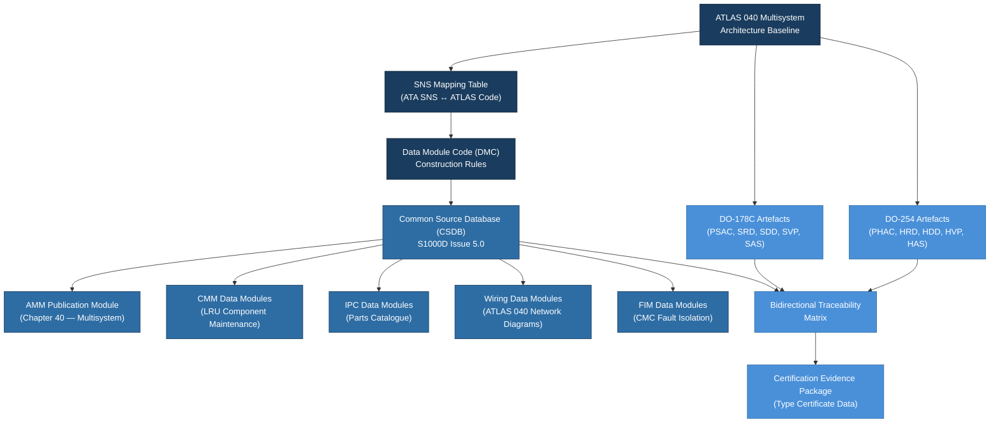

# ATLAS 040-049 · Section 04 · Subsection 040 · 090 — S1000D CSDB Mapping and Traceability

## 1. Purpose

This document defines the **S1000D Data Module Code (DMC) mapping, Common Source Database (CSDB) structure, and end-to-end traceability** framework linking the ATLAS 040 Multisystem physical and functional architecture to the technical publication layer and the design assurance artefact set (DO-178C, DO-254).

S1000D[^ref1] is the international specification for technical publications using a structured authoring and database approach. For avionics systems as complex as the Multisystem domain, S1000D provides the mechanism through which maintenance procedures, fault isolation guidance, wiring descriptions, and illustrated parts catalogues are created, managed, and delivered as rigorously controlled data modules. The Q+ATLANTIDE baseline mandates S1000D Issue 5.0 compliance for all technical publication artefacts in the ATLAS 040 domain and requires full bidirectional traceability to the ATLAS taxonomy coding scheme.

## 2. Scope

This document covers:

- **S1000D Data Module Code (DMC) structure**: model identification code, system difference code, standard numbering system (SNS) mapping, disassembly code, information code, and item location code as they apply to ATLAS 040 Multisystem subjects;
- **SNS-to-ATA cross-reference table**: the mapping between ATLAS 040 SNS codes and ATA iSpec 2200[^ref2] chapter/section/subject hierarchy used in DMC construction;
- **CSDB architecture**: data module management, applicability filtering, publication structure (IETP, AMM, CMM, IPC, WDM), and delivery output types;
- **Business Rules Exchange (BREX)** document applicable to ATLAS 040 CSDB instances;
- **Traceability to DO-178C artefacts**: mapping between S1000D data modules and the software development life cycle documents (PSAC, SRD, SDD, SVP, SAS, SCM records);
- **Traceability to DO-254 artefacts**: mapping between S1000D hardware description data modules and the hardware design life cycle documents (PHAC, HRD, HDD, HVP, HAS);
- **Publication module (PM) structure** for ATLAS 040: AMM chapter organisation, CMM data module trees, and wiring data module structure;
- **Change management at the CSDB level**: DMC status codes (new, revised, deleted), reason for update, and applicability cross-reference matrix maintenance.

## 3. Glossary

| Term / Acronym | Definition |
|---|---|
| **S1000D** | International specification for technical publications using a Common Source Database — currently Issue 5.0 — applicable to aircraft, defence equipment, and complex systems. |
| **DMC** | Data Module Code — the unique identifier for an S1000D data module, structured as a hyphen-delimited code encoding the product, SNS, information type, and other discriminators. |
| **CSDB** | Common Source Database — the managed repository in which all S1000D data modules are authored, versioned, and from which publications are generated. |
| **BREX** | Business Rules Exchange — an S1000D data module that defines the project-specific authoring rules, element usage constraints, and allowable value sets for a CSDB instance. |
| **IETP** | Interactive Electronic Technical Publication — a delivery format for S1000D content providing dynamic, navigation-enabled technical documentation on electronic devices. |
| **AMM** | Aircraft Maintenance Manual — the primary maintenance publication; in S1000D, organised as a publication module (PM) linking descriptive, procedural, and fault isolation data modules. |
| **IPC** | Illustrated Parts Catalogue — the publication listing all aircraft parts with their part numbers, effectivity, and illustrated assembly breakdowns; generated from parts data modules in the CSDB. |
| **PSAC** | Plan for Software Aspects of Certification — the top-level DO-178C planning document; S1000D traceability maps software description data modules to PSAC-defined software components. |
| **SNS** | Standard Numbering System — the ATA-defined hierarchical code (system-subsystem-subject) used as the primary discriminator in DMC construction for aviation applications. |

## 4. Diagram

## 5. Footprint

| Metric | Value |
|---|---|
| Architecture | `ATLAS` — Aircraft Top Level Architecture Schema/System (controlled term) |
| Master range | `000–099` |
| Code range | `040-049` |
| Section | `04` — Aviónica, Información & APU |
| Subsection | `040` — Multisystem |
| Subsubject | `090` — S1000D CSDB Mapping and Traceability |
| Primary Q-Division | Q-DATAGOV[^qdiv] |
| Support Q-Divisions | Q-AIR, Q-SPACE, Q-HPC |
| ORB support | ORB-PMO, ORB-LEG |
| Governance class | `baseline`[^gov] |
| Folder path | `Q+ATLANTIDE/000-099_ATLAS/040-049_Avionica-Informacion-y-APU/040_Multisystem/` |
| Document | `040-090-S1000D-CSDB-Mapping-and-Traceability.md` (this file) |
| Parent subsection | [`README.md`](./README.md) |
| Parent section | [`../../README.md`](../../README.md) |
| Parent architecture | [`../../../README.md`](../../../README.md) |
| Parent baseline | [`organization/Q+ATLANTIDE.md`](../../../../organization/Q+ATLANTIDE.md) |

## 6. References & Citations

[^baseline]: **Q+ATLANTIDE controlled baseline (v1.0.0)** — [`organization/Q+ATLANTIDE.md`](../../../../organization/Q+ATLANTIDE.md).
[^qdiv]: **Q-Division authority** — [`organization/Q-Divisions/`](../../../../organization/Q-Divisions/).
[^gov]: **Governance class** — `baseline` denotes documents under controlled change management.
[^n001]: **Note N-001** — Q+ATLANTIDE is a taxonomy and traceability ecosystem. See [`organization/Q+ATLANTIDE.md` §4](../../../../organization/Q+ATLANTIDE.md#4-notes).
[^ref1]: **S1000D Issue 5.0** — International Specification for Technical Publications Using a Common Source Database. ASD/AIA/ATA. Defines the DMC structure, CSDB architecture, BREX, and publication module schema used for all ATLAS 040 Multisystem technical publications.
[^ref2]: **ATA iSpec 2200** — Information Standards for Aviation Maintenance. Provides the SNS coding hierarchy (system-subsystem-subject) used as the primary input to DMC construction for aviation product CSDBs.
[^ref3]: **RTCA DO-178C / EUROCAE ED-12C** — Software Considerations in Airborne Systems and Equipment Certification. The Software Accomplishment Summary (SAS), Software Requirements Document (SRD), and Software Design Document (SDD) are the primary DO-178C artefacts to which S1000D system description data modules must maintain traceability.
[^ref4]: **RTCA DO-254 / EUROCAE ED-80** — Design Assurance Guidance for Airborne Electronic Hardware. The Hardware Accomplishment Summary (HAS), Hardware Requirements Document (HRD), and Hardware Design Document (HDD) are the primary DO-254 artefacts linked in the traceability matrix.
[^ref5]: **ASD S3000L** — International Procedure Specification for Logistics Support Analysis. Complements S1000D by providing the LSA process that drives maintenance task identification and procedural data module authoring for ATLAS 040 LRUs.
[^ref6]: **ASD S5000F** — International Specification for In-Service Data Feedback. Defines the feedback loop from in-service BITE and CMC data back to the CSDB for data module revision, relevant to the PHM and ACMS traceability requirements in ATLAS 040.080.
