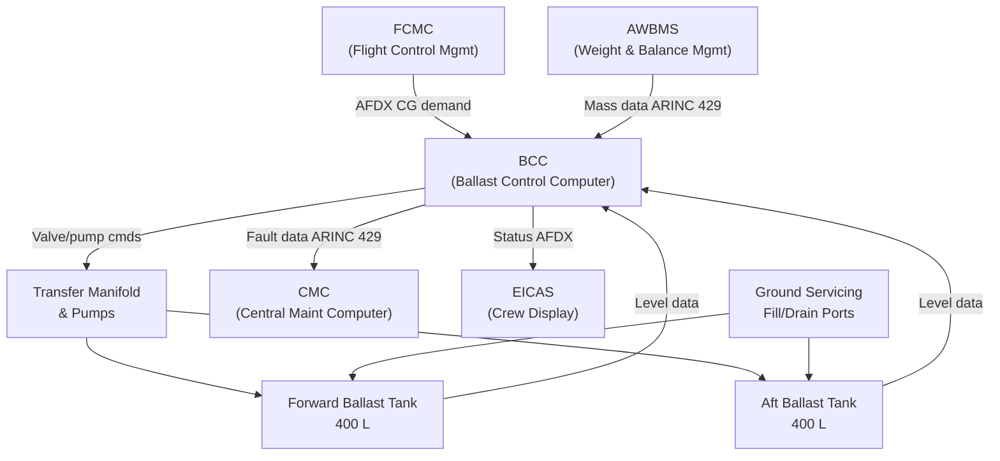
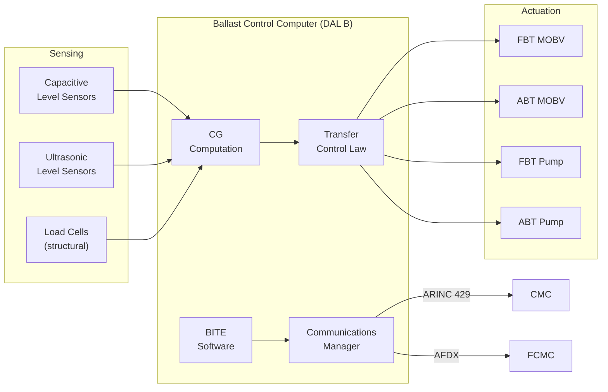
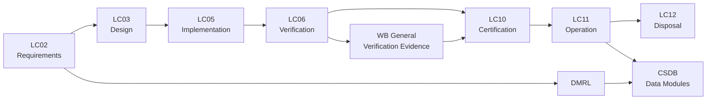

# ATLAS 040-049 · Section 04 · Subsection 041 · 000 — Water Ballast General

## 0. Hyperlink Policy

All internal cross-references use relative Markdown links resolved within the Q+ATLANTIDE CSDB repository. External regulatory citations are listed in §19 (Citations) and §20 (References) with identifiers marked  pending publication indexing. Parent context: [ATLAS 040-049 Water Ballast README](../README.md).

---

## 1. Purpose

This document establishes the general framework for the Water Ballast (WB) system on the [PROGRAMME-AIRCRAFT] electric wide-body twin-wing ([PROGRAMME-VARIANT]) aircraft. It defines the system boundary, regulatory basis, design philosophy, and top-level functional allocation that govern all subordinate water ballast subsystem documents within the ATLAS 041 subject range (041-000 through 041-090).

The Water Ballast system provides active centre-of-gravity (CG) management by transferring a controlled water mass between fore and aft ballast tanks. On the programme-defined aircraft type, where the distributed propulsion architecture and hydrogen/battery hybrid energy storage create a variable mass distribution across the flight envelope, precise CG control is safety-critical for handling-qualities compliance with CS-25 Amendment 27 §25.143 and §25.171 through §25.181.

The top-level design is governed by CS-25 §25.1583 (operating limitations), FAR Part 25 §25.785 (seats, berths, safety belts), and the EASA certification basis agreed in the Type Certificate Data Sheet (TCDS). Environmental qualification of all wetted and electronic components complies with DO-160G. Weight and balance documentation for line operations conforms to EASA Part-CAT OPS requirements and IATA AHM 560.

---

## 2. Applicability

| Attribute | Value |
|-----------|-------|
| Aircraft Model | programme-defined aircraft type (all production variants) |
| ATA Reference | ATA 41 — Water Ballast |
| Standards | CS-25 Amd 27, FAR Part 25, DO-160G, S1000D Issue 5.0, ARP4754B |
| Dev Assurance | ARP4754B System Level DAL B (CG control function) |
| Applicability Code | [PROGRAMME-AIRCRAFT]-[PROGRAMME-VARIANT]-ALL |
| Weight Impact | Max ballast water mass 800 kg (fore + aft tanks combined) |

---

## 3. System / Function Overview

The Water Ballast system comprises two primary tank groups — a forward ballast tank (FBT) located beneath the forward cargo hold and an aft ballast tank (ABT) adjacent to the aft pressure bulkhead — connected by a transfer manifold with electrically actuated valves and dual centrifugal transfer pumps. Total usable water volume is 800 litres at 1.0 kg/litre, providing a CG authority of ±3.5% mean aerodynamic chord (MAC) relative to the nominal centre-of-gravity position.

The Ballast Control Computer (BCC), interfaced to the Flight Control Management Computer (FCMC) via AFDX (ARINC 664 Part 7), continuously computes the required ballast transfer schedule based on fuel burn, passenger load changes, and cargo loading as reported by the Aircraft Weight and Balance Management System (AWBMS). Transfer commands are executed automatically within defined authority limits, with manual override available to the crew via the Overhead Panel (OHP) Water Ballast Control Panel (WBCP).

System integrity is maintained through redundant level sensing (capacitive primary, ultrasonic secondary), independent pump channels, and fail-safe valve logic that isolates all tanks on detection of a leak or loss of BCC. The system does not form part of the primary flight control path; it acts as a slow-authority trim aid with a maximum transfer rate of 25 kg/min per channel.

---

## 4. Scope

### 4.1 Included
- General system description and top-level functional allocation (this document)
- Tank storage and structural integration (041-010)
- Distribution piping, manifold, and transfer flow paths (041-020)
- Pumps, valves, and fluid lines (041-030)
- Quantity indication and mass properties computation (041-040)
- Ballast Control Computer, automatic trim interfaces, and FCMC link (041-050)
- Drain, dump, and isolation functions (041-060)
- Ground servicing and fill-port interfaces (041-070)
- BITE, diagnostics, CMC, and ACMS integration (041-080)
- S1000D/CSDB mapping and traceability matrix (041-090)

### 4.2 Excluded
- Fuel system CG management (ATA 28)
- Primary flight control authority (ATA 27)
- Potable water system (ATA 38)
- Cargo loading management beyond WB input data (ATA 25)

---

## 5. Architecture Description

**System Topology.** The WB system is arranged as a two-tank, single-manifold architecture. The FBT (400 L) and ABT (400 L) are interconnected via a 50 mm bore stainless-steel transfer manifold. Each tank has an independent fill port, level sensor suite, and isolation valve. Transfer direction is determined by the BCC based on real-time CG computation.

**Control Path.** The BCC (DAL B, ARINC 653 partitioned) receives aircraft state data (fuel quantity, passenger seating sensors, cargo load cells) via AFDX and outputs valve/pump commands via hardwired discretes and ARINC 429 data words. The BCC implements a PI control law with authority limits of ±3.5% MAC and a minimum transfer increment of 5 kg to avoid hunting.

**Safety Architecture.** Primary isolation is provided by motor-operated ball valves (MOBVs) on each tank outlet. Secondary isolation is provided by spring-loaded solenoid isolation valves. On BCC failure, both channels revert to last-known-good valve state (fail-operational for 30 minutes) before defaulting to full isolation. A dedicated leak detection loop (differential pressure across each line segment) triggers EICAS advisory within 5 seconds of detection.

**Environmental Protection.** All tanks, lines, and wetted fittings are designed to operate from −55 °C to +70 °C ambient. Freeze protection is provided by thermostatically controlled trace heating elements on all external and non-insulated line runs, powered from the aircraft 28 VDC essential bus.

---

## 6. Functional Breakdown

| Function ID | Function Name | Description | Allocated To | DAL |
|-------------|---------------|-------------|-------------|-----|
| F-000-01 | CG Computation | Compute real-time CG position from mass inputs | BCC Software | B |
| F-000-02 | Transfer Control | Command pump and valve sequencing for ballast transfer | BCC Software | B |
| F-000-03 | Quantity Sensing | Measure water mass in each tank to ±0.5% full scale | WBMS Sensors | B |
| F-000-04 | Crew Indication | Display CG position and ballast status on EICAS/OHP | Display Software | C |
| F-000-05 | Fault Isolation | Detect, isolate, and report WB system faults to CMC | BITE Module | C |

---

## 7. Mermaid — System Context Diagram

---

## 8. Mermaid — Internal Functional Architecture

---

## 9. Mermaid — Lifecycle Traceability

---

## 10. Interfaces

| Interface ID | From | To | Protocol / Standard | Direction | Notes |
|-------------|------|----|---------------------|-----------|-------|
| IF-000-01 | BCC | FCMC | AFDX (ARINC 664 Pt.7) | Bi-directional | CG demand / status |
| IF-000-02 | BCC | CMC | ARINC 429 | BCC → CMC | Fault / maintenance messages |
| IF-000-03 | BCC | EICAS | AFDX | BCC → EICAS | Crew advisory / status pages |
| IF-000-04 | AWBMS | BCC | ARINC 429 | AWBMS → BCC | Mass data (fuel, PAX, cargo) |
| IF-000-05 | BCC | Valve/Pump actuators | 28 VDC discrete + RS-422 | BCC → Actuators | Command signals |
| IF-000-06 | Ground panel | BCC | Discrete / ARINC 429 | Ground → BCC | Servicing data uplink |

---

## 11. Operating Modes

| Mode | Description | Trigger | System Response |
|------|-------------|---------|-----------------|
| Normal Auto | BCC controls transfer automatically per CG trim law | Aircraft in-flight, BCC healthy | Continuous CG monitoring and transfer as needed |
| Manual Crew | Crew selects fore/aft transfer via WBCP | Crew selection on OHP | BCC executes commanded direction at fixed rate; auto inhibited |
| Degraded | Single sensor or single pump failure | BITE fault detection | Transfer continues on redundant channel; EICAS advisory |
| Fail-Safe Isolation | BCC loss or dual-channel fault | Watchdog timeout or dual fault | All MOBVs close; tanks isolated; EICAS warning |

---

## 12. Monitoring and Diagnostics

- Continuous BITE monitors BCC processor health, sensor validity, and actuator feedback at 10 Hz cycle rate.
- Differential pressure sensors across each line segment detect leaks; threshold set at 0.05 bar deviation triggers EICAS advisory within 5 seconds.
- Tank level cross-check between capacitive and ultrasonic sensors; discrepancy >2% triggers sensor fault flag.
- BCC watchdog timer (100 ms timeout) drives hardware isolation relay if software hangs.
- All fault events logged to Non-Volatile Memory (NVM) in BCC for retrieval via AMT (ARINC 767) interface.
- CMC fault messages conform to ARINC 780 message format; maintenance messages use ATA MSG coding for ATA 41.

---

## 13. Maintenance Concept

| Task | Interval | Access | Tooling |
|------|----------|--------|---------|
| Visual inspection of tanks and lines | Pre-flight (walk-around) | External access panels | None |
| BCC NVM fault log download | On-condition / A-check | AMT port (forward EE bay) | AMT laptop + ARINC 767 adapter |
| Level sensor calibration check | 4,000 FH or C-check | Cargo hold access | Calibration jig + test fluid |
| Full system functional test | C-check / after modification | Ground power + GSE water supply | WB functional test rig |
| Tank interior inspection and cleaning | 8,000 FH or D-check | Tank access manholes | Borescope + approved cleaning agents |

---

## 14. S1000D / CSDB Mapping

| Document Type | Data Module Code (DMC) | Info Code | Title |
|---------------|----------------------|-----------|-------|
| System Description | DMC-<PROGRAMME>-<VARIANT>-041-000-00A-040A-A | 040 | Water Ballast General Description |
| Maintenance Procedures | DMC-<PROGRAMME>-<VARIANT>-041-000-00A-300A-A | 300 | Water Ballast General Fault Isolation |
| BITE/Test | DMC-<PROGRAMME>-<VARIANT>-041-000-00A-400A-A | 400 | Water Ballast General BITE Procedures |
| Wiring Data | DMC-<PROGRAMME>-<VARIANT>-041-000-00A-520A-A | 520 | Water Ballast General Wiring and Connector Data |
| IPD | DMC-<PROGRAMME>-<VARIANT>-041-000-00A-941A-A | 941 | Water Ballast General Illustrated Parts |
| Software Desc | DMC-<PROGRAMME>-<VARIANT>-041-000-00A-720A-A | 720 | Water Ballast General SW Description |

### Recommended Data Module Set

| Info Code | Publication | Applicability |
|-----------|-------------|---------------|
| 040 | AMM — System Description | All variants |
| 300 | FIM — Fault Isolation | All variants |
| 400 | TSM — BITE Procedures | All variants |
| 520 | AMM — Wiring Data | All variants |
| 720 | SRM — Software Description | All variants |
| 941 | IPD — Parts Data | All variants |

---

## 15. Footprints

### 15.1 Physical

| Item | Dimension (mm) | Mass (kg) | Location |
|------|---------------|-----------|----------|
| Forward Ballast Tank (FBT) | 1 200 × 600 × 600 | 48 (empty) | Fwd cargo hold underfloor |
| Aft Ballast Tank (ABT) | 1 200 × 600 × 600 | 48 (empty) | Aft pressure-bulkhead bay |
| Transfer manifold assembly | 2 400 × 150 × 150 | 12 | Belly fairing keel beam |

### 15.2 Electrical / Data

| Interface | Standard | Bandwidth / Power |
|-----------|----------|-------------------|
| AFDX network | ARINC 664 Part 7 | 100 Mbit/s / < 5 W |
| ARINC 429 bus | ARINC 429 High-speed | 100 kbit/s / < 1 W |
| 28 VDC trace heating | MIL-W-22759 | 800 W peak (all zones) |

### 15.3 Maintenance

| Task | Man-Hours | Skill Level | Access |
|------|-----------|-------------|--------|
| A-check fault log download | 0.5 | AV tech (Cat B2) | EE bay AMT port |
| C-check sensor calibration | 4.0 | AV tech (Cat B2) | Cargo hold |
| D-check tank inspection | 8.0 | Struct + AV (Cat B1/B2) | Tank manholes |

### 15.4 Data

| Data Item | Volume | Storage | Retention |
|-----------|--------|---------|-----------|
| BCC NVM fault logs | 64 MB | BCC internal NVM | Last 2 000 flight hours |
| CSDB data modules | ~200 DMs | CSDB repository | Lifetime of type |
| AWBMS weight reports | 1 MB/flight | QAR / ACMS | 12 months on aircraft |

---

## 16. Safety and Certification Considerations

- System classified DAL B per ARP4754B due to contribution to CG control; loss of CG management is not catastrophic (crew can recover) but hazardous if undetected, hence Hazardous / DAL B.
- CS-25 §25.1583 requires operating limitation documentation; WBCP placards and AFM supplement define max ballast mass and CG envelope limits.
- DO-160G environmental qualification covers temperature (−55/+70 °C), humidity (Cat A), vibration (Curve B), altitude (50 000 ft), and lightning indirect effects (Level 3).
- DO-178C DAL B applies to BCC software (CG computation and transfer control); DO-254 DAL C applies to valve-driver hardware.
- CS-25 §25.981 fire and ignition protection: all ballast lines in fire zones use fire-resistant materials per AC 20-135.
- Failure Mode and Effects Analysis (FMEA) per ARP4761A required for all single-failure paths; demonstrated system-level probability of hazardous failure < 1×10⁻⁷ per flight hour.

---

## 17. Verification and Validation

| V&V ID | Requirement | Method | Success Criteria | Status |
|--------|-------------|--------|-----------------|--------|
| VV-000-01 | CG computation accuracy ±0.5% MAC | Analysis + ground test | BCC output within ±0.5% MAC of reference |  |
| VV-000-02 | Transfer rate ≥ 20 kg/min per channel | Ground test | Measured rate ≥ 20 kg/min at nominal conditions |  |
| VV-000-03 | Fail-safe isolation on BCC loss | Fault injection test | MOBVs closed within 200 ms of BCC watchdog trigger |  |
| VV-000-04 | DO-160G environmental qualification | Lab test per DO-160G | Pass all applicable categories |  |
| VV-000-05 | FMEA probability < 1×10⁻⁷ per FH | Analysis (ARP4761A) | Quantitative FTA result < 1×10⁻⁷ |  |
| VV-000-06 | BITE fault detection coverage ≥ 99% | Analysis + test | BITE detects ≥ 99% of defined fault list |  |
| VV-000-07 | CS-25 §25.1583 AFM supplement | Compliance review | AFM supplement accepted by authority |  |

---

## 18. Glossary

| Term/Acronym | Definition | Link |
|-------------|-----------|------|
| ABT | Aft Ballast Tank — the rearward water ballast tank adjacent to the aft pressure bulkhead | [§3](#3-system--function-overview) |
| AWBMS | Aircraft Weight and Balance Management System — computes and monitors aircraft CG using sensor inputs from fuel, PAX, and cargo systems | [§10](#10-interfaces) |
| BCC | Ballast Control Computer — DAL B avionics unit executing CG computation and transfer control law | [§5](#5-architecture-description) |
| CG | Centre of Gravity — the point at which the aircraft weight acts; expressed as % MAC | [§3](#3-system--function-overview) |
| DAL | Development Assurance Level — assigned per ARP4754B; governs rigour of design and verification process | [§6](#6-functional-breakdown) |
| [PROGRAMME-VARIANT] | Electric Wide-body Twin-Wing — the [PROGRAMME-AIRCRAFT] airframe configuration with distributed electric propulsion on twin wing structures | [§1](#1-purpose) |
| FBT | Forward Ballast Tank — the forward water ballast tank located beneath the forward cargo hold | [§3](#3-system--function-overview) |
| FCMC | Flight Control Management Computer — primary avionics computer managing flight envelope and receiving CG trim demand from BCC | [§10](#10-interfaces) |
| MAC | Mean Aerodynamic Chord — the reference chord length used to express CG position as a percentage | [§3](#3-system--function-overview) |
| MOBV | Motor-Operated Ball Valve — electrically actuated valve providing primary tank isolation | [§5](#5-architecture-description) |
| WBCP | Water Ballast Control Panel — overhead panel interface for crew manual control of ballast transfers | [§3](#3-system--function-overview) |
| WBMS | Water Ballast Management System — collective term for BCC and associated sensors/actuators | [§3](#3-system--function-overview) |

---

## 19. Citations

| Ref | Citation | Use | Link |
|-----|---------|-----|------|
| CS-25 | EASA CS-25 Amendment 27 — Certification Specifications for Large Aeroplanes | Regulatory basis; §25.1583 operating limitations, §25.143 handling qualities |  |
| FAR-25 | FAA FAR Part 25 — Airworthiness Standards: Transport Category Airplanes | US regulatory mirror to CS-25 for FAA validation |  |
| DO-160G | RTCA DO-160G — Environmental Conditions and Test Procedures for Airborne Equipment | Environmental qualification of WB components |  |
| ARP4754B | SAE ARP4754B — Guidelines for Development of Civil Aircraft and Systems | System DAL assignment and development process |  |
| ARP4761A | SAE ARP4761A — Guidelines and Methods for the Safety Assessment Process | FMEA and FTA methodology |  |
| S1000D | S1000D Issue 5.0 — International Specification for Technical Publications | CSDB data module coding and publication structure |  |
| ATA-iSpec-2200 | ATA iSpec 2200 — Information Standards for Aviation Maintenance | AMM/FIM/IPD structure and ATA chapter coding |  |
| EASA-TC | EASA Type Certificate Data Sheet for [PROGRAMME-AIRCRAFT] | Certification basis and approved AFM limitations |  |

---

## 20. References

| Ref | Document | Identifier | Revision | Status | Link |
|-----|---------|-----------|---------|--------|------|
| R-001 | [PROGRAMME-AIRCRAFT] System Architecture Document | [PROGRAMME-AIRCRAFT]-SAD-001 | Rev A | Active |  |
| R-002 | Water Ballast System Requirements Specification | [PROGRAMME-AIRCRAFT]-SRS-041-001 | Rev A | Active |  |
| R-003 | Q+ATLANTIDE ATLAS Framework README | QATL-ATLAS-README | Rev 1.0 | Active | [README](../README.md) |

---

## 21. Open Issues

| ID | Issue | Owner | Status | Link |
|----|-------|-------|--------|------|
| OI-000-01 | Final CG authority limits (±3.5% MAC) subject to handling qualities flight test confirmation | Q-AIR | Open |  |
| OI-000-02 | TCDS AFM supplement format and content pending EASA pre-submission review | Q-DATAGOV | Open |  |
| OI-000-03 | DO-160G test laboratory selection and schedule for BCC environmental qualification | Q-MECHANICS | Open |  |

---

## 22. Change Log

| Version | Date | Author | Change | Link |
|---------|------|--------|--------|------|
| 1.0.0 | 2026-05-09 | Q+ Team/Amedeo Pelliccia + AI | Initial creation with full 22-section template |  |
