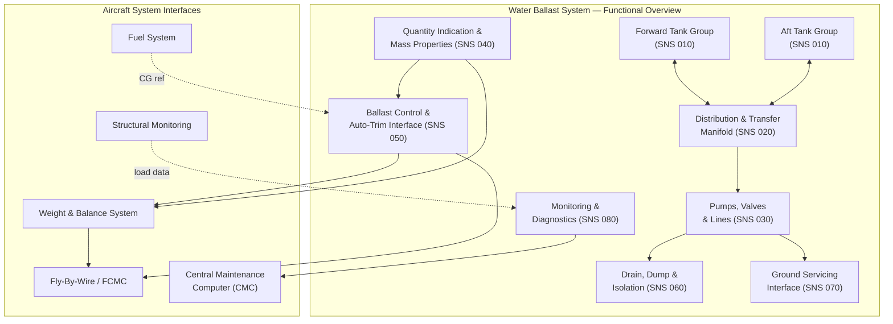

# ATLAS 040-049 · Section 04 · Subsection 041 · 000 — Water Ballast General

## 1. Purpose

This document provides the general overview and system-level description of the Water Ballast System (WBS) as defined within the Q+ATLANTIDE ATLAS architecture framework. The WBS is a dedicated onboard system designed to actively manage the aircraft's centre-of-gravity (CG) position, all-up weight distribution, structural load symmetry, and aerodynamic trim state through the controlled carriage, transfer, and jettison of potable or non-potable water ballast.

The primary purpose of this general document (SNS 000) is to establish the system boundary, define the functional scope and design intent, identify all major interfaces, and provide the regulatory and certification context governing the WBS. All subordinate subsubject documents (SNS 010 through 090) are subordinate to and consistent with the definitions herein.

The WBS fulfils four principal operational roles:

1. **Centre-of-Gravity Management** — Active transfer of water between forward and aft tank groups adjusts the longitudinal CG position within the certified CG envelope, reducing stabiliser trim drag and improving fuel efficiency throughout the flight envelope.
2. **Structural Testing and Ground Validation** — Water ballast provides a safe, controllable, and repeatable means of introducing distributed structural loads during static, fatigue, and ground resonance testing without the risks associated with solid ballast masses.
3. **Performance Validation and Flight Testing** — WBS allows flight-test organisations to precisely vary aircraft weight and CG independently, enabling efficient exploration of the full weight-and-balance flight envelope per CS-25.103 and FAR 25.103.
4. **Weight-and-Balance Dispatch Compliance** — For commercial operations, the WBS may be used as a dispatch tool to ensure take-off CG compliance when payload loading deviates from the standard loading schedule.

## 2. Scope

This document covers:

- System functional description and design philosophy of the Water Ballast System.
- Definition of system boundaries and interface identification with adjacent aircraft systems (fuel system, fly-by-wire, central maintenance computer, weight-and-balance system, structural monitoring system).
- Applicable regulatory framework including CS-25 (EASA Certification Specifications for Large Aeroplanes), FAR Part 25 (FAA Airworthiness Standards), ATA iSpec 2200 chapter structuring, and S1000D Issue 5.0 data module structuring.
- High-level system architecture including major components, functional groupings, and data flows.
- Safety classification and development assurance level assignment per SAE ARP4754A and EUROCAE ED-79A.

This document does **not** cover detailed component specifications, manufacturing drawings, or maintenance task procedures, which are addressed in the subordinate SNS documents (010–090) and their associated S1000D data modules.

## 3. Glossary

| Term / Acronym | Definition |
|---|---|
| WBS | Water Ballast System — the integrated onboard system for carriage, transfer, and discharge of water ballast to manage aircraft CG and weight. |
| CG | Centre of Gravity — the three-dimensional point through which the resultant gravitational force on the aircraft acts; expressed as % Mean Aerodynamic Chord (%MAC) for longitudinal management. |
| MAC | Mean Aerodynamic Chord — the chord of the theoretical rectangular wing having the same area and aerodynamic moments as the actual tapered wing; used as the reference for CG limits. |
| CS-25 | EASA Certification Specifications for Large Aeroplanes — the EASA airworthiness code governing structural, performance, flight, and systems certification of transport category aircraft. |
| FAR 25 | Federal Aviation Regulations Part 25 — the FAA equivalent airworthiness standard for transport category aeroplanes. |
| DAL | Development Assurance Level — a classification (A through E) per SAE ARP4754A/DO-178C/DO-254 indicating the rigour of development and verification activities required based on the severity of failure effects. |
| FHA | Functional Hazard Assessment — a systematic examination of aircraft and system functions to identify potential failure conditions and their effects, performed per SAE ARP4754A §5.2. |
| PSSA | Preliminary System Safety Assessment — a top-down safety analysis defining safety requirements for systems and items based on FHA results, per SAE ARP4754A §5.4. |
| %MAC | Percentage Mean Aerodynamic Chord — the non-dimensional expression of longitudinal CG position relative to the leading edge of the MAC. |
| MTOW | Maximum Take-Off Weight — the maximum certified structural weight at which the aircraft may commence the take-off roll. |
| ZFW | Zero Fuel Weight — the maximum structural weight of the aircraft excluding usable fuel; a primary structural design limit. |
| ATA iSpec 2200 | Airlines for America Information Specification for Aviation — the industry standard defining chapter, section, and subject numbering for aircraft technical publications. |

## 4. Diagram (Mermaid)

## 5. Footprint

| Metric | Value |
|---|---|
| Architecture | `ATLAS` — Aircraft Top Level Architecture Schema/System (controlled term) |
| Master range | `000–099` |
| Code range | `040-049` |
| Section | `04` — Aviónica, Información & APU |
| Subsection | `041` — Water Ballast |
| Subsubject | `000` — Water Ballast General |
| Primary Q-Division | Q-DATAGOV[^qdiv] |
| Support Q-Divisions | Q-AIR, Q-SPACE, Q-HPC |
| ORB support | ORB-PMO, ORB-LEG |
| Governance class | `baseline`[^gov] |
| Folder path | `Q+ATLANTIDE/000-099_ATLAS/040-049_Avionica-Informacion-y-APU/041_Water-Ballast/` |
| Document | `041-000-Water-Ballast-General.md` (this file) |
| Parent subsection | [`README.md`](./README.md) |
| Parent section | [`../../README.md`](../../README.md) |
| Parent architecture | [`../../../README.md`](../../../README.md) |
| Parent baseline | [`organization/Q+ATLANTIDE.md`](../../../../organization/Q+ATLANTIDE.md) |

## 6. References & Citations

[^baseline]: Q+ATLANTIDE controlled baseline (v1.0.0) — the governing architecture baseline document for the ATLAS master range 000–099. All documents in this subsection derive authority from the Q+ATLANTIDE baseline register.

[^qdiv]: Q-Division authority — Q-DATAGOV holds primary data governance authority over all ATLAS subsubject documents. Q-AIR, Q-SPACE, and Q-HPC provide engineering domain support.

[^gov]: Governance class — `baseline` denotes that this document is subject to formal change control, configuration management, and periodic review under the Q+ATLANTIDE baseline management process.

[^n001]: Note N-001 — EASA CS-25 (Amendment 27, 2023): Certification Specifications and Acceptable Means of Compliance for Large Aeroplanes. European Union Aviation Safety Agency, Cologne. Applicable subparts: CS-25.301 (loads), CS-25.561 (emergency landing), CS-25.1309 (equipment, systems, installations), CS-25.1316 (system lightning protection).

[^n002]: Note N-002 — FAA FAR Part 25 (14 CFR Part 25): Airworthiness Standards — Transport Category Airplanes. U.S. Federal Aviation Administration. Applicable to certification basis harmonisation with EASA CS-25 for WBS functional and structural requirements.

[^n003]: Note N-003 — SAE ARP4754A (2010): Guidelines for Development of Civil Aircraft and Systems. SAE International. Governs FHA, PSSA, SSA, and DAL assignment for all WBS functions and failure modes.

[^n004]: Note N-004 — EUROCAE ED-79A / SAE ARP4754A: Safety Assessment Process for Part 25 aircraft systems. Defines the acceptable means of compliance for system safety assessment submitted to EASA/FAA during WBS certification.

[^n005]: Note N-005 — ATA iSpec 2200 (2022 edition): Information Standards for Aviation Maintenance. Airlines for America (A4A). Governs technical publication chapter, section, and subject numbering; ATA chapter 41 corresponds to the Water Ballast system.

[^n006]: Note N-006 — S1000D Issue 5.0 (2019): International Specification for Technical Publications. ASD/AIA/ATA. Governs data module coding, CSDB structure, and publication types for all WBS technical publications (AMM, IPD, SRM, FIM).
