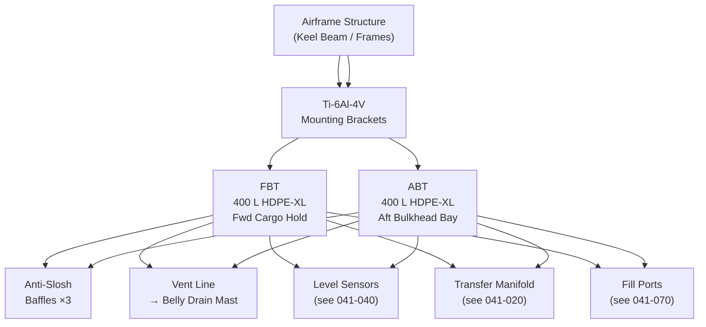
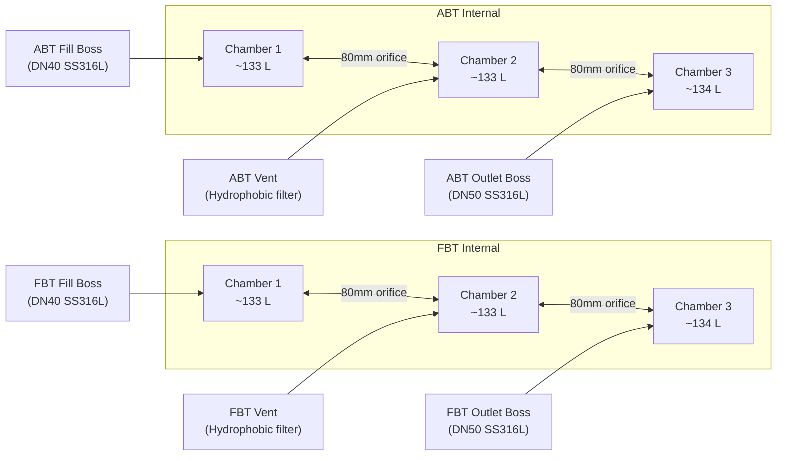
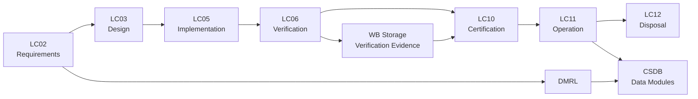

# ATLAS 040-049 · Section 04 · Subsection 041 · 010 — Water Ballast Storage

## 0. Hyperlink Policy

All internal cross-references use relative Markdown links resolved within the Q+ATLANTIDE CSDB repository. External regulatory citations are listed in §19 (Citations) and §20 (References) with identifiers marked  pending publication indexing. Parent context: [ATLAS 041 Water Ballast General](./041-000-Water-Ballast-General.md).

---

## 1. Purpose

This document defines the storage architecture for the Water Ballast system on the AMPEL360E eWTW aircraft. It specifies the tank configuration, material selection, structural attachment, volume/mass sizing, venting provisions, and internal anti-slosh design for both the Forward Ballast Tank (FBT) and Aft Ballast Tank (ABT).

Tank design must satisfy contradictory requirements: low empty mass (to minimise structural weight penalty), high structural efficiency under pressurised and inertial loads, and resistance to the corrosive, microbiological, and freeze-thaw environments encountered across the operational flight envelope. Both rigid HDPE and flexible bladder-tank architectures are assessed; the baseline selection is rigid HDPE for structural predictability and low maintenance.

Environmental qualification of all tank assemblies, including mounting hardware and integral fittings, complies with DO-160G §4 (temperature/altitude), §6 (temperature variation), and §8 (humidity). Structural proof and ultimate load testing conforms to CS-25 §25.561 (emergency landing conditions) and §25.571 (damage tolerance).

---

## 2. Applicability

| Attribute | Value |
|-----------|-------|
| Aircraft Model | AMPEL360E eWTW (all production variants) |
| ATA Reference | ATA 41-10 — Water Ballast Storage |
| Standards | CS-25 Amd 27, DO-160G §4/6/8, ISO 15750, ARP4754B |
| Dev Assurance | DAL C (structural/containment); DAL B for quantity sensing |
| Applicability Code | AMPEL360E-EWTW-ALL |
| Max Operating Pressure | 0.35 bar gauge (gravity + pump head) |

---

## 3. System / Function Overview

The FBT and ABT each have a nominal usable volume of 400 litres (400 kg at 1.0 kg/L). The tanks are constructed from cross-linked high-density polyethylene (HDPE-XL) with a minimum wall thickness of 8 mm, providing a burst factor of 4× operating pressure per CS-25 §25.985 equivalent. External surface UV stabilisation and antistatic coating meet DO-160G §25 (electrostatic discharge).

Structural attachment uses a 6-point titanium bracket system per tank, with vibration-isolating bushings rated to DO-160G Curve B. Each bracket transfers both inertial and pressure loads to the primary airframe structure via shear pins, preventing peel loads on the airframe skin.

Anti-slosh baffles of 6 mm HDPE partition each tank into three equal chambers connected by calibrated orifices sized to limit free-surface sloshing resonance frequency to below 0.05 Hz, well below the aircraft's lowest flexible-body mode. Venting is provided by a dedicated vent line to the airframe belly drain mast, fitted with a hydrophobic membrane filter to prevent water ingress during high-humidity ground operations.

---

## 4. Scope

### 4.1 Included
- FBT and ABT structural design and material specification
- Anti-slosh baffle design and sizing
- Tank venting architecture and vent-line routing
- Structural attachment brackets and vibration isolation
- Integral fittings (fill/drain bosses, sensor ports, outlet boss)
- DO-160G environmental qualification scope for tank assemblies
- Bladder-tank alternative assessment (trade study documentation reference)

### 4.2 Excluded
- Distribution piping downstream of tank outlet fittings (see 041-020)
- Level sensors (see 041-040)
- Fill port and ground servicing interface (see 041-070)
- Thermal / freeze-protection trace heating of lines (see 041-030)

---

## 5. Architecture Description

**Tank Construction.** The HDPE-XL tanks are rotationally moulded as single-piece shells to eliminate weld seams. Wall thickness is 8 mm minimum at all sections, increasing to 12 mm at fitting boss interfaces. Internal surface roughness Ra ≤ 3.2 µm to minimise biofilm adhesion. Tanks are opaque to UV light to inhibit algae growth.

**Anti-Slosh Design.** Three transverse baffles per tank divide the internal volume into four equal chambers. Calibrated orifice diameter is 80 mm, providing adequate inter-chamber flow at transfer rates up to 30 kg/min while restricting sloshing. Baffle attachment uses HDPE fusion bonding; joint strength verified to 150% of ultimate slosh load.

**Structural Attachment.** Six titanium (Ti-6Al-4V) mounting brackets per tank, with 3 on each longitudinal rail. Brackets are bolted to airframe frames via NAS standard bolts with wet installation per AMPEL360E structural repair manual. Elastomeric vibration isolators (Shore 60A) between bracket and tank flange reduce high-frequency vibration transmission.

**Material Compatibility.** HDPE-XL is compatible with deionised water, potable water (NSF/ANSI 61 compliant), and dilute biocide solutions (150 ppm chlorine equivalent). All metallic fittings are 316L stainless steel. EPDM seals are used on all connections; PTFE thread tape is prohibited (FOD risk); Loctite 243 threadlocker is used on all fitting bosses.

---

## 6. Functional Breakdown

| Function ID | Function Name | Description | Allocated To | DAL |
|-------------|---------------|-------------|-------------|-----|
| F-010-01 | Water Containment | Contain up to 400 L water under all flight and ground load cases | Tank structure | C |
| F-010-02 | Slosh Attenuation | Limit free-surface sloshing to prevent structural excitation | Anti-slosh baffles | C |
| F-010-03 | Pressure Relief | Vent tank headspace to prevent over-pressure from thermal expansion | Vent assembly | C |
| F-010-04 | Structural Load Transfer | Transfer tank inertial and pressure loads to airframe | Mounting brackets | C |
| F-010-05 | Freeze Protection Interface | Provide attachment interfaces for trace-heating elements on external surfaces | Tank shell bosses | D |

---

## 7. Mermaid — System Context Diagram

---

## 8. Mermaid — Internal Functional Architecture

---

## 9. Mermaid — Lifecycle Traceability

---

## 10. Interfaces

| Interface ID | From | To | Protocol / Standard | Direction | Notes |
|-------------|------|----|---------------------|-----------|-------|
| IF-010-01 | FBT outlet boss | Transfer manifold | Flanged connection DN50 SS316L | FBT → Manifold | Per 041-020 |
| IF-010-02 | ABT outlet boss | Transfer manifold | Flanged connection DN50 SS316L | ABT → Manifold | Per 041-020 |
| IF-010-03 | FBT fill boss | Ground fill line | Quick-disconnect DN40 | External → FBT | Per 041-070 |
| IF-010-04 | ABT fill boss | Ground fill line | Quick-disconnect DN40 | External → ABT | Per 041-070 |
| IF-010-05 | Tank sensor ports | Level sensors | NPT 1/2 threaded boss | Sensor → Tank | Per 041-040 |
| IF-010-06 | Vent bosses | Belly drain mast | 12 mm OD PTFE tube | Tank → Atmosphere | Hydrophobic filter fitted |

---

## 11. Operating Modes

| Mode | Description | Trigger | System Response |
|------|-------------|---------|-----------------|
| Full (800 kg combined) | Both tanks at maximum fill level | Ground servicing completed | All anti-slosh baffles engaged; vent open |
| Transfer | Water moving between FBT and ABT via manifold | BCC transfer command | Outlet valve open; pump running; free surface level in motion |
| Partially Filled | Tanks at intermediate levels during flight | Normal operation / fuel burn offset | Slosh risk per CFD-validated baffle model |
| Empty / Dry | Tanks drained for maintenance or disposal | Maintenance drain procedure | Tank interior accessible via manhole; vent open |

---

## 12. Monitoring and Diagnostics

- Tank pressure is monitored by a 0–1 bar MEMS pressure transducer on each tank headspace; overpressure alarm at 0.4 bar gauge.
- Vent-line blockage detected by differential pressure across hydrophobic filter; alarm threshold 0.02 bar differential.
- External tank surface visual inspection criteria defined in AMM: crazing, surface cracks >10 mm, or discolouration to be reported.
- Structural bracket torque-check values recorded at each C-check; out-of-tolerance torque values trigger NDT inspection of bracket attachment holes.
- Water quality sample port on FBT fill boss enables microbiological sampling per AMPEL360E maintenance schedule.

---

## 13. Maintenance Concept

| Task | Interval | Access | Tooling |
|------|----------|--------|---------|
| External visual inspection of tanks and brackets | A-check | Cargo hold panels removed | Flashlight, mirror |
| Vent filter replacement | 2 000 FH or C-check | Cargo hold | Filter spanner, approved filter element |
| Bracket torque verification | C-check | Cargo hold | Calibrated torque wrench |
| Tank internal inspection (borescope) | 8 000 FH / D-check | Manhole access (300 mm dia) | Borescope, cleaning kit |
| Tank replacement (if cracked/degraded) | On-condition | Cargo hold — full tank removal | Tank handling sling, 4-person team |

---

## 14. S1000D / CSDB Mapping

| Document Type | Data Module Code (DMC) | Info Code | Title |
|---------------|----------------------|-----------|-------|
| System Description | DMC-AMPEL360E-EWTW-041-010-00A-040A-A | 040 | Water Ballast Storage Description |
| Maintenance Procedures | DMC-AMPEL360E-EWTW-041-010-00A-300A-A | 300 | Water Ballast Storage Fault Isolation |
| BITE/Test | DMC-AMPEL360E-EWTW-041-010-00A-400A-A | 400 | Water Ballast Storage BITE Procedures |
| Wiring Data | DMC-AMPEL360E-EWTW-041-010-00A-520A-A | 520 | Water Ballast Storage Wiring and Connector Data |
| IPD | DMC-AMPEL360E-EWTW-041-010-00A-941A-A | 941 | Water Ballast Storage Illustrated Parts |
| Software Desc | DMC-AMPEL360E-EWTW-041-010-00A-720A-A | 720 | Water Ballast Storage SW Description |

### Recommended Data Module Set

| Info Code | Publication | Applicability |
|-----------|-------------|---------------|
| 040 | AMM — System Description | All variants |
| 300 | FIM — Fault Isolation | All variants |
| 400 | TSM — BITE Procedures | All variants |
| 520 | AMM — Wiring Data | All variants |
| 720 | SRM — Software Description | All variants |
| 941 | IPD — Parts Data | All variants |

---

## 15. Footprints

### 15.1 Physical

| Item | Dimension (mm) | Mass (kg) | Location |
|------|---------------|-----------|----------|
| FBT (empty, with fittings) | 1 200 × 600 × 600 | 48 | Fwd cargo hold, FS 220–340 |
| ABT (empty, with fittings) | 1 200 × 600 × 600 | 48 | Aft bay, FS 1 480–1 600 |
| Mounting brackets (per tank, set of 6) | Various | 6.5 | Attached to keel beam frames |

### 15.2 Electrical / Data

| Interface | Standard | Bandwidth / Power |
|-----------|----------|-------------------|
| Pressure transducer signal | 4–20 mA analogue | < 0.5 W per sensor |
| Trace heating power (external) | 28 VDC MIL-W-22759 | 200 W per tank zone |
| Level sensor supply | 28 VDC | Covered in 041-040 |

### 15.3 Maintenance

| Task | Man-Hours | Skill Level | Access |
|------|-----------|-------------|--------|
| A-check visual inspection | 0.5 | Cat B1 | Cargo hold |
| C-check filter + bracket check | 2.0 | Cat B1 | Cargo hold panels |
| D-check tank interior inspection | 8.0 | Cat B1 + struct specialist | Manhole access |

### 15.4 Data

| Data Item | Volume | Storage | Retention |
|-----------|--------|---------|-----------|
| Pressure transducer logs | 5 MB/flight | ACMS | 6 months |
| Maintenance inspection records | Per AMM task card | AMT / paper | Life of component |
| Tank serial number traceability | Registry entry | CSDB IPD | Life of type |

---

## 16. Safety and Certification Considerations

- CS-25 §25.561 emergency landing conditions: tank assembly and brackets tested to 9g forward, 3g sideward, 6g downward, 1.5g upward inertial loads.
- CS-25 §25.571 damage tolerance: fatigue crack growth analysis for bracket attachment holes; inspection thresholds defined in MRB.
- DO-160G §4 low temperature: tanks proof-tested at −55 °C with water fill simulated; HDPE-XL retains ductility to −40 °C operating minimum.
- CS-25 §25.863 flammability: HDPE is not used in fire zones; tank locations are non-fire-zone; tank drain to belly sump prevents pooling.
- Microbiological contamination risk: NSF/ANSI 61 material compliance prevents leaching; biocide treatment protocol in AMM limits Legionella growth risk.
- REACH/RoHS compliance: no cadmium, hexavalent chromium, or restricted substances in tank materials per EU Regulation 1907/2006.

---

## 17. Verification and Validation

| V&V ID | Requirement | Method | Success Criteria | Status |
|--------|-------------|--------|-----------------|--------|
| VV-010-01 | Burst pressure ≥ 4× MAWP (0.35 bar) | Hydraulic burst test | No rupture at 1.4 bar |  |
| VV-010-02 | Emergency landing load (9g fwd) | Static structural test | No bracket or attachment failure |  |
| VV-010-03 | DO-160G §4 temperature/altitude | Lab test | Pass all temperature/altitude categories |  |
| VV-010-04 | Slosh frequency < 0.05 Hz | CFD analysis + scaled model test | First sloshing mode < 0.05 Hz |  |
| VV-010-05 | Material compatibility (HDPE-XL / water) | Immersion test per ISO 175 | No measurable degradation after 1 000 h at 70 °C |  |
| VV-010-06 | Vent filter water ingress rejection | Spray test per DO-160G §10 | No water ingress through vent at max spray rate |  |
| VV-010-07 | Tank mass (empty) ≤ 50 kg | Weighing | Measured mass ≤ 50 kg including all fittings |  |

---

## 18. Glossary

| Term/Acronym | Definition | Link |
|-------------|-----------|------|
| ABT | Aft Ballast Tank | [§3](#3-system--function-overview) |
| Anti-Slosh Baffle | Internal partition reducing free-surface sloshing resonance | [§3](#3-system--function-overview) |
| Burst Pressure | Minimum pressure at which the tank structural shell ruptures; must be ≥ 4× MAWP | [§16](#16-safety-and-certification-considerations) |
| DO-160G | RTCA DO-160G Environmental Conditions and Test Procedures for Airborne Equipment | [§2](#2-applicability) |
| FBT | Forward Ballast Tank | [§3](#3-system--function-overview) |
| HDPE-XL | Cross-linked High-Density Polyethylene; rotationally moulded tank material | [§3](#3-system--function-overview) |
| MAWP | Maximum Allowable Working Pressure; 0.35 bar gauge for WB tanks | [§2](#2-applicability) |
| MOBV | Motor-Operated Ball Valve | [§5](#5-architecture-description) |
| NSF/ANSI 61 | US standard for drinking water system components; ensures no hazardous leaching | [§16](#16-safety-and-certification-considerations) |
| Ti-6Al-4V | Titanium alloy (Grade 5) used for mounting brackets; high strength-to-weight ratio | [§5](#5-architecture-description) |
| Vent Assembly | Headspace vent line with hydrophobic filter, routing to belly drain mast | [§3](#3-system--function-overview) |

---

## 19. Citations

| Ref | Citation | Use | Link |
|-----|---------|-----|------|
| CS-25 | EASA CS-25 Amendment 27 — Certification Specifications for Large Aeroplanes | §25.561, §25.571, §25.863 |  |
| DO-160G | RTCA DO-160G — Environmental Conditions and Test Procedures | §4, §6, §8 environmental qualification |  |
| NSF/ANSI 61 | NSF International/ANSI Standard 61 — Drinking Water System Components | Material safety for water contact |  |
| ISO 175 | ISO 175:2010 — Plastics; Methods of Test for Effects of Immersion in Liquid | HDPE-XL material compatibility test |  |
| S1000D | S1000D Issue 5.0 — International Specification for Technical Publications | CSDB mapping |  |
| ATA-iSpec-2200 | ATA iSpec 2200 | AMM/FIM structure |  |
| EASA-TC | EASA Type Certificate Data Sheet for AMPEL360E | Structural load certification basis |  |

---

## 20. References

| Ref | Document | Identifier | Revision | Status | Link |
|-----|---------|-----------|---------|--------|------|
| R-001 | Water Ballast General (041-000) | QATL-ATLAS-041-000 | Rev 1.0 | Active | [041-000](./041-000-Water-Ballast-General.md) |
| R-002 | AMPEL360E Structural Design Manual | AMPEL360E-SDM-001 | Rev A | Active |  |
| R-003 | WB Tank Material Trade Study | AMPEL360E-TS-041-001 | Rev A | Active |  |

---

## 21. Open Issues

| ID | Issue | Owner | Status | Link |
|----|-------|-------|--------|------|
| OI-010-01 | Bladder tank alternative not fully traded; HDPE-XL baseline pending final weight budget confirmation | Q-MECHANICS | Open |  |
| OI-010-02 | DO-160G humidity category selection for ABT location (potential condensation zone) | Q-MECHANICS | Open |  |
| OI-010-03 | Biocide treatment protocol to be aligned with EASA potable water guidance (AMC 25.1419) | Q-GREENTECH | Open |  |

---

## 22. Change Log

| Version | Date | Author | Change | Link |
|---------|------|--------|--------|------|
| 1.0.0 | 2026-05-09 | Q-DATAGOV / Copilot | Initial creation with full 22-section template |  |
