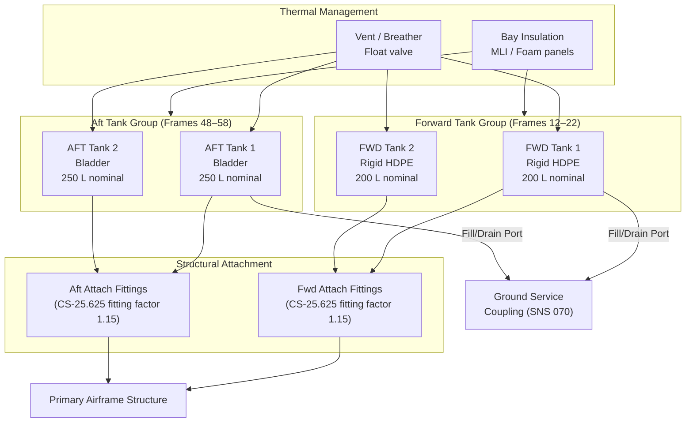

# ATLAS 040-049 · Section 04 · Subsection 041 · 010 — Water Ballast Storage

## 1. Purpose

This document defines the design requirements, material specifications, structural integration principles, certification basis, and thermal management provisions for all water ballast storage containers forming part of the Water Ballast System (WBS) within the Q+ATLANTIDE ATLAS architecture framework. Water ballast storage is the foundational element of the WBS; without adequate, certified storage volumes in appropriate airframe locations, neither CG management nor structural load introduction can be accomplished reliably and safely.

The storage subsystem must simultaneously satisfy conflicting engineering requirements: it must be lightweight (to preserve useful payload capacity when empty), volumetrically efficient (to maximise ballast mass for a given airframe bay volume), structurally compatible with the surrounding primary structure, and demonstrably safe across the full environmental envelope defined in RTCA DO-160G for airborne equipment. The design philosophy documented herein reflects these trade-offs and establishes the baseline configuration from which all design variants and modifications must be assessed.

Tank location philosophy is driven by the requirement to achieve maximum CG shift per kilogram of water transferred. Forward group tanks are positioned ahead of the nominal loaded CG, and aft group tanks are positioned behind it, maximising the moment arm and therefore the CG authority of the system.

## 2. Scope

This document covers:

- Tank type selection rationale (flexible bladder versus rigid shell construction) and the certification implications of each approach.
- Material specifications for tank shells, liners, fitting interfaces, and structural attachment hardware.
- Tank location, orientation, and dimensional envelope within the airframe bays.
- Structural attachment philosophy: load path definition, fitting design, and interface with surrounding primary and secondary structure.
- Certification basis for the storage subsystem under CS-25 Subpart C (Structure) and Subpart D (Design and Construction).
- Thermal management: insulation requirements to prevent freeze damage at altitude, and vent provisions to manage pressure differential.
- Fill and drain provisions integral to the tank assembly, including ground-service coupling interfaces at tank level.

## 3. Glossary

| Term / Acronym | Definition |
|---|---|
| Bladder Tank | A flexible, elastomeric or thermoplastic storage vessel that conforms to a rigid outer bay structure; pressure-neutral when partially filled; collapses when empty. |
| HDPE | High-Density Polyethylene — a thermoplastic polymer used for rigid tank construction; chemically inert to water; weldable; density ≈ 950–970 kg/m³. |
| MIL-DTL-27422 | U.S. military specification for flexible liquid containers (bladder tanks); widely referenced as a design standard for aircraft bladder tank qualification. |
| CS-25 Subpart C | Structural requirements within EASA CS-25 covering limit and ultimate load conditions applicable to tank attachment fittings and surrounding structure. |
| RTCA DO-160G | Environmental Conditions and Test Procedures for Airborne Equipment — defines temperature, humidity, vibration, and altitude test environments applicable to WBS tank assemblies and sensors. |
| Ullage | The void volume within a tank above the liquid surface; required to accommodate liquid expansion due to temperature variation and to prevent tank over-pressurisation. |
| Fitting Factor | A certification multiplier (typically 1.15 per CS-25.625) applied to calculated fitting loads to account for material variability and manufacturing tolerances in structural joints. |
| MLI | Multi-Layer Insulation — a thermal insulation technique using multiple reflective layers separated by low-conductivity spacers; used on tanks in low-temperature bays to prevent freezing. |
| MAWP | Maximum Allowable Working Pressure — the highest internal gauge pressure a tank and its fittings are designed and certified to sustain continuously under normal operating conditions. |
| Proof Pressure | Typically 1.5× MAWP; the pressure applied during acceptance testing to verify structural integrity of the tank assembly without permanent deformation or leakage. |
| Ultimate Pressure | Typically 3.0× MAWP (or as defined by the applicable burst pressure requirement); the pressure at which failure of the tank is acceptable, with no requirement for functionality thereafter. |
| Bay | A structural compartment within the airframe (typically defined by fuselage frames, stringers, and floor beams) into which a tank assembly is installed. |

## 4. Diagram (Mermaid)

## 5. Footprint

| Metric | Value |
|---|---|
| Architecture | `ATLAS` — Aircraft Top Level Architecture Schema/System (controlled term) |
| Master range | `000–099` |
| Code range | `040-049` |
| Section | `04` — Aviónica, Información & APU |
| Subsection | `041` — Water Ballast |
| Subsubject | `010` — Water Ballast Storage |
| Primary Q-Division | Q-DATAGOV[^qdiv] |
| Support Q-Divisions | Q-AIR, Q-SPACE, Q-HPC |
| ORB support | ORB-PMO, ORB-LEG |
| Governance class | `baseline`[^gov] |
| Folder path | `Q+ATLANTIDE/000-099_ATLAS/040-049_Avionica-Informacion-y-APU/041_Water-Ballast/` |
| Document | `041-010-Water-Ballast-Storage.md` (this file) |
| Parent subsection | [`README.md`](./README.md) |
| Parent section | [`../../README.md`](../../README.md) |
| Parent architecture | [`../../../README.md`](../../../README.md) |
| Parent baseline | [`organization/Q+ATLANTIDE.md`](../../../../organization/Q+ATLANTIDE.md) |

## 6. References & Citations

[^baseline]: Q+ATLANTIDE controlled baseline (v1.0.0) — governing architecture baseline for ATLAS master range 000–099; all storage subsubject requirements derive authority from this document.

[^qdiv]: Q-Division authority — Q-DATAGOV holds primary data governance authority. Q-AIR provides structural and materials engineering domain support for tank design and certification.

[^gov]: Governance class — `baseline` denotes formal change control, configuration management, and periodic review under the Q+ATLANTIDE baseline management process.

[^n001]: Note N-001 — EASA CS-25 Amendment 27, Subpart C (§25.301–25.581): Structural requirements governing limit and ultimate load analysis for tank attachment fittings and surrounding airframe structure, including the 1.15 fitting factor per CS-25.625.

[^n002]: Note N-002 — EASA CS-25 Subpart D (§25.601–25.899): Design and Construction requirements applicable to fluid-carrying components, material approval, and pressure vessel design within the airframe environment.

[^n003]: Note N-003 — RTCA DO-160G (2010): Environmental Conditions and Test Procedures for Airborne Equipment. Radio Technical Commission for Aeronautics, Washington DC. Categories applicable to WBS tank assemblies: Temperature (Cat C2), Altitude (Cat A1), Vibration (Cat S/M), Humidity (Cat A).

[^n004]: Note N-004 — MIL-DTL-27422D: Detail Specification — Container, Liquid, Flexible (Collapsible), Military. U.S. Department of Defense. Referenced as design and qualification standard for bladder tank assemblies used in aft tank group.

[^n005]: Note N-005 — ASTM D1998 / ISO 15494: Standards for polyethylene (PE) tanks and piping systems. Material mechanical properties, weld qualification, and pressure testing procedures for HDPE rigid tank shells.

[^n006]: Note N-006 — ASD S3000L (Issue 2, 2016): International Specification for Logistics Support Analysis. ASD-Europe. Provides the LSA framework within which WBS tank replacement intervals, inspection intervals, and storage life limits are documented.
