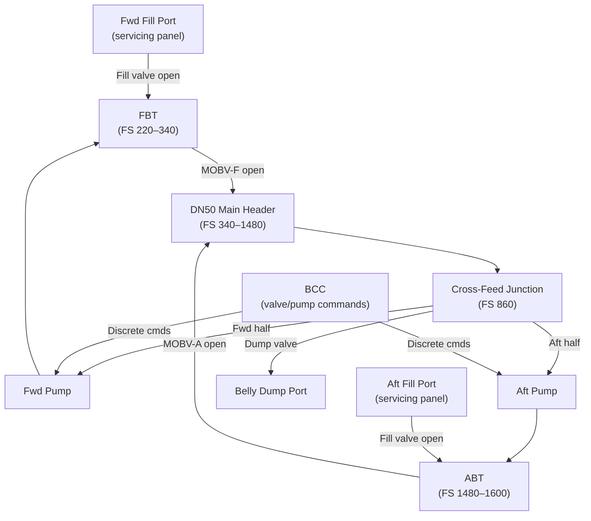
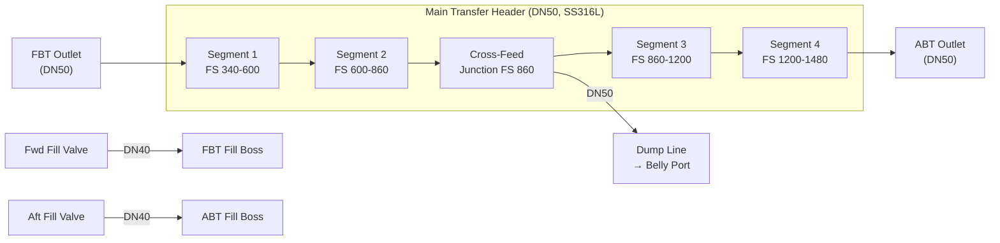
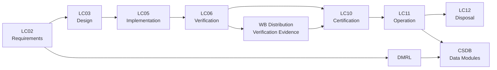

# ATLAS 040-049 · Section 04 · Subsection 041 · 020 — Water Ballast Distribution and Transfer

## 0. Hyperlink Policy

All internal cross-references use relative Markdown links resolved within the Q+ATLANTIDE CSDB repository. External regulatory citations are listed in §19 (Citations) and §20 (References) with identifiers marked . Parent context: [ATLAS 041 Water Ballast General](./041-000-Water-Ballast-General.md).

---

## 1. Purpose

This document defines the distribution and transfer architecture of the Water Ballast system on the AMPEL360E eWTW, covering manifold design, pipe routing, cross-feed connections, flow paths for fill, transfer, and dump operations, and line-sizing methodology. The document provides the authoritative hydraulic architecture reference for all piping downstream of the tank outlet bosses and upstream of the pump/valve assembly defined in 041-030.

The transfer architecture is designed to support a nominal transfer rate of 25 kg/min per direction (fore-to-aft or aft-to-fore) at a maximum differential head of 2.0 m under aircraft pitch angles up to ±10°. The system must remain functional at altitude up to 43 000 ft cabin pressure altitude (simulated differential ≤ 0.6 bar) and at temperatures from −40 °C (line surface minimum with trace heating active) to +70 °C.

Regulatory compliance for the distribution architecture is governed by CS-25 §25.971 equivalent (fuel line sizing analogy applied to water systems), CS-25 §25.1183 (lines, fittings, and components), and FAA AC 25.1701-1 for separation from critical systems. All joints use mechanical compression fittings or welded flanges; no push-fit or adhesive joints are permitted in pressurised water ballast lines.

---

## 2. Applicability

| Attribute | Value |
|-----------|-------|
| Aircraft Model | AMPEL360E eWTW (all production variants) |
| ATA Reference | ATA 41-20 — Water Ballast Distribution |
| Standards | CS-25 Amd 27 §25.1183, DO-160G §8, ARP4754B |
| Dev Assurance | DAL C (fluid line structural integrity) |
| Applicability Code | AMPEL360E-EWTW-ALL |
| Max Line Pressure | 1.5 bar gauge (pump outlet, steady state) |

---

## 3. System / Function Overview

The transfer manifold consists of a 50 mm nominal bore (DN50) main header fabricated from 316L stainless-steel tubing, running longitudinally along the keel beam from the FBT outlet (FS 340) to the ABT outlet (FS 1 480), a distance of approximately 11.4 m. A cross-feed junction at mid-fuselage (FS 860) allows isolation of either tank independently without interrupting the transfer path.

Flow direction is controlled by a pair of motor-operated ball valves (MOBV-F at FBT outlet and MOBV-A at ABT outlet) combined with dual centrifugal transfer pumps (one per direction, each rated 30 L/min at 1.0 bar). Gravity-assisted transfer (aft to forward on nose-high approach) supplements pump performance; the pump is sized to provide the full 25 kg/min requirement against the worst-case 10° nose-down pressure head.

Line sizing follows a hydraulic analysis to limit pressure drop to ≤ 0.3 bar at 30 L/min flow; Darcy-Weisbach with a Colebrook friction factor is used. A 10% margin on pressure loss is maintained. Minimum pipe wall thickness is calculated per ASME B31.1 equivalent using a safety factor of 4× on burst pressure.

---

## 4. Scope

### 4.1 Included
- Main transfer manifold (DN50 SS316L header, FS 340–FS 1 480)
- Cross-feed junction and mid-fuselage isolation valve
- Branch lines to FBT and ABT tank outlets
- Fill line from ground servicing ports to tank inlet bosses (DN40)
- Dump line from cross-feed junction to belly dump port (DN50)
- Line sizing analysis documentation
- Pipe routing and support spacing (per MIL-S-901D vibration equivalent)
- Separation requirements from fuel, oxygen, and electrical systems

### 4.2 Excluded
- Pump and valve hardware details (see 041-030)
- Tank outlet boss fittings (see 041-010)
- Ground fill-port hardware (see 041-070)
- Control logic (see 041-050)

---

## 5. Architecture Description

**Main Transfer Header.** DN50 seamless SS316L tube (1.5 mm wall), running along the aircraft keel beam in P-clamp supports at 600 mm maximum spacing. Header flanged joints use ASME B16.5 Class 150 flanges with EPDM full-face gaskets. All routing maintains ≥ 100 mm clearance from fuel system components and ≥ 50 mm from electrical harnesses.

**Cross-Feed Junction.** A tee junction at FS 860 with a normally-open solenoid isolation valve (24 VDC, fail-open) allows the fore and aft halves of the manifold to be isolated independently for single-tank maintenance. The junction also connects to the dump line for emergency rapid drain.

**Fill Lines.** DN40 SS316L tubes branch from the main header to each tank fill boss via a dedicated fill valve (normally closed, opens only during ground servicing). Fill lines run inside the cargo hold ceiling to the fill ports in the fuselage sidewall servicing panels.

**Drain / Dump Line.** A DN50 line from the cross-feed junction to a belly-mounted dump port, routed through the keel bay. The dump line incorporates a swing check valve to prevent in-flight air ingestion and a remotely operated dump valve (see 041-060).

---

## 6. Functional Breakdown

| Function ID | Function Name | Description | Allocated To | DAL |
|-------------|---------------|-------------|-------------|-----|
| F-020-01 | Fore-to-Aft Transfer | Route water from FBT to ABT via main header | Manifold + MOBV-F | C |
| F-020-02 | Aft-to-Fore Transfer | Route water from ABT to FBT via main header | Manifold + MOBV-A | C |
| F-020-03 | Cross-Feed Isolation | Isolate fore or aft half of manifold for maintenance | Cross-feed valve | C |
| F-020-04 | Ground Fill Routing | Direct ground supply water to selected tank | Fill valves + fill lines | D |
| F-020-05 | Dump Routing | Route emergency dump flow to belly port | Dump line + dump valve | C |

---

## 7. Mermaid — System Context Diagram

---

## 8. Mermaid — Internal Functional Architecture

---

## 9. Mermaid — Lifecycle Traceability

---

## 10. Interfaces

| Interface ID | From | To | Protocol / Standard | Direction | Notes |
|-------------|------|----|---------------------|-----------|-------|
| IF-020-01 | FBT outlet boss | Main header FS 340 | DN50 flanged SS316L | FBT → Header | Per 041-010 |
| IF-020-02 | ABT outlet boss | Main header FS 1 480 | DN50 flanged SS316L | ABT → Header | Per 041-010 |
| IF-020-03 | Cross-feed junction | Dump line | DN50 branched tee | Header → Dump | Dump valve interlock per 041-060 |
| IF-020-04 | Fill lines | FBT / ABT fill bosses | DN40 compression | Ground → Tanks | Fill valves N/C in flight |
| IF-020-05 | Pump inlet ports | Main header | DN50 flanged | Header → Pumps | Per 041-030 |
| IF-020-06 | Pump outlet ports | FBT / ABT return | DN50 flanged | Pumps → Tanks | Per 041-030 |

---

## 11. Operating Modes

| Mode | Description | Trigger | System Response |
|------|-------------|---------|-----------------|
| Transfer Active | Water flowing fore-to-aft or aft-to-fore | BCC transfer command | Selected MOBV open; pump running at rated speed |
| Fill Mode | Ground fill in progress | Ground fill valve open | Fill valve open; transfer valves closed; pumps off |
| Standby | No transfer; tanks isolated | BCC idle or on ground | All MOBVs closed; header at static pressure |
| Dump | Emergency rapid drain | Dump command | Dump valve open; gravity drain to belly port |

---

## 12. Monitoring and Diagnostics

- Flow meter (Coriolis type, ±0.5% accuracy) on the main header at FS 860 provides real-time transfer rate to BCC.
- Differential pressure sensors across each line segment detect blockage or leak; alarm threshold 0.05 bar deviation from nominal.
- Header pressure transducer at XFD junction monitors line integrity; high-pressure alarm at 1.6 bar gauge.
- Vibration sensor on header at first P-clamp downstream of pump; high vibration alarm triggers pump inspection flag.
- All sensor outputs logged by BCC at 1 Hz; downloadable via AMT for trend analysis.
- BITE cross-checks flow meter output against tank level change rate; discrepancy >5% triggers flow path fault flag.

---

## 13. Maintenance Concept

| Task | Interval | Access | Tooling |
|------|----------|--------|---------|
| Visual inspection of header and clamps | A-check | Cargo hold belly panels | Flashlight |
| P-clamp torque verification | C-check | Cargo hold belly panels | Torque wrench |
| Flow meter calibration check | 4 000 FH | Keel bay access | Calibrated flow reference |
| Header hydrostatic pressure test | After modification / repair | Ground supply connection | Pressure test kit 2.25 bar |

---

## 14. S1000D / CSDB Mapping

| Document Type | Data Module Code (DMC) | Info Code | Title |
|---------------|----------------------|-----------|-------|
| System Description | DMC-AMPEL360E-EWTW-041-020-00A-040A-A | 040 | WB Distribution and Transfer Description |
| Maintenance Procedures | DMC-AMPEL360E-EWTW-041-020-00A-300A-A | 300 | WB Distribution Fault Isolation |
| BITE/Test | DMC-AMPEL360E-EWTW-041-020-00A-400A-A | 400 | WB Distribution BITE Procedures |
| Wiring Data | DMC-AMPEL360E-EWTW-041-020-00A-520A-A | 520 | WB Distribution Wiring and Connector Data |
| IPD | DMC-AMPEL360E-EWTW-041-020-00A-941A-A | 941 | WB Distribution Illustrated Parts |
| Software Desc | DMC-AMPEL360E-EWTW-041-020-00A-720A-A | 720 | WB Distribution SW Description |

### Recommended Data Module Set

| Info Code | Publication | Applicability |
|-----------|-------------|---------------|
| 040 | AMM — System Description | All variants |
| 300 | FIM — Fault Isolation | All variants |
| 400 | TSM — BITE Procedures | All variants |
| 520 | AMM — Wiring Data | All variants |
| 720 | SRM — Software Description | All variants |
| 941 | IPD — Parts Data | All variants |

---

## 15. Footprints

### 15.1 Physical

| Item | Dimension (mm) | Mass (kg) | Location |
|------|---------------|-----------|----------|
| Main transfer header (DN50) | 11 400 × 60 OD | 18.5 | Keel beam, FS 340–1 480 |
| Fill line assemblies (×2) | 4 200 × 48 OD each | 3.2 each | Cargo hold ceiling |
| Dump line assembly (DN50) | 1 800 × 60 OD | 3.0 | Keel bay to belly skin |

### 15.2 Electrical / Data

| Interface | Standard | Bandwidth / Power |
|-----------|----------|-------------------|
| Coriolis flow meter | 4–20 mA / HART | < 8 W |
| Differential pressure sensor | 4–20 mA analogue | < 0.5 W each |
| Trace heating (header) | 28 VDC | 400 W (full run) |

### 15.3 Maintenance

| Task | Man-Hours | Skill Level | Access |
|------|-----------|-------------|--------|
| A-check visual inspection | 0.5 | Cat B1 | Belly panels |
| C-check P-clamp torque | 1.5 | Cat B1 | Belly panels |
| Flow meter calibration | 3.0 | AV tech (Cat B2) | Keel bay |

### 15.4 Data

| Data Item | Volume | Storage | Retention |
|-----------|--------|---------|-----------|
| Flow meter logs (1 Hz) | 10 MB/flight | BCC NVM | 500 FH rolling |
| DP sensor logs | 5 MB/flight | BCC NVM | 500 FH rolling |
| Maintenance test records | Per task card | AMT | Life of component |

---

## 16. Safety and Certification Considerations

- CS-25 §25.1183: all pressurised water lines in the aircraft use fire-resistant materials (SS316L) where routed through fire zones; non-fire-zone runs use PTFE-lined hose with SS316L overbraid.
- Separation from fuel system: minimum 100 mm physical separation maintained throughout; shared penetrations sealed with approved fire-stop material.
- Water hammer analysis: valve closure time ≥ 3 seconds to limit pressure transient to < 0.3 bar above steady-state; verified by analysis and test.
- Freeze protection: full header run within insulated keel bay; trace heating activates at < +4 °C line surface temperature.
- CS-25 §25.963 fuel tank protection equivalent: water lines do not route through fuel tank structure; 200 mm minimum clearance maintained.
- Leakage classification per CS-25: no flammable fluid; water leakage classified as minor if contained within belly drain; major if affecting structural elements.

---

## 17. Verification and Validation

| V&V ID | Requirement | Method | Success Criteria | Status |
|--------|-------------|--------|-----------------|--------|
| VV-020-01 | Transfer rate ≥ 25 kg/min at worst-case head | Ground test | Measured ≥ 25 kg/min at 10° pitch equivalent |  |
| VV-020-02 | Pressure drop ≤ 0.3 bar at 30 L/min | Analysis + bench test | Measured ΔP ≤ 0.3 bar |  |
| VV-020-03 | Header hydrostatic at 2.25 bar (4× MAWP) | Hydrostatic test | No leakage or permanent deformation |  |
| VV-020-04 | Water hammer pressure transient < 0.3 bar above steady-state | Analysis | Calculated transient < 0.3 bar for 3 s closure |  |
| VV-020-05 | Routing separation from fuel lines ≥ 100 mm | Installation inspection | Measured clearance ≥ 100 mm at all points |  |
| VV-020-06 | Freeze protection effectiveness at −40 °C | Environmental test | Line surface temperature ≥ 0 °C within 30 min |  |
| VV-020-07 | Flow meter accuracy ±0.5% | Bench calibration | Error ≤ 0.5% against reference standard |  |

---

## 18. Glossary

| Term/Acronym | Definition | Link |
|-------------|-----------|------|
| Coriolis | Mass flow measurement principle using vibrating tube; provides mass flow rate directly | [§12](#12-monitoring-and-diagnostics) |
| DN50 | Nominal diameter 50 mm per ISO 6708; actual OD ~60.3 mm for SS316L tube | [§3](#3-system--function-overview) |
| EPDM | Ethylene Propylene Diene Monomer; elastomeric gasket and seal material | [§5](#5-architecture-description) |
| Fill Valve | Normally-closed valve on fill line branch; opens only during ground servicing | [§5](#5-architecture-description) |
| Header | Main longitudinal transfer pipe connecting FBT and ABT | [§3](#3-system--function-overview) |
| MOBV | Motor-Operated Ball Valve providing primary tank outlet isolation | [§3](#3-system--function-overview) |
| P-Clamp | Standard cushioned pipe support clamp; limits vibration transmission | [§5](#5-architecture-description) |
| SS316L | Low-carbon austenitic stainless steel; chosen for corrosion resistance in water systems | [§5](#5-architecture-description) |
| Water Hammer | Pressure transient from rapid valve closure in fluid-filled lines | [§16](#16-safety-and-certification-considerations) |
| XFD | Cross-Feed Junction at mid-fuselage enabling independent tank isolation | [§3](#3-system--function-overview) |

---

## 19. Citations

| Ref | Citation | Use | Link |
|-----|---------|-----|------|
| CS-25 | EASA CS-25 Amendment 27 | §25.1183 lines and fittings |  |
| DO-160G | RTCA DO-160G §8 | Humidity qualification for line assemblies |  |
| ASME B31.1 | ASME B31.1 Power Piping | Line wall thickness sizing methodology |  |
| ASME B16.5 | ASME B16.5 Pipe Flanges | Flange class and seating standards |  |
| S1000D | S1000D Issue 5.0 | CSDB module coding |  |
| ATA-iSpec-2200 | ATA iSpec 2200 | AMM/FIM structure |  |
| EASA-TC | EASA Type Certificate Data Sheet AMPEL360E | Certification basis |  |

---

## 20. References

| Ref | Document | Identifier | Revision | Status | Link |
|-----|---------|-----------|---------|--------|------|
| R-001 | WB General (041-000) | QATL-ATLAS-041-000 | Rev 1.0 | Active | [041-000](./041-000-Water-Ballast-General.md) |
| R-002 | WB Storage (041-010) | QATL-ATLAS-041-010 | Rev 1.0 | Active | [041-010](./041-010-Water-Ballast-Storage.md) |
| R-003 | WB Pumps/Valves (041-030) | QATL-ATLAS-041-030 | Rev 1.0 | Active | [041-030](./041-030-Ballast-Pumps-Valves-and-Lines.md) |

---

## 21. Open Issues

| ID | Issue | Owner | Status | Link |
|----|-------|-------|--------|------|
| OI-020-01 | Coriolis meter installation envelope in keel bay may conflict with structural frames; routing survey required | Q-MECHANICS | Open |  |
| OI-020-02 | Water hammer analysis to be completed once pump closure time confirmed with vendor | Q-AIR | Open |  |
| OI-020-03 | Dump line belly port location to be finalised with airframe structural team | Q-MECHANICS | Open |  |

---

## 22. Change Log

| Version | Date | Author | Change | Link |
|---------|------|--------|--------|------|
| 1.0.0 | 2026-05-09 | Q+ Team/Amedeo Pelliccia + AI | Initial creation with full 22-section template |  |
