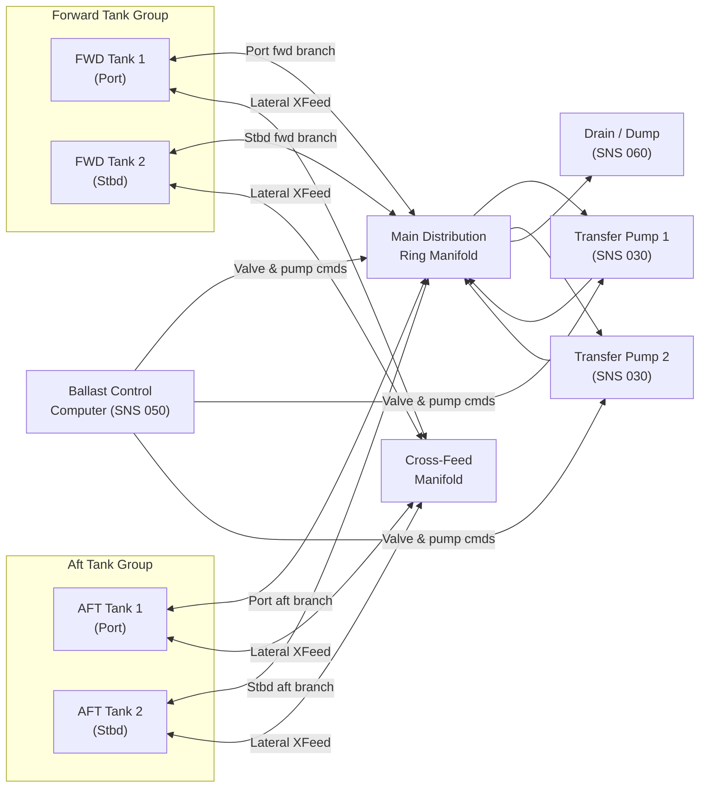

# ATLAS 040-049 · Section 04 · Subsection 041 · 020 — Water Ballast Distribution and Transfer

## 1. Purpose

This document defines the pipe routing architecture, manifold design, cross-feed logic, transfer pump integration, gravity transfer provisions, inter-tank distribution philosophy, flow rate requirements, and balancing logic governing the distribution and transfer functions of the Water Ballast System (WBS). The distribution and transfer subsystem is the dynamic heart of the WBS: it translates CG management commands — whether issued automatically by the Ballast Control Computer (BCC) or manually by flight crew — into controlled movement of water mass between storage tank groups.

The overarching design objective is to achieve CG adjustments within defined time windows (typically ≤ 120 seconds for a standard trim correction) without introducing asymmetric loads that could excite structural modes or compromise aircraft controllability. The system must also support emergency transfer modes and be robust to single-point failures in accordance with the failure mode and effects analysis (FMEA) conducted under SAE ARP4754A and CS-25.1309.

The distribution architecture is a fully-connected ring manifold: any tank can supply any other tank through the manifold network, subject to valve sequencing logic enforced by the BCC. This topology maximises operational flexibility while allowing isolation of any single component or pipe segment in the event of a leak or blockage.

## 2. Scope

This document covers:

- Longitudinal pipe routing from tank outlets through the main distribution manifold to tank inlets; lateral cross-feed provisions between left and right side tank pairs.
- Manifold design including header sizing, branch point geometry, non-return valve integration, and pressure drop budgeting.
- Transfer pump integration within the distribution network (detailed component specifications are in SNS 030).
- Gravity transfer provisions applicable when the aircraft is on ground or at low airspeeds and pump power is unavailable.
- Inter-tank distribution logic: sequencing rules, balancing algorithms, and protection against simultaneous conflicting valve commands.
- Steady-state and peak flow rate requirements derived from CG correction time budgets and the CG envelope width.
- Interface definition with the Ballast Control Computer (SNS 050) for command and status signals.

## 3. Glossary

| Term / Acronym | Definition |
|---|---|
| Ring Manifold | A closed-loop pipe network in which any inlet is hydraulically connected to any outlet through at least two independent flow paths, providing redundancy against single pipe or valve blockage. |
| Cross-Feed | A lateral pipe connection between the port and starboard tank groups, enabling water transfer across the aircraft centreline to correct lateral CG or mass asymmetry. |
| Header | The main large-bore pipe section of a manifold from which individual branch lines to tanks are taken; sized to minimise pressure drop across the full flow range. |
| NRV | Non-Return Valve (check valve) — a one-directional flow device preventing backflow through a branch when another branch is pressurised; protects tanks from reverse-flow contamination. |
| BCC | Ballast Control Computer — the dedicated avionics unit commanding valve positions and pump states to execute CG management strategies; interfaces defined in SNS 050. |
| Gravity Transfer | Passive transfer of ballast from a higher-elevation tank to a lower-elevation tank driven solely by hydrostatic head; available as a backup mode when pump power is unavailable. |
| Flow Rate (Q) | Volumetric flow rate through the distribution network, expressed in litres per minute (L/min); sizing parameter for pump selection and pipe diameter determination. |
| Pressure Drop (ΔP) | The loss of static pressure along a pipe run due to friction and fittings losses; calculated per the Darcy-Weisbach equation for all critical flow paths. |
| Sequencing Logic | The BCC-enforced ordering and timing of valve open/close commands to prevent simultaneous incompatible flow states (e.g., bi-directional flow through the same manifold segment). |
| Balancing | The iterative process of adjusting valve apertures and pump speeds to achieve equal mass flow rates to multiple destination tanks, preventing individual tank overfill or cavitation. |
| FMEA | Failure Mode and Effects Analysis — a bottom-up systematic method per MIL-STD-1629A / SAE ARP4761 for identifying component failure modes and their effects on system and aircraft level. |
| Two-Fault Tolerance | A design requirement that no single failure and no combination of two independent failures shall result in a catastrophic aircraft-level failure condition, per CS-25.1309 and ARP4754A. |

## 4. Diagram (Mermaid)

## 5. Footprint

| Metric | Value |
|---|---|
| Architecture | `ATLAS` — Aircraft Top Level Architecture Schema/System (controlled term) |
| Master range | `000–099` |
| Code range | `040-049` |
| Section | `04` — Aviónica, Información & APU |
| Subsection | `041` — Water Ballast |
| Subsubject | `020` — Water Ballast Distribution and Transfer |
| Primary Q-Division | Q-DATAGOV[^qdiv] |
| Support Q-Divisions | Q-AIR, Q-SPACE, Q-HPC |
| ORB support | ORB-PMO, ORB-LEG |
| Governance class | `baseline`[^gov] |
| Folder path | `Q+ATLANTIDE/000-099_ATLAS/040-049_Avionica-Informacion-y-APU/041_Water-Ballast/` |
| Document | `041-020-Water-Ballast-Distribution-and-Transfer.md` (this file) |
| Parent subsection | [`README.md`](./README.md) |
| Parent section | [`../../README.md`](../../README.md) |
| Parent architecture | [`../../../README.md`](../../../README.md) |
| Parent baseline | [`organization/Q+ATLANTIDE.md`](../../../../organization/Q+ATLANTIDE.md) |

## 6. References & Citations

[^baseline]: Q+ATLANTIDE controlled baseline (v1.0.0) — governing architecture baseline for ATLAS master range 000–099; distribution and transfer design requirements derive authority from this document.

[^qdiv]: Q-Division authority — Q-DATAGOV holds primary data governance authority. Q-AIR provides fluid systems and pneumatic/hydraulic engineering domain support.

[^gov]: Governance class — `baseline` denotes formal change control, configuration management, and periodic review under the Q+ATLANTIDE baseline management process.

[^n001]: Note N-001 — EASA CS-25.1309: Equipment, systems, and installations. Probability and severity requirements governing system-level failure condition classification and the independence/redundancy requirements of the WBS distribution architecture.

[^n002]: Note N-002 — SAE ARP4761 (1996): Guidelines and Methods for Conducting the Safety Assessment Process on Civil Airborne Systems and Equipment. SAE International. Governs FMEA, FTA, and CCA methodology applied to the WBS distribution subsystem.

[^n003]: Note N-003 — MIL-HDBK-1290A: Plumbing and Fluid Systems — Aerospace. U.S. Department of Defense. Reference for pipe sizing, fitting standards, pressure drop calculation methods, and assembly quality standards applicable to WBS piping runs.

[^n004]: Note N-004 — ISO 4126: Safety devices for protection against excessive pressure — General requirements for safety valves. Referenced for any pressure relief provisions integrated within the WBS manifold assembly.

[^n005]: Note N-005 — RTCA DO-160G §8: Vibration tests. Applicable to manifold assemblies and pipe support clamps to verify structural integrity across the aircraft vibration environment, including resonant frequencies of pipe spans.

[^n006]: Note N-006 — ASD S3000L (Issue 2, 2016): International Specification for Logistics Support Analysis. Referenced for maintainability requirements governing pipe routing accessibility, minimum bend radii for pipe replacement, and connector standardisation.
