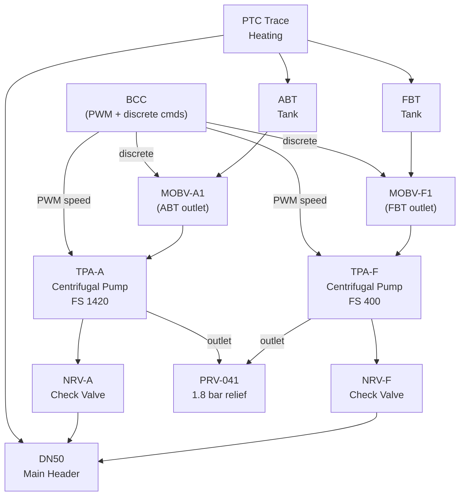
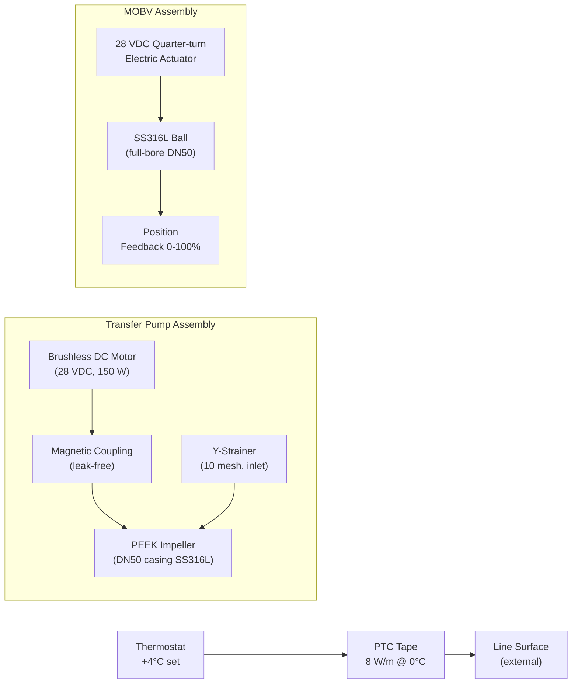
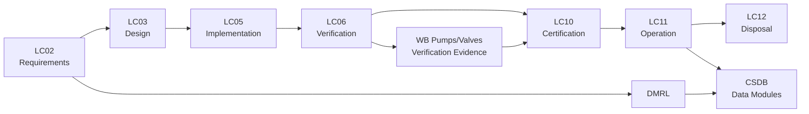

# ATLAS 040-049 · Section 04 · Subsection 041 · 030 — Ballast Pumps, Valves and Lines

## 0. Hyperlink Policy

All internal cross-references use relative Markdown links resolved within the Q+ATLANTIDE CSDB repository. External regulatory citations are listed in §19 (Citations) and §20 (References) with identifiers marked . Parent context: [ATLAS 041 Water Ballast General](./041-000-Water-Ballast-General.md).

---

## 1. Purpose

This document defines the mechanical components of the Water Ballast transfer system: transfer pumps, motor-operated ball valves (MOBVs), check valves, pressure-relief valves, freeze-protection trace heating, and flexible hose assemblies. It provides the authoritative specification, installation, and maintenance reference for all active fluid-control hardware within the ATA 41 Water Ballast system boundary.

Two centrifugal transfer pump assemblies (TPA-F and TPA-A, one per transfer direction) provide the head required for forced transfer against adverse pitch. The valve suite consists of four MOBVs for primary isolation/direction control, two non-return check valves to prevent back-flow, and a single pressure-relief valve (PRV) protecting the pump outlets. Flexible PTFE-lined stainless-steel overbraid hoses connect pump flanges to the rigid manifold to absorb vibration and thermal expansion.

Environmental qualification of all components conforms to DO-160G Section 8 (humidity) and Section 14 (icing/freezing rain); freeze protection trace-heating elements comply with DO-160G Section 4 (temperature and altitude) and are powered from the 28 VDC essential bus to ensure operation during engine-out conditions.

---

## 2. Applicability

| Attribute | Value |
|-----------|-------|
| Aircraft Model | AMPEL360E eWTW (all production variants) |
| ATA Reference | ATA 41-30 — Ballast Pumps, Valves and Lines |
| Standards | CS-25 Amd 27, DO-160G §8/14, MIL-PRF-8564 (hoses) |
| Dev Assurance | DAL C (pump/valve hardware); DAL D (trace heating) |
| Applicability Code | AMPEL360E-EWTW-ALL |
| Pump Rated Flow | 30 L/min at 1.0 bar differential |

---

## 3. System / Function Overview

The Transfer Pump Assemblies (TPA-F, TPA-A) are brushless DC motor-driven centrifugal pumps with composite impellers (PEEK) and SS316L casings. Each pump is rated at 30 L/min at a 1.0 bar differential pressure head, sufficient to overcome the worst-case 10° nose-down pitch gradient and line losses. Pump speed is variable (0–3 500 rpm) under BCC PWM control, allowing the transfer rate to be trimmed between 5 and 30 kg/min.

The MOBV suite uses quarter-turn electric actuators with integral position feedback (0–100% open, ±2% resolution). Actuator operating voltage is 28 VDC; full-open to full-closed travel time is 5 seconds. Spring return ensures fail-closed on power loss, providing passive isolation. Non-return check valves (swing type, SS316L) on each pump outlet prevent back-flow through the standby pump when the active pump is running.

Trace-heating elements are self-regulating positive-temperature-coefficient (PTC) polymer tapes rated at 8 W/m at 0 °C, reducing to < 1 W/m at 60 °C. Elements are adhesively bonded to external pipe surfaces and covered with closed-cell foam insulation. Element circuits are monitored by the BCC for continuity; open-circuit fault triggers EICAS advisory.

---

## 4. Scope

### 4.1 Included
- Transfer pump assemblies TPA-F and TPA-A (specification, installation, maintenance)
- Motor-operated ball valves MOBV-F1, MOBV-F2, MOBV-A1, MOBV-A2
- Non-return check valves NRV-F, NRV-A
- Pressure-relief valve PRV-041 (pump outlet protection)
- PTFE-lined SS overbraid flexible hose assemblies at pump flanges
- Trace-heating elements and thermostat controls
- Pressure drop analysis and pump curve verification
- DO-160G §8/14 environmental qualification scope

### 4.2 Excluded
- Manifold pipe routing upstream of pump inlet flanges (see 041-020)
- Level sensors (see 041-040)
- BCC control software (see 041-050)
- Dump and drain valves (see 041-060)

---

## 5. Architecture Description

**Pump Architecture.** TPA-F is located at FS 400 (between FBT outlet and main header junction), and TPA-A is located at FS 1 420 (between ABT outlet and main header junction). Each TPA includes: a magnetically coupled brushless DC motor (to avoid shaft seal leakage), a PEEK centrifugal impeller, inlet/outlet flanges DN50, and an integral 10-mesh Y-strainer on the inlet. Motor controllers are remote-mounted in the forward EE bay.

**Valve Architecture.** MOBV-F1 is on the FBT tank outlet; MOBV-F2 is on the pump TPA-F inlet cross-feed branch. MOBV-A1 is on the ABT tank outlet; MOBV-A2 is on the pump TPA-A inlet cross-feed branch. This arrangement allows either pump to be isolated without disturbing the main transfer header.

**Pressure Relief.** PRV-041 is set at 1.8 bar gauge, providing 20% margin over the pump maximum discharge pressure (1.5 bar). PRV outlets connect to the drain sump. PRV is a stainless-steel spring-loaded poppet valve with no external adjustment; set pressure is verified at factory acceptance.

**Freeze Protection.** PTC tape is applied to all external line segments, pump casings (non-motor side), and valve bodies exposed to sub-zero environments. Thermostat set-point is +4 °C; heating elements energise when line surface temperature falls below this threshold.

---

## 6. Functional Breakdown

| Function ID | Function Name | Description | Allocated To | DAL |
|-------------|---------------|-------------|-------------|-----|
| F-030-01 | Pumped Transfer | Provide forced flow against adverse pressure head | TPA-F / TPA-A | C |
| F-030-02 | Primary Isolation | Isolate tank or pump section on command or fault | MOBV suite | C |
| F-030-03 | Back-Flow Prevention | Prevent reverse flow through standby pump | NRV-F / NRV-A | C |
| F-030-04 | Over-Pressure Protection | Limit line pressure to ≤ 1.8 bar on pump outlet | PRV-041 | C |
| F-030-05 | Freeze Protection | Maintain line and component temperature above 0 °C | PTC trace heating | D |

---

## 7. Mermaid — System Context Diagram

---

## 8. Mermaid — Internal Functional Architecture

---

## 9. Mermaid — Lifecycle Traceability

---

## 10. Interfaces

| Interface ID | From | To | Protocol / Standard | Direction | Notes |
|-------------|------|----|---------------------|-----------|-------|
| IF-030-01 | BCC | TPA-F motor controller | PWM 400 Hz, 28 VDC | BCC → TPA | Speed command 0–100% |
| IF-030-02 | BCC | TPA-A motor controller | PWM 400 Hz, 28 VDC | BCC → TPA | Speed command 0–100% |
| IF-030-03 | BCC | MOBV actuators (×4) | 28 VDC discrete (open/close) | BCC → MOBV | Plus ARINC 429 position feedback |
| IF-030-04 | TPA motor controllers | BCC | ARINC 429 | TPA → BCC | Speed / fault status |
| IF-030-05 | PTC thermostat | 28 VDC essential bus | Hardwired | Bus → PTC | Autonomous thermal control |
| IF-030-06 | PRV outlet | Drain sump | Gravity drain DN25 | PRV → Sump | No control signal |

---

## 11. Operating Modes

| Mode | Description | Trigger | System Response |
|------|-------------|---------|-----------------|
| Pumping Active | TPA running at commanded speed | BCC transfer command | Selected MOBV open; TPA at target RPM; NRV open |
| Standby | TPA stopped; MOBVs closed | No transfer demanded | TPA at rest; MOBVs spring-return closed |
| Degraded — Single Pump | One TPA failed; transfer on remaining pump | BITE fault on one TPA | Transfer rate reduced to 15 kg/min; EICAS advisory |
| Freeze Protection Active | PTC heating energised | Line surface < 4 °C | Heater elements on; thermostat maintains ≥ 0 °C surface |

---

## 12. Monitoring and Diagnostics

- Pump motor current monitored by BCC; over-current (>12 A) triggers pump trip and EICAS caution.
- MOBV position feedback compared to command; disagree >5% after 6 s triggers valve fault in CMC.
- NRV back-flow detected by downstream pressure rise when pump off; threshold 0.15 bar above static.
- PRV activation event detected by pressure drop on outlet side; logged as maintenance message.
- PTC element continuity monitored by low-level current injection; open circuit triggers EICAS advisory.
- Y-strainer differential pressure monitored; ΔP > 0.1 bar triggers strainer-cleaning maintenance message.

---

## 13. Maintenance Concept

| Task | Interval | Access | Tooling |
|------|----------|--------|---------|
| Y-strainer cleaning | 500 FH or on ΔP alert | Keel bay access | Spanner set, clean water flush |
| MOBV functional test | C-check | Keel bay | BCC test mode via AMT |
| TPA impeller inspection | 4 000 FH | Keel bay | Impeller removal tool, borescope |
| PRV set-pressure check | 4 000 FH | Keel bay | Test bench with calibrated gauge |
| PTC element replacement | On-condition | Keel bay insulation removal | PTC tape kit, adhesive |

---

## 14. S1000D / CSDB Mapping

| Document Type | Data Module Code (DMC) | Info Code | Title |
|---------------|----------------------|-----------|-------|
| System Description | DMC-AMPEL360E-EWTW-041-030-00A-040A-A | 040 | Ballast Pumps, Valves and Lines Description |
| Maintenance Procedures | DMC-AMPEL360E-EWTW-041-030-00A-300A-A | 300 | Ballast Pumps Fault Isolation |
| BITE/Test | DMC-AMPEL360E-EWTW-041-030-00A-400A-A | 400 | Ballast Pumps BITE Procedures |
| Wiring Data | DMC-AMPEL360E-EWTW-041-030-00A-520A-A | 520 | Ballast Pumps Wiring and Connector Data |
| IPD | DMC-AMPEL360E-EWTW-041-030-00A-941A-A | 941 | Ballast Pumps Illustrated Parts |
| Software Desc | DMC-AMPEL360E-EWTW-041-030-00A-720A-A | 720 | Ballast Pumps SW Description |

### Recommended Data Module Set

| Info Code | Publication | Applicability |
|-----------|-------------|---------------|
| 040 | AMM — System Description | All variants |
| 300 | FIM — Fault Isolation | All variants |
| 400 | TSM — BITE Procedures | All variants |
| 520 | AMM — Wiring Data | All variants |
| 720 | SRM — Software Description | All variants |
| 941 | IPD — Parts Data | All variants |

---

## 15. Footprints

### 15.1 Physical

| Item | Dimension (mm) | Mass (kg) | Location |
|------|---------------|-----------|----------|
| TPA-F assembly | 350 × 200 × 200 | 4.2 | FS 400, keel bay port side |
| TPA-A assembly | 350 × 200 × 200 | 4.2 | FS 1 420, keel bay stbd side |
| MOBV assemblies (×4) | 180 × 180 × 120 each | 1.8 each | Adjacent to tank outlets |

### 15.2 Electrical / Data

| Interface | Standard | Bandwidth / Power |
|-----------|----------|-------------------|
| TPA motor (×2) | 28 VDC brushless | 150 W each at max speed |
| MOBV actuators (×4) | 28 VDC | 25 W peak during travel |
| PTC trace heating | 28 VDC essential bus | 800 W total (all zones) |

### 15.3 Maintenance

| Task | Man-Hours | Skill Level | Access |
|------|-----------|-------------|--------|
| Y-strainer cleaning | 1.0 | Cat B1 | Keel bay belly panels |
| MOBV functional test | 1.5 | Cat B1/B2 | AMT port |
| TPA impeller inspection | 4.0 | Cat B1 | Keel bay |

### 15.4 Data

| Data Item | Volume | Storage | Retention |
|-----------|--------|---------|-----------|
| Pump motor current logs | 5 MB/flight | BCC NVM | 500 FH rolling |
| MOBV position logs | 2 MB/flight | BCC NVM | 500 FH rolling |
| PTC continuity logs | 1 MB/flight | BCC NVM | 500 FH rolling |

---

## 16. Safety and Certification Considerations

- DO-160G §8 humidity: all pump and valve assemblies sealed to IP67 or better; no water ingress during condensation or spray events.
- DO-160G §14 icing: trace heating system qualified to maintain operation in freezing rain per DO-160G Cat B.
- CS-25 §25.1309: pump and valve failure analysis performed; single-pump failure results in degraded (not lost) ballast transfer capability; classified as Minor failure condition.
- Magnetic coupling design eliminates rotating shaft seal, removing a potential fluid leakage path and simplifying DO-160G §10 (waterproofness) compliance.
- PRV spring material (Inconel 718) selected for fatigue resistance; PRV rated for 10 000 cycles minimum without set-pressure drift.
- Pump motor controllers are located in the forward EE bay (non-flammable zone); motor power cables are fire-resistant per CS-25 §25.869.

---

## 17. Verification and Validation

| V&V ID | Requirement | Method | Success Criteria | Status |
|--------|-------------|--------|-----------------|--------|
| VV-030-01 | Pump rated flow 30 L/min at 1.0 bar | Bench flow test | Measured ≥ 30 L/min at 1.0 bar ΔP |  |
| VV-030-02 | MOBV travel time ≤ 5 s full stroke | Functional test | Measured travel time ≤ 5 s at 28 VDC nominal |  |
| VV-030-03 | PRV set pressure 1.8 ± 0.05 bar | Bench test | Opens at 1.75–1.85 bar |  |
| VV-030-04 | DO-160G §8 humidity (Cat A) | Lab test | No degradation after 24 h at 95% RH, 50 °C |  |
| VV-030-05 | DO-160G §14 icing (Cat B) | Lab test | Functional after icing test per Cat B profile |  |
| VV-030-06 | MOBV fail-closed on power loss | Fault injection | MOBV closes within 2 s of 28 VDC removal |  |
| VV-030-07 | PTC element: no overheating > 85 °C at 60 °C ambient | Lab test | Surface temperature ≤ 85 °C at 60 °C ambient |  |

---

## 18. Glossary

| Term/Acronym | Definition | Link |
|-------------|-----------|------|
| Brushless DC | Electric motor with electronic commutation; no brushes; higher reliability and lower maintenance | [§3](#3-system--function-overview) |
| Magnetic Coupling | Hermetic torque transmission through a containment shell; eliminates rotating seal | [§5](#5-architecture-description) |
| MOBV | Motor-Operated Ball Valve; 28 VDC quarter-turn electric actuator on full-bore ball valve | [§3](#3-system--function-overview) |
| NRV | Non-Return (Check) Valve; prevents reverse flow through standby pump | [§3](#3-system--function-overview) |
| PEEK | Polyetheretherketone; high-temperature thermoplastic used for pump impeller | [§3](#3-system--function-overview) |
| PRV | Pressure-Relief Valve; spring-loaded poppet protecting pump outlet from over-pressure | [§3](#3-system--function-overview) |
| PTC | Positive Temperature Coefficient; self-regulating resistance heating tape | [§3](#3-system--function-overview) |
| TPA | Transfer Pump Assembly; complete pump unit including motor, coupling, impeller, strainer | [§3](#3-system--function-overview) |
| Y-Strainer | Inline mesh filter protecting pump impeller from particulate contamination | [§5](#5-architecture-description) |
| PWM | Pulse Width Modulation; variable-speed control signal from BCC to motor controller | [§5](#5-architecture-description) |

---

## 19. Citations

| Ref | Citation | Use | Link |
|-----|---------|-----|------|
| CS-25 | EASA CS-25 Amendment 27 | §25.1309 failure analysis, §25.869 wiring |  |
| DO-160G | RTCA DO-160G §8, §14 | Humidity and icing qualification |  |
| MIL-PRF-8564 | MIL-PRF-8564 — Hose Assemblies, Rubber, Hydraulic | PTFE-lined hose specification |  |
| S1000D | S1000D Issue 5.0 | CSDB mapping |  |
| ATA-iSpec-2200 | ATA iSpec 2200 | AMM/FIM structure |  |
| EASA-TC | EASA Type Certificate Data Sheet AMPEL360E | Certification basis |  |

---

## 20. References

| Ref | Document | Identifier | Revision | Status | Link |
|-----|---------|-----------|---------|--------|------|
| R-001 | WB General (041-000) | QATL-ATLAS-041-000 | Rev 1.0 | Active | [041-000](./041-000-Water-Ballast-General.md) |
| R-002 | WB Distribution (041-020) | QATL-ATLAS-041-020 | Rev 1.0 | Active | [041-020](./041-020-Water-Ballast-Distribution-and-Transfer.md) |
| R-003 | AMPEL360E Equipment List | AMPEL360E-EL-041 | Rev A | Active |  |

---

## 21. Open Issues

| ID | Issue | Owner | Status | Link |
|----|-------|-------|--------|------|
| OI-030-01 | TPA vendor selection pending; three suppliers under evaluation | Q-MECHANICS | Open |  |
| OI-030-02 | Motor controller location in EE bay to be confirmed with thermal management team | Q-AIR | Open |  |
| OI-030-03 | PTC tape adhesive compatibility with keel bay insulation material to be verified | Q-GREENTECH | Open |  |

---

## 22. Change Log

| Version | Date | Author | Change | Link |
|---------|------|--------|--------|------|
| 1.0.0 | 2026-05-09 | Q-DATAGOV / Copilot | Initial creation with full 22-section template |  |
