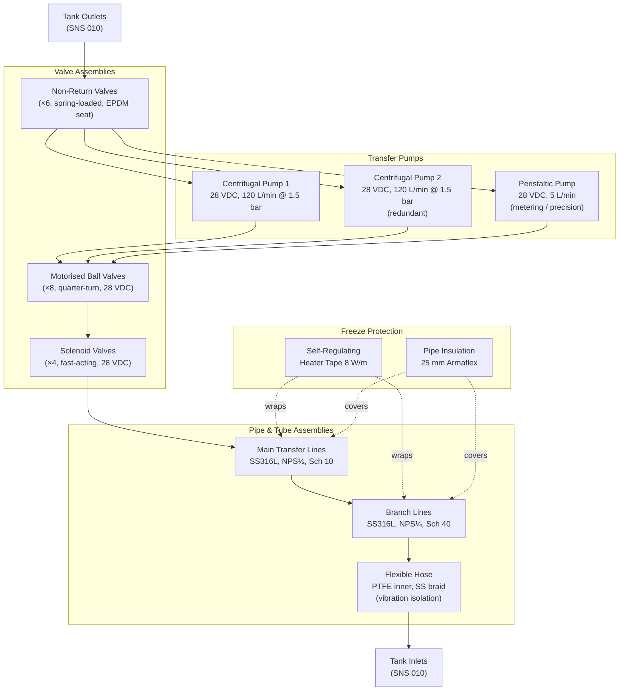

# ATLAS 040-049 · Section 04 · Subsection 041 · 030 — Ballast Pumps, Valves and Lines

## 1. Purpose

This document specifies the mechanical and electromechanical components of the Water Ballast System (WBS) plumbing circuit, comprising the transfer pumps, control valves, isolation valves, check valves, pipe assemblies, and associated fittings and supports. These components collectively constitute the active hydraulic network through which water ballast is moved within the airframe under the direction of the Ballast Control Computer (BCC).

The selection and sizing of pumps, valves, and lines is governed by the flow rate and pressure budgets established in SNS 020 (Distribution and Transfer), the material compatibility requirements arising from the use of water as the working fluid, the environmental envelope defined in RTCA DO-160G, and the safety and reliability targets established by the system-level PSSA. Each component must be individually qualified to its applicable airworthiness requirement and demonstrated compatible with all anticipated fluid compositions, including treated potable water, demineralised water, and water with approved anti-freeze additives at concentrations up to 10% by volume.

Freeze protection is a critical design driver for this subsystem. At cruise altitude, uninsulated pipe sections in non-conditioned bays can reach −40 °C; any standing water column that freezes can block flow, damage pipe walls through volumetric expansion, and jam valve actuators. The freeze protection strategy — a combination of insulation, self-regulating heater tapes, and minimum-flow circulation — is established at this subsystem level and implemented at component level.

## 2. Scope

This document covers:

- Pump type selection and performance specification: centrifugal and peristaltic pump technology trade-off, rated flow, head, efficiency, and electrical power requirements.
- Valve type specifications: motorised ball valves, solenoid-operated valves, check (non-return) valves — opening/closing times, leakage rates, and actuation power.
- Pipe and tube sizing methodology: internal diameter selection based on velocity limits, Darcy-Weisbach pressure drop analysis, and wall thickness selection based on internal pressure and CS-25 Subpart D.
- Fitting and connector standards: flare fittings, compression fittings, quick-disconnect couplings, and their qualification requirements.
- Material compatibility: compatibility matrix for wetted materials (stainless steel 316L, HDPE, EPDM, PTFE) with the WBS fluid compositions.
- Freeze protection provisions: thermal insulation specifications, self-regulating heater tape parameters, and anti-freeze additive compatibility.
- Support and clamp design: vibration isolation, pipe span limits, and load path to airframe secondary structure.

## 3. Glossary

| Term / Acronym | Definition |
|---|---|
| Centrifugal Pump | A dynamic pump using a rotating impeller to impart kinetic energy to the fluid; high flow rates at moderate head; preferred for main transfer duty cycles with continuous flow. |
| Peristaltic Pump | A positive-displacement pump using a rotating roller to compress a flexible tube, propelling fluid without direct contact between the pump mechanism and the fluid; preferred for metering and low-flow precision transfer. |
| Motorised Ball Valve | A quarter-turn valve with a spherical plug, actuated by an electric motor; low pressure drop when fully open; rated for ≥ 10,000 cycles; provides positive shut-off (≤ 0.1 mL/min leakage per CS-25.997 equivalent). |
| Solenoid Valve | An electromechanical valve actuated directly by an electromagnetic solenoid coil; fast response (< 100 ms); used for small-bore isolation and drain functions where rapid actuation is required. |
| EPDM | Ethylene Propylene Diene Monomer rubber — the preferred elastomeric material for valve seats, O-ring seals, and flexible hose liners in contact with water ballast; excellent chemical resistance and wide temperature range (−55 °C to +150 °C). |
| PTFE | Polytetrafluoroethylene — used as valve seat inserts and pipe liner material where chemical inertness and very low friction are required. |
| Darcy-Weisbach | The fundamental equation for pressure drop in pipe flow: ΔP = f·(L/D)·(ρV²/2), where f is the Moody friction factor, L pipe length, D internal diameter, ρ fluid density, and V mean velocity. |
| Heater Tape | A self-regulating electrical resistance heating element adhered to pipe outer surfaces; power output varies inversely with temperature, providing efficient freeze protection without thermostat control. |
| NPS | Nominal Pipe Size — the North American standard dimensional reference for pipe and fitting outer diameter (ASME B36.10M); used for specification and procurement of metallic pipe assemblies. |
| QD Coupling | Quick-Disconnect Coupling — a push-to-connect/pull-to-release fluid connector enabling tool-free disconnection of pipe sections during maintenance; shall seal in both connected and disconnected states (dry-break type). |
| Velocity Limit | The maximum permissible mean fluid velocity in a pipe, typically 3 m/s for continuous flow to limit erosion, noise, and pressure pulsation in WBS lines. |
| Anti-Freeze Additive | An approved water-miscible additive (typically propylene glycol, non-toxic grade) mixed at ≤ 10% v/v concentration to depress the freezing point of ballast water to ≤ −10 °C in cold-soak conditions. |

## 4. Diagram (Mermaid)

## 5. Footprint

| Metric | Value |
|---|---|
| Architecture | `ATLAS` — Aircraft Top Level Architecture Schema/System (controlled term) |
| Master range | `000–099` |
| Code range | `040-049` |
| Section | `04` — Aviónica, Información & APU |
| Subsection | `041` — Water Ballast |
| Subsubject | `030` — Ballast Pumps, Valves and Lines |
| Primary Q-Division | Q-DATAGOV[^qdiv] |
| Support Q-Divisions | Q-AIR, Q-SPACE, Q-HPC |
| ORB support | ORB-PMO, ORB-LEG |
| Governance class | `baseline`[^gov] |
| Folder path | `Q+ATLANTIDE/000-099_ATLAS/040-049_Avionica-Informacion-y-APU/041_Water-Ballast/` |
| Document | `041-030-Ballast-Pumps-Valves-and-Lines.md` (this file) |
| Parent subsection | [`README.md`](./README.md) |
| Parent section | [`../../README.md`](../../README.md) |
| Parent architecture | [`../../../README.md`](../../../README.md) |
| Parent baseline | [`organization/Q+ATLANTIDE.md`](../../../../organization/Q+ATLANTIDE.md) |

## 6. References & Citations

[^baseline]: Q+ATLANTIDE controlled baseline (v1.0.0) — governing architecture baseline for ATLAS master range 000–099; all pump, valve, and line component requirements derive authority from this document.

[^qdiv]: Q-Division authority — Q-DATAGOV holds primary data governance authority. Q-AIR provides fluid systems and mechanical engineering domain support for component qualification activities.

[^gov]: Governance class — `baseline` denotes formal change control, configuration management, and periodic review under the Q+ATLANTIDE baseline management process.

[^n001]: Note N-001 — EASA CS-25.997: Fuel strainer or filter. Applied by analogy to WBS line strainer requirements to prevent particulate contamination of pump impellers and valve seats, with similar bypass and indication provisions.

[^n002]: Note N-002 — RTCA DO-160G §8 (Vibration) and §14 (Fluid Susceptibility): Environmental qualification test requirements for all WBS pump, valve, and line assemblies installed in the airframe vibration environment.

[^n003]: Note N-003 — ASME B31.3 (Process Piping) and ASME B36.10M (Welded and Seamless Wrought Steel Pipe): Dimensional and pressure rating standards for SS316L pipe and fittings used in main WBS transfer lines.

[^n004]: Note N-004 — SAE AS4395: Fluid Systems — Fittings, Tube, End Fitting and Port Design — General Requirements. Governs flare and compression fitting qualification for use in aircraft fluid systems at pressures up to 3.5 MPa.

[^n005]: Note N-005 — EN 14514 / ASTM D2513: Standards for flexible thermoplastic pipe and hose assemblies; applied to PTFE-lined flexible hose sections at pump inlet/outlet and tank connections to accommodate differential thermal expansion and vibration.

[^n006]: Note N-006 — MIL-PRF-23827 / AMS 3050: Anti-icing fluid specification. Referenced for anti-freeze additive compatibility with wetted elastomers (EPDM, PTFE, Buna-N) and metallic components in the WBS plumbing circuit.
