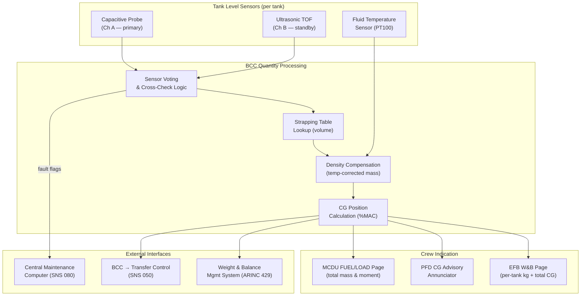

# ATLAS 040-049 · Section 04 · Subsection 041 · 040 — Ballast Quantity Indication and Mass Properties

## 1. Purpose

This document defines the measurement, computation, and display architecture for Water Ballast System (WBS) quantity indication and mass properties calculation. Accurate knowledge of the mass and location of water ballast in each tank is fundamental to safe weight-and-balance management, CG envelope compliance, and the correct operation of automatic trim and load-alleviation interfaces.

The quantity indication subsystem provides real-time tank fill data to the Ballast Control Computer (BCC), the Weight-and-Balance Management System (WBMS), and the flight deck display system. Computed mass and moment data are integrated with fuel system mass properties data and payload loading data to yield the aggregate aircraft CG position, expressed as %MAC, which is compared against the certified forward and aft CG limits at all times during ground operations and flight.

Measurement accuracy is a safety-critical attribute of this subsystem. An error in tank quantity indication propagates directly into the CG calculation; a sufficiently large error could result in an undetected out-of-envelope CG condition, a major failure condition under CS-25.1309. The accuracy budget established in this document is therefore derived from the permissible CG error contribution allocated to the WBS in the aircraft-level CG accuracy analysis.

## 2. Scope

This document covers:

- Level sensor technology selection: capacitive probe sensors versus ultrasonic time-of-flight sensors — measurement principle, accuracy, temperature correction, and installation constraints.
- Mass measurement by density-corrected volume: fluid density compensation for temperature-dependent density variation of water and water-antifreeze mixtures.
- Tank geometry model: calibration tables (strapping tables) mapping sensor output to volume and volume to mass for each tank shape.
- Weight-and-balance integration: ARINC 429 bus data exchange with the WBMS and Electronic Flight Bag (EFB) weight-and-balance application.
- CG envelope display: requirements for crew indication on the EFB CG page and the primary flight display (PFD) CG advisory annunciator.
- Accuracy requirements: end-to-end accuracy budget from sensor output to displayed CG position; required accuracy is ≤ 0.5% MAC at the system level.
- Redundancy architecture: dual-redundant sensor channels per tank; voting and cross-check logic; failure annunciation.

## 3. Glossary

| Term / Acronym | Definition |
|---|---|
| Capacitive Probe | A level sensor consisting of two concentric metallic cylinders; the electrical capacitance between them varies with the dielectric constant and height of the liquid column, enabling accurate level measurement independent of turbulence. |
| Ultrasonic TOF Sensor | A non-contact level sensor that measures the time of flight of an ultrasonic pulse reflected from the liquid surface; immunity to fluid electrical properties; sensitive to foam and extreme temperatures. |
| Strapping Table | A calibration table (also called a dip chart or ullage table) mapping measured sensor output (height or capacitance) to volumetric content and mass for a specific tank geometry. |
| WBMS | Weight-and-Balance Management System — the onboard avionics function computing and displaying total aircraft weight, CG position, and compliance with all certified weight-and-balance limits. |
| ARINC 429 | Aeronautical Radio INC data bus standard defining the electrical interface, data rate, and word format for digital avionics data exchange; WBS mass property data transmitted at 12.5 kbps (low speed). |
| %MAC | Percentage Mean Aerodynamic Chord — the non-dimensional longitudinal CG coordinate; CG limits are specified in %MAC in the aircraft Approved Flight Manual (AFM) and Type Certificate Data Sheet (TCDS). |
| CG Envelope | The certified range of CG positions (forward limit to aft limit) within which the aircraft must be operated; expressed as a function of gross weight in the AFM. |
| Density Compensation | A correction applied to volumetric quantity measurements to account for the temperature-dependent variation in fluid density (water density varies from 999.8 kg/m³ at 4 °C to 971.8 kg/m³ at 80 °C). |
| EFB | Electronic Flight Bag — a portable or installed tablet computing platform running approved weight-and-balance and performance calculation applications; receives WBS data via ARINC 429 or aircraft LAN. |
| PFD | Primary Flight Display — the main crew attitude and flight information display; hosts a CG advisory annunciator showing WBS-derived CG status (NORMAL / CAUTION / WARNING). |
| BITE | Built-In Test Equipment — the internal self-test capability of avionics and sensor units; for WBS sensors, BITE detects open-circuit probes, short circuits, and out-of-range outputs. |
| Voting Logic | A comparison algorithm examining outputs from two or more redundant sensor channels; if channels disagree by more than a defined threshold, a sensor fault is flagged and the failed channel is isolated. |

## 4. Diagram (Mermaid)

## 5. Footprint

| Metric | Value |
|---|---|
| Architecture | `ATLAS` — Aircraft Top Level Architecture Schema/System (controlled term) |
| Master range | `000–099` |
| Code range | `040-049` |
| Section | `04` — Aviónica, Información & APU |
| Subsection | `041` — Water Ballast |
| Subsubject | `040` — Ballast Quantity Indication and Mass Properties |
| Primary Q-Division | Q-DATAGOV[^qdiv] |
| Support Q-Divisions | Q-AIR, Q-SPACE, Q-HPC |
| ORB support | ORB-PMO, ORB-LEG |
| Governance class | `baseline`[^gov] |
| Folder path | `Q+ATLANTIDE/000-099_ATLAS/040-049_Avionica-Informacion-y-APU/041_Water-Ballast/` |
| Document | `041-040-Ballast-Quantity-Indication-and-Mass-Properties.md` (this file) |
| Parent subsection | [`README.md`](./README.md) |
| Parent section | [`../../README.md`](../../README.md) |
| Parent architecture | [`../../../README.md`](../../../README.md) |
| Parent baseline | [`organization/Q+ATLANTIDE.md`](../../../../organization/Q+ATLANTIDE.md) |

## 6. References & Citations

[^baseline]: Q+ATLANTIDE controlled baseline (v1.0.0) — governing architecture baseline for ATLAS master range 000–099; all quantity indication and mass property requirements derive authority from this document.

[^qdiv]: Q-Division authority — Q-DATAGOV holds primary data governance authority. Q-HPC provides computational and avionics software engineering domain support for quantity processing algorithms.

[^gov]: Governance class — `baseline` denotes formal change control, configuration management, and periodic review under the Q+ATLANTIDE baseline management process.

[^n001]: Note N-001 — EASA CS-25.1309 and AMC 25.1309: Equipment, systems, and installations — failure probability and severity requirements. The WBS quantity indication system is classified at minimum as a Major failure condition requiring probability ≤ 10⁻⁵ per flight hour for complete loss of indication.

[^n002]: Note N-002 — ARINC Specification 429P1-22 (2018): Mark 33 Digital Information Transfer System (DITS). Aeronautical Radio Inc., Annapolis MD. Governs the electrical interface and data word formats for WBS mass property data transmission to WBMS and EFB.

[^n003]: Note N-003 — EASA AMC 25.1581 / FAA AC 25-7D: Approved Flight Manual content requirements for weight-and-balance limitations; basis for the accuracy and format of CG envelope data derived from WBS quantity indication and presented to the crew.

[^n004]: Note N-004 — RTCA DO-178C (2011): Software Considerations in Airborne Systems and Equipment Certification. Governs the development and verification of BCC quantity processing software, including strapping table algorithms and CG calculation functions.

[^n005]: Note N-005 — EUROCAE ED-12C / RTCA DO-178C §6.3: Accuracy and resolution requirements for avionics data processing functions; applied to establish the 0.5% MAC end-to-end CG accuracy budget and sensor channel accuracy allocation.

[^n006]: Note N-006 — SAE ARP4754A §5.5: System Safety Assessment — System Safety Assessment (SSA) requirement for WBS quantity indication, requiring demonstration that loss of all quantity indication does not result in a catastrophic failure condition through cross-reference to independent WBMS channels.
