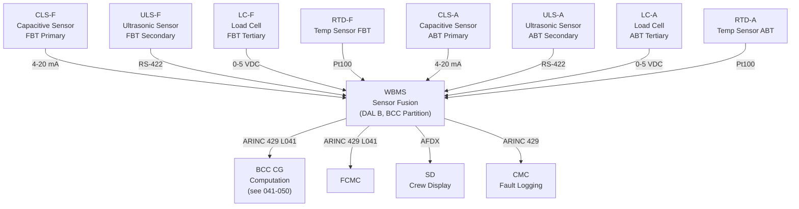
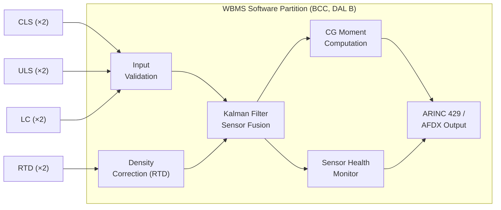
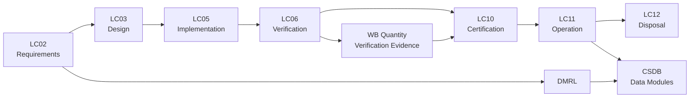

# ATLAS 040-049 · Section 04 · Subsection 041 · 040 — Ballast Quantity Indication and Mass Properties

## 0. Hyperlink Policy

All internal cross-references use relative Markdown links resolved within the Q+ATLANTIDE CSDB repository. External regulatory citations are listed in §19 and §20 with identifiers marked . Parent context: [ATLAS 041 Water Ballast General](./041-000-Water-Ballast-General.md).

---

## 1. Purpose

This document defines the sensing, computation, and indication architecture for Water Ballast quantity measurement and mass-properties determination on the programme-defined aircraft type. It specifies the capacitive level sensor primary system, the ultrasonic level sensor secondary system, the load cell auxiliary mass measurement inputs, and the Water Ballast Management System (WBMS) software that fuses these inputs to compute water mass and CG moment arm contributions in real time.

Accurate quantity indication is a safety-critical function: the BCC CG computation depends on a maximum sensor error of ±0.5% full scale (±2 kg per tank) to maintain CG within the certified envelope. The dual-sensor architecture (capacitive primary + ultrasonic secondary) provides the measurement integrity needed to support DAL B software in the BCC. Sensor outputs are transmitted to the BCC via ARINC 429 high-speed bus; computed mass and CG data are re-broadcast on AFDX to FCMC and EICAS.

Crew indication provides a ballast quantity page on the SD (System Display) in the cockpit, showing per-tank mass (kg), total ballast mass, and CG position (%MAC) updated at 1 Hz. An AFM-mandated operating limitation prohibits flight if both primary and secondary sensors for either tank are failed simultaneously.

---

## 2. Applicability

| Attribute | Value |
|-----------|-------|
| Aircraft Model | programme-defined aircraft type (all production variants) |
| ATA Reference | ATA 41-40 — Ballast Quantity Indication |
| Standards | CS-25 Amd 27, DO-178C (DAL B SW), DO-160G §7/8 |
| Dev Assurance | DAL B (WBMS software); DAL C (sensor hardware) |
| Applicability Code | [PROGRAMME-AIRCRAFT]-[PROGRAMME-VARIANT]-ALL |
| Measurement Accuracy | ±0.5% full scale (±2 kg per 400 kg tank) |

---

## 3. System / Function Overview

Each ballast tank is equipped with a primary capacitive level sensor (CLS) and a secondary ultrasonic level sensor (ULS). The CLS uses a coaxial probe spanning the full tank height; capacitance varies linearly with water level, providing a 4–20 mA analogue output. The ULS uses a non-contact piezoelectric transducer mounted in the tank headspace, measuring the time-of-flight of ultrasonic pulses to the water surface; digital RS-422 output at 10 Hz.

A pair of load cells (LC-F and LC-A) is installed between the tank mounting brackets and the airframe structure. Each load cell provides a direct mass measurement independent of the level sensors; LC output is 0–5 VDC proportional to tank weight. Load cell data cross-checks the CLS/ULS mass computation and provides an independent input to the WBMS fault monitoring algorithm.

The WBMS software (DAL B, DO-178C compliant) runs on a dedicated partition in the BCC. It receives CLS, ULS, and LC inputs, applies density correction for water temperature (measured by a Pt100 RTD sensor on each tank), and computes a fused mass estimate using a Kalman-filter-based sensor fusion algorithm. The computed mass and estimated CG position are output on ARINC 429 Label 041 to the FCMC and on AFDX to the SD.

---

## 4. Scope

### 4.1 Included
- Primary capacitive level sensor system (CLS-F, CLS-A)
- Secondary ultrasonic level sensor system (ULS-F, ULS-A)
- Load cell auxiliary mass measurement (LC-F, LC-A)
- Water temperature sensors (Pt100 RTD, ×2)
- WBMS sensor fusion software (DAL B)
- ARINC 429 data output to BCC and FCMC
- AFDX data output to SD (crew indication)
- Crew ballast quantity indication page on SD
- Sensor calibration and accuracy requirements

### 4.2 Excluded
- BCC CG computation and control law (see 041-050)
- Cockpit overhead panel controls (see 041-050)
- Pump and valve hardware (see 041-030)
- Ground servicing data uplink (see 041-070)

---

## 5. Architecture Description

**Primary Sensor (CLS).** A coaxial capacitive probe (316L SS inner rod, HDPE outer tube, 580 mm active length) is installed vertically through the tank lid. Capacitance range 50–500 pF, linearity ±0.2% FS. Signal conditioning converts capacitance to 4–20 mA; signal sent to BCC via shielded two-wire cable. In-situ calibration uses the EMPTY (air) and FULL (400 L water) reference points stored in NVM.

**Secondary Sensor (ULS).** A 40 kHz ultrasonic transducer mounted in the tank headspace at the top of the tank lid measures the air-water interface distance. RS-422 digital output, 10 Hz, ±1 mm resolution. Temperature-compensated speed-of-sound correction uses tank RTD input. ULS performance is independent of water electrical permittivity, providing a true independent check on the CLS.

**Load Cells.** Shear-beam load cells (rated 600 kg each) between bracket pad and airframe frame. Wheatstone bridge, 0–5 VDC, ±0.1% FS accuracy. Provides direct measurement of tank + water mass; used by WBMS as tertiary cross-check and by maintenance team to verify tank weight for calibration.

**WBMS Sensor Fusion.** The Kalman filter combines CLS (primary), ULS (secondary), and LC (tertiary) inputs with predicted mass from the transfer flow meter (from 041-020) to produce a minimum-variance mass estimate. Filter residuals are monitored for sensor health; residual > 3σ triggers a sensor fault flag and excludes that sensor from the estimate.

---

## 6. Functional Breakdown

| Function ID | Function Name | Description | Allocated To | DAL |
|-------------|---------------|-------------|-------------|-----|
| F-040-01 | Primary Level Sensing | Measure water level via capacitance; primary mass input | CLS-F / CLS-A | C |
| F-040-02 | Secondary Level Sensing | Measure water level via ultrasound; independent cross-check | ULS-F / ULS-A | C |
| F-040-03 | Auxiliary Mass Measurement | Measure tank weight directly via load cells | LC-F / LC-A | C |
| F-040-04 | Sensor Fusion and Mass Computation | Fuse sensor inputs to minimum-variance mass estimate | WBMS software | B |
| F-040-05 | Crew Indication | Display per-tank mass and CG on SD; generate alerts | Display interface | C |

---

## 7. Mermaid — System Context Diagram

---

## 8. Mermaid — Internal Functional Architecture

---

## 9. Mermaid — Lifecycle Traceability

---

## 10. Interfaces

| Interface ID | From | To | Protocol / Standard | Direction | Notes |
|-------------|------|----|---------------------|-----------|-------|
| IF-040-01 | CLS-F / CLS-A | WBMS (BCC) | 4–20 mA analogue, shielded cable | Sensor → BCC | 12 V excitation from BCC |
| IF-040-02 | ULS-F / ULS-A | WBMS (BCC) | RS-422, 10 Hz | Sensor → BCC | Temperature-compensated |
| IF-040-03 | LC-F / LC-A | WBMS (BCC) | 0–5 VDC differential | Sensor → BCC | Bridge excitation 10 VDC |
| IF-040-04 | RTD-F / RTD-A | WBMS (BCC) | Pt100 3-wire | Sensor → BCC | Range −20 to +80 °C |
| IF-040-05 | WBMS | FCMC | ARINC 429 HS Label 041 | BCC → FCMC | Mass + CG data at 1 Hz |
| IF-040-06 | WBMS | SD (EICAS) | AFDX | BCC → SD | Crew display data |

---

## 11. Operating Modes

| Mode | Description | Trigger | System Response |
|------|-------------|---------|-----------------|
| Normal Dual-Sensor | Both CLS and ULS operational; Kalman filter using all inputs | All sensors healthy | Full accuracy ±0.5% FS; all outputs valid |
| Degraded Single-Primary | ULS failed; CLS primary only with LC tertiary | ULS fault flag | Accuracy ±0.8% FS; EICAS advisory; CLS + LC continue |
| Degraded Single-Secondary | CLS failed; ULS primary with LC tertiary | CLS fault flag | Accuracy ±1.0% FS; EICAS advisory; crew aware |
| No-Go Dual Sensor Failed | Both CLS and ULS failed on either tank | Dual fault on one tank | AFM limitation: flight prohibited; EICAS warning |

---

## 12. Monitoring and Diagnostics

- Kalman filter residual monitoring detects sensor drift; residual > 3σ (±6 kg) flags sensor suspect and excludes from fusion.
- LC vs. CLS/ULS cross-check; difference > ±5 kg triggers advisory; difference > ±15 kg triggers CMC fault message.
- RTD range check: temperature outside −20 to +80 °C triggers density correction default to +15 °C (conservative).
- CLS linearity check: BITE applies known reference capacitance; ±1% deviation from stored calibration triggers calibration flag.
- WBMS software watchdog: if sensor fusion update rate drops below 0.5 Hz, output flagged as stale; BCC uses last-known value for max 30 s.
- All sensor health flags transmitted to CMC on ARINC 429; maintenance message generated per ARINC 780 format.

---

## 13. Maintenance Concept

| Task | Interval | Access | Tooling |
|------|----------|--------|---------|
| CLS in-situ calibration check | 2 000 FH or C-check | Tank access (lid removed) | Calibration probe + BCC test mode |
| ULS functional test | C-check | Tank access (lid removed) | Water level reference gauge |
| Load cell zero-balance check | C-check | Tank bracket area | Reference calibration mass |
| RTD resistance check | C-check | Tank lid connector | Digital multimeter |

---

## 14. S1000D / CSDB Mapping

| Document Type | Data Module Code (DMC) | Info Code | Title |
|---------------|----------------------|-----------|-------|
| System Description | DMC-<PROGRAMME>-<VARIANT>-041-040-00A-040A-A | 040 | Ballast Quantity Indication Description |
| Maintenance Procedures | DMC-<PROGRAMME>-<VARIANT>-041-040-00A-300A-A | 300 | Ballast Quantity Indication Fault Isolation |
| BITE/Test | DMC-<PROGRAMME>-<VARIANT>-041-040-00A-400A-A | 400 | Ballast Quantity BITE Procedures |
| Wiring Data | DMC-<PROGRAMME>-<VARIANT>-041-040-00A-520A-A | 520 | Ballast Quantity Wiring and Connector Data |
| IPD | DMC-<PROGRAMME>-<VARIANT>-041-040-00A-941A-A | 941 | Ballast Quantity Illustrated Parts |
| Software Desc | DMC-<PROGRAMME>-<VARIANT>-041-040-00A-720A-A | 720 | WBMS Software Description |

### Recommended Data Module Set

| Info Code | Publication | Applicability |
|-----------|-------------|---------------|
| 040 | AMM — System Description | All variants |
| 300 | FIM — Fault Isolation | All variants |
| 400 | TSM — BITE Procedures | All variants |
| 520 | AMM — Wiring Data | All variants |
| 720 | SRM — Software Description | All variants |
| 941 | IPD — Parts Data | All variants |

---

## 15. Footprints

### 15.1 Physical

| Item | Dimension (mm) | Mass (kg) | Location |
|------|---------------|-----------|----------|
| CLS probes (×2) | 620 mm length, 25 mm OD | 0.8 each | Tank lid, vertical |
| ULS transducers (×2) | 80 × 80 × 50 | 0.3 each | Tank lid headspace |
| Load cells (×2) | 200 × 80 × 40 | 1.2 each | Bracket pad, per tank |

### 15.2 Electrical / Data

| Interface | Standard | Bandwidth / Power |
|-----------|----------|-------------------|
| CLS (4–20 mA) | IEC 60381-1 | < 0.5 W per sensor |
| ULS (RS-422) | TIA/EIA-422 | < 1 W per sensor |
| Load cell bridge | 10 VDC excitation | < 0.2 W per cell |

### 15.3 Maintenance

| Task | Man-Hours | Skill Level | Access |
|------|-----------|-------------|--------|
| CLS calibration check | 2.0 | AV tech (Cat B2) | Tank lid removal |
| ULS functional test | 1.5 | AV tech (Cat B2) | Tank lid removal |
| LC zero-balance check | 1.0 | AV tech (Cat B2) | Bracket area |

### 15.4 Data

| Data Item | Volume | Storage | Retention |
|-----------|--------|---------|-----------|
| WBMS sensor outputs (1 Hz) | 8 MB/flight | BCC NVM | 1 000 FH rolling |
| Kalman filter residual logs | 4 MB/flight | BCC NVM | 500 FH rolling |
| Calibration records | 1 KB per event | AMT | Life of sensor |

---

## 16. Safety and Certification Considerations

- DAL B software (DO-178C) applies to WBMS sensor fusion; independence requirements met by separate HW partition in BCC (ARINC 653).
- AFM operating limitation: flight prohibited if both primary and secondary level sensors for either tank report simultaneous failure (no-go condition).
- DO-160G §7 (operational shock): CLS probes rated to 6g operational shock; do not contact tank baffles in full shock event.
- Sensor calibration interval determined by demonstrated accuracy retention; initial interval 2 000 FH, subject to in-service data.
- Load cell installation must maintain structural path integrity; load cells are not primary structural members; shunt path provided by bracket design.
- Water density assumption (1.0 kg/L at 15 °C) corrected by RTD sensor; ±2% density variation over −20 to +70 °C corrected to < 0.1% mass error.

---

## 17. Verification and Validation

| V&V ID | Requirement | Method | Success Criteria | Status |
|--------|-------------|--------|-----------------|--------|
| VV-040-01 | CLS accuracy ±0.2% FS | Bench calibration vs. reference volume | Error ≤ ±0.2% FS at all points |  |
| VV-040-02 | ULS accuracy ±1 mm | Bench test with reference gauge | Error ≤ ±1 mm at 10 points |  |
| VV-040-03 | WBMS fused mass accuracy ±0.5% FS | System-level test with reference masses | Combined error ≤ ±0.5% FS |  |
| VV-040-04 | Kalman filter convergence time < 30 s | Software test | Filter converges within 30 s of sensor restore |  |
| VV-040-05 | Sensor fault detection (≥ 99% coverage) | Fault injection test | All injected sensor faults detected within 5 s |  |
| VV-040-06 | DO-160G §7 operational shock | Lab test | CLS probe functional after 6g shock |  |
| VV-040-07 | DAL B software compliance | DO-178C audit + MC/DC coverage | 100% MC/DC, all objectives met |  |

---

## 18. Glossary

| Term/Acronym | Definition | Link |
|-------------|-----------|------|
| CLS | Capacitive Level Sensor; primary water level measurement | [§3](#3-system--function-overview) |
| DAL B | Development Assurance Level B; second-highest rigour per ARP4754B | [§2](#2-applicability) |
| Kalman Filter | Optimal recursive estimator combining multiple sensor inputs with process model | [§3](#3-system--function-overview) |
| LC | Load Cell; direct gravimetric mass measurement device | [§3](#3-system--function-overview) |
| MC/DC | Modified Condition/Decision Coverage; DO-178C coverage criterion for DAL A/B | [§16](#16-safety-and-certification-considerations) |
| Pt100 | Platinum resistance thermometer; 100 Ω at 0 °C; used for water temperature measurement | [§3](#3-system--function-overview) |
| RTD | Resistance Temperature Detector; general term for Pt100 type sensors | [§3](#3-system--function-overview) |
| ULS | Ultrasonic Level Sensor; secondary water level measurement using time-of-flight | [§3](#3-system--function-overview) |
| WBMS | Water Ballast Management System; software partition in BCC performing sensor fusion | [§3](#3-system--function-overview) |
| ARINC 429 Label 041 | ARINC 429 data word Label 041 (octal); used for water ballast mass data | [§10](#10-interfaces) |

---

## 19. Citations

| Ref | Citation | Use | Link |
|-----|---------|-----|------|
| CS-25 | EASA CS-25 Amendment 27 | §25.1309 equipment systems |  |
| DO-178C | RTCA DO-178C — Software Considerations in Airborne Systems and Equipment Certification | WBMS software development at DAL B |  |
| DO-160G | RTCA DO-160G §7, §8 | Shock and humidity qualification |  |
| ARP4754B | SAE ARP4754B | DAL assignment |  |
| S1000D | S1000D Issue 5.0 | CSDB mapping |  |
| ATA-iSpec-2200 | ATA iSpec 2200 | AMM/FIM structure |  |
| EASA-TC | EASA Type Certificate Data Sheet [PROGRAMME-AIRCRAFT] | Certification basis |  |

---

## 20. References

| Ref | Document | Identifier | Revision | Status | Link |
|-----|---------|-----------|---------|--------|------|
| R-001 | WB General (041-000) | QATL-ATLAS-041-000 | Rev 1.0 | Active | [041-000](./041-000-Water-Ballast-General.md) |
| R-002 | WB Control (041-050) | QATL-ATLAS-041-050 | Rev 1.0 | Active | [041-050](./041-050-Ballast-Control-and-Automatic-Trim-Interfaces.md) |
| R-003 | WBMS Software Requirements Spec | [PROGRAMME-AIRCRAFT]-SRS-041-SW-040 | Rev A | Active |  |

---

## 21. Open Issues

| ID | Issue | Owner | Status | Link |
|----|-------|-------|--------|------|
| OI-040-01 | Load cell structural qualification (shunt path) to be agreed with structural team | Q-MECHANICS | Open |  |
| OI-040-02 | Kalman filter convergence time spec (30 s) to be confirmed acceptable by FCMC team | Q-AIR | Open |  |
| OI-040-03 | ULS performance in partially filled tank with foam/aeration to be validated by test | Q-MECHANICS | Open |  |

---

## 22. Change Log

| Version | Date | Author | Change | Link |
|---------|------|--------|--------|------|
| 1.0.0 | 2026-05-09 | Q+ Team/Amedeo Pelliccia + AI | Initial creation with full 22-section template |  |
