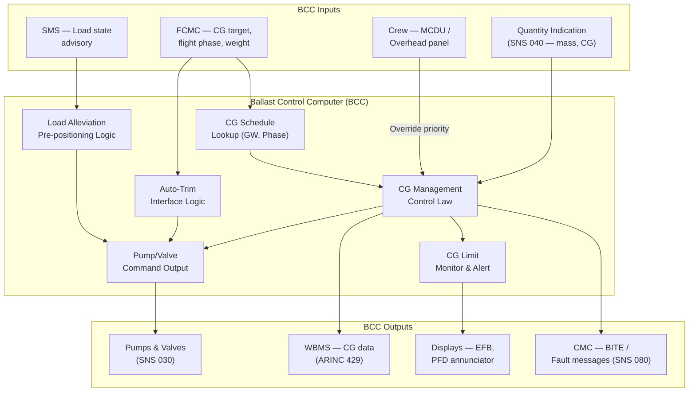

# ATLAS 040-049 · Section 04 · Subsection 041 · 050 — Ballast Control and Automatic Trim Interfaces

## 1. Purpose

This document defines the architecture, control laws, avionics interfaces, and crew interface provisions of the Ballast Control and Automatic Trim subsystem of the Water Ballast System (WBS). The Ballast Control Computer (BCC) is the central decision-making element of the WBS: it receives CG position data from the quantity indication subsystem (SNS 040), interprets CG management objectives from the Flight Control and Management Computer (FCMC), and commands the pump and valve network (SNS 030) to execute controlled water transfers that maintain the aircraft CG within the certified envelope throughout all phases of flight.

The automatic trim interface couples the WBS to the fly-by-wire flight control architecture, enabling the FCMC to use ballast transfer as a slow-acting trim effector complementary to the horizontal stabiliser and elevators. This integration reduces stabiliser-induced drag in long cruise segments by biasing the CG aftward within the envelope — a well-established fuel efficiency technique used on modern long-range transport aircraft. The interface also supports load-alleviation functions: in turbulent flight conditions, the BCC can receive advisory signals from the structural monitoring function and pre-position ballast to reduce bending moments at wing roots and fuselage frames.

## 2. Scope

This document covers:

- BCC functional architecture: processing channels, redundancy concept, input/output signal definitions, and software development assurance level (DAL) assignment.
- CG management control laws: the target CG scheduling algorithm as a function of gross weight, flight phase, and aerodynamic efficiency objectives.
- Fly-by-wire integration: ARINC 429 and AFDX interface with the FCMC; command and status signal definitions; authority limits and interlock logic.
- Load-alleviation interface: data exchange with the Structural Monitoring System (SMS); pre-positioning logic; activation conditions and inhibits.
- CG envelope management: forward and aft limit monitoring; proximity alerts; automatic deceleration of transfers approaching limits.
- Manual override provisions: crew-initiated transfer via MCDU and overhead panel; priority logic ensuring crew authority supersedes automatic commands at all times.
- Failure modes and degraded mode operation: loss of BCC channel, sensor fault, pump/valve failure — effects on automatic and manual control authority.

## 3. Glossary

| Term / Acronym | Definition |
|---|---|
| BCC | Ballast Control Computer — the dedicated avionics line-replaceable unit (LRU) commanding WBS pump and valve actuators based on CG management control laws and FCMC interface signals. |
| FCMC | Flight Control and Management Computer — the primary fly-by-wire avionics unit computing flight control laws, stabiliser trim commands, and load-alleviation functions; the BCC's primary automatic control interface. |
| AFDX | Avionics Full-Duplex Switched Ethernet (ARINC 664 Part 7) — the high-bandwidth deterministic avionics network used for BCC–FCMC data exchange where latency requirements are < 50 ms. |
| Control Law | A mathematical algorithm computing actuator commands as a function of measured state variables and target states; the BCC CG management control law computes pump flow rate and valve configuration to achieve a target CG position. |
| CG Schedule | A pre-computed table or function specifying the target CG position as a function of gross weight and flight phase, optimised for minimum trim drag throughout the mission profile. |
| Authority Limit | A hard boundary on the CG change that can be commanded by the automatic function without crew awareness; the BCC has an authority limit of ±2% MAC from the pre-flight CG, requiring crew notification for larger excursions. |
| Load Alleviation | A function that reduces structural loads by using fast-acting aerodynamic and slower-acting inertial (ballast) effectors to redistribute mass in response to gust or manoeuvre loads; reduces structural fatigue. |
| Manual Override | Crew-initiated WBS command via the MCDU BALLAST page or dedicated overhead panel switch; takes priority over BCC automatic commands; BCC reverts to monitoring role until manual mode is exited. |
| SMS | Structural Monitoring System — an onboard sensor network measuring airframe strains, accelerations, and fatigue cycles; provides load state data to the BCC for load-alleviation pre-positioning commands. |
| DAL | Development Assurance Level — per SAE ARP4754A; the BCC core control function is DAL B (Hazardous failure effect) requiring independence between development and verification activities. |
| Interlock | A hardware or software logic condition that prevents a command from being executed unless prerequisite conditions are satisfied (e.g., aircraft weight-on-wheels signal must be false before aft CG biasing is permitted in flight). |
| MCDU | Multi-function Control and Display Unit — the crew keyboard/display unit through which manual WBS transfer commands are entered; displays current tank quantities, total ballast mass, and CG position. |

## 4. Diagram (Mermaid)

## 5. Footprint

| Metric | Value |
|---|---|
| Architecture | `ATLAS` — Aircraft Top Level Architecture Schema/System (controlled term) |
| Master range | `000–099` |
| Code range | `040-049` |
| Section | `04` — Aviónica, Información & APU |
| Subsection | `041` — Water Ballast |
| Subsubject | `050` — Ballast Control and Automatic Trim Interfaces |
| Primary Q-Division | Q-DATAGOV[^qdiv] |
| Support Q-Divisions | Q-AIR, Q-SPACE, Q-HPC |
| ORB support | ORB-PMO, ORB-LEG |
| Governance class | `baseline`[^gov] |
| Folder path | `Q+ATLANTIDE/000-099_ATLAS/040-049_Avionica-Informacion-y-APU/041_Water-Ballast/` |
| Document | `041-050-Ballast-Control-and-Automatic-Trim-Interfaces.md` (this file) |
| Parent subsection | [`README.md`](./README.md) |
| Parent section | [`../../README.md`](../../README.md) |
| Parent architecture | [`../../../README.md`](../../../README.md) |
| Parent baseline | [`organization/Q+ATLANTIDE.md`](../../../../organization/Q+ATLANTIDE.md) |

## 6. References & Citations

[^baseline]: Q+ATLANTIDE controlled baseline (v1.0.0) — governing architecture baseline for ATLAS master range 000–099; all BCC and automatic trim interface requirements derive authority from this document.

[^qdiv]: Q-Division authority — Q-DATAGOV holds primary data governance authority. Q-HPC provides avionics software and control law engineering support; Q-AIR provides flight control integration support.

[^gov]: Governance class — `baseline` denotes formal change control, configuration management, and periodic review under the Q+ATLANTIDE baseline management process.

[^n001]: Note N-001 — EUROCAE ED-79A / SAE ARP4754A (2010): Guidelines for Development of Civil Aircraft and Systems. BCC development is conducted at DAL B with fully independent verification, consistent with the Hazardous failure classification of total automatic CG control loss.

[^n002]: Note N-002 — RTCA DO-178C (2011): Software Considerations in Airborne Systems and Equipment Certification. BCC flight software is developed at Software Level B, requiring MC/DC structural coverage of all control law decision branches.

[^n003]: Note N-003 — RTCA DO-254 (2000): Design Assurance Guidance for Airborne Electronic Hardware. BCC FPGA/ASIC elements (if applicable) are developed at hardware Design Assurance Level B per DO-254 §4.

[^n004]: Note N-004 — ARINC 664 Part 7 (AFDX) and ARINC 429P1-22: Data bus specifications governing BCC–FCMC interface (AFDX) and BCC–WBMS/CMC interface (ARINC 429); virtual link allocation and latency budgets defined in the aircraft ICD.

[^n005]: Note N-005 — EASA AMC 25.671: Control systems — general. Acceptable means of compliance for fly-by-wire integration of the BCC, including authority limits, manual override provisions, and failure mode transitions.

[^n006]: Note N-006 — SAE ARP4761 (1996): Guidelines for Safety Assessment Process — FTA, FMEA, and CCA applicable to BCC dual-channel redundancy architecture and FCMC interface failure mode analysis, ensuring no single failure disables both automatic and manual ballast control.
