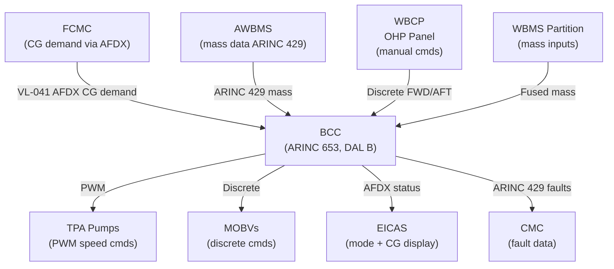
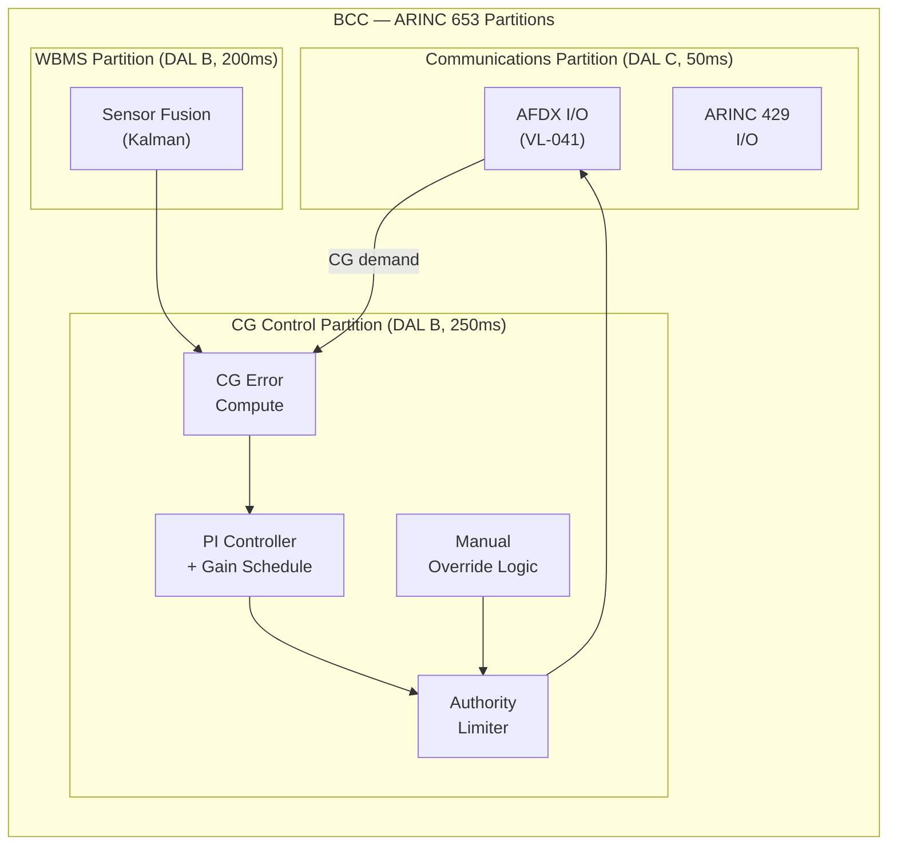
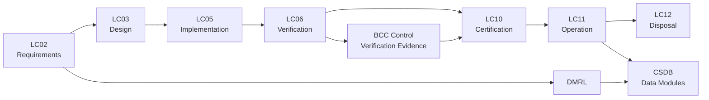

# ATLAS 040-049 · Section 04 · Subsection 041 · 050 — Ballast Control and Automatic Trim Interfaces

## 0. Hyperlink Policy

All internal cross-references use relative Markdown links resolved within the Q+ATLANTIDE CSDB repository. External regulatory citations are listed in §19 and §20 with identifiers marked TBD. Parent context: [ATLAS 041 Water Ballast General](./041-000-Water-Ballast-General.md).

---

## 1. Purpose

This document defines the Ballast Control Computer (BCC) architecture, the automatic CG trim control law, and the interfaces between the BCC and the Flight Control Management Computer (FCMC) on the AMPEL360E eWTW. It specifies the control authority limits, mode logic, manual crew override, ARINC 653 software partitioning, and cockpit annunciation for the Water Ballast control function.

The BCC is a DAL B avionics computer executing the CG computation and transfer control law in a dedicated ARINC 653 partition. Its interface to the FCMC via AFDX (ARINC 664 Part 7) provides the trim-demand signal that drives the fuel-trim-fuel and water-ballast-trim optimisation. The BCC is the authoritative source of CG position for EICAS display and AFM-defined CG warning alerting.

The automatic trim law operates as a proportional-integral (PI) controller with a CG error input (from WBMS) and a transfer rate command output (to TPA pumps), subject to authority limits of ±3.5% MAC and a minimum increment of 5 kg to prevent valve and pump hunting.

---

## 2. Applicability

| Attribute | Value |
|-----------|-------|
| Aircraft Model | AMPEL360E eWTW (all production variants) |
| ATA Reference | ATA 41-50 — Ballast Control |
| Standards | CS-25 Amd 27, DO-178C DAL B, DO-254 DAL C, ARINC 653, ARP4754B |
| Dev Assurance | BCC software DAL B (DO-178C); BCC hardware DAL C (DO-254) |
| Applicability Code | AMPEL360E-EWTW-ALL |
| Authority Limits | ±3.5% MAC CG authority; 5–30 kg/min transfer rate |

---

## 3. System / Function Overview

The BCC is an ARINC 653-partitioned avionics computer housed in the forward avionics bay (LRU, 4MCU ARINC 600). It hosts three software partitions: the WBMS sensor fusion partition (interfacing with level sensors and load cells), the CG Control partition (implementing the PI trim law), and the Communications partition (managing AFDX and ARINC 429 I/O). Partition separation provides DAL B integrity for the control function without requiring the full computer to be DAL B.

The FCMC provides a CG demand signal on AFDX (target CG as %MAC, updated at 4 Hz). The BCC CG Control partition computes the CG error (target minus actual) and outputs a transfer rate command (kg/min) to the pumps. The PI controller gains are scheduled with Mach number and aircraft weight (fed from AWBMS via ARINC 429) to maintain consistent trim authority across the flight envelope. Authority limits are enforced in hardware by a rate limiter circuit on the pump motor controller.

Manual crew override is provided via the Overhead Panel Water Ballast Control Panel (WBCP): momentary pushbuttons FWD XFER and AFT XFER command transfer at a fixed rate of 10 kg/min in the selected direction. Manual mode inhibits the automatic trim law but does not disable the authority limit protection. An AFM note requires crew awareness of manual override use during approach.

---

## 4. Scope

### 4.1 Included
- BCC hardware architecture (ARINC 653 partitioned, DAL B/C)
- CG Control partition: PI trim law, gain scheduling, authority limits
- FCMC AFDX interface (CG demand in, transfer status out)
- AWBMS ARINC 429 interface (mass data in)
- Manual crew override logic (WBCP panel)
- Mode annunciation on EICAS and OHP
- ARINC 653 partition configuration and health monitoring
- BCC NVM and configuration management

### 4.2 Excluded
- WBMS sensor fusion software (see 041-040)
- Pump and valve hardware (see 041-030)
- Crew indication of quantity (SD page — see 041-040)
- Dump and drain control (see 041-060)
- BITE and CMC interface (see 041-080)

---

## 5. Architecture Description

**BCC Hardware.** The BCC is a 4MCU ARINC 600 LRU with a dual-core COTS SBC (DO-254 DAL C), 4 GB ECC RAM, 64 GB NVM, dual AFDX VL ports, and 4× ARINC 429 high-speed channels. Power: 28 VDC primary, 115 VAC secondary (for AFDX switch). Cooling by convection via ARINC 600 face plate; no active cooling required for thermal dissipation < 15 W.

**ARINC 653 Partitioning.** Three partitions: WBMS (DAL B, 200 ms period), CG Control (DAL B, 250 ms period), and Communications (DAL C, 50 ms period). A Type 1 hypervisor enforces time and space partitioning per ARINC 653-1. Partition health monitored by the hypervisor; failed partition triggers a warm restart with BCC entering Degraded mode.

**PI Control Law.** CG error e = CG_target − CG_actual (%MAC). Transfer rate command R = Kp·e + Ki·∫e dt, where Kp and Ki are scheduled look-up table values versus Mach and gross weight. Authority limits: |R| ≤ 30 kg/min; |ΔCG| ≤ 3.5% MAC. Integrator anti-windup engages at authority limit. Minimum command increment 5 kg to prevent micro-cycling.

**FCMC AFDX Interface.** BCC acts as AFDX end system on the avionics AFDX network, Virtual Link ID VL-041. Message rate 4 Hz. CG demand received from FCMC (Label 041-CD); transfer status (rate, mode, faults) sent to FCMC and EICAS (Label 041-ST). Latency budget: BCC processing ≤ 50 ms, AFDX transmission ≤ 2 ms.

---

## 6. Functional Breakdown

| Function ID | Function Name | Description | Allocated To | DAL |
|-------------|---------------|-------------|-------------|-----|
| F-050-01 | CG Computation | Compute real-time CG from WBMS mass data | CG Control partition | B |
| F-050-02 | PI Trim Law | Execute PI control with gain scheduling and authority limits | CG Control partition | B |
| F-050-03 | FCMC Interface | Receive CG demand; send transfer status via AFDX | Communications partition | C |
| F-050-04 | Manual Override | Execute crew WBCP FWD/AFT commands; inhibit auto trim | CG Control partition | B |
| F-050-05 | Mode Annunciation | Publish WBMS mode (AUTO/MANUAL/DEGRADED/FAIL) to EICAS | Communications partition | C |

---

## 7. Mermaid — System Context Diagram

---

## 8. Mermaid — Internal Functional Architecture

---

## 9. Mermaid — Lifecycle Traceability

---

## 10. Interfaces

| Interface ID | From | To | Protocol / Standard | Direction | Notes |
|-------------|------|----|---------------------|-----------|-------|
| IF-050-01 | FCMC | BCC | AFDX VL-041 | FCMC → BCC | CG demand (%MAC) at 4 Hz |
| IF-050-02 | BCC | FCMC | AFDX VL-041 | BCC → FCMC | Transfer status, mode, CG actual |
| IF-050-03 | AWBMS | BCC | ARINC 429 HS | AWBMS → BCC | Fuel + PAX + cargo mass at 1 Hz |
| IF-050-04 | BCC | TPA motor controllers | PWM 400 Hz | BCC → TPA | Speed command 0–100% |
| IF-050-05 | BCC | MOBV actuators | 28 VDC discrete | BCC → MOBV | Open/close command |
| IF-050-06 | WBCP | BCC | 28 VDC discrete (hardwired) | WBCP → BCC | FWD/AFT/INHIBIT discretes |

---

## 11. Operating Modes

| Mode | Description | Trigger | System Response |
|------|-------------|---------|-----------------|
| AUTO | BCC executes PI trim law continuously | Normal in-flight, all systems healthy | CG maintained within ±0.5% MAC of FCMC demand |
| MANUAL | Crew commands fixed-rate transfer | WBCP FWD or AFT pushbutton pressed | Transfer at 10 kg/min; auto trim inhibited; EICAS WBAL MAN |
| DEGRADED | Single partition failure or single sensor fault | BITE fault detection | Reduced authority or rate; EICAS WBAL DEGRAD advisory |
| FAIL / ISOLATED | BCC failure or dual fault | Watchdog / dual fault | All MOBVs closed; no transfer; EICAS WBAL FAIL warning |

---

## 12. Monitoring and Diagnostics

- BCC processor health monitored by dual watchdog timers (primary 100 ms, secondary 500 ms); soft fault triggers partition restart, hard fault triggers BCC isolation.
- CG actual vs. FCMC demand cross-check; error > 2% MAC for > 60 s without transfer in progress triggers EICAS advisory.
- AFDX Virtual Link monitoring: missed frames > 3 consecutive triggers FCMC/BCC interface fault; BCC enters Degraded.
- PI integrator wind-up detection: integrator state clamped at ±3.5% MAC equivalent; saturation flag logged.
- WBCP panel discrete integrity: hardwired discretes are power-up tested; stuck-closed discrete triggers maintenance flag.
- All BCC health events and ARINC 653 partition health logs available via AMT (ARINC 767) at forward EE bay.

---

## 13. Maintenance Concept

| Task | Interval | Access | Tooling |
|------|----------|--------|---------|
| BCC NVM log download | A-check (on condition) | AMT port, fwd EE bay | AMT laptop + ARINC 767 |
| BCC software version check | B-check | AMT port | AMT laptop |
| Full BCC functional test (auto trim law) | C-check | Ground power + BCC test mode | WB functional test rig + AMT |
| WBCP panel discrete test | C-check | OHP access | AMT + discrete test set |

---

## 14. S1000D / CSDB Mapping

| Document Type | Data Module Code (DMC) | Info Code | Title |
|---------------|----------------------|-----------|-------|
| System Description | DMC-AMPEL360E-EWTW-041-050-00A-040A-A | 040 | Ballast Control and Trim Interfaces Description |
| Maintenance Procedures | DMC-AMPEL360E-EWTW-041-050-00A-300A-A | 300 | Ballast Control Fault Isolation |
| BITE/Test | DMC-AMPEL360E-EWTW-041-050-00A-400A-A | 400 | Ballast Control BITE Procedures |
| Wiring Data | DMC-AMPEL360E-EWTW-041-050-00A-520A-A | 520 | Ballast Control Wiring and Connector Data |
| IPD | DMC-AMPEL360E-EWTW-041-050-00A-941A-A | 941 | Ballast Control Illustrated Parts |
| Software Desc | DMC-AMPEL360E-EWTW-041-050-00A-720A-A | 720 | BCC Software Description |

### Recommended Data Module Set

| Info Code | Publication | Applicability |
|-----------|-------------|---------------|
| 040 | AMM — System Description | All variants |
| 300 | FIM — Fault Isolation | All variants |
| 400 | TSM — BITE Procedures | All variants |
| 520 | AMM — Wiring Data | All variants |
| 720 | SRM — Software Description | All variants |
| 941 | IPD — Parts Data | All variants |

---

## 15. Footprints

### 15.1 Physical

| Item | Dimension (mm) | Mass (kg) | Location |
|------|---------------|-----------|----------|
| BCC LRU (4MCU) | 155 × 194 × 320 | 3.8 | Fwd avionics bay, row 3 |
| WBCP OHP panel | 120 × 80 × 30 | 0.4 | Overhead panel P5 area |
| AFDX switch (shared) | 194 × 194 × 115 | 1.2 (shared resource) | Fwd avionics bay |

### 15.2 Electrical / Data

| Interface | Standard | Bandwidth / Power |
|-----------|----------|-------------------|
| BCC 28 VDC primary | MIL-STD-704F | 15 W continuous |
| AFDX (dual) | ARINC 664 Part 7 | 100 Mbit/s / < 2 W |
| ARINC 429 (×4 ch) | ARINC 429 HS | 100 kbit/s each |

### 15.3 Maintenance

| Task | Man-Hours | Skill Level | Access |
|------|-----------|-------------|--------|
| BCC NVM download | 0.5 | AV tech (Cat B2) | EE bay AMT port |
| Full BCC functional test | 3.0 | AV tech (Cat B2) | EE bay + OHP |
| BCC LRU replacement | 1.0 | AV tech (Cat B2) | EE bay (4MCU pull/replace) |

### 15.4 Data

| Data Item | Volume | Storage | Retention |
|-----------|--------|---------|-----------|
| BCC NVM partition health logs | 32 MB | BCC NVM | 2 000 FH rolling |
| PI integrator state history | 10 MB/flight | BCC NVM | 500 FH rolling |
| Configuration parameters | 4 MB | BCC NVM (protected) | Permanent |

---

## 16. Safety and Certification Considerations

- DO-178C DAL B: WBMS partition and CG Control partition require MC/DC coverage, requirements-based testing, and structural coverage analysis per DO-178C Table A-7.
- ARINC 653 partitioning provides DAL B function isolation; partition monitor (hypervisor) qualified at DAL A (monitoring only, no control path).
- CS-25 §25.1309: BCC dual failure (both partitions failed) results in loss of ballast control, classified as Hazardous; probability < 1×10⁻⁷ per flight hour required by FTA.
- Manual override authority (10 kg/min) is limited to prevent crew from defeating structural limits; AFM Note requires crew understanding.
- DO-254 DAL C applies to BCC hardware (SBC, FPGA logic, AFDX interface logic); independence from DAL B software maintained via design standards.
- Configuration management of BCC software follows ARP4754B CM requirements; each software load identified by part number and version in CSDB.

---

## 17. Verification and Validation

| V&V ID | Requirement | Method | Success Criteria | Status |
|--------|-------------|--------|-----------------|--------|
| VV-050-01 | PI trim law CG error < 0.5% MAC in steady state | HIL simulation | Steady-state error < 0.5% MAC | TBD |
| VV-050-02 | Authority limit enforcement (3.5% MAC) | Functional test | BCC output saturates at 3.5% MAC demand | TBD |
| VV-050-03 | Manual override activates within 1 s of WBCP press | Functional test | Transfer starts within 1 s | TBD |
| VV-050-04 | BCC fail-safe isolation within 200 ms of watchdog | Fault injection | MOBVs closed within 200 ms | TBD |
| VV-050-05 | DO-178C DAL B objectives met | Software audit | All DO-178C Table A-7 objectives satisfied | TBD |
| VV-050-06 | AFDX latency ≤ 50 ms end-to-end | Network analysis + test | Measured latency ≤ 50 ms | TBD |
| VV-050-07 | FTA: hazardous CG loss probability < 1×10⁻⁷ / FH | Safety analysis | Computed probability < 1×10⁻⁷ / FH | TBD |

---

## 18. Glossary

| Term/Acronym | Definition | Link |
|-------------|-----------|------|
| ARINC 653 | Avionics Application Software Standard Interface; defines time/space partitioning for IMA | [§3](#3-system--function-overview) |
| BCC | Ballast Control Computer; DAL B/C LRU hosting WBMS and CG Control partitions | [§3](#3-system--function-overview) |
| CG Demand | FCMC-provided target CG position (%MAC) for the BCC PI controller | [§3](#3-system--function-overview) |
| DO-178C | RTCA DO-178C Software Considerations; defines DAL B/A software development objectives | [§2](#2-applicability) |
| DO-254 | RTCA DO-254 Design Assurance Guidance for Airborne Electronic Hardware | [§16](#16-safety-and-certification-considerations) |
| FTA | Fault Tree Analysis; top-down safety analysis method per ARP4761A | [§16](#16-safety-and-certification-considerations) |
| PI | Proportional-Integral control law; used for CG trim command computation | [§3](#3-system--function-overview) |
| VL-041 | AFDX Virtual Link identifier for WB control messages | [§3](#3-system--function-overview) |
| WBCP | Water Ballast Control Panel; OHP crew interface for manual ballast control | [§3](#3-system--function-overview) |
| Gain Schedule | Look-up table of Kp/Ki values versus Mach and gross weight | [§5](#5-architecture-description) |

---

## 19. Citations

| Ref | Citation | Use | Link |
|-----|---------|-----|------|
| CS-25 | EASA CS-25 Amendment 27 §25.1309 | Equipment failure effects | TBD |
| DO-178C | RTCA DO-178C | DAL B software development | TBD |
| DO-254 | RTCA DO-254 | DAL C hardware development | TBD |
| ARINC 653-1 | ARINC 653-1 — Avionics Application SW Standard Interface | BCC partitioning standard | TBD |
| S1000D | S1000D Issue 5.0 | CSDB mapping | TBD |
| ATA-iSpec-2200 | ATA iSpec 2200 | AMM/FIM structure | TBD |
| EASA-TC | EASA Type Certificate Data Sheet AMPEL360E | Certification basis | TBD |

---

## 20. References

| Ref | Document | Identifier | Revision | Status | Link |
|-----|---------|-----------|---------|--------|------|
| R-001 | WB General (041-000) | QATL-ATLAS-041-000 | Rev 1.0 | Active | [041-000](./041-000-Water-Ballast-General.md) |
| R-002 | WB Quantity Indication (041-040) | QATL-ATLAS-041-040 | Rev 1.0 | Active | [041-040](./041-040-Ballast-Quantity-Indication-and-Mass-Properties.md) |
| R-003 | BCC Software Requirements Spec | AMPEL360E-SRS-041-SW-050 | Rev A | Active | TBD |

---

## 21. Open Issues

| ID | Issue | Owner | Status | Link |
|----|-------|-------|--------|------|
| OI-050-01 | Gain schedule Kp/Ki values pending handling qualities flight test data | Q-AIR | Open | TBD |
| OI-050-02 | ARINC 653 hypervisor supplier selection pending IMA platform decision | Q-DATAGOV | Open | TBD |
| OI-050-03 | AFDX VL-041 bandwidth allocation to be agreed with network architect | Q-DATAGOV | Open | TBD |

---

## 22. Change Log

| Version | Date | Author | Change | Link |
|---------|------|--------|--------|------|
| 1.0.0 | 2026-05-09 | Q-DATAGOV / Copilot | Initial creation with full 22-section template | TBD |
