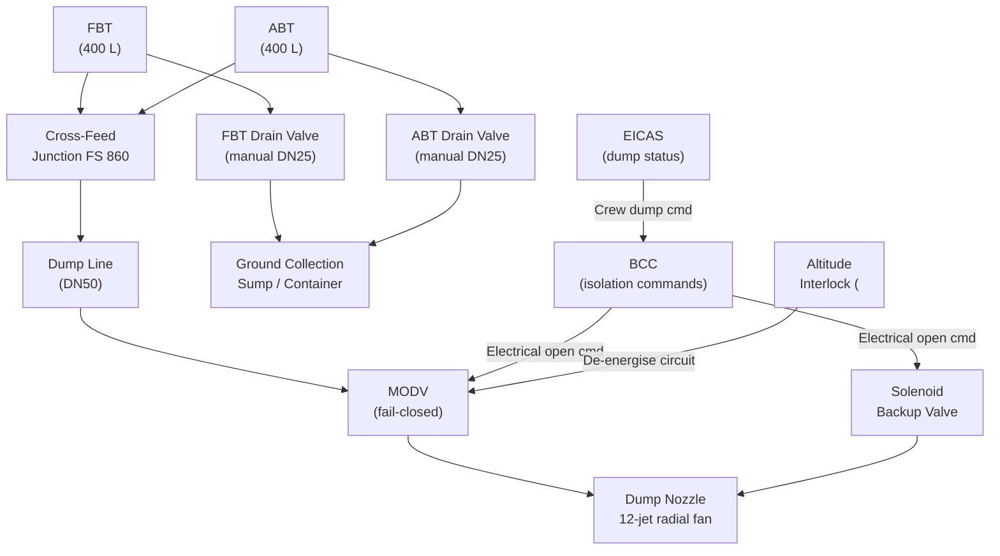
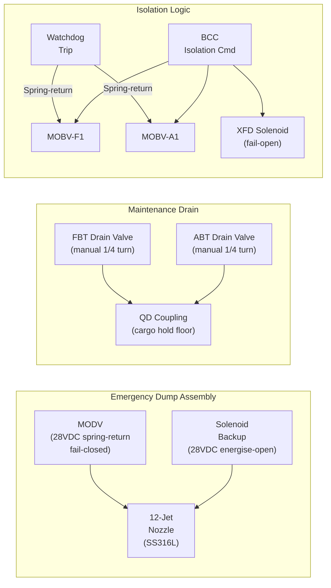
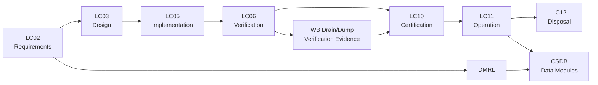

# ATLAS 040-049 · Section 04 · Subsection 041 · 060 — Ballast Drain, Dump and Isolation

## 0. Hyperlink Policy

All internal cross-references use relative Markdown links resolved within the Q+ATLANTIDE CSDB repository. External regulatory citations are listed in §19 and §20 with identifiers marked . Parent context: [ATLAS 041 Water Ballast General](./041-000-Water-Ballast-General.md).

---

## 1. Purpose

This document defines the drain, dump, and isolation functions of the Water Ballast system on the AMPEL360E eWTW. It covers the emergency dump system for rapid jettison of ballast water, the maintenance drain function for complete tank emptying on the ground, tank and line isolation valve logic, and the fail-safe isolation modes activated on loss of BCC or detection of a leakage fault.

The emergency dump capability allows the crew to rapidly displace up to 800 kg of water in less than 8 minutes (target rate ≥ 100 kg/min through the dump port) to recover CG or reduce aircraft weight in an abnormal CG divergence scenario. Dump operations are subject to ICAO Annex 16 Environmental Protection constraints: dumping is only permitted above an approved altitude (FL100 minimum) and at approved locations per ICAO Doc 9137. The dump rate and trajectory are designed to disperse water into fine droplets (nozzle aperture < 3 mm) to ensure complete evaporation before ground level.

Maintenance drain valves allow both tanks to be fully emptied to a ground collection sump. Isolation valve logic ensures both tanks are independently isolatable for maintenance without disturbing the transfer circuit.

---

## 2. Applicability

| Attribute | Value |
|-----------|-------|
| Aircraft Model | AMPEL360E eWTW (all production variants) |
| ATA Reference | ATA 41-60 — Ballast Drain, Dump and Isolation |
| Standards | CS-25 Amd 27, ICAO Annex 16 Vol I, DO-160G §8 |
| Dev Assurance | DAL C (dump/drain hardware); DAL B (isolation logic) |
| Applicability Code | AMPEL360E-EWTW-ALL |
| Emergency Dump Rate | ≥ 100 kg/min (both tanks combined) |

---

## 3. System / Function Overview

The emergency dump system uses a dedicated dump port in the aircraft belly skin, connected to the cross-feed junction via a DN50 dump line. A motor-operated dump valve (MODV) and a manually-resettable solenoid backup valve provide dual-path dump initiation. The dump nozzle assembly disperses water through twelve 2.8 mm jets arranged in a radial fan pattern, generating droplets < 500 µm diameter to meet ICAO Annex 16 evaporation requirements.

The maintenance drain system uses gravity-drain paths from the lowest points of each tank through DN25 ball-valve drain ports to a portable collection container or belly drain plug, providing complete tank drain in < 20 minutes. Drain valves are manual-operated, accessible from the cargo hold floor.

Isolation valve architecture provides independent isolation of: each tank (via MOBV-F1 and MOBV-A1 on tank outlets), each pump (via MOBV-F2 and MOBV-A2), the cross-feed junction (via a normally-open solenoid isolation valve), and the dump path (via MODV). Fail-safe logic closes all MOBVs on BCC loss, EICAS warning, or leak detection, preventing uncontrolled water transfer or dump.

---

## 4. Scope

### 4.1 Included
- Emergency dump valve (MODV) and backup solenoid valve
- Dump nozzle assembly (12-jet radial fan, < 500 µm droplets)
- Dump line from cross-feed junction to belly port (DN50)
- Dump rate analysis and ICAO Annex 16 compliance
- Maintenance drain valves and drain lines (DN25)
- Belly drain collection plug and sump provisions
- Isolation valve logic (MOBVs + cross-feed isolation)
- Fail-safe isolation modes (BCC loss, leak, manual)

### 4.2 Excluded
- MOBV hardware design (see 041-030)
- Transfer manifold architecture (see 041-020)
- BCC isolation command logic (see 041-050)
- Ground servicing fill valves (see 041-070)

---

## 5. Architecture Description

**Emergency Dump Path.** The MODV (28 VDC, spring-return fail-closed) is installed on the DN50 dump line at FS 860 belly skin, 200 mm upstream of the dump nozzle. A backup solenoid valve (28 VDC, energise-to-open) is in parallel with the MODV for redundancy. The dump nozzle is a stainless-steel machined assembly with 12 × 2.8 mm angled jets and a deflector cone, providing a 45° spray cone. Dump flow is driven by gravity and tank headspace pressure; no pump is required.

**Maintenance Drain Path.** Two DN25 manual ball valves (one per tank) at the lowest point of each tank connect via flexible hoses to a quick-disconnect coupling at the cargo hold floor level. Drain connects to a portable collection tank or via belly skin drain plug to an airport drainage sump. Minimum drain rate 40 L/min by gravity.

**Isolation Logic.** BCC monitors all valve positions against commanded states. On BITE fault detecting a line pressure discrepancy > 0.05 bar (indicative of a leak), the BCC isolates the affected line segment within 5 s by closing the nearest upstream MOBV. On BCC watchdog trip, all MOBVs revert to spring-return state (fail-closed). The cross-feed solenoid (fail-open) maintains forward/aft manifold connectivity even with BCC failed, but transfer pumps are off so no flow occurs.

**ICAO Annex 16 Compliance.** Dump altitude minimum FL100 is enforced by a flight-phase discrete interlock on the MODV circuit; below FL100, the MODV electrical circuit is de-energised, preventing electrical opening. Dump event is reported to the Aircraft Communication Addressing and Reporting System (ACARS) automatically, and the crew must obtain ATC clearance per airline SOP.

---

## 6. Functional Breakdown

| Function ID | Function Name | Description | Allocated To | DAL |
|-------------|---------------|-------------|-------------|-----|
| F-060-01 | Emergency Dump | Rapidly discharge ballast water through belly port | MODV + dump nozzle | C |
| F-060-02 | Maintenance Drain | Gravity drain tanks to collection sump on ground | Manual drain valves | D |
| F-060-03 | Tank Isolation | Isolate individual tanks for maintenance or fault | MOBV-F1 / MOBV-A1 | B |
| F-060-04 | Fail-Safe Isolation | Close all isolation valves on BCC loss or leak fault | BCC logic + spring-return | B |
| F-060-05 | ICAO Altitude Interlock | Prevent dump below FL100 | Altitude discrete circuit | C |

---

## 7. Mermaid — System Context Diagram

---

## 8. Mermaid — Internal Functional Architecture

---

## 9. Mermaid — Lifecycle Traceability

---

## 10. Interfaces

| Interface ID | From | To | Protocol / Standard | Direction | Notes |
|-------------|------|----|---------------------|-----------|-------|
| IF-060-01 | BCC | MODV | 28 VDC discrete | BCC → MODV | Open command (energise) |
| IF-060-02 | BCC | Solenoid backup | 28 VDC discrete | BCC → Solenoid | Open command (energise) |
| IF-060-03 | Altitude discrete | MODV circuit | 28 VDC inhibit | ADIRU → MODV | De-energises circuit below FL100 |
| IF-060-04 | EICAS | BCC | AFDX | EICAS → BCC | Crew dump initiation |
| IF-060-05 | Manual drain valves | Ground collection | Manual operation | Maintenance | No electrical interface |
| IF-060-06 | BCC | CMC | ARINC 429 | BCC → CMC | Dump event report / leak isolation log |

---

## 11. Operating Modes

| Mode | Description | Trigger | System Response |
|------|-------------|---------|-----------------|
| Isolation Active | All MOBVs closed; no transfer | BCC loss or dual fault | Tanks isolated; no transfer or dump possible |
| Dump Active | Emergency dump in progress | Crew DUMP pushbutton + altitude ≥ FL100 | MODV opens; gravity dump ≥ 100 kg/min |
| Leak Isolation | Affected line segment isolated | DP leak detection > 0.05 bar | BCC closes nearest upstream MOBV within 5 s |
| Maintenance Drain | Ground drain in progress | Maintenance procedure | Manual drain valves open; ground collection |

---

## 12. Monitoring and Diagnostics

- MODV position feedback (open/closed discrete) confirmed after each command; disagree within 3 s triggers EICAS caution.
- Dump flow is estimated from tank level change rate during dump; rate < 80 kg/min triggers nozzle-blockage advisory.
- Altitude interlock circuit status monitored by BITE; de-energised correctly below FL100 confirmed at each BIT cycle.
- Maintenance drain valve status is mechanical (no electrical feedback); AMM procedure includes visual confirmation.
- Leak isolation events logged to CMC with timestamp and affected segment; triggers maintenance message ATA 41 code.
- Solenoid backup valve tested during each C-check functional test via BCC test mode.

---

## 13. Maintenance Concept

| Task | Interval | Access | Tooling |
|------|----------|--------|---------|
| MODV functional test | C-check | Belly access panel | BCC test mode via AMT |
| Dump nozzle inspection | C-check | Belly skin panel removal | Borescope, 3 mm gauge pin |
| Altitude interlock continuity check | C-check | EE bay wiring diagram | Multimeter, AMT |
| Maintenance drain test (flow rate) | C-check | Cargo hold drain valve | Graduated container, stopwatch |

---

## 14. S1000D / CSDB Mapping

| Document Type | Data Module Code (DMC) | Info Code | Title |
|---------------|----------------------|-----------|-------|
| System Description | DMC-AMPEL360E-EWTW-041-060-00A-040A-A | 040 | Ballast Drain, Dump and Isolation Description |
| Maintenance Procedures | DMC-AMPEL360E-EWTW-041-060-00A-300A-A | 300 | Ballast Drain/Dump Fault Isolation |
| BITE/Test | DMC-AMPEL360E-EWTW-041-060-00A-400A-A | 400 | Ballast Drain/Dump BITE Procedures |
| Wiring Data | DMC-AMPEL360E-EWTW-041-060-00A-520A-A | 520 | Ballast Drain/Dump Wiring and Connector Data |
| IPD | DMC-AMPEL360E-EWTW-041-060-00A-941A-A | 941 | Ballast Drain/Dump Illustrated Parts |
| Software Desc | DMC-AMPEL360E-EWTW-041-060-00A-720A-A | 720 | Ballast Drain/Dump SW Description |

### Recommended Data Module Set

| Info Code | Publication | Applicability |
|-----------|-------------|---------------|
| 040 | AMM — System Description | All variants |
| 300 | FIM — Fault Isolation | All variants |
| 400 | TSM — BITE Procedures | All variants |
| 520 | AMM — Wiring Data | All variants |
| 720 | SRM — Software Description | All variants |
| 941 | IPD — Parts Data | All variants |

---

## 15. Footprints

### 15.1 Physical

| Item | Dimension (mm) | Mass (kg) | Location |
|------|---------------|-----------|----------|
| MODV assembly | 180 × 180 × 120 | 2.0 | Belly FS 860, skin panel |
| Dump nozzle assembly | 150 × 80 dia | 0.8 | Belly skin fitting |
| Maintenance drain valves (×2) | 80 × 80 × 60 each | 0.4 each | Cargo hold floor, each tank |

### 15.2 Electrical / Data

| Interface | Standard | Bandwidth / Power |
|-----------|----------|-------------------|
| MODV actuator | 28 VDC discrete | 25 W peak |
| Solenoid backup valve | 28 VDC | 8 W holding |
| Altitude interlock relay | 28 VDC | < 1 W |

### 15.3 Maintenance

| Task | Man-Hours | Skill Level | Access |
|------|-----------|-------------|--------|
| MODV functional test | 1.5 | Cat B1/B2 | Belly panel |
| Dump nozzle inspection | 1.0 | Cat B1 | Belly skin access |
| Maintenance drain test | 1.0 | Cat B1 | Cargo hold |

### 15.4 Data

| Data Item | Volume | Storage | Retention |
|-----------|--------|---------|-----------|
| Dump event logs | 1 MB per event | BCC NVM | Life of aircraft |
| Leak isolation events | 1 MB per event | BCC NVM + CMC | Life of aircraft |
| MODV position history | 2 MB/flight | BCC NVM | 500 FH rolling |

---

## 16. Safety and Certification Considerations

- ICAO Annex 16 Vol I compliance: dump altitude ≥ FL100, approved locations; nozzle droplet size < 500 µm ensures evaporation before ground; ACARS dump report required.
- CS-25 §25.1309: loss of dump capability is classified as Minor (crew can manage CG by other means in most scenarios); hardware reliability target > 10 000 cycles MTBF for MODV.
- Fail-safe isolation (spring-return MOBVs): verified by power-off test at each C-check; springs inspected at 8 000 FH.
- Dump nozzle shielding: nozzle design prevents water impingement on fuselage skin, engines, and horizontal stabiliser per CS-25 §25.1583 operating procedures.
- Environmental consideration: dump water disperses above cloud layer (FL100+); no evidence of harm to ground environment per EASA CM-21.A-002.
- CS-25 §25.785 equivalent: drain valve handles accessible to maintenance personnel; positive locking (wire-lock) prevents inadvertent in-flight opening.

---

## 17. Verification and Validation

| V&V ID | Requirement | Method | Success Criteria | Status |
|--------|-------------|--------|-----------------|--------|
| VV-060-01 | Dump rate ≥ 100 kg/min (both tanks) | Ground flow test | Measured rate ≥ 100 kg/min at FS nominal |  |
| VV-060-02 | Droplet size < 500 µm | Spray characterisation test | Sauter mean diameter < 500 µm |  |
| VV-060-03 | Altitude interlock prevents dump below FL100 | Fault injection test | MODV cannot open below FL100 signal |  |
| VV-060-04 | Fail-safe isolation within 200 ms of BCC loss | Fault injection | All MOBVs closed within 200 ms |  |
| VV-060-05 | Leak isolation within 5 s of DP threshold | System test | Affected MOBV closes within 5 s |  |
| VV-060-06 | Maintenance drain rate ≥ 40 L/min | Ground test | Measured drain rate ≥ 40 L/min |  |
| VV-060-07 | MODV MTBF > 10 000 cycles | Reliability analysis + accelerated life test | Computed MTBF > 10 000 cycles |  |

---

## 18. Glossary

| Term/Acronym | Definition | Link |
|-------------|-----------|------|
| ACARS | Aircraft Communications Addressing and Reporting System; used for automatic dump event reporting | [§3](#3-system--function-overview) |
| Altitude Interlock | Hardware circuit preventing dump valve energisation below FL100 | [§5](#5-architecture-description) |
| Dump Nozzle | 12-jet radial fan assembly producing < 500 µm droplets for evaporation compliance | [§3](#3-system--function-overview) |
| ICAO Annex 16 | ICAO Annex 16 Environmental Protection; governs aircraft fluid dumping altitude and location | [§1](#1-purpose) |
| MODV | Motor-Operated Dump Valve; primary emergency dump control valve | [§3](#3-system--function-overview) |
| Sauter Mean Diameter | Volume-to-surface area mean droplet diameter; key metric for ICAO evaporation compliance | [§16](#16-safety-and-certification-considerations) |
| Spring-Return | Valve actuator design that reverts to closed position on loss of power | [§3](#3-system--function-overview) |
| XFD Solenoid | Cross-feed junction solenoid valve; fail-open design maintains manifold connectivity | [§5](#5-architecture-description) |
| Fail-Safe | System design ensuring a safe state on component failure without operator action | [§3](#3-system--function-overview) |
| Wire-Lock | Safety wiring preventing inadvertent manual valve opening in flight | [§16](#16-safety-and-certification-considerations) |

---

## 19. Citations

| Ref | Citation | Use | Link |
|-----|---------|-----|------|
| CS-25 | EASA CS-25 Amendment 27 §25.1309 | Failure effects and dump system design |  |
| ICAO-A16 | ICAO Annex 16 Environmental Protection, Volume I | Dump altitude and droplet size requirements |  |
| DO-160G | RTCA DO-160G §8 | Humidity qualification for dump/drain hardware |  |
| EASA-CM | EASA CM-21.A-002 — Water Ballast Environmental Impact | Environmental compliance guidance |  |
| S1000D | S1000D Issue 5.0 | CSDB mapping |  |
| ATA-iSpec-2200 | ATA iSpec 2200 | AMM/FIM structure |  |
| EASA-TC | EASA Type Certificate Data Sheet AMPEL360E | Certification basis |  |

---

## 20. References

| Ref | Document | Identifier | Revision | Status | Link |
|-----|---------|-----------|---------|--------|------|
| R-001 | WB General (041-000) | QATL-ATLAS-041-000 | Rev 1.0 | Active | [041-000](./041-000-Water-Ballast-General.md) |
| R-002 | WB Distribution (041-020) | QATL-ATLAS-041-020 | Rev 1.0 | Active | [041-020](./041-020-Water-Ballast-Distribution-and-Transfer.md) |
| R-003 | WB Control (041-050) | QATL-ATLAS-041-050 | Rev 1.0 | Active | [041-050](./041-050-Ballast-Control-and-Automatic-Trim-Interfaces.md) |

---

## 21. Open Issues

| ID | Issue | Owner | Status | Link |
|----|-------|-------|--------|------|
| OI-060-01 | Dump nozzle droplet size < 500 µm to be validated by spray test; supplier to provide certified data | Q-MECHANICS | Open |  |
| OI-060-02 | ICAO approved dump zone list for route network to be added to AFM supplement | Q-DATAGOV | Open |  |
| OI-060-03 | ACARS dump report format to be agreed with ACARS service provider | Q-DATAGOV | Open |  |

---

## 22. Change Log

| Version | Date | Author | Change | Link |
|---------|------|--------|--------|------|
| 1.0.0 | 2026-05-09 | Q-DATAGOV / Copilot | Initial creation with full 22-section template |  |
