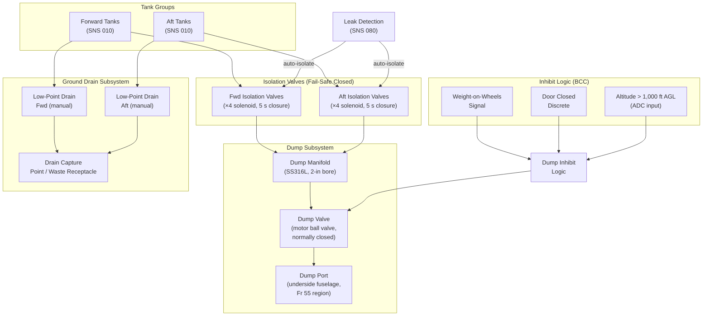

# ATLAS 040-049 · Section 04 · Subsection 041 · 060 — Ballast Drain, Dump and Isolation

## 1. Purpose

This document defines the design, operational requirements, environmental compliance obligations, and certification basis for the Ballast Drain, Dump, and Isolation subsystem of the Water Ballast System (WBS). This subsystem encompasses all provisions for controlled and emergency removal of water ballast from the aircraft — both to ground drainage infrastructure during maintenance and to the atmosphere (overboard dump) during flight or ground emergency operations — as well as the isolation valve network that permits containment of individual tanks or pipe segments in the event of a leak or component failure.

The dump function is a safety-critical capability: in the event that the aircraft exceeds its Maximum Landing Weight (MLW) or Maximum Zero Fuel Weight (MZFW) due to an abnormal ballast state, the crew must be able to rapidly discharge a defined quantity of water overboard in a controlled manner during approach, reducing aircraft weight to within certified structural limits before touchdown. The design of this function must therefore meet demanding flow rate and reliability requirements.

Environmental compliance is a co-equal design driver. The discharge of untreated or additive-contaminated water into the atmosphere or onto airport surfaces is regulated under ICAO Annex 16 Volume II and national environmental regulations. The dump system design must ensure that discharge location, droplet size, and additive concentration at ground level are within permitted limits.

## 2. Scope

This document covers:

- Emergency overboard dump provisions: dump port location, dump valve specification, dump flow rate requirement (minimum capable of reducing aircraft weight by 1,000 kg within 10 minutes), and altitude/speed constraints on dump activation.
- Ground drain provisions: low-point drain ports for complete system drainage during maintenance; drain valve actuation; capture provisions to prevent uncontrolled ground spillage.
- Isolation valve architecture: the network of normally-closed solenoid isolation valves permitting any tank or pipe segment to be isolated from the remainder of the distribution network within 5 seconds of a leak detection signal.
- Dump flow rate calculations and dump port sizing per fluid dynamics principles.
- Environmental compliance: ICAO Annex 16 Volume II analysis; additive concentration limits at ground level; documentation requirements for environmental certification.
- Inhibit logic: conditions under which dump is inhibited (e.g., aircraft weight-on-wheels AND doors closed, conflicting structural limits).
- Interface with the WBS leak detection function (SNS 080) for automatic isolation triggering.

## 3. Glossary

| Term / Acronym | Definition |
|---|---|
| Overboard Dump | The intentional discharge of water ballast through a dedicated port directly to atmosphere from a flying aircraft; used to reduce weight toward MLW during an emergency or abnormal procedure. |
| Dump Valve | A large-bore, normally-closed, motor-operated ball valve or butterfly valve providing the primary flow control for the overboard dump function; sized for the required dump flow rate. |
| MLW | Maximum Landing Weight — the maximum structural weight at which the aircraft is certified to land; if exceeded due to abnormal ballast state, dump is required prior to landing. |
| MZFW | Maximum Zero Fuel Weight — the maximum structural weight of the aircraft excluding usable fuel; a hard structural limit defining the maximum payload-plus-structure weight. |
| Low-Point Drain | A manually operated drain valve at the lowest geometric point of each tank or pipe segment, permitting complete gravity drainage during ground maintenance operations. |
| Isolation Valve | A normally-closed (fail-safe closed) solenoid valve installed at the inlet and outlet of each major distribution segment; activated automatically by leak detection logic or manually by crew/maintenance. |
| Dump Port | The airframe penetration through which overboard dump water exits the aircraft; located and oriented to prevent re-ingestion through engine intakes or impact on control surfaces. |
| ICAO Annex 16 | International Standards and Recommended Practices for Environmental Protection, Volume II (Aircraft Engine Emissions); also references aircraft fluid discharge environmental requirements. |
| Fail-Safe Closed | A valve design philosophy in which the valve moves to the closed (safe) position on loss of electrical power or control signal, preventing unintended fluid discharge. |
| Drip-Free | A specification requirement for dump port and drain valve assemblies that no liquid shall drip or stream from the closed valve when the aircraft is in a depressurised state on the ground. |
| Leak Detection | The function (detailed in SNS 080) that detects abnormal fluid presence in non-fluid bays using moisture sensors, and triggers automatic isolation valve closure within 5 seconds. |
| SGHA | Standard Ground Handling Agreement — the contractual document governing ground servicing activities; the drain procedure must comply with SGHA Annex B provisions for fluid waste disposal. |

## 4. Diagram (Mermaid)

## 5. Footprint

| Metric | Value |
|---|---|
| Architecture | `ATLAS` — Aircraft Top Level Architecture Schema/System (controlled term) |
| Master range | `000–099` |
| Code range | `040-049` |
| Section | `04` — Aviónica, Información & APU |
| Subsection | `041` — Water Ballast |
| Subsubject | `060` — Ballast Drain, Dump and Isolation |
| Primary Q-Division | Q-DATAGOV[^qdiv] |
| Support Q-Divisions | Q-AIR, Q-SPACE, Q-HPC |
| ORB support | ORB-PMO, ORB-LEG |
| Governance class | `baseline`[^gov] |
| Folder path | `Q+ATLANTIDE/000-099_ATLAS/040-049_Avionica-Informacion-y-APU/041_Water-Ballast/` |
| Document | `041-060-Ballast-Drain-Dump-and-Isolation.md` (this file) |
| Parent subsection | [`README.md`](./README.md) |
| Parent section | [`../../README.md`](../../README.md) |
| Parent architecture | [`../../../README.md`](../../../README.md) |
| Parent baseline | [`organization/Q+ATLANTIDE.md`](../../../../organization/Q+ATLANTIDE.md) |

## 6. References & Citations

[^baseline]: Q+ATLANTIDE controlled baseline (v1.0.0) — governing architecture baseline for ATLAS master range 000–099; all drain, dump, and isolation requirements derive authority from this document.

[^qdiv]: Q-Division authority — Q-DATAGOV holds primary data governance authority. Q-AIR provides fluid systems and environmental compliance engineering support for dump port aerodynamic analysis and ICAO compliance.

[^gov]: Governance class — `baseline` denotes formal change control, configuration management, and periodic review under the Q+ATLANTIDE baseline management process.

[^n001]: Note N-001 — ICAO Annex 16, Volume II (Aircraft Engine Emissions) and ICAO Doc 9501 (Environmental Technical Manual): International standards governing airborne discharge of fluids; provides basis for additive concentration limit analysis and dump altitude/location constraints.

[^n002]: Note N-002 — EASA CS-25.1309 and AMC 25.1309: Applied to isolation valve reliability requirements; loss of all isolation capability in the presence of a confirmed leak is classified as a Hazardous failure condition requiring probability ≤ 10⁻⁷ per flight hour.

[^n003]: Note N-003 — EASA CS-25.963 / CS-25.975: Fuel tank access and vent provisions — applied by analogy to WBS tank drain port design requirements for maintenance access and atmospheric pressure equalisation during drain operations.

[^n004]: Note N-004 — IATA Airport Handling Manual (AHM) 810 / Standard Ground Handling Agreement (SGHA) Annex B: Provisions for ground handling of aircraft fluid waste, including WBS drain water capture, disposal, and contamination prevention requirements.

[^n005]: Note N-005 — RTCA DO-160G §16 (Power Input) and §17 (Voltage Spike): Environmental test requirements for isolation valve solenoid actuator electrical interfaces to ensure reliable closure on electrical power transients.

[^n006]: Note N-006 — EASA CS-25.734 and AC 25.734-1: Provisions for airframe penetrations (dump ports); structural and aerodynamic analysis requirements ensuring that dump port openings do not compromise fuselage structural integrity or create hazardous airflow patterns at dump port exit.
