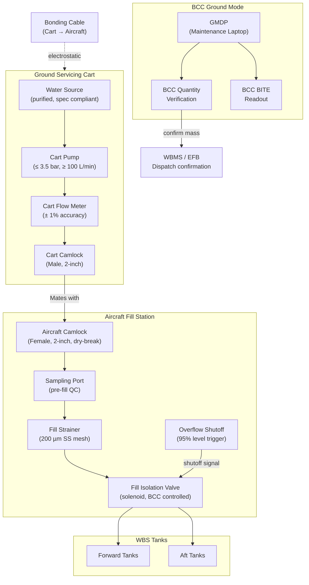

# ATLAS 040-049 · Section 04 · Subsection 041 · 070 — Ballast Servicing and Ground Interfaces

## 1. Purpose

This document defines the ground servicing interface architecture, fill port design, coupling standards, servicing cart requirements, ramp safety provisions, contamination prevention measures, and Standard Ground Handling Agreement (SGHA) interface requirements for the Water Ballast System (WBS). Ground servicing of the WBS — filling, draining, flushing, and sanitising — is a routine maintenance activity that must be executable efficiently, safely, and without risk of fluid contamination at any airport where the aircraft is operated.

The WBS servicing interface design philosophy prioritises three objectives: simplicity of operation for ground crew with minimal specialist training, physical and procedural prevention of incorrect fluid type introduction (water instead of fuel or hydraulic fluid), and environmental containment of all discharged fluids. The ground servicing connection points are standardised and colour-coded per IATA AHM 880 to prevent mis-servicing; coupling geometry is physically keyed to prevent connection of incompatible service carts.

The servicing system must also support the data exchange required for flight dispatch: after filling, the tank quantity indication system (SNS 040) must confirm total ballast mass and CG contribution to the WBMS and Electronic Flight Bag (EFB) before departure clearance is authorised. The ground interface therefore includes an electrical data connection for BCC access during pre-flight servicing checks.

## 2. Scope

This document covers:

- Ground servicing connection standard: fill port physical specification (coupling type, bore diameter, pressure rating), location on aircraft fuselage, and access panel provisions.
- Fill port types and configuration: pressure-fill ports for cart-driven filling; gravity-fill ports for low-pressure servicing; port identification and labelling requirements.
- Coupling types: dry-break couplings to prevent spillage on disconnection; Camlock or equivalent coupling standard; torque and retention requirements.
- Servicing cart interface: electrical power requirements, water quality specifications (conductivity limits, particulate limits, pH range), flow rate capability, and pressure limits.
- Ramp safety provisions: bonding and grounding requirements to prevent electrostatic discharge; overflow protection; trip-hazard management for servicing hoses.
- Contamination prevention: strainer and filter provisions at the fill port; sampling port for water quality verification; flushing procedure definition.
- SGHA interface: documentation of WBS servicing in the SGHA Annex B services schedule; airline-specific service level requirements.
- Pre-departure BCC ground data link: definition of the ground maintenance data port (GMDP) for laptop/tablet connection to BCC for quantity verification and BITE readout during servicing.

## 3. Glossary

| Term / Acronym | Definition |
|---|---|
| Fill Port | The aircraft-mounted fluid entry point through which water ballast is loaded into the WBS from a ground servicing cart or tanker; shall be located within 3 m of ground level for maintenance accessibility. |
| Dry-Break Coupling | A fluid connector that seals both the aircraft-side and cart-side connection simultaneously upon disconnection, preventing spillage of liquid during de-mating; mandatory for all WBS fill and drain connections. |
| Camlock | A widely-used quick-connect coupling standard (per MIL-C-27487 or ISO 9974) employing a cam-and-groove locking mechanism; specified as the WBS fill port coupling type for ramp interoperability. |
| GMDP | Ground Maintenance Data Port — an aircraft-mounted electrical connector providing RS-232, USB, or Ethernet access to the BCC for ground maintenance, BITE readout, configuration data loading, and servicing quantity confirmation. |
| AHM 880 | IATA Airport Handling Manual Chapter 880 — defines colour coding, labelling, and identification standards for aircraft ground servicing connection points to prevent mis-servicing. |
| Water Quality Specification | The defined limits for WBS fill water: electrical conductivity ≤ 500 µS/cm, particulate size ≤ 50 µm, pH 6.5–8.5, no detectable hydrocarbons, no biological contamination exceeding WHO potable water limits. |
| Bonding Cable | An electrical cable connecting the servicing cart chassis to the aircraft structure before any fluid connection is made, equalising electrostatic potential and preventing incendive sparks. |
| Overflow Protection | A combination of a high-level sensor alarm and an automatic fill shutoff valve that closes when a tank reaches 95% capacity, preventing overfill and spillage on the ramp. |
| SGHA | Standard Ground Handling Agreement — the bilateral contract between an airline and a ground handling agent; Annex B lists specific services including WBS filling, draining, and documentation responsibilities. |
| Strainer | A coarse-mesh filter element (typically 200 µm stainless steel mesh) installed immediately downstream of the fill port to trap particulates from the servicing cart before they enter the WBS tanks. |
| Sampling Port | A small valved port immediately upstream of the fill strainer, permitting a pre-fill water sample to be taken for quality verification without contaminating the WBS. |
| Flushing Procedure | A defined maintenance task in which the WBS tanks and distribution lines are filled, circulated, and completely drained with approved clean water to remove stagnant water, biofilm, and residual anti-freeze additive. |

## 4. Diagram (Mermaid)

## 5. Footprint

| Metric | Value |
|---|---|
| Architecture | `ATLAS` — Aircraft Top Level Architecture Schema/System (controlled term) |
| Master range | `000–099` |
| Code range | `040-049` |
| Section | `04` — Aviónica, Información & APU |
| Subsection | `041` — Water Ballast |
| Subsubject | `070` — Ballast Servicing and Ground Interfaces |
| Primary Q-Division | Q-DATAGOV[^qdiv] |
| Support Q-Divisions | Q-AIR, Q-SPACE, Q-HPC |
| ORB support | ORB-PMO, ORB-LEG |
| Governance class | `baseline`[^gov] |
| Folder path | `Q+ATLANTIDE/000-099_ATLAS/040-049_Avionica-Informacion-y-APU/041_Water-Ballast/` |
| Document | `041-070-Ballast-Servicing-and-Ground-Interfaces.md` (this file) |
| Parent subsection | [`README.md`](./README.md) |
| Parent section | [`../../README.md`](../../README.md) |
| Parent architecture | [`../../../README.md`](../../../README.md) |
| Parent baseline | [`organization/Q+ATLANTIDE.md`](../../../../organization/Q+ATLANTIDE.md) |

## 6. References & Citations

[^baseline]: Q+ATLANTIDE controlled baseline (v1.0.0) — governing architecture baseline for ATLAS master range 000–099; all servicing and ground interface requirements derive authority from this document.

[^qdiv]: Q-Division authority — Q-DATAGOV holds primary data governance authority. Q-AIR provides ground operations and logistics engineering support for servicing procedure development.

[^gov]: Governance class — `baseline` denotes formal change control, configuration management, and periodic review under the Q+ATLANTIDE baseline management process.

[^n001]: Note N-001 — IATA Airport Handling Manual (AHM) 880 (current edition): Aircraft Ground Servicing Point Identification — colour coding, labelling, and coupling geometry standards for all aircraft fluid servicing connections, including WBS fill ports.

[^n002]: Note N-002 — IATA Standard Ground Handling Agreement (SGHA) (2018 edition): Master Agreement and Annex B services schedule. WBS filling and draining are classified under Annex B §7 (Special Services) and require explicit itemisation in operator-ground handler service level agreements.

[^n003]: Note N-003 — MIL-C-27487 (Camlock Coupling Standard): Dimensional and pressure rating specification for the cam-and-groove coupling selected as the WBS fill port standard; provides interoperability with standard ramp equipment globally.

[^n004]: Note N-004 — ATA iSpec 2200 Chapter 12 (Servicing): Governs the format and content requirements for WBS servicing data in the Aircraft Maintenance Manual (AMM) Chapter 41, including fill procedures, quantity verification steps, and water quality acceptance criteria.

[^n005]: Note N-005 — EASA Part-145 and FAA AC 120-94: Line maintenance procedures and approval requirements for WBS servicing personnel; establishes training and authorisation standards for ground crew performing ballast filling, draining, and pre-departure BCC quantity verification.

[^n006]: Note N-006 — ASD S3000L (Issue 2, 2016): Logistics Support Analysis. Referenced for Maintenance Task Analysis (MTA) of WBS servicing tasks, including task time, skill level, tooling, and consumables requirements documented in the Interactive Electronic Technical Manual (IETM).
