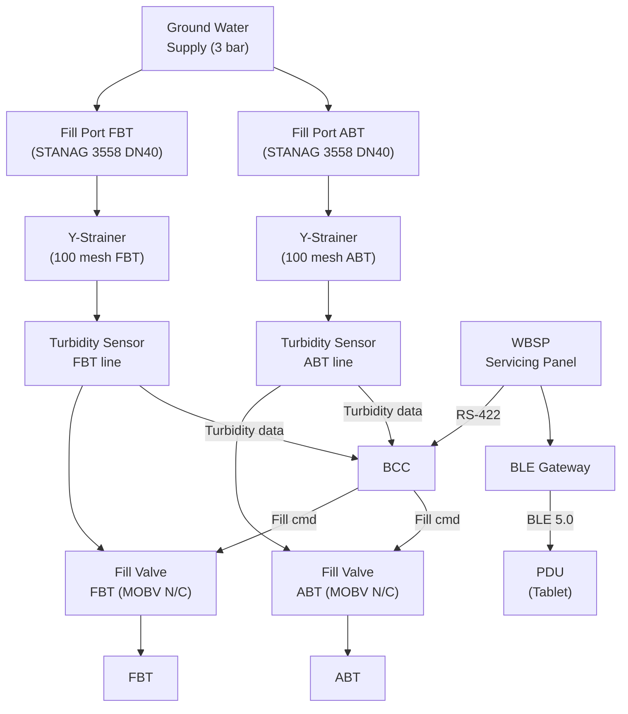
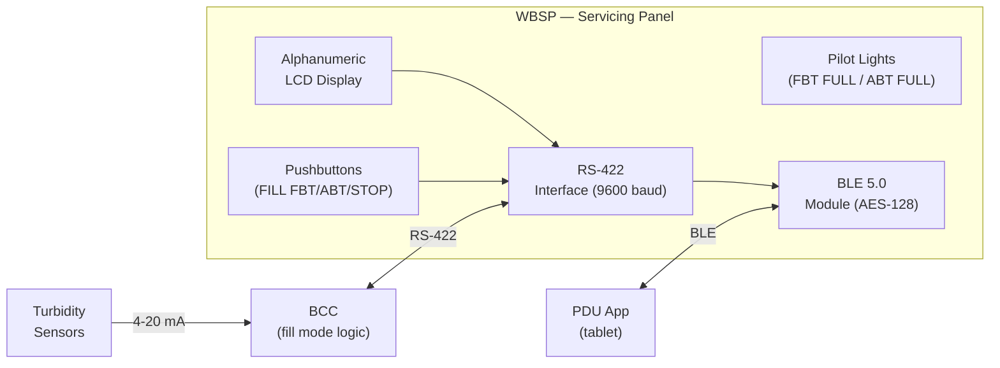
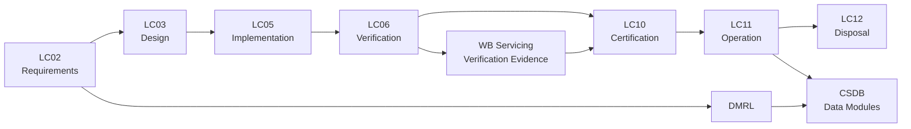

# ATLAS 040-049 · Section 04 · Subsection 041 · 070 — Ballast Servicing and Ground Interfaces

## 0. Hyperlink Policy

All internal cross-references use relative Markdown links resolved within the Q+ATLANTIDE CSDB repository. External regulatory citations are listed in §19 and §20 with identifiers marked . Parent context: [ATLAS 041 Water Ballast General](./041-000-Water-Ballast-General.md).

---

## 1. Purpose

This document defines the ground servicing architecture for the Water Ballast system on the programme-defined aircraft type, covering fill-port design, dry-break coupling specifications, Standard Ground Handling Agreement (SGHA) interfaces per AHM 810, water quality specifications, servicing panel layout, servicing data uplink, and contamination detection provisions.

Efficient and safe ground servicing of the WB system is essential for turnaround time compliance. The design target is a full fill of both tanks (800 L) in ≤ 10 minutes using a standard airport water supply at 3 bar. The fill system uses self-sealing dry-break couplings to prevent spillage, with colour coding and captive dust caps to prevent mis-coupling with other aircraft systems.

Water quality requirements are defined to prevent contamination of the ballast system with materials that could damage HDPE tanks, block sensors, or create biological hazards for maintenance personnel. The servicing data uplink allows the ground crew to confirm fill quantity and tank status from a portable display unit (PDU) via a Bluetooth-authenticated connection to the BCC, eliminating manual dipstick verification.

---

## 2. Applicability

| Attribute | Value |
|-----------|-------|
| Aircraft Model | programme-defined aircraft type (all production variants) |
| ATA Reference | ATA 41-70 — Ballast Servicing |
| Standards | AHM 810, NSF/ANSI 61, DO-160G §8, STANAG 3558 |
| Dev Assurance | DAL D (servicing hardware); DAL C (data uplink) |
| Applicability Code | [PROGRAMME-AIRCRAFT]-[PROGRAMME-VARIANT]-ALL |
| Max Fill Rate | 80 L/min at 3 bar supply |

---

## 3. System / Function Overview

The servicing fill system consists of two fill ports (one per tank) located in the forward and aft fuselage sidewall servicing panels (FWSP and AWSP respectively), accessible from the aircraft apron. Each fill port uses a NATO-STANAG 3558 dry-break coupling (DN40, rated 5 bar) with a colour-coded blue cap (blue = water ballast, per airline SOP). An integral flow control valve limits fill rate to 80 L/min to prevent tank over-pressurisation.

A Water Ballast Servicing Panel (WBSP) is mounted adjacent to the forward servicing port, displaying: FBT level (%), ABT level (%), total ballast mass (kg), and SYSTEM STATUS (READY / FAULT). The WBSP connects to the BCC via RS-422; display updates at 2 Hz. A FILL START / FILL STOP pushbutton sequence on the WBSP activates the fill valves under BCC control, enabling automatic shut-off when tanks reach the programmed fill level.

Contamination detection uses a turbidity sensor on the fill line inlet (optical, 0–100 NTU range). Fill is automatically inhibited if turbidity > 5 NTU (indicates sediment or biological contamination) and a CONTAMINATED WATER alert is displayed on the WBSP and EICAS. A water sample port downstream of the fill valve allows ground crew to take a sample for laboratory analysis.

---

## 4. Scope

### 4.1 Included
- Fill port assemblies (FWSP and AWSP, DN40 dry-break couplings)
- Fill line run from ports to fill valves and tank inlet bosses
- Overfill protection (automatic shut-off at 95% tank level)
- Water Ballast Servicing Panel (WBSP) and operator interface
- Water quality specification and contamination detection
- Servicing data uplink (BCC ↔ PDU via RS-422 / Bluetooth gateway)
- Biocide dosing provisions (fill line injection port)
- SGHA AHM 810 interface documentation

### 4.2 Excluded
- Fill valves at tank inlet bosses (see 041-020)
- Level sensors providing fill level feedback (see 041-040)
- Ground drain and dump (see 041-060)
- BCC control logic for fill mode (see 041-050)

---

## 5. Architecture Description

**Fill Ports.** Two STANAG 3558 dry-break coupling receptacles, one at FS 260 (FWSP, forward fuselage port-side) and one at FS 1 500 (AWSP, aft fuselage port-side). Each receptacle is enclosed in a spring-loaded flap flush-fitting with aircraft skin; flap is automatically closed by the fill valve closure signal. Coupling rated for 200 000 mating cycles.

**Fill Line Run.** From each fill port, a DN40 SS316L tube runs through the fuselage to the respective tank fill boss (per 041-020 fill-line routing). Each fill line includes: a Y-strainer (100 mesh) to remove particulate from supply water, a turbidity sensor, and a fill valve (normally closed MOBV). Maximum fill line length is 3.5 m (FBT line) and 2.8 m (ABT line); pressure drop at 80 L/min is < 0.2 bar.

**WBSP Interface.** The WBSP is a weatherproof IP65 panel (200 × 150 mm), mounted at 1.5 m height on the FWSP door surround. It includes an alphanumeric LCD, two pilot lights (FBT FULL, ABT FULL), and three pushbuttons (FILL FBT, FILL ABT, STOP). The WBSP is powered from the aircraft 28 VDC ground service bus; it communicates with the BCC via RS-422 at 9 600 baud.

**Data Uplink.** A Bluetooth 5.0 gateway (BLE, AES-128 encrypted, authenticated pairing) is integrated in the WBSP enclosure. An airline-issued PDU (tablet with ballast servicing app) pairs with the WBSP on the secure channel and displays real-time tank levels, fill progress, and system faults. The PDU app also allows the ground crew to enter the planned fill quantity, which is stored in the BCC servicing log.

---

## 6. Functional Breakdown

| Function ID | Function Name | Description | Allocated To | DAL |
|-------------|---------------|-------------|-------------|-----|
| F-070-01 | Fill Coupling Interface | Accept ground water supply via dry-break coupling | Fill port + coupling | D |
| F-070-02 | Fill Flow Control | Control fill rate; automatic shut-off at 95% tank level | Fill valves + BCC | C |
| F-070-03 | Contamination Detection | Inhibit fill on turbidity > 5 NTU; alert crew/ground | Turbidity sensor + WBSP | D |
| F-070-04 | Servicing Panel Display | Display real-time tank status to ground crew | WBSP + RS-422 | D |
| F-070-05 | Data Uplink | Transmit fill data to PDU; log servicing event in BCC | BLE gateway + BCC | D |

---

## 7. Mermaid — System Context Diagram

---

## 8. Mermaid — Internal Functional Architecture

---

## 9. Mermaid — Lifecycle Traceability

---

## 10. Interfaces

| Interface ID | From | To | Protocol / Standard | Direction | Notes |
|-------------|------|----|---------------------|-----------|-------|
| IF-070-01 | Ground supply hose | Fill port coupler | STANAG 3558 DN40 dry-break | External → Aircraft | Max 3 bar supply |
| IF-070-02 | Turbidity sensor | BCC | 4–20 mA analogue | Sensor → BCC | 0–100 NTU range |
| IF-070-03 | WBSP | BCC | RS-422 9 600 baud | WBSP → BCC | Fill commands + status |
| IF-070-04 | BCC | Fill valves | 28 VDC discrete | BCC → Valves | Open/close command |
| IF-070-05 | BLE gateway | PDU tablet | Bluetooth 5.0 AES-128 | WBSP → PDU | Authenticated pairing |
| IF-070-06 | Ground service bus | WBSP | 28 VDC | Bus → WBSP | Powered on ground only |

---

## 11. Operating Modes

| Mode | Description | Trigger | System Response |
|------|-------------|---------|-----------------|
| Ready for Servicing | Aircraft on ground, ground bus powered, BCC in fill mode | Ground arrival, BCC mode switch | WBSP illuminates READY; fill valves armed |
| Filling Active | Water flowing into selected tank | FILL pushbutton pressed on WBSP | Fill valve open; WBSP shows fill progress; auto-stop at 95% |
| Contamination Inhibit | Fill halted due to turbidity > 5 NTU | Turbidity sensor > 5 NTU | Fill valve closed; CONTAMINATED WATER on WBSP and EICAS |
| Servicing Complete | Both tanks at target fill level | Auto shut-off or STOP pressed | Fill valves closed; BCC logs servicing event; FULL pilot lights |

---

## 12. Monitoring and Diagnostics

- Turbidity sensor self-test at power-up: sensor injects known optical reference; out-of-range reading triggers sensor fault on WBSP.
- Fill flow rate monitored by BCC via tank level change rate; if rate drops to < 10 L/min with fill valve open, blockage alert displayed on WBSP.
- Overfill protection: BCC closes fill valve when CLS or ULS reports > 95% tank level; hardware backup: float-type mechanical overfill shutoff valve in tank fill boss.
- BLE pairing log stored in WBSP NVM; unauthorised pairing attempts logged and reported via CMC on next power cycle.
- Y-strainer differential pressure monitored (same sensor as fill line DP); ΔP > 0.1 bar triggers strainer-cleaning alert on WBSP.
- All servicing events (date, time, quantity filled, water quality) logged to BCC NVM and uploaded to ACMS on next flight power-up.

---

## 13. Maintenance Concept

| Task | Interval | Access | Tooling |
|------|----------|--------|---------|
| Fill coupling cleaning and cap check | Pre-servicing | External servicing panel | Visual + approved cleaning cloth |
| Turbidity sensor functional test | A-check | Servicing panel area | Calibrated turbidity standard solution |
| Y-strainer cleaning | 200 servicing cycles | Servicing panel area | Spanner set |
| WBSP display and pushbutton test | C-check | Servicing panel | BCC test mode + visual |
| BLE pairing audit | Annual | AMT log download | AMT laptop |

---

## 14. S1000D / CSDB Mapping

| Document Type | Data Module Code (DMC) | Info Code | Title |
|---------------|----------------------|-----------|-------|
| System Description | DMC-<PROGRAMME>-<VARIANT>-041-070-00A-040A-A | 040 | Ballast Servicing and Ground Interfaces Description |
| Maintenance Procedures | DMC-<PROGRAMME>-<VARIANT>-041-070-00A-300A-A | 300 | Ballast Servicing Fault Isolation |
| BITE/Test | DMC-<PROGRAMME>-<VARIANT>-041-070-00A-400A-A | 400 | Ballast Servicing BITE Procedures |
| Wiring Data | DMC-<PROGRAMME>-<VARIANT>-041-070-00A-520A-A | 520 | Ballast Servicing Wiring and Connector Data |
| IPD | DMC-<PROGRAMME>-<VARIANT>-041-070-00A-941A-A | 941 | Ballast Servicing Illustrated Parts |
| Software Desc | DMC-<PROGRAMME>-<VARIANT>-041-070-00A-720A-A | 720 | Ballast Servicing SW Description |

### Recommended Data Module Set

| Info Code | Publication | Applicability |
|-----------|-------------|---------------|
| 040 | AMM — System Description | All variants |
| 300 | FIM — Fault Isolation | All variants |
| 400 | TSM — BITE Procedures | All variants |
| 520 | AMM — Wiring Data | All variants |
| 720 | SRM — Software Description | All variants |
| 941 | IPD — Parts Data | All variants |

---

## 15. Footprints

### 15.1 Physical

| Item | Dimension (mm) | Mass (kg) | Location |
|------|---------------|-----------|----------|
| Fill port assemblies (×2) | 120 × 120 flush | 0.6 each | FS 260 and FS 1 500 sidewall panels |
| WBSP panel | 200 × 150 × 80 | 0.8 | FWSP door surround, 1.5 m height |
| Y-strainers + turbidity sensors | 200 × 80 × 80 | 0.5 each | Fill line run behind panels |

### 15.2 Electrical / Data

| Interface | Standard | Bandwidth / Power |
|-----------|----------|-------------------|
| WBSP RS-422 | TIA/EIA-422 | 9 600 baud / < 5 W |
| BLE 5.0 gateway | Bluetooth 5.0 | < 0.1 W |
| Turbidity sensor | 4–20 mA | < 0.5 W |

### 15.3 Maintenance

| Task | Man-Hours | Skill Level | Access |
|------|-----------|-------------|--------|
| Coupling cleaning + cap | 0.25 | Ramp agent | External panel |
| Turbidity sensor test | 0.5 | Cat B1 | Servicing panel |
| WBSP functional test | 1.0 | Cat B1/B2 | Servicing panel + AMT |

### 15.4 Data

| Data Item | Volume | Storage | Retention |
|-----------|--------|---------|-----------|
| Servicing event logs | 2 KB/event | BCC NVM + ACMS | 5 years |
| Water quality records | 4 KB/event | BCC NVM | 2 years |
| BLE pairing audit logs | 1 KB/event | WBSP NVM | 1 year |

---

## 16. Safety and Certification Considerations

- NSF/ANSI 61 compliance of all wetted fill-line components ensures no harmful leaching into water supply; important as maintenance personnel may contact fill water.
- STANAG 3558 dry-break coupling prevents spillage on disconnect; dry-break rating 0 mL per disconnect per NATO AEP-76.
- Contamination inhibit logic (turbidity > 5 NTU) protects sensors and tanks from sediment that could block ULS transducer or CLS probe.
- BLE security (AES-128, authenticated pairing) prevents unauthorised fill commands from rogue devices; meets ARINC 827 guidance for wireless avionics interfaces.
- Overfill mechanical shutoff valve provides hardware backup independent of BCC; rated for 5 bar; meets CS-25 §25.985 equivalent over-pressure protection.
- SGHA AHM 810 interface document defines airline-airport service agreement provisions; water quality specification referenced in airline ground handling manual.

---

## 17. Verification and Validation

| V&V ID | Requirement | Method | Success Criteria | Status |
|--------|-------------|--------|-----------------|--------|
| VV-070-01 | Fill rate ≥ 80 L/min at 3 bar supply | Ground flow test | Measured ≥ 80 L/min |  |
| VV-070-02 | Auto shut-off at 95% tank level | Functional test | Fill valve closes within 5 s of 95% signal |  |
| VV-070-03 | Turbidity inhibit at > 5 NTU | Sensor test with known turbidity standard | Fill halted; alert displayed on WBSP |  |
| VV-070-04 | STANAG dry-break: zero spillage on disconnect | Coupling test | 0 mL per disconnect at 3 bar |  |
| VV-070-05 | BLE pairing requires authenticated credentials | Security test | Unauthenticated devices cannot pair |  |
| VV-070-06 | Full fill of both tanks in ≤ 10 min | Ground test | Elapsed time ≤ 10 min for 800 L |  |
| VV-070-07 | Servicing event logged to ACMS on next power-up | Functional test | Log entry present in ACMS after fill + flight |  |

---

## 18. Glossary

| Term/Acronym | Definition | Link |
|-------------|-----------|------|
| AHM 810 | IATA Airport Handling Manual 810 — Standard Ground Handling Agreement | [§1](#1-purpose) |
| BLE | Bluetooth Low Energy (version 5.0); used for WBSP-to-PDU data uplink | [§3](#3-system--function-overview) |
| Dry-Break | Self-sealing coupling that prevents fluid spillage when disconnected | [§3](#3-system--function-overview) |
| PDU | Portable Display Unit (ground crew tablet); displays WB servicing data | [§3](#3-system--function-overview) |
| SGHA | Standard Ground Handling Agreement; defines responsibilities between airline and handler | [§1](#1-purpose) |
| STANAG 3558 | NATO Standardisation Agreement 3558 for dry-break coupling standard | [§3](#3-system--function-overview) |
| Turbidity | Optical clarity measure of water (NTU); > 5 NTU indicates contamination | [§3](#3-system--function-overview) |
| WBSP | Water Ballast Servicing Panel; ground crew interface at forward servicing panel | [§3](#3-system--function-overview) |
| NTU | Nephelometric Turbidity Unit; standard measure of water turbidity | [§3](#3-system--function-overview) |
| Overfill Shutoff | Mechanical float-type valve in tank fill boss; closes at 100% fill as hardware backup | [§5](#5-architecture-description) |

---

## 19. Citations

| Ref | Citation | Use | Link |
|-----|---------|-----|------|
| NSF/ANSI 61 | NSF/ANSI Standard 61 — Drinking Water System Components | Wetted materials safety |  |
| STANAG 3558 | NATO STANAG 3558 — Dry-Break Coupling | Fill port coupling standard |  |
| AHM 810 | IATA AHM 810 — Standard Ground Handling Agreement | Ground service interface |  |
| ARINC 827 | ARINC 827 — Wireless Avionics Intra-Communications (WAIC) | BLE security guidance |  |
| S1000D | S1000D Issue 5.0 | CSDB mapping |  |
| ATA-iSpec-2200 | ATA iSpec 2200 | AMM/FIM structure |  |
| EASA-TC | EASA Type Certificate Data Sheet [PROGRAMME-AIRCRAFT] | Certification basis |  |

---

## 20. References

| Ref | Document | Identifier | Revision | Status | Link |
|-----|---------|-----------|---------|--------|------|
| R-001 | WB General (041-000) | QATL-ATLAS-041-000 | Rev 1.0 | Active | [041-000](./041-000-Water-Ballast-General.md) |
| R-002 | WB Distribution (041-020) | QATL-ATLAS-041-020 | Rev 1.0 | Active | [041-020](./041-020-Water-Ballast-Distribution-and-Transfer.md) |
| R-003 | [PROGRAMME-AIRCRAFT] Ground Servicing Manual | [PROGRAMME-AIRCRAFT]-GSM-041 | Rev A | Active |  |

---

## 21. Open Issues

| ID | Issue | Owner | Status | Link |
|----|-------|-------|--------|------|
| OI-070-01 | STANAG 3558 coupling colour-code (blue) to be confirmed as non-conflicting with airport water supply hose standards | Q-MECHANICS | Open |  |
| OI-070-02 | PDU app specification and airline customisation policy to be agreed with launch customer | Q-DATAGOV | Open |  |
| OI-070-03 | Biocide injection port design pending approval from EASA re: NSF/ANSI 61 compliance impact | Q-GREENTECH | Open |  |

---

## 22. Change Log

| Version | Date | Author | Change | Link |
|---------|------|--------|--------|------|
| 1.0.0 | 2026-05-09 | Q+ Team/Amedeo Pelliccia + AI | Initial creation with full 22-section template |  |
