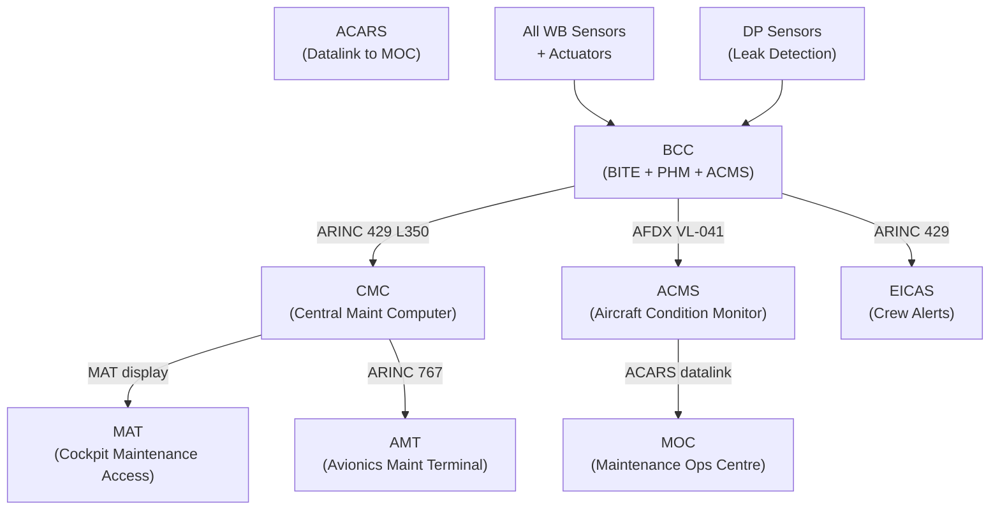
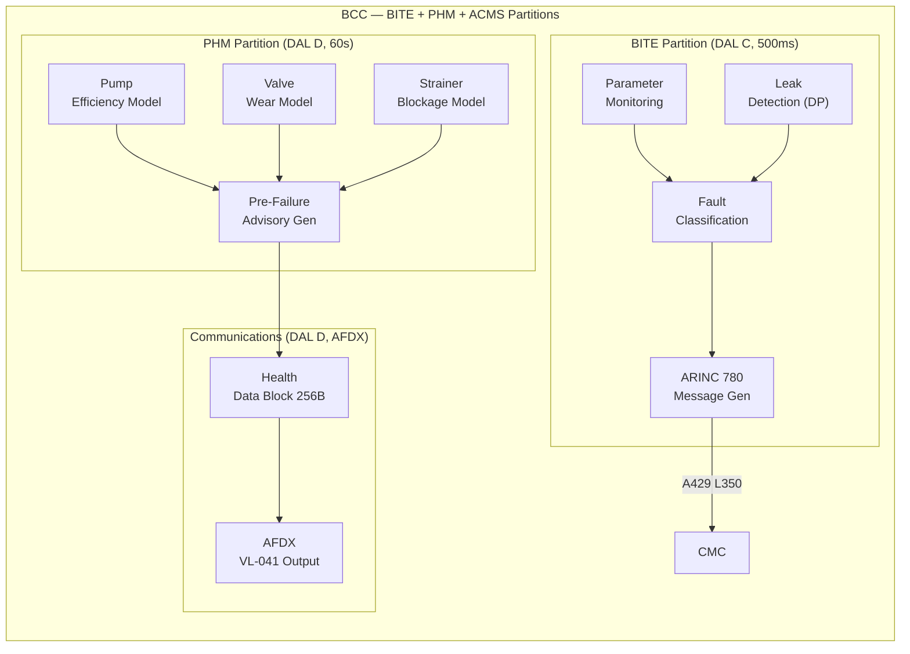
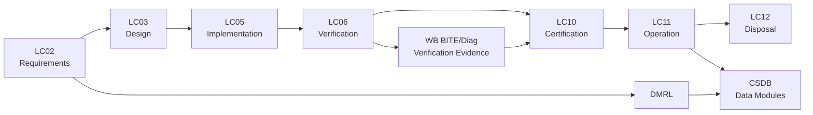

# ATLAS 040-049 · Section 04 · Subsection 041 · 080 — Water Ballast Monitoring, Diagnostics and Control Interfaces

## 0. Hyperlink Policy

All internal cross-references use relative Markdown links resolved within the Q+ATLANTIDE CSDB repository. External regulatory citations are listed in §19 and §20 with identifiers marked . Parent context: [ATLAS 041 Water Ballast General](./041-000-Water-Ballast-General.md).

---

## 1. Purpose

This document defines the Built-In Test Equipment (BITE) architecture, Central Maintenance Computer (CMC) integration, Aircraft Condition Monitoring System (ACMS) interfaces, leak detection architecture, Prognostic Health Management (PHM) capabilities, Avionics Maintenance Terminal (AMT) interface, and maintenance message coding for the Water Ballast system on the AMPEL360E eWTW.

The WB BITE architecture is designed to achieve a fault detection coverage of ≥ 99% of the defined fault list, with a fault isolation rate (to LRU level) of ≥ 95%. These rates, together with a false alarm rate < 1%, are required to support a 12-month on-wing target for all WB LRUs. BITE faults are transmitted to the CMC via ARINC 429 in real time and to the AMT via ARINC 767 on ground.

The PHM module within the BCC uses sensor trend data (pump current, valve travel time, DP sensor readings) to predict impending failure of wear items (pump impellers, MOBV actuators, Y-strainers) and generate pre-failure advisory messages to the maintenance planning system, enabling condition-based maintenance that reduces unscheduled removals.

---

## 2. Applicability

| Attribute | Value |
|-----------|-------|
| Aircraft Model | AMPEL360E eWTW (all production variants) |
| ATA Reference | ATA 41-80 — WB Monitoring and Diagnostics |
| Standards | ARINC 767, ARINC 780, DO-178C DAL C (BITE SW), ARINC 429 |
| Dev Assurance | DAL C (BITE software); DAL D (PHM software) |
| Applicability Code | AMPEL360E-EWTW-ALL |
| BITE Fault Coverage | ≥ 99% detection; ≥ 95% LRU-level isolation; < 1% false alarms |

---

## 3. System / Function Overview

The WB BITE is hosted as a software partition (DAL C) within the BCC, running a 500 ms diagnostic cycle covering all sensors, actuators, communications links, and software partitions. Each monitored parameter is compared to a defined validity envelope; out-of-envelope readings are classified as warnings (advisory) or faults (maintenance action required) per the WB Fault Taxonomy (AMPEL360E-FT-041).

CMC integration uses a dedicated ARINC 429 high-speed channel from the BCC to the CMC. Fault messages follow the ARINC 780 format with ATA MSG coding under ATA Chapter 41. Each message includes: fault code, timestamp, fault class (warning/fault), LRU identifier, and recommended maintenance action (RMA) code. The CMC stores up to 500 messages in its short-term fault history, accessible via the cockpit Maintenance Access Terminal (MAT) or the AMT.

The ACMS receives periodic health reports from the BCC via AFDX (once per flight phase) containing: transfer statistics (total volume transferred, number of transfer cycles), sensor accuracy trends, pump efficiency index, and valve cycle counts. ACMS data are downlinked via ACARS to the airline maintenance operations centre (MOC) after each flight.

---

## 4. Scope

### 4.1 Included
- WB BITE architecture (detection, isolation, ARINC 780 fault messages)
- CMC ARINC 429 interface (fault messages, LRU identification)
- ACMS AFDX interface (health reports, transfer statistics)
- Leak detection architecture (DP-based, continuous monitoring)
- PHM module (pump efficiency, valve wear, strainer blockage prediction)
- AMT ARINC 767 interface (ground maintenance access)
- Maintenance message ATA coding (ATA 41 chapter scope)
- FCOM/QRH crew alert messages (EICAS advisory/caution/warning)

### 4.2 Excluded
- BITE for sensors (see 041-040) and pumps/valves (see 041-030)
- Control law monitoring (see 041-050)
- Ground servicing panel diagnostics (see 041-070)
- S1000D CSDB module coding (see 041-090)

---

## 5. Architecture Description

**BITE Partition.** The BITE partition (DAL C, 500 ms period) monitors: BCC processor health (dual watchdog), ARINC 653 partition health, AFDX VL-041 frame rate and integrity, ARINC 429 channel activity, all discrete I/O states vs commanded states, level sensor validity (rate-of-change plausibility), flow meter calibration status, and PTC heater continuity. A 10-level fault priority scheme maps each fault to an EICAS message level (advisory, caution, or warning) per AMPEL360E Alert Philosophy Document.

**CMC Interface.** BCC transmits on ARINC 429 Label 350 (octal) for WB fault messages. Message rate: on-detection (event-driven) plus a 60-second keep-alive heartbeat. CMC de-duplicates repeated faults and presents the first-occurrence and last-occurrence timestamps. CMC also polls the BCC NVM for extended fault history on ground via AMT trigger.

**ACMS Interface.** BCC packages a WB health data block (256 bytes) on AFDX VL-041, transmitted at top-of-climb, top-of-descent, and on-ground power-up. The block includes: pump efficiency index (0–100%, decreasing with impeller wear), MOBV cycle counts (life limit 50 000 cycles), Kalman filter residual statistics, and water quality turbidity trend. ACMS downlinks via ACARS to MOC.

**PHM Module.** The PHM algorithm uses a physics-based degradation model for the centrifugal pump: pump efficiency η = Q·ΔP / (ρ·g·P_shaft). Decreasing η trend over 200 operating cycles predicts impeller wear; advisory generated at η < 80% nominal. A valve wear model tracks MOBV mean travel time increase as a proxy for actuator spring fatigue; advisory at +20% baseline travel time.

---

## 6. Functional Breakdown

| Function ID | Function Name | Description | Allocated To | DAL |
|-------------|---------------|-------------|-------------|-----|
| F-080-01 | BITE Monitoring | Continuously monitor all WB parameters at 500 ms cycle | BITE partition (BCC) | C |
| F-080-02 | CMC Fault Reporting | Transmit ARINC 780 fault messages to CMC on detection | BITE partition (BCC) | C |
| F-080-03 | ACMS Health Reporting | Transmit periodic health data block to ACMS via AFDX | Communications partition | D |
| F-080-04 | Leak Detection | Detect fluid line leakage from DP sensor trends | BITE partition (BCC) | C |
| F-080-05 | PHM Prediction | Predict impending LRU failure; generate pre-failure advisories | PHM partition (BCC) | D |

---

## 7. Mermaid — System Context Diagram

---

## 8. Mermaid — Internal Functional Architecture

---

## 9. Mermaid — Lifecycle Traceability

---

## 10. Interfaces

| Interface ID | From | To | Protocol / Standard | Direction | Notes |
|-------------|------|----|---------------------|-----------|-------|
| IF-080-01 | BCC BITE | CMC | ARINC 429 HS Label 350 | BCC → CMC | Fault messages event-driven + 60 s keep-alive |
| IF-080-02 | BCC ACMS | ACMS | AFDX VL-041 | BCC → ACMS | 256-byte health block at flight phase events |
| IF-080-03 | CMC | AMT | ARINC 767 | CMC → AMT | Ground maintenance access |
| IF-080-04 | CMC | MAT | RS-232 / AFDX | CMC → MAT | Cockpit maintenance display |
| IF-080-05 | ACMS | ACARS | Proprietary / ARINC 724B | ACMS → ACARS | MOC downlink |
| IF-080-06 | BCC BITE | EICAS | AFDX VL-041 | BCC → EICAS | Advisory/caution/warning messages |

---

## 11. Operating Modes

| Mode | Description | Trigger | System Response |
|------|-------------|---------|-----------------|
| In-Flight Monitoring | Continuous BITE at 500 ms cycle; PHM at 60 s | Aircraft in flight | All parameters monitored; faults sent to CMC/EICAS |
| Ground BITE | Comprehensive test including actuator exercise | Ground power, AMT trigger | Full LRU exercise test; results to AMT |
| Post-Fault Isolation | Targeted diagnostic after fault detected | BITE fault detection | CMC presents RMA; AMT shows detailed fault trace |
| PHM Trend Analysis | PHM degradation model update | Each flight phase completion | Efficiency index and wear trends updated; advisory if threshold crossed |

---

## 12. Monitoring and Diagnostics

- BITE fault detection coverage verified by fault injection test (FIT) covering all 87 defined faults in the WB Fault Taxonomy; coverage ≥ 99% required.
- False alarm rate monitored in service; target < 1 false alarm per 1 000 flight hours across fleet; reviewed at 12-month in-service evaluation.
- DP leak detection algorithm uses a 30-second rolling average to filter pump-induced pressure fluctuations; sensitivity threshold 0.05 bar above rolling average.
- AMT ground test initiates a 15-minute automated BITE sequence: valve cycle test, pump flow test, sensor cross-check, PTC continuity test, and communications loopback.
- CMC fault history retained for 90 days; downloadable via AMT as XML report for entry into airline MIS.
- All ACMS health data blocks time-stamped with GPS-synchronised aircraft time from ADIRU.

---

## 13. Maintenance Concept

| Task | Interval | Access | Tooling |
|------|----------|--------|---------|
| CMC fault history download | A-check (on-condition) | MAT in cockpit | MAT keyboard |
| AMT full BITE sequence | C-check | Forward EE bay AMT port | AMT laptop + ARINC 767 cable |
| PHM trend report review | Monthly (fleet level) | MOC ACARS reports | MOC MIS system |
| Fault injection test (BITE coverage audit) | 8 000 FH | Ground with test equipment | Fault injection rig (AMPEL360E-FIR-041) |

---

## 14. S1000D / CSDB Mapping

| Document Type | Data Module Code (DMC) | Info Code | Title |
|---------------|----------------------|-----------|-------|
| System Description | DMC-AMPEL360E-EWTW-041-080-00A-040A-A | 040 | WB Monitoring and Diagnostics Description |
| Maintenance Procedures | DMC-AMPEL360E-EWTW-041-080-00A-300A-A | 300 | WB BITE Fault Isolation |
| BITE/Test | DMC-AMPEL360E-EWTW-041-080-00A-400A-A | 400 | WB BITE Test Procedures |
| Wiring Data | DMC-AMPEL360E-EWTW-041-080-00A-520A-A | 520 | WB BITE Wiring and Connector Data |
| IPD | DMC-AMPEL360E-EWTW-041-080-00A-941A-A | 941 | WB BITE Illustrated Parts |
| Software Desc | DMC-AMPEL360E-EWTW-041-080-00A-720A-A | 720 | WB BITE and PHM Software Description |

### Recommended Data Module Set

| Info Code | Publication | Applicability |
|-----------|-------------|---------------|
| 040 | AMM — System Description | All variants |
| 300 | FIM — Fault Isolation | All variants |
| 400 | TSM — BITE Procedures | All variants |
| 520 | AMM — Wiring Data | All variants |
| 720 | SRM — Software Description | All variants |
| 941 | IPD — Parts Data | All variants |

---

## 15. Footprints

### 15.1 Physical

| Item | Dimension (mm) | Mass (kg) | Location |
|------|---------------|-----------|----------|
| BCC (includes BITE/PHM partitions) | 155 × 194 × 320 | 3.8 (shared with 041-050) | Fwd avionics bay |
| AMT port (J1) | D-sub 25-pin panel mount | 0.1 | Fwd EE bay access panel |
| DP sensors for leak detection (×6) | 60 × 40 × 30 each | 0.1 each | Keel bay at each line segment |

### 15.2 Electrical / Data

| Interface | Standard | Bandwidth / Power |
|-----------|----------|-------------------|
| ARINC 429 to CMC | ARINC 429 HS | 100 kbit/s / < 0.5 W |
| AFDX to ACMS | ARINC 664 Part 7 | 100 Mbit/s / < 2 W (shared) |
| ARINC 767 to AMT | ARINC 767 | 1 Mbit/s / < 1 W |

### 15.3 Maintenance

| Task | Man-Hours | Skill Level | Access |
|------|-----------|-------------|--------|
| A-check CMC fault download | 0.25 | AV tech (Cat B2) | MAT |
| C-check AMT full BITE | 2.5 | AV tech (Cat B2) | EE bay AMT port |
| 8 000 FH fault injection test | 8.0 | AV tech (Cat B2) + test equip | Ground support |

### 15.4 Data

| Data Item | Volume | Storage | Retention |
|-----------|--------|---------|-----------|
| CMC fault history | 50 MB | CMC NVM | 90 days |
| ACMS health data blocks | 256 B per block × 3 per flight | ACMS / ACARS | 12 months on aircraft |
| PHM trend database | 10 MB | BCC NVM | 5 000 FH rolling |

---

## 16. Safety and Certification Considerations

- DO-178C DAL C for BITE software; statement of compliance to all DAL C objectives required for EASA STC.
- ARINC 780 fault message format ensures CMC compatibility with airline standard maintenance systems; deviation from format requires airline MIS adaptation.
- PHM advisories are non-mandatory (informational only); no airworthiness decision is automated based on PHM output; human maintainer remains in the loop.
- False alarm rate < 1 per 1 000 FH required per AMPEL360E system-level BITE specification; false alarms affecting crew (EICAS) subject to additional review.
- Leak detection DP threshold (0.05 bar) validated by fluid dynamics analysis; set to minimise false alarms from pump pulsation while detecting leaks of ≥ 5 L/min.
- ACARS downlink data classified as maintenance (non-safety) data; encrypted per ARINC 724B but not subject to DO-178C software assurance.

---

## 17. Verification and Validation

| V&V ID | Requirement | Method | Success Criteria | Status |
|--------|-------------|--------|-----------------|--------|
| VV-080-01 | BITE fault detection coverage ≥ 99% | Fault injection test (87 faults) | ≥ 87 of 87 faults detected (99% = 87/87) |  |
| VV-080-02 | LRU isolation rate ≥ 95% | Fault injection test | ≥ 95% of detected faults isolated to single LRU |  |
| VV-080-03 | False alarm rate < 1 per 1 000 FH | In-service monitoring (EIS) | Fleet average < 1 FA per 1 000 FH at 12 months |  |
| VV-080-04 | CMC message format per ARINC 780 | Format compliance check | All fields conform to ARINC 780 specification |  |
| VV-080-05 | Leak detection threshold sensitivity | Lab test (controlled leak 5 L/min) | DP alert triggers within 30 s at 5 L/min |  |
| VV-080-06 | PHM pump efficiency prediction accuracy | Bench test (accelerated wear) | Efficiency trend tracks measured η within ±5% |  |
| VV-080-07 | DO-178C DAL C objectives met | Software audit | All Table A-5 objectives satisfied |  |

---

## 18. Glossary

| Term/Acronym | Definition | Link |
|-------------|-----------|------|
| ACMS | Aircraft Condition Monitoring System; records and downlinks aircraft health data | [§3](#3-system--function-overview) |
| AMT | Avionics Maintenance Terminal; ground laptop interface per ARINC 767 | [§3](#3-system--function-overview) |
| ARINC 767 | ARINC 767 — Electronic Documentation Standard for avionics maintenance data | [§2](#2-applicability) |
| ARINC 780 | ARINC 780 — On-Board Maintenance System message format standard | [§3](#3-system--function-overview) |
| BITE | Built-In Test Equipment; onboard diagnostic software | [§1](#1-purpose) |
| CMC | Central Maintenance Computer; aircraft-level fault collection and correlation | [§3](#3-system--function-overview) |
| FIT | Fault Injection Test; verification method for BITE coverage measurement | [§12](#12-monitoring-and-diagnostics) |
| MAT | Maintenance Access Terminal; cockpit display for CMC fault access | [§3](#3-system--function-overview) |
| MOC | Maintenance Operations Centre; airline ground-based maintenance monitoring hub | [§3](#3-system--function-overview) |
| PHM | Prognostic Health Management; predictive maintenance using sensor trend analytics | [§3](#3-system--function-overview) |
| RMA | Recommended Maintenance Action; CMC-provided guidance for corrective action | [§3](#3-system--function-overview) |

---

## 19. Citations

| Ref | Citation | Use | Link |
|-----|---------|-----|------|
| ARINC 767 | ARINC 767 — Electronic Documentation Standard | AMT interface protocol |  |
| ARINC 780 | ARINC 780 — On-Board Maintenance System | CMC fault message format |  |
| DO-178C | RTCA DO-178C | DAL C BITE software development |  |
| ARINC 724B | ARINC 724B — Aircraft Communications Addressing and Reporting System | ACARS downlink |  |
| S1000D | S1000D Issue 5.0 | CSDB mapping |  |
| ATA-iSpec-2200 | ATA iSpec 2200 | AMM/FIM structure |  |
| EASA-TC | EASA Type Certificate Data Sheet AMPEL360E | Certification basis |  |

---

## 20. References

| Ref | Document | Identifier | Revision | Status | Link |
|-----|---------|-----------|---------|--------|------|
| R-001 | WB General (041-000) | QATL-ATLAS-041-000 | Rev 1.0 | Active | [041-000](./041-000-Water-Ballast-General.md) |
| R-002 | WB Control (041-050) | QATL-ATLAS-041-050 | Rev 1.0 | Active | [041-050](./041-050-Ballast-Control-and-Automatic-Trim-Interfaces.md) |
| R-003 | WB Fault Taxonomy | AMPEL360E-FT-041 | Rev A | Active |  |

---

## 21. Open Issues

| ID | Issue | Owner | Status | Link |
|----|-------|-------|--------|------|
| OI-080-01 | WB Fault Taxonomy (87 faults) to be finalised; draft under review by Q-AIR and Q-MECHANICS | Q-DATAGOV | Open |  |
| OI-080-02 | PHM life-limit for MOBV (50 000 cycles) to be validated by accelerated life test | Q-MECHANICS | Open |  |
| OI-080-03 | ACMS health data block format to be agreed with ACMS supplier | Q-DATAGOV | Open |  |

---

## 22. Change Log

| Version | Date | Author | Change | Link |
|---------|------|--------|--------|------|
| 1.0.0 | 2026-05-09 | Q+ Team/Amedeo Pelliccia + AI | Initial creation with full 22-section template |  |
