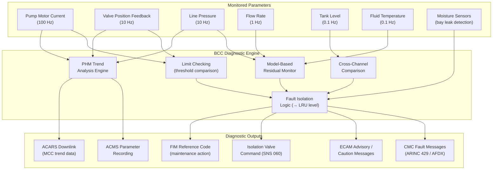

# ATLAS 040-049 · Section 04 · Subsection 041 · 080 — Water Ballast Monitoring, Diagnostics and Control Interfaces

## 1. Purpose

This document defines the Built-In Test Equipment (BITE) architecture, Central Maintenance Computer (CMC) integration, real-time parameter monitoring framework, fault detection and isolation logic, prognostic health management functions, and maintenance message generation requirements for the Water Ballast System (WBS) Monitoring, Diagnostics and Control Interfaces subsystem.

Effective monitoring and diagnostics are essential to maintaining WBS airworthiness between scheduled maintenance visits, supporting dispatch reliability, and enabling predictive maintenance to reduce unscheduled removal rates of WBS components. The monitoring function continuously observes pump motor current, valve actuator position feedback, distribution network pressures, flow rates, tank levels, and fluid temperatures, comparing measured values against expected model values derived from the current transfer command state. Deviations exceeding defined thresholds trigger fault isolation sequences that identify the failed component to line-replaceable unit (LRU) level within 95% of cases (isolation accuracy target), generating maintenance messages routed to the CMC and recorded in the Aircraft Condition Monitoring System (ACMS).

The prognostic health management (PHM) function extends beyond fault detection to trend analysis: by tracking pump motor current increase over time (an indicator of bearing degradation), valve cycle count accumulation, and filter differential pressure increase, the PHM module generates predictive maintenance alerts before failures occur, supporting the transition from time-based to condition-based maintenance (CBM) per ASD S3000L.

## 2. Scope

This document covers:

- BITE architecture: continuous BITE (power-on), initiated BITE (ground test), and maintenance BITE (laptop/tablet initiated via GMDP) for all WBS LRUs.
- CMC integration: ARINC 429 and AFDX data exchange with the CMC; message format per ATA iSpec 2200 Chapter 45 (Central Maintenance System); fault code structure.
- Monitored parameters and monitoring rates: pump motor current (100 Hz), valve position feedback (10 Hz), pipe pressure (10 Hz), flow rate (1 Hz), tank level (0.1 Hz), fluid temperature (0.1 Hz).
- Fault detection logic: parameter limit checking, model-based residual monitoring, cross-channel comparison for redundant sensors.
- Fault isolation logic: fault tree traversal to identify failed LRU; generation of Fault Isolation Manual (FIM) reference codes.
- Leak detection: moisture sensor network in WBS bays; leak detection threshold and automatic isolation valve triggering (interface to SNS 060).
- PHM functions: bearing degradation trending (pump), valve cycle counter, filter ΔP trending, tank liner inspection interval prediction.
- Maintenance messages: ECAM-type advisory messages, CMC fault history, and exportable diagnostic reports for off-aircraft analysis.

## 3. Glossary

| Term / Acronym | Definition |
|---|---|
| BITE | Built-In Test Equipment — hardware and software within each WBS LRU that continuously or on-demand tests the LRU's own functional health and reports results to the CMC and maintenance system. |
| CMC | Central Maintenance Computer — the aircraft-level avionics unit aggregating fault data from all aircraft systems; generates consolidated maintenance messages and fault history accessible to maintenance crews via the MCDU and laptop GMDP interface. |
| ACMS | Aircraft Condition Monitoring System — a data recording and transmission system capturing WBS parameter trends over flight time; data may be downlinked via ACARS for off-aircraft trend analysis by an airline MCC. |
| PHM | Prognostic Health Management — the application of sensor data analysis and degradation models to predict component remaining useful life and generate maintenance alerts before failure occurs; underpins condition-based maintenance. |
| LRU | Line-Replaceable Unit — a modular assembly designed for rapid replacement at the aircraft level without workshop disassembly; WBS LRUs include the BCC, each pump motor assembly, each valve actuator, and the quantity indication signal conditioner. |
| FIM | Fault Isolation Manual — the technical publication (S1000D data module type DI) providing step-by-step troubleshooting procedures for maintenance engineers to isolate faults to the failed LRU based on CMC fault codes and BITE results. |
| Residual Monitoring | A model-based monitoring technique in which a mathematical model of expected system behaviour is computed in real time and the difference (residual) between model output and measured output is tested for fault signatures. |
| Moisture Sensor | A capacitive or resistive humidity/conductivity sensor installed in WBS bays to detect the presence of liquid water indicative of a ballast line or tank leak; triggers automatic isolation valve closure. |
| ECAM | Electronic Centralised Aircraft Monitor — the primary flight deck alerting system; WBS monitoring generates ECAM-format advisory (blue) and caution (amber) messages for crew awareness during flight. |
| CBM | Condition-Based Maintenance — a maintenance strategy in which maintenance actions are performed based on actual component condition (as determined by monitoring) rather than fixed time or cycle intervals. |
| Fault Code | A structured alphanumeric identifier uniquely identifying a specific failure mode within the WBS; format complies with ATA iSpec 2200 Chapter 45 fault code structure (system-chapter-LRU-failure mode). |
| ACARS | Aircraft Communications Addressing and Reporting System — a digital data link used to transmit WBS fault codes and parameter trends from the aircraft to the airline Maintenance Control Centre (MCC) in near-real time. |

## 4. Diagram (Mermaid)

## 5. Footprint

| Metric | Value |
|---|---|
| Architecture | `ATLAS` — Aircraft Top Level Architecture Schema/System (controlled term) |
| Master range | `000–099` |
| Code range | `040-049` |
| Section | `04` — Aviónica, Información & APU |
| Subsection | `041` — Water Ballast |
| Subsubject | `080` — Water Ballast Monitoring, Diagnostics and Control Interfaces |
| Primary Q-Division | Q-DATAGOV[^qdiv] |
| Support Q-Divisions | Q-AIR, Q-SPACE, Q-HPC |
| ORB support | ORB-PMO, ORB-LEG |
| Governance class | `baseline`[^gov] |
| Folder path | `Q+ATLANTIDE/000-099_ATLAS/040-049_Avionica-Informacion-y-APU/041_Water-Ballast/` |
| Document | `041-080-Water-Ballast-Monitoring-Diagnostics-and-Control-Interfaces.md` (this file) |
| Parent subsection | [`README.md`](./README.md) |
| Parent section | [`../../README.md`](../../README.md) |
| Parent architecture | [`../../../README.md`](../../../README.md) |
| Parent baseline | [`organization/Q+ATLANTIDE.md`](../../../../organization/Q+ATLANTIDE.md) |

## 6. References & Citations

[^baseline]: Q+ATLANTIDE controlled baseline (v1.0.0) — governing architecture baseline for ATLAS master range 000–099; all monitoring, diagnostics, and CMC interface requirements derive authority from this document.

[^qdiv]: Q-Division authority — Q-DATAGOV holds primary data governance authority. Q-HPC provides data analytics and prognostic algorithm engineering support for PHM function development.

[^gov]: Governance class — `baseline` denotes formal change control, configuration management, and periodic review under the Q+ATLANTIDE baseline management process.

[^n001]: Note N-001 — ATA iSpec 2200, Chapter 45 (Central Maintenance System): Defines the fault code structure, message format, and BITE integration standards governing WBS–CMC data exchange and maintenance message generation.

[^n002]: Note N-002 — EUROCAE ED-116 / ED-117 (2009): MOPS for Airborne Maintenance Systems. Minimum Operational Performance Standard governing CMC integration, BITE design, and fault isolation accuracy requirements (≥ 95% isolation to LRU level) applicable to the WBS diagnostics function.

[^n003]: Note N-003 — RTCA DO-178C (2011) and DO-331 (Model-Based Development): Software certification standards applicable to BCC diagnostic engine software, including the model-based residual monitoring algorithm and PHM trend analysis functions developed at DAL C.

[^n004]: Note N-004 — ASD S3000L (Issue 2, 2016): Logistics Support Analysis. Provides the CBM+ framework within which WBS PHM outputs (remaining useful life predictions, maintenance alerts) are integrated into the Maintenance Planning Document (MPD) to define condition-based task intervals.

[^n005]: Note N-005 — SAE JA6268 (2016): Integrated Vehicle Health Management (IVHM) Recommended Practice. Referenced for PHM algorithm design methodology, including bearing degradation models for pump health monitoring and prognostic accuracy validation requirements.

[^n006]: Note N-006 — ARINC 624 (Design Guidance for Onboard Maintenance Systems): Architecture reference for on-board maintenance system design, fault reporting hierarchy, and ACARS-based fault downlink integration applicable to WBS ACMS and CMC interface design.
