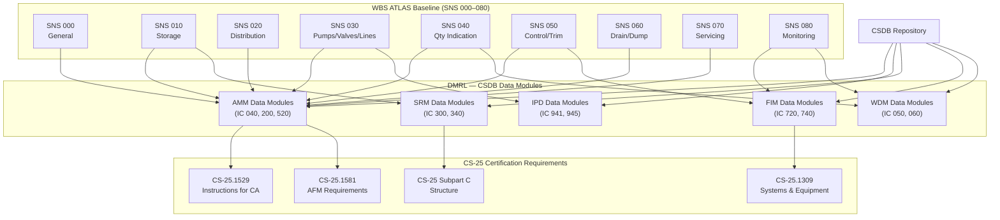

# ATLAS 040-049 · Section 04 · Subsection 041 · 090 — S1000D CSDB Mapping and Traceability

## 1. Purpose

This document defines the S1000D Issue 5.0 Data Module Code (DMC) structure for all technical publications relating to the Water Ballast System (WBS), establishes the Common Source DataBase (CSDB) applicability rules governing which DMCs apply to each aircraft variant and configuration, identifies the publication types supported, and provides a bi-directional traceability matrix linking each WBS ATLAS subsubject (SNS 000–080) to the corresponding DMCs, certification requirements (CS-25 paragraphs), and Data Module Requirements List (DMRL) entries.

The purpose of this traceability framework is threefold. First, it ensures completeness: every design requirement captured in the WBS ATLAS documentation (SNS 000–080) is demonstrably covered by one or more S1000D data modules, and no data module exists without a traceable requirement. Second, it enables configuration management: when a design change occurs in any WBS subsystem, the traceability matrix immediately identifies all affected data modules requiring revision, preventing stale technical publications from reaching maintenance engineers. Third, it supports regulatory compliance: EASA CS-25 requires that the Approved Flight Manual, Aircraft Maintenance Manual, and Instructions for Continued Airworthiness accurately reflect the as-certified system design; traceability to CS-25 paragraphs confirms this requirement is met.

The WBS S1000D publication suite includes five publication types: the Aircraft Maintenance Manual (AMM), Illustrated Parts Data (IPD), Structural Repair Manual (SRM), Fault Isolation Manual (FIM), and Wiring Diagram Manual (WDM). Each publication type draws DMCs from the CSDB; this document defines the DMRL for each type and maps them to the WBS ATLAS baseline.

## 2. Scope

This document covers:

- S1000D Issue 5.0 DMC structure for the WBS: model identification code (MIC), system difference code (SDC), standard numbering system (SNS) mapping, disassembly code (DC), disassembly code variant (DCV), information code (IC), information code variant (ICV), and item location code (ILC).
- CSDB applicability rules: product attribute filtering by aircraft series, engine variant, and WBS configuration (standard WBS vs. extended-range WBS with additional tank pairs).
- Publication type mapping: AMM (task-oriented procedural), IPD (parts catalogue), SRM (structural repair), FIM (fault isolation), WDM (wiring diagrams).
- DMRL structure: listing of all required DMCs with their IC, publication type assignment, and development priority.
- Bi-directional traceability matrix: WBS ATLAS SNS ↔ DMC ↔ CS-25 paragraph ↔ certification requirement.
- Change management: procedure for identifying and revising DMCs when WBS ATLAS baseline documents are updated.
- ATA iSpec 2200 chapter 41 cross-reference: mapping between ATA chapter/section/subject numbers and S1000D DMC SNS fields for publications supporting mixed ATA/S1000D environments.

## 3. Glossary

| Term / Acronym | Definition |
|---|---|
| S1000D | International Specification for Technical Publications (Issue 5.0, 2019) — the ASD/AIA/ATA joint specification governing the creation, management, and exchange of technical publications as structured data modules stored in a CSDB. |
| DMC | Data Module Code — the 17-field alphanumeric identifier uniquely identifying an S1000D data module within a CSDB; structured as MIC-SNS-DC-DCV-IC-ICV-ILC. |
| CSDB | Common Source DataBase — the managed repository in which all WBS S1000D data modules are authored, stored, and controlled; supports multi-publication output from a single source. |
| DMRL | Data Module Requirements List — the controlled list of all DMCs required to document a system or aircraft type; the authoritative reference for CSDB completeness audits. |
| MIC | Model Identification Code — the first field of the DMC identifying the aircraft model; example: `QPLS` for Q+ATLANTIDE aircraft. |
| SNS | Standard Numbering System — the DMC field derived from the ATA chapter/section/subject structure; for WBS, SNS = `41-00` through `41-90` corresponding to ATA chapter 41 subjects. |
| IC | Information Code — a three-character DMC field defining the type of information content within the data module; examples: `040` (Description and Operation), `200` (Maintenance Practices), `520` (Remove and Install), `720` (Fault Isolation). |
| IPD | Illustrated Parts Data — the S1000D publication type providing parts catalogue information for each WBS assembly and sub-assembly; each LRU has one or more IPD data modules. |
| SRM | Structural Repair Manual — the publication providing FAA/EASA-approved repair schemes for WBS structural elements (tank attachment fittings, structural brackets); SRM DMCs reference CS-25 Subpart C. |
| FIM | Fault Isolation Manual — the publication providing step-by-step troubleshooting procedures for WBS maintenance engineers; FIM DMCs are generated from FMEA results and BCC BITE fault code definitions. |
| WDM | Wiring Diagram Manual — the publication providing schematic and point-to-point wiring data for all WBS electrical harnesses, connectors, and avionics interfaces; generated from the aircraft wiring design database. |
| ICA | Instructions for Continued Airworthiness — the regulatory deliverable required by CS-25.1529 and FAR 25.1529; the AMM, FIM, SRM, and IPD collectively constitute the WBS ICA. |

## 4. Diagram (Mermaid)

## 5. Footprint

| Metric | Value |
|---|---|
| Architecture | `ATLAS` — Aircraft Top Level Architecture Schema/System (controlled term) |
| Master range | `000–099` |
| Code range | `040-049` |
| Section | `04` — Aviónica, Información & APU |
| Subsection | `041` — Water Ballast |
| Subsubject | `090` — S1000D CSDB Mapping and Traceability |
| Primary Q-Division | Q-DATAGOV[^qdiv] |
| Support Q-Divisions | Q-AIR, Q-SPACE, Q-HPC |
| ORB support | ORB-PMO, ORB-LEG |
| Governance class | `baseline`[^gov] |
| Folder path | `Q+ATLANTIDE/000-099_ATLAS/040-049_Avionica-Informacion-y-APU/041_Water-Ballast/` |
| Document | `041-090-S1000D-CSDB-Mapping-and-Traceability.md` (this file) |
| Parent subsection | [`README.md`](./README.md) |
| Parent section | [`../../README.md`](../../README.md) |
| Parent architecture | [`../../../README.md`](../../../README.md) |
| Parent baseline | [`organization/Q+ATLANTIDE.md`](../../../../organization/Q+ATLANTIDE.md) |

## 6. References & Citations

[^baseline]: Q+ATLANTIDE controlled baseline (v1.0.0) — governing architecture baseline for ATLAS master range 000–099; this document is the authoritative DMRL and traceability reference for all WBS S1000D publications.

[^qdiv]: Q-Division authority — Q-DATAGOV holds primary data governance and CSDB management authority. Q-HPC provides data management system engineering and CSDB tooling support.

[^gov]: Governance class — `baseline` denotes formal change control, configuration management, and periodic review under the Q+ATLANTIDE baseline management process.

[^n001]: Note N-001 — S1000D Issue 5.0 (2019): International Specification for Technical Publications Using a Common Source DataBase. ASD-Europe, AIA, ATA. Governing specification for all WBS DMC structures, CSDB management rules, applicability filtering, and publication type definitions used in this document.

[^n002]: Note N-002 — ATA iSpec 2200 (2022 edition): Information Standards for Aviation Maintenance. Airlines for America (A4A). Provides the ATA Chapter 41 SNS mapping used as the basis for the S1000D SNS field in WBS DMCs, and the cross-reference structure for operators maintaining ATA-based documentation environments alongside S1000D.

[^n003]: Note N-003 — EASA CS-25.1529 and FAR 25.1529: Instructions for Continued Airworthiness (ICA). Defines the regulatory obligation to provide complete and accurate AMM, FIM, SRM, and IPD data; the WBS DMRL completeness audit against this document satisfies the CS-25.1529 deliverable requirement.

[^n004]: Note N-004 — EUROCAE ED-160 / SAE AS9100D: Quality Management Systems — Aerospace. The CSDB change management process (DMC revision, applicability update, publication regeneration) is governed by the organisation's AS9100D-certified Document Management Procedure.

[^n005]: Note N-005 — ASD S3000L (Issue 2, 2016): International Specification for Logistics Support Analysis. The DMRL is integrated with the S3000L Maintenance Task Analysis (MTA) outputs; each maintenance task in the MTA corresponds to one or more AMM data modules, providing bi-directional traceability between LSA and technical publications.

[^n006]: Note N-006 — EASA AMC 20-29 / FAA AC 25.1581-1: Acceptable Means of Compliance for AFM content; confirms that WBS operational data (ballast mass limits, CG contribution, dump procedure) appearing in the AFM Emergency and Abnormal Procedures chapter is traceable to SNS 000 and SNS 060 ATLAS baseline documents and corresponding AMM data modules.
