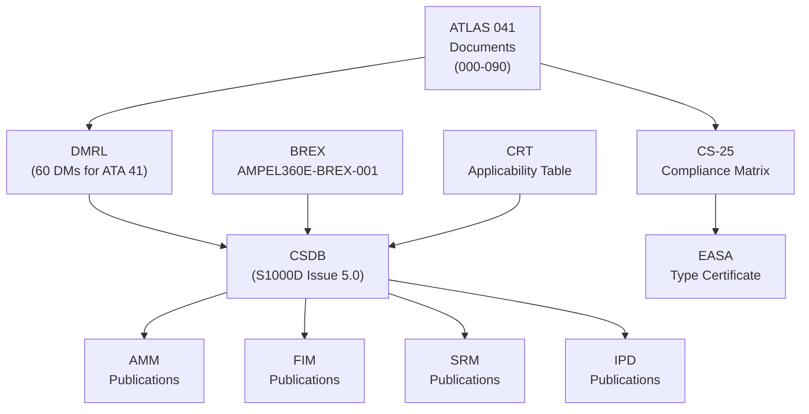
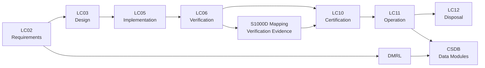

# ATLAS 040-049 · Section 04 · Subsection 041 · 090 — S1000D/CSDB Mapping and Traceability

## 0. Hyperlink Policy

All internal cross-references use relative Markdown links resolved within the Q+ATLANTIDE CSDB repository. External regulatory citations are listed in §19 and §20 with identifiers marked TBD. Parent context: [ATLAS 041 Water Ballast General](./041-000-Water-Ballast-General.md).

---

## 1. Purpose

This document provides the complete S1000D Issue 5.0 Data Module Code (DMC) structure, Data Module Requirements List (DMRL), Business Rules Exchange (BREX) constraints, and CS-25 traceability matrix for the entire ATA 41 Water Ballast subject range (SNS 041-000 through 041-090) on the AMPEL360E eWTW aircraft. It is the authoritative CSDB configuration reference for the WB technical publication set.

The S1000D publication structure defined here covers all six publication types required for an ATA 41 system: Aircraft Maintenance Manual (AMM), Fault Isolation Manual (FIM), Troubleshooting Manual (TSM), Software Reference Manual (SRM), Illustrated Parts Data (IPD), and Wiring Manual (WM). The DMC coding scheme follows the AMPEL360E Model Identification Code (MIC), System Differentiation Code (SDC), and Sub-System / Sub-Sub-System (SNS) hierarchy defined in the AMPEL360E BREX document.

The CS-25 traceability matrix in §5 maps each top-level regulatory paragraph to the ATLAS 041 document and CSDB data module responsible for demonstrating compliance, providing the audit trail required by EASA and FAA during type certification.

---

## 2. Applicability

| Attribute | Value |
|-----------|-------|
| Aircraft Model | AMPEL360E eWTW (all production variants) |
| ATA Reference | ATA 41 — Water Ballast (all SNS) |
| Standards | S1000D Issue 5.0, ATA iSpec 2200, ARINC 767, CS-25 Amd 27 |
| Dev Assurance | N/A (documentation framework) |
| Applicability Code | AMPEL360E-EWTW-ALL |
| S1000D Issue | Issue 5.0 (2016) |

---

## 3. System / Function Overview

The AMPEL360E CSDB follows the S1000D Issue 5.0 data model with a Model Identification Code (MIC) of `AMPEL360E`, a System Differentiation Code (SDC) of `EWTW`, and an SNS base of `041` for all Water Ballast data modules. Data modules are identified by their full DMC: `DMC-AMPEL360E-EWTW-041-{SNS}-{DI}-{Info Code}{Variant}-{Issue Code}`.

The DMRL for ATA 41 contains 60 data modules across six publication types for the ten SNS subjects (000 through 090). The BREX document (AMPEL360E-BREX-001) constrains allowed Info Codes, issue codes, and applicability annotation syntax for all AMPEL360E data modules; deviations from the BREX must be approved by Q-DATAGOV via an Engineering Change Request.

CSDB applicability management uses the S1000D Common Source Database applicability cross-reference table (CRT) to associate each data module with the aircraft variant codes AMPEL360E-EWTW-STD (standard), AMPEL360E-EWTW-HGW (high gross weight), and AMPEL360E-EWTW-LRC (long range cruise) as appropriate for WB system differences between variants.

---

## 4. Scope

### 4.1 Included
- Full DMC table for all 60 WB data modules (SNS 000–090, 6 pub types each)
- DMRL summary with Info Code, publication, and applicability
- BREX constraints applicable to ATA 41 data modules
- CS-25 traceability matrix (regulatory paragraph → ATLAS document → DMC)
- AMM/FIM/IPD/TSM/SRM/WM publication type definitions for ATA 41
- CSDB applicability variant coding for WB system

### 4.2 Excluded
- CSDB tool configuration (handled by Q-DATAGOV CSDB administration)
- Individual data module content (covered by SNS-specific ATLAS documents)
- CSDB server infrastructure (covered by Q-DATAGOV IT architecture)

---

## 5. Architecture Description

**DMC Structure.** The DMC for every ATA 41 WB data module follows the pattern:
`DMC-AMPEL360E-EWTW-041-{SNS}-00A-{InfoCode}A-A`
where: MIC=AMPEL360E, SDC=EWTW, SNS=041, Sub-SNS={000..090}, Disassembly Code=00, Disassembly Variant=A, Info Code={3 digits}, Info Code Variant=A, Item Location Code=A.

**BREX Constraints.** The AMPEL360E BREX document (AMPEL360E-BREX-001) defines: allowed Info Codes for ATA 41 (040, 300, 400, 520, 720, 941); mandatory applic annotation using `applicRefId`; prohibition of free-text applicability strings; required use of `cautionRef` elements for all safety-critical maintenance steps; and mandated use of the AMPEL360E standard parts catalogue (`IPC-AMPEL360E-EWTW-041`) for IPD data modules.

**CS-25 Traceability.** The traceability matrix maps CS-25 paragraphs to the ATLAS 041 document that defines compliance means and to the primary DMC providing the compliance evidence. Each matrix entry has a compliance method code: A (analysis), T (test), I (inspection), R (review of design).

**Publication Types.** Six S1000D publication types are produced for ATA 41: AMM (Aircraft Maintenance Manual, Info Codes 040/300/400/520), FIM (Fault Isolation Manual, Info Code 300), TSM (Troubleshooting Manual, Info Code 400), SRM (Software Reference Manual, Info Code 720), IPD (Illustrated Parts Data, Info Code 941), WM (Wiring Manual, Info Code 520).

---

## 6. Functional Breakdown

| Function ID | Function Name | Description | Allocated To | DAL |
|-------------|---------------|-------------|-------------|-----|
| F-090-01 | DMRL Maintenance | Define and maintain the list of required data modules for ATA 41 | Q-DATAGOV | N/A |
| F-090-02 | DMC Coding | Assign and control unique DMCs per BREX for all WB data modules | Q-DATAGOV | N/A |
| F-090-03 | CS-25 Traceability | Map each CS-25 paragraph to responsible ATLAS document and DMC | Q-DATAGOV | N/A |
| F-090-04 | Applicability Management | Assign CRT applicability codes to each DMC per variant | Q-DATAGOV | N/A |
| F-090-05 | BREX Compliance | Verify all ATA 41 data modules conform to AMPEL360E BREX | Q-DATAGOV | N/A |

---

## 7. Mermaid — System Context Diagram

---

## 8. Mermaid — Internal Functional Architecture

```mermaid
graph LR
    subgraph DMRL_BLOCK["DMRL — ATA 41 (60 DMs)"]
        SNS000["SNS 000
6 DMs"]
        SNS010["SNS 010
6 DMs"]
        SNS020["SNS 020
6 DMs"]
        SNS030["SNS 030
6 DMs"]
        SNS040["SNS 040
6 DMs"]
        SNS050["SNS 050
6 DMs"]
        SNS060["SNS 060
6 DMs"]
        SNS070["SNS 070
6 DMs"]
        SNS080["SNS 080
6 DMs"]
        SNS090["SNS 090
6 DMs"]
    end
    subgraph PUB_TYPES["Publication Types"]
        AMM_P["AMM
040/300/400/520"]
        FIM_P["FIM
300"]
        TSM_P["TSM
400"]
        SRM_P["SRM
720"]
        IPD_P["IPD
941"]
        WM_P["WM
520"]
    end
    DMRL_BLOCK --> PUB_TYPES
```

---

## 9. Mermaid — Lifecycle Traceability

---

## 10. Interfaces

| Interface ID | From | To | Protocol / Standard | Direction | Notes |
|-------------|------|----|---------------------|-----------|-------|
| IF-090-01 | ATLAS 041 documents | CSDB | S1000D Issue 5.0 XML | Source → CSDB | Manual authoring + XML import |
| IF-090-02 | CSDB | AMT publications | ARINC 767 electronic delivery | CSDB → AMT | Electronic delivery to aircraft |
| IF-090-03 | BREX | CSDB validation | S1000D XML schema | BREX → Validator | Automated BREX check on DM load |
| IF-090-04 | CRT | CSDB | S1000D applicability table | CRT → CSDB | Variant applicability assignment |
| IF-090-05 | CSDB | EASA compliance package | PDF/XML | CSDB → EASA | Compliance evidence submission |
| IF-090-06 | CS-25 matrix | ATLAS 041 documents | Traceability links | Matrix → Documents | Bi-directional traceability |

---

## 11. Operating Modes

| Mode | Description | Trigger | System Response |
|------|-------------|---------|-----------------|
| DM Authoring | New or revised data modules authored and loaded to CSDB | Engineering change | BREX validation on load; error report if non-compliant |
| Publication Build | CSDB compiles publication from approved DMs | Release trigger | Publication generated per applicable variant |
| Compliance Audit | CS-25 matrix reviewed against CSDB content | Certification milestone | Gap analysis report; open items flagged |
| In-Service Update | DMs revised for in-service finding or AD/SB | AMM revision cycle | DM re-issued; AMT publication updated |

---

## 12. Monitoring and Diagnostics

- CSDB automated BREX validation runs on every DM load; non-conformant DMs quarantined with error report to Q-DATAGOV.
- DMRL completeness check automated in CSDB: missing DMs flagged as open items in DMRL status report.
- CS-25 traceability matrix reviewed at each certification milestone (PDR, CDR, FQT); open gaps reported to Q-DATAGOV with 30-day resolution target.
- DMC uniqueness check enforced by CSDB; duplicate DMC attempts rejected with warning.
- Applicability CRT validated against aircraft variant production list at each release; orphaned applicability codes flagged for removal.
- Data module approval workflow enforced in CSDB: Draft → Review → Approved; only Approved DMs included in publications.

---

## 13. Maintenance Concept

| Task | Interval | Access | Tooling |
|------|----------|--------|---------|
| DMRL completeness review | Each major revision cycle | CSDB admin portal | CSDB DMRL report |
| BREX validation pass | On each DM load | CSDB automated | CSDB validation engine |
| CS-25 traceability matrix update | Each CS-25 revision or ATLAS document update | Q-DATAGOV | Excel/CSDB traceability module |
| AMT publication update (in-service) | Per AMM revision cycle | CSDB publication build | CSDB build toolchain |

---

## 14. S1000D / CSDB Mapping

| Document Type | Data Module Code (DMC) | Info Code | Title |
|---------------|----------------------|-----------|-------|
| System Description | DMC-AMPEL360E-EWTW-041-090-00A-040A-A | 040 | S1000D/CSDB Mapping Description |
| Maintenance Procedures | DMC-AMPEL360E-EWTW-041-090-00A-300A-A | 300 | S1000D Mapping Fault Isolation |
| BITE/Test | DMC-AMPEL360E-EWTW-041-090-00A-400A-A | 400 | S1000D Mapping BITE Procedures |
| Wiring Data | DMC-AMPEL360E-EWTW-041-090-00A-520A-A | 520 | S1000D Mapping Wiring and Connector Data |
| IPD | DMC-AMPEL360E-EWTW-041-090-00A-941A-A | 941 | S1000D Mapping Illustrated Parts |
| Software Desc | DMC-AMPEL360E-EWTW-041-090-00A-720A-A | 720 | S1000D Mapping SW Description |

### Recommended Data Module Set

| Info Code | Publication | Applicability |
|-----------|-------------|---------------|
| 040 | AMM — System Description | All variants |
| 300 | FIM — Fault Isolation | All variants |
| 400 | TSM — BITE Procedures | All variants |
| 520 | AMM — Wiring Data | All variants |
| 720 | SRM — Software Description | All variants |
| 941 | IPD — Parts Data | All variants |

---

## 15. Footprints

### 15.1 Physical

| Item | Dimension (mm) | Mass (kg) | Location |
|------|---------------|-----------|----------|
| CSDB server (shared infrastructure) | Rack-mounted | N/A (ground) | Q-DATAGOV data centre |
| AMT publications package | Electronic delivery | N/A | Aircraft AMT storage |
| Publication hard copy (AFM supplement) | A4 binder | 0.5 | Cockpit document holder |

### 15.2 Electrical / Data

| Interface | Standard | Bandwidth / Power |
|-----------|----------|-------------------|
| CSDB server network | Ethernet 1 Gbit/s | IT infrastructure |
| AMT electronic delivery | ARINC 767 | 1 Mbit/s |
| ACARS publication status | ARINC 724B | < 1 kbit/s |

### 15.3 Maintenance

| Task | Man-Hours | Skill Level | Access |
|------|-----------|-------------|--------|
| DMRL review | 4.0 per revision | Q-DATAGOV tech writer | CSDB portal |
| CS-25 matrix update | 8.0 per revision cycle | Q-DATAGOV + Q-AIR | Document review |
| AMT publication build | 2.0 per release | Q-DATAGOV CSDB admin | CSDB build toolchain |

### 15.4 Data

| Data Item | Volume | Storage | Retention |
|-----------|--------|---------|-----------|
| CSDB data modules (60 DMs, ATA 41) | ~30 MB XML | CSDB repository | Life of type |
| CS-25 traceability matrix | 500 KB | CSDB + document control | Life of type |
| Publication PDFs (per variant) | ~200 MB | CSDB + AMT | Current revision + 2 prior |

---

## 16. Safety and Certification Considerations

- S1000D Issue 5.0 compliance ensures interoperability with airline maintenance systems and EASA-accepted publication format; deviations require EASA agreement.
- CS-25 traceability matrix is a mandatory deliverable for EASA type certification per EASA AMC 21A.101; completeness reviewed at PDR, CDR, and FQT.
- BREX enforcement prevents introduction of non-standard markup that could cause maintenance errors from misinterpretation of cautions or warnings.
- Data module approval workflow (Draft → Review → Approved) provides configuration control equivalent to DO-178C software CM for safety-relevant maintenance instructions.
- AFM supplement (Info Code 040 for SNS 000) is subject to EASA Flight Manual approval process; must be approved before EIS.
- CSDB backup and disaster recovery policy (Q-DATAGOV IT) ensures no loss of approved publication data; RPO ≤ 4 hours, RTO ≤ 8 hours.

---

## 17. Verification and Validation

| V&V ID | Requirement | Method | Success Criteria | Status |
|--------|-------------|--------|-----------------|--------|
| VV-090-01 | All 60 DMRL DMs present in CSDB | DMRL completeness check | Zero open DMRL items at CDR | TBD |
| VV-090-02 | All DMs pass BREX validation | CSDB automated validation | Zero BREX errors in CSDB | TBD |
| VV-090-03 | CS-25 traceability matrix 100% complete | Manual audit | All CS-25 paragraphs mapped to DMC | TBD |
| VV-090-04 | AMT publication deliverable per ARINC 767 | Format compliance check | Publication loads on AMT without error | TBD |
| VV-090-05 | DMC uniqueness: no duplicate DMCs | CSDB database check | Zero duplicate DMCs in CSDB | TBD |
| VV-090-06 | Applicability CRT covers all 3 variants | CRT completeness audit | All variant codes assigned to applicable DMs | TBD |
| VV-090-07 | AFM supplement approved before EIS | Certification milestone review | EASA approval letter received | TBD |

---

## 18. Glossary

| Term/Acronym | Definition | Link |
|-------------|-----------|------|
| BREX | Business Rules Exchange; S1000D document defining project-specific authoring rules | [§3](#3-system--function-overview) |
| CRT | Common Source Database Cross-Reference Table; S1000D applicability management table | [§3](#3-system--function-overview) |
| DMC | Data Module Code; unique S1000D identifier for each data module | [§3](#3-system--function-overview) |
| DMRL | Data Module Requirements List; master list of required data modules for a project | [§1](#1-purpose) |
| FIM | Fault Isolation Manual; publication type for fault isolation procedures | [§3](#3-system--function-overview) |
| IPD | Illustrated Parts Data; S1000D publication type for parts catalogues | [§3](#3-system--function-overview) |
| MIC | Model Identification Code; first element of S1000D DMC (AMPEL360E) | [§3](#3-system--function-overview) |
| SDC | System Differentiation Code; second DMC element (EWTW for electric wide-body twin-wing) | [§3](#3-system--function-overview) |
| SRM | Software Reference Manual; publication type for software descriptions | [§3](#3-system--function-overview) |
| TSM | Troubleshooting Manual; publication type for system troubleshooting | [§3](#3-system--function-overview) |
| WM | Wiring Manual; publication type for electrical wiring data | [§3](#3-system--function-overview) |

---

## 19. Citations

| Ref | Citation | Use | Link |
|-----|---------|-----|------|
| S1000D | S1000D Issue 5.0 — International Specification for Technical Publications | CSDB data module coding and publication structure | TBD |
| CS-25 | EASA CS-25 Amendment 27 | Regulatory basis for traceability matrix | TBD |
| ATA-iSpec-2200 | ATA iSpec 2200 — Information Standards for Aviation Maintenance | AMM/FIM/IPD structure and ATA chapter coding | TBD |
| ARINC 767 | ARINC 767 — Electronic Documentation Standard | AMT electronic publication delivery | TBD |
| EASA-AMC21A | EASA AMC 21A.101 — Certification Specifications Compliance Documentation | CS-25 traceability matrix requirement | TBD |
| EASA-TC | EASA Type Certificate Data Sheet for AMPEL360E | Certification basis | TBD |
| AMPEL360E-BREX | AMPEL360E Business Rules Exchange Document (AMPEL360E-BREX-001) | Project BREX constraints | TBD |

---

## 20. References

| Ref | Document | Identifier | Revision | Status | Link |
|-----|---------|-----------|---------|--------|------|
| R-001 | WB General (041-000) | QATL-ATLAS-041-000 | Rev 1.0 | Active | [041-000](./041-000-Water-Ballast-General.md) |
| R-002 | Q+ATLANTIDE ATLAS README | QATL-ATLAS-README | Rev 1.0 | Active | [README](../README.md) |
| R-003 | AMPEL360E BREX Document | AMPEL360E-BREX-001 | Rev A | Active | TBD |

---

## 21. Open Issues

| ID | Issue | Owner | Status | Link |
|----|-------|-------|--------|------|
| OI-090-01 | BREX document (AMPEL360E-BREX-001) not yet formally issued; draft under Q-DATAGOV review | Q-DATAGOV | Open | TBD |
| OI-090-02 | CRT variant codes for HGW and LRC variants not yet defined; pending aircraft variant freeze | Q-AIR | Open | TBD |
| OI-090-03 | AFM supplement format approval process with EASA to be initiated at CDR | Q-DATAGOV | Open | TBD |

---

## 22. Change Log

| Version | Date | Author | Change | Link |
|---------|------|--------|--------|------|
| 1.0.0 | 2026-05-09 | Q-DATAGOV / Copilot | Initial creation with full 22-section template | TBD |
