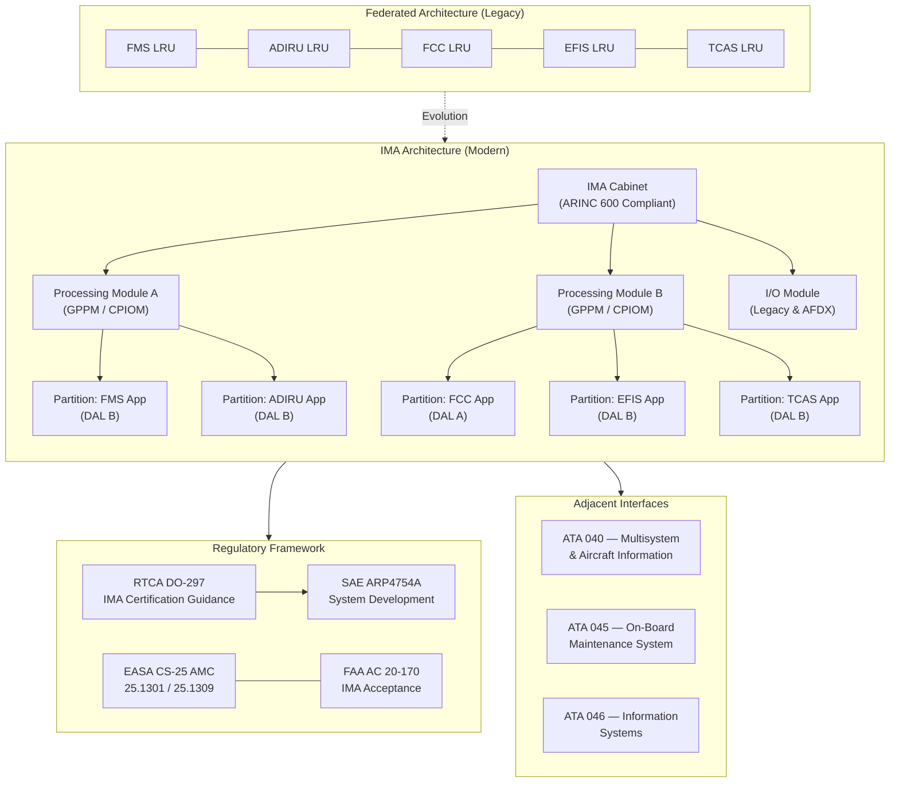

# ATLAS 040-049 · Section 04 · Subsection 042 · 000 — Integrated Modular Avionics General

## 1. Purpose

This document provides the general description, architecture rationale, and regulatory context for the Integrated Modular Avionics (IMA) subsystem within the Q+ATLANTIDE ATLAS framework. It establishes the foundational principles, system boundary definitions, and key interfaces that govern all subordinate subjects (042-010 through 042-090). The document serves as the normative entry point for engineers, certification authorities, and programme managers engaged with IMA architecture design, qualification, and continued airworthiness activities.

The overarching objective is to codify how IMA replaces the traditional federated avionics architecture — where each aircraft function is housed in a dedicated, self-contained box — with a shared, partitioned computing environment that consolidates multiple avionics functions onto common hardware platforms. This consolidation realises significant savings in weight, volume, power consumption, and wiring harness complexity without degrading the safety or determinism required by civil and military airworthiness regulations.

## 2. Scope

This subject covers:

- The architectural distinction between IMA and federated avionics, including trade-off metrics.
- The normative role of RTCA DO-297 / EUROCAE ED-124 as the primary IMA certification guidance.
- Mapping to ATA iSpec 2200 Chapter 42 and its relationship to adjacent chapters (040, 045, 046).
- Top-level system boundary, allocated functions, and inter-system interfaces.
- Regulatory framework spanning EASA CS-25 AMC 25.1301/1309, FAA AC 20-170, and SAE ARP4754A system-level processes.
- Weight, volume, and power reduction quantification methodology applicable to IMA trade studies.
- Programme and governance context within the Q+ATLANTIDE baseline.

The scope excludes detailed software qualification (addressed in 042-060), network architecture specifics (042-040), and hardware module descriptions (042-010, 042-020).

## 3. Glossary

| Term / Acronym | Definition |
|---|---|
| IMA | Integrated Modular Avionics — a shared, partitioned computing platform hosting multiple avionics applications on common hardware resources, as defined by RTCA DO-297. |
| Federated Avionics | Legacy architecture wherein each avionics function resides in a dedicated, self-contained Line Replaceable Unit (LRU) with its own processor, power supply, and I/O. |
| DO-297 | RTCA document "Integrated Modular Avionics (IMA) Development Guidance and Certification Considerations", the primary certification guidance for IMA platforms. |
| ATA 42 | ATA iSpec 2200 Chapter 42 — the standardised chapter designation for Integrated Modular Avionics within aircraft maintenance and technical documentation. |
| DAL | Design Assurance Level — as defined in SAE ARP4754A / RTCA DO-178C / DO-254, classifying the rigour of development activities according to the failure condition severity (DAL A through E). |
| CS-25 | EASA Certification Specifications for Large Aeroplanes, including AMC 25.1301 and AMC 25.1309 governing avionics equipment qualification and system safety assessment. |
| ARP4754A | SAE Aerospace Recommended Practice 4754A — "Guidelines for Development of Civil Aircraft and Systems", providing the system-level development process framework for IMA and hosted applications. |
| System Boundary | The formal delineation of IMA scope, inputs, outputs, and interfaces, established in the IMA System Requirements Document and maintained under configuration control. |
| LRU | Line Replaceable Unit — a modular avionics unit designed for rapid replacement at line maintenance level, typically conforming to ARINC 600 mechanical standards. |
| ED-79A | EUROCAE ED-79A (equivalent to SAE ARP4754A) — European guidance for aircraft and system development, accepted by EASA for demonstrating compliance with CS-25 safety objectives. |

## 4. Diagram (Mermaid)

## 5. Footprint

| Metric | Value |
|---|---|
| Architecture | `ATLAS` — Aircraft Top Level Architecture Schema/System (controlled term) |
| Master range | `000–099` |
| Code range | `040-049` |
| Section | `04` — Aviónica, Información & APU |
| Subsection | `042` — Integrated Modular Avionics |
| Subsubject | `000` — Integrated Modular Avionics General |
| Primary Q-Division | Q-DATAGOV[^qdiv] |
| Support Q-Divisions | Q-AIR, Q-SPACE, Q-HPC |
| ORB support | ORB-PMO, ORB-LEG |
| Governance class | `baseline`[^gov] |
| Folder path | `Q+ATLANTIDE/000-099_ATLAS/040-049_Avionica-Informacion-y-APU/042_Integrated-Modular-Avionics/` |
| Document | `042-000-Integrated-Modular-Avionics-General.md` (this file) |
| Parent subsection | [`README.md`](./README.md) |
| Parent section | [`../../README.md`](../../README.md) |
| Parent architecture | [`../../../README.md`](../../../README.md) |
| Parent baseline | [`organization/Q+ATLANTIDE.md`](../../../../organization/Q+ATLANTIDE.md) |

## 6. References & Citations

[^baseline]: Q+ATLANTIDE controlled baseline (v1.0.0) — the governing programme baseline document for all ATLAS architecture artefacts. Maintained under configuration management per the Q+ATLANTIDE governance framework.

[^qdiv]: Q-Division authority — Q-DATAGOV holds primary governance authority over IMA architecture documentation, data integrity, and configuration control within the Q+ATLANTIDE programme.

[^gov]: Governance class — `baseline` denotes that this document forms part of the formally controlled baseline configuration. Changes require formal change-request approval through ORB-PMO.

[^n001]: Note N-001 — IMA architecture trade studies referenced in this document shall be maintained in the IMA Trade Study Record (TSR-042-001) under the Q-AIR configuration management system.

[^do297]: RTCA DO-297 / EUROCAE ED-124 — "Integrated Modular Avionics (IMA) Development Guidance and Certification Considerations", RTCA Inc., Washington DC. The primary normative reference for IMA platform and hosted application certification.

[^arp4754a]: SAE ARP4754A — "Guidelines for Development of Civil Aircraft and Systems", SAE International, 2010. Defines the system development process applied at IMA platform and hosted-application level.

[^cs25]: EASA CS-25 Amendment 27 — Certification Specifications and Acceptable Means of Compliance for Large Aeroplanes. AMC 25.1301 and AMC 25.1309 provide specific guidance for avionics equipment and system safety assessment.

[^ac20170]: FAA Advisory Circular AC 20-170A — "Integrated Modular Avionics Development, Verification, Integration, and Approval Using RTCA/DO-297 and Technical Standard Order (TSO)-C153", FAA, 2014.
