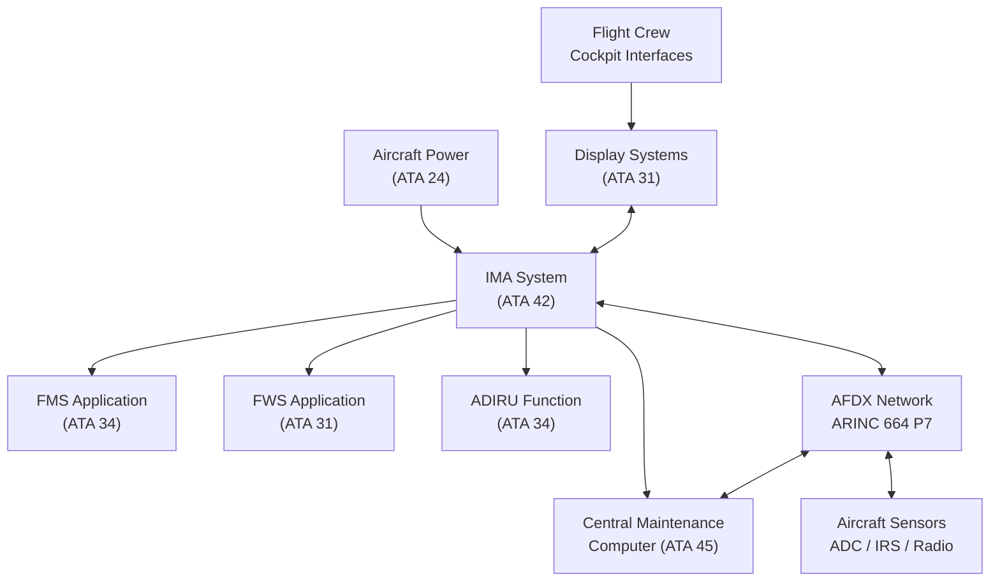
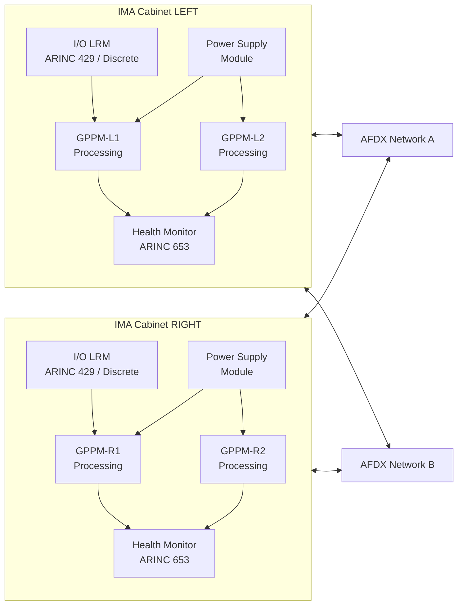
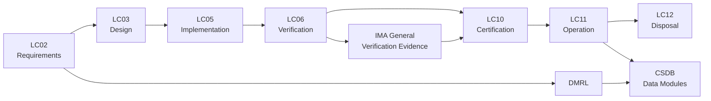

# ATLAS 040-049 · Section 04 · Subsection 042 · 000 — Integrated Modular Avionics General

## 0. Hyperlink Policy

All internal cross-references use relative Markdown links resolved within the Q+ATLANTIDE CSDB repository. External regulatory citations are listed in §19 (Citations) and §20 (References) with identifiers marked  pending publication indexing. Parent context: [ATLAS 042 README](./README.md).

---

## 1. Purpose

This document establishes the top-level description, functional allocation, architectural rationale, and compliance framework for the Integrated Modular Avionics (IMA) system of the AMPEL360E eWTW aircraft. The IMA architecture consolidates previously federated Line Replaceable Units (LRUs) into shared computing platforms hosting multiple avionics functions under rigorous partitioning, enabling significant reductions in weight, volume, power consumption, and maintenance burden.

The document governs:
- IMA system boundaries, hosted application catalogue, and DAL allocations per ARP4754B.
- Compliance approach for DO-297, DO-178C, DO-254, and CS-25 AMC 25-11B.
- Interface conventions between IMA platform and hosted applications.
- Safety goals and validation evidence framework for the AMPEL360E IMA deployment.

---

## 2. Applicability

| Attribute | Value |
|-----------|-------|
| Aircraft Program | AMPEL360E eWTW |
| ATA Chapter | ATA 42 — Integrated Modular Avionics |
| Certification Basis | CS-25 Amendment 28; AMC 25-11B; AMC 20-152A |
| Applicable Standards | DO-297; DO-178C; DO-254; DO-160G; ARP4754B; ARINC 653; ARINC 664 |
| Design Assurance Level | Platform: DAL B; Hosted apps: DAL A–C per function |
| Configuration | AMPEL360E Build Standard 1.0 and above |

---

## 3. System / Function Overview

The AMPEL360E IMA system implements a modular avionics architecture consistent with DO-297 guidance. Two redundant IMA cabinets (IMA-CAB-LEFT, IMA-CAB-RIGHT) are installed in the avionics bay. Each cabinet houses General-Purpose Processing Modules (GPPMs) and I/O Line Replaceable Modules (LRMs) interconnected via a dual-redundant AFDX (ARINC 664 Part 7) network.

Hosted applications span Flight Management (FMS), Flight Warning (FWS), Air Data/Inertial Reference (ADIRU functions), Cabin Management, and Aircraft Health Monitoring. Each application partition is isolated spatially and temporally per ARINC 653 Part 1. The IMA platform is qualified to DO-297 and provides the hosting environment; each hosted application is independently accepted per DO-178C (software) and DO-254 (hardware).

The federated vs IMA trade study conducted during AMPEL360E concept phase demonstrated a 23% reduction in avionics LRU count, 18% reduction in avionics bay weight, and 31% reduction in avionics harness mass compared to an equivalent federated baseline.

---

## 4. Scope

### 4.1 Included

- IMA cabinet physical architecture and structural mounting provisions.
- General-Purpose Processing Modules (GPPMs) and associated memory.
- ARINC 653 Real-Time Operating System (RTOS) platform qualification.
- AFDX network end-system configuration integrated within IMA cabinets.
- Health Monitoring and BITE functions for the IMA platform itself.
- Configuration control and data loading (ARINC 615A) for IMA platform software.
- Partitioning enforcement, APEX API service provision, and inter-partition communication.
- IMA power supply modules and cooling provisions (detailed in 042-050).

### 4.2 Excluded

- Individual hosted application internal design (covered by application-specific documents).
- AFDX switches and external network infrastructure (covered in 042-040).
- Aircraft-level power distribution upstream of IMA PDU (covered in ATA 24).
- Display Systems hardware (covered in ATA 31).
- FMS function specification (covered in ATA 34).

---

## 5. Architecture Description

The AMPEL360E IMA architecture follows a two-cabinet, dual-channel topology. Each IMA cabinet contains:

**Processing Layer:** Four GPPMs per cabinet (8 total), each hosting a dual-core processor with ECC RAM and hardware memory protection units. Processing redundancy is achieved through active-active and active-standby partition configurations depending on DAL requirements.

**I/O Layer:** Six I/O LRMs per cabinet handling ARINC 429, discrete I/O, and analog signal conditioning. I/O LRMs present a uniform interface to hosted partitions via the APEX API abstraction.

**Network Layer:** Each cabinet contains two AFDX end-system controllers providing redundant A and B network connectivity at 100 Mbps full-duplex per Virtual Link (VL).

**Platform Software:** The ARINC 653-compliant RTOS provides temporal partitioning (minor/major frame scheduling) and spatial partitioning (MMU-enforced memory regions). The Health Monitor (HM) table defines partition-level and system-level health actions including partition restart, process restart, and cabinet-level shutdown.

**Safety Architecture:** Common Cause Analysis (CCA) including Zonal Safety Analysis, Particular Risks Analysis, and Common Mode Analysis has been performed to demonstrate independence between IMA cabinet LEFT and RIGHT sufficient for DAL A hosted functions requiring dual dissimilar channel operation.

---

## 6. Functional Breakdown

| Function ID | Function Name | Description | DAL | Owner |
|-------------|---------------|-------------|-----|-------|
| F-042-01 | System Initialization | Execute POST, load partition configurations, validate ARINC 653 schedule, and transition to RUN state within 90 s of power-on | B | Q-DATAGOV |
| F-042-02 | Resource Management | Allocate CPU time, memory regions, and I/O channel assignments to hosted partitions per DMRL-defined configuration | B | Q-HPC |
| F-042-03 | Health Monitoring | Continuously monitor partition liveness, memory integrity, and I/O LRM status; execute HM table actions on detection of anomalies | B | Q-DATAGOV |
| F-042-04 | Configuration Control | Maintain and enforce the active Software Configuration Index (SCI) and IMA Platform Configuration; reject unauthorised software loads | B | Q-DATAGOV |
| F-042-05 | Fault Management | Detect, isolate, and report LRM faults; execute reconfiguration strategies (swap, degrade, shutdown) and report to CMC via ARINC 429 | B | Q-AIR |

---

## 7. Mermaid — System Context Diagram

---

## 8. Mermaid — Internal Functional Architecture

---

## 9. Mermaid — Lifecycle Traceability

---

## 10. Interfaces

| Interface ID | Name | Type | Counterpart System | Protocol | Direction |
|--------------|------|------|--------------------|----------|-----------|
| IF-042-01 | IMA to AFDX Network | Digital Network | AFDX Switches (ATA 42) | ARINC 664 Part 7, 100 Mbps | Bidirectional |
| IF-042-02 | IMA to Aircraft Power | Electrical | EPDC (ATA 24) | 28 V DC / 115 V AC | Input |
| IF-042-03 | IMA to CMC | Data | Central Maintenance Computer (ATA 45) | ARINC 429 HS; AFDX VL | Bidirectional |
| IF-042-04 | IMA to Display Systems | Data | EFIS/MFD (ATA 31) | AFDX VL | Output |
| IF-042-05 | IMA to Sensors | Data | Air Data, IRS, Radio Altimeter | ARINC 429; AFDX VL | Input |
| IF-042-06 | IMA to Data Loader | Data | DLCS / Portable Data Loader | ARINC 615A over Ethernet | Bidirectional |

---

## 11. Operating Modes

| Mode | Name | Description | Entry Condition | Exit Condition |
|------|------|-------------|-----------------|----------------|
| M1 | Power-On Self Test | Execute POST, validate hardware integrity, load partition config | Power applied | POST pass or fault declared |
| M2 | Initialization | Load ARINC 653 schedule, start RTOS, initialize partitions | POST pass | All partitions READY |
| M3 | Normal Operation | All partitions running per schedule; full redundancy active | Initialization complete | Fault or power removal |
| M4 | Degraded Operation | One or more non-critical partitions stopped; core functions maintained | Fault detected | Recovery or maintenance |
| M5 | Maintenance | IBIT active; ground power; data loading mode | Aircraft on ground | Maintenance complete |

---

## 12. Monitoring and Diagnostics

- **Power-Up BITE (PUBIT):** Executed at each power-on cycle, validates processor cores, memory (ECC), I/O LRM connectivity, and ARINC 653 schedule integrity before transitioning to Normal Operation.
- **Continuous Monitoring BITE (CMBIT):** Runtime monitoring of partition heartbeats, CPU utilisation per partition (alert >85%), memory ECC single-bit corrections, and temperature sensors on each GPPM.
- **Interactive BITE (IBIT):** Ground-initiated diagnostic suite exercising all I/O channels, cross-channel data comparison, and network loopback; results stored in Non-Volatile Memory (NVM) and reported to CMC.
- **Fault Isolation:** Automated fault isolation tree identifies faulted LRM with 95% isolation certainty to LRM level; maintenance action dispatched to AMT interface.
- **Health Monitoring (HM) Table:** ARINC 653 HM table defines recovery actions (process restart, partition restart, module shutdown) for each monitored fault condition.
- **CMC Reporting:** All BITE results, fault records, and HM actions forwarded to CMC via ARINC 429 and AFDX VL for correlation and maintenance dispatch.
- **ACMS Integration:** Performance data (CPU load, memory usage, network utilisation) logged to ACMS for trend analysis and predictive maintenance.
- **Prognostics (PHM):** PHM algorithms estimate remaining useful life (RUL) of GPPM modules based on thermal cycling history and fault rate trends.

---

## 13. Maintenance Concept

| Task ID | Task Description | Interval | Access | Skill Level |
|---------|-----------------|----------|--------|-------------|
| MC-042-01 | IMA Cabinet Visual Inspection | Pre-flight / A-Check | Avionics Bay Access Panel | Line Mechanic |
| MC-042-02 | IBIT Execution and Log Retrieval | A-Check | Ground Support Terminal | Avionics Technician |
| MC-042-03 | LRM Removal and Replacement | On-Condition | ARINC 600 Connector Release | Avionics Technician |
| MC-042-04 | Software Load via ARINC 615A | Per SB / On-Condition | Portable Data Loader | Avionics Technician |
| MC-042-05 | GPPM Thermal Interface Inspection | C-Check | Cabinet Disassembly | Avionics Engineer |

---

## 14. S1000D / CSDB Mapping

| Data Module Code (DMC) | Title | Publication Type | SNS |
|------------------------|-------|-----------------|-----|
| QATL-A-042-00-00-00AAA-040A-A | IMA System Description | AMM | 042-000 |
| QATL-A-042-00-00-00AAA-520A-A | IMA BITE Procedures | AMM | 042-000 |
| QATL-A-042-00-00-00AAA-920A-A | IMA Fault Isolation | FIM | 042-000 |
| QATL-A-042-00-00-00AAA-941A-A | IMA Illustrated Parts | IPD | 042-000 |

### Recommended DM Set

| DM Role | DMC Suffix | Content |
|---------|-----------|---------|
| System Overview | 040A | Architecture, interfaces, operating modes |
| BITE Procedure | 520A | Step-by-step IBIT execution |
| Fault Isolation | 920A | Fault codes, isolation trees, corrective actions |
| IPD | 941A | Part numbers, effectivity, interchangeability |

---

## 15. Footprints

### 15.1 Physical

| Item | Value |
|------|-------|
| Cabinet Dimensions (each) | 400 mm × 300 mm × 200 mm (W×H×D) |
| Cabinet Mass (each) | ≤18 kg (populated) |
| Installation Location | Forward Avionics Bay, Frames 12–14 |
| Mounting | ARINC 600 rack, 4-point vibration-isolated |

### 15.2 Electrical / Data

| Parameter | Value |
|-----------|-------|
| Primary Power | 28 V DC, ≤25 A per cabinet |
| Secondary Power | 115 V AC 400 Hz, ≤5 A per cabinet |
| Network Bandwidth | 2 × 100 Mbps AFDX per cabinet |
| ARINC 429 Channels | 32 receive + 16 transmit per cabinet |

### 15.3 Maintenance

| Parameter | Value |
|-----------|-------|
| LRM Replacement Time | <15 min per LRM (no-tools connector) |
| Software Load Time | <20 min per GPPM via ARINC 615A |
| IBIT Duration | <8 min complete suite |

### 15.4 Data

| Parameter | Value |
|-----------|-------|
| NVM Fault Log Capacity | 2048 fault records, FIFO |
| ACMS Data Rate | 1 kB/s average, 10 kB/s burst |
| Configuration Index Size | <4 MB per cabinet |

---

## 16. Safety and Certification Considerations

- **DO-297 IMA Platform Qualification:** The IMA platform is qualified per DO-297 guidance providing Platform Service Agreement (PSA) and Incremental Certification Credit for hosted applications. Platform qualification evidence is maintained in CSDB.
- **ARINC 653 Partitioning:** Spatial partitioning enforced by hardware Memory Management Units (MMUs) and temporal partitioning by the RTOS scheduler ensures DAL A applications are not adversely affected by lower-DAL co-residents.
- **CCA and Independence:** Common Cause Analysis demonstrates that simultaneous failure of IMA-CAB-LEFT and IMA-CAB-RIGHT is not credible under CS-25 §25.1309 quantitative criteria (probability < 1×10⁻⁹ /FH for catastrophic failure conditions).
- **CS-25 AMC 25-11B Compliance:** Electronic display system requirements applicable to IMA-hosted display functions are addressed in aircraft-level compliance matrix.
- **DAL Allocation:** Platform software is DAL B per ARP4754B functional hazard assessment. Individual hosted application DAL allocations are documented in the System Safety Assessment for each function.
- **Configuration Management:** IMA software configuration is managed under DO-200B-compliant data management processes; SCI traceability maintained from requirements through certification evidence.

---

## 17. Verification and Validation

| V&V ID | Requirement | Method | Evidence | Status |
|--------|-------------|--------|----------|--------|
| VV-042-01 | Platform POST completes within 90 s | Test | Lab bench test report |  |
| VV-042-02 | Spatial partitioning prevents cross-partition memory access | Analysis + Test | DO-297 partition test suite |  |
| VV-042-03 | HM table recovery actions execute within 50 ms | Test | Iron-bird test report |  |
| VV-042-04 | AFDX VL latency ≤ 2 ms end-to-end | Test | Network analyser measurement |  |
| VV-042-05 | IMA dual-cabinet independence demonstrated | Analysis | CCA report, zonal analysis |  |
| VV-042-06 | IBIT fault detection coverage ≥ 95% | Analysis + Test | BITE coverage analysis |  |
| VV-042-07 | Software load integrity verified post-load | Test | ARINC 615A load test |  |

---

## 18. Glossary

| Term | Acronym | Definition |
|------|---------|------------|
| Integrated Modular Avionics | IMA | Avionics architecture where multiple functions share common computing resources under strict partitioning |
| Line Replaceable Module | LRM | Modular avionics unit designed for plug-in replacement within an IMA cabinet |
| Line Replaceable Unit | LRU | Traditional federated avionics box; distinct from IMA LRM |
| ARINC 653 | — | Avionics Application Standard Software Interface defining spatial/temporal partitioning RTOS API |
| DO-297 | — | RTCA guidance for IMA platform qualification and hosted application acceptance |
| APEX API | APEX | Application Executive API defined by ARINC 653 for partition-to-RTOS service calls |
| Design Assurance Level | DAL | Classification A–E of rigour required for hardware/software development per ARP4754B |
| Safety Assurance Level | SAL | Safety-oriented classification used in some standards; analogous to DAL |
| Triple Modular Redundancy | TMR | Fault-tolerance technique using three identical channels with majority voting |
| Common Cause Analysis | CCA | Set of analyses (ZSA, PRA, CMA) demonstrating independence between redundant systems |
| General-Purpose Processing Module | GPPM | High-performance computing LRM hosting multiple avionics software partitions |
| Software Configuration Index | SCI | Document identifying all software part numbers loaded on an IMA cabinet |

---

## 19. Citations

| Ref ID | Standard / Document | Applicability | Status |
|--------|--------------------|-----------|----|
| CIT-042-01 | RTCA DO-297, Integrated Modular Avionics Development Guidance and Certification Considerations | IMA qualification framework |  |
| CIT-042-02 | RTCA DO-178C, Software Considerations in Airborne Systems and Equipment Certification | Hosted application software |  |
| CIT-042-03 | RTCA DO-254, Design Assurance Guidance for Airborne Electronic Hardware | IMA hardware DAL |  |
| CIT-042-04 | EUROCAE ED-80 / RTCA DO-254 (harmonised) | Hardware assurance |  |
| CIT-042-05 | ARINC 653 Part 1, Avionics Application Software Standard Interface | RTOS partitioning |  |
| CIT-042-06 | ARINC 664 Part 7, Avionics Full-Duplex Switched Ethernet | IMA network protocol |  |
| CIT-042-07 | EASA CS-25 Amendment 28, Certification Specifications for Large Aeroplanes | Airworthiness basis |  |
| CIT-042-08 | EASA AMC 25-11B, Electronic Display Systems | Display system hosted app compliance |  |
| CIT-042-09 | SAE ARP4754B, Guidelines for Development of Civil Aircraft and Systems | System DAL allocation |  |

---

## 20. References

| Ref ID | Document | Version | Status |
|--------|----------|---------|--------|
| REF-042-01 | AMPEL360E System Architecture Description | 1.0 |  |
| REF-042-02 | ATLAS 042 README — IMA Subsection Index | 1.0 |  |
| REF-042-03 | IMA Platform Service Agreement (PSA) | 1.0 |  |
| REF-042-04 | AMPEL360E Functional Hazard Assessment — ATA 42 | 1.0 |  |

---

## 21. Open Issues

| Issue ID | Description | Owner | Status |
|----------|-------------|-------|--------|
| OI-042-01 | IMA platform supplier selection pending; PSA template to be agreed | Q-DATAGOV |  |
| OI-042-02 | DAL A hosted application isolation test suite methodology to be defined with EASA | Q-AIR |  |
| OI-042-03 | Multi-core processing interference analysis (DO-297 §3.3) method under review | Q-HPC |  |

---

## 22. Change Log

| Version | Date | Author | Description |
|---------|------|--------|-------------|
| 1.0.0 | 2025-01-01 | Q-DATAGOV | Initial baseline release |  |
