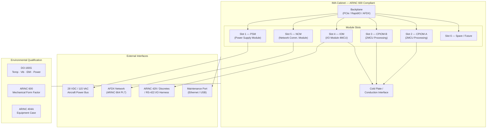

# ATLAS 040-049 · Section 04 · Subsection 042 · 010 — IMA Cabinets and Core Modules

## 1. Purpose

This document defines the physical architecture of IMA cabinets and core modules within the Q+ATLANTIDE ATLAS framework. It establishes the mechanical, electrical, and environmental requirements for IMA enclosures, the distinction between Line Replaceable Units (LRUs) and Line Replaceable Modules (LRMs), and the integration standards that govern cabinet design, backplane architecture, and module interconnect. The document provides the authoritative physical interface reference for hardware design, installation engineering, and line maintenance operations pertaining to ATA Chapter 42 IMA cabinets.

The design philosophy is centred on the ARINC 600 standard family for avionics enclosures, complemented by ARINC 404A for equipment cases and DO-160G for environmental qualification. Standardisation of the physical envelope enables multi-vendor sourcing, interoperability, and simplified line maintenance through tool-less or single-fastener module replacement procedures consistent with aircraft operator requirements for maximum dispatch reliability.

## 2. Scope

This subject covers:

- IMA cabinet types: closed-box LRU cabinets versus open-architecture LRM/slot-card cabinets.
- ARINC 600 rack dimensions, unit sizes (MCU), and connector pin assignments.
- Backplane architecture: high-speed serial interconnect (RapidIO, PCIe) versus legacy parallel buses.
- Module form factors: standard module sizes conforming to ARINC 600 2MCU and 4MCU.
- Electromagnetic compatibility (EMC) shielding design per RTCA DO-160G Section 20/21.
- Mechanical envelope constraints: weight, vibration isolation, and shock qualification.
- Cooling provisions: conduction-cooled versus convection-cooled module interfaces.
- Module interconnect standards and connector keying for error-proofing during maintenance.
- Cabinet installation provisions, including airframe attachment interfaces and harness routing.

## 3. Glossary

| Term / Acronym | Definition |
|---|---|
| LRU | Line Replaceable Unit — a self-contained avionics box replaceable at the flight-line level, typically conforming to ARINC 600 mechanical standards with an integrated power supply and I/O connectors. |
| LRM | Line Replaceable Module — a plug-in card or module within an IMA cabinet that can be replaced at line maintenance level, enabling more granular repair without replacing the entire cabinet. |
| ARINC 600 | ARINC Specification 600 — "Air Transport Avionics Equipment Interfaces", defining standard mechanical dimensions, connector types, and rack form factors for avionics LRUs and LRMs. |
| MCU | Modular Concept Unit — the standardised size unit defined in ARINC 600, where 1 MCU ≈ 38.6 mm wide, used to quantify module width in an IMA cabinet slot configuration. |
| Backplane | The passive or active interconnect structure within an IMA cabinet that provides power distribution, signal routing, and high-speed data paths between installed modules. |
| DO-160G | RTCA DO-160G — "Environmental Conditions and Test Procedures for Airborne Equipment", the environmental qualification standard covering temperature, humidity, vibration, shock, EMI, and power characteristics. |
| EMC | Electromagnetic Compatibility — the ability of equipment to function correctly in its electromagnetic environment without introducing unacceptable electromagnetic disturbance to other systems, per DO-160G Sections 20 and 21. |
| Conduction Cooling | A thermal management technique in which heat is transferred from the module via the card edge into the cabinet cold plate or heat exchanger, rather than by convective airflow over components. |
| ARINC 404A | ARINC Specification 404A — "Air Transport Equipment Cases and Racking", defining standard chassis dimensions and mounting provisions for avionics equipment used in aircraft equipment bays. |
| TIM | Thermal Interface Material — a compliant, thermally conductive compound or pad used between a module's heat-generating components and the cabinet cold plate to minimise contact thermal resistance. |

## 4. Diagram (Mermaid)

## 5. Footprint

| Metric | Value |
|---|---|
| Architecture | `ATLAS` — Aircraft Top Level Architecture Schema/System (controlled term) |
| Master range | `000–099` |
| Code range | `040-049` |
| Section | `04` — Aviónica, Información & APU |
| Subsection | `042` — Integrated Modular Avionics |
| Subsubject | `010` — IMA Cabinets and Core Modules |
| Primary Q-Division | Q-DATAGOV[^qdiv] |
| Support Q-Divisions | Q-AIR, Q-SPACE, Q-HPC |
| ORB support | ORB-PMO, ORB-LEG |
| Governance class | `baseline`[^gov] |
| Folder path | `Q+ATLANTIDE/000-099_ATLAS/040-049_Avionica-Informacion-y-APU/042_Integrated-Modular-Avionics/` |
| Document | `042-010-IMA-Cabinets-and-Core-Modules.md` (this file) |
| Parent subsection | [`README.md`](./README.md) |
| Parent section | [`../../README.md`](../../README.md) |
| Parent architecture | [`../../../README.md`](../../../README.md) |
| Parent baseline | [`organization/Q+ATLANTIDE.md`](../../../../organization/Q+ATLANTIDE.md) |

## 6. References & Citations

[^baseline]: Q+ATLANTIDE controlled baseline (v1.0.0) — the governing programme baseline document for all ATLAS architecture artefacts. Maintained under configuration management per the Q+ATLANTIDE governance framework.

[^qdiv]: Q-Division authority — Q-DATAGOV holds primary governance authority over IMA architecture documentation, data integrity, and configuration control within the Q+ATLANTIDE programme.

[^gov]: Governance class — `baseline` denotes that this document forms part of the formally controlled baseline configuration. Changes require formal change-request approval through ORB-PMO.

[^n001]: Note N-001 — Cabinet installation drawings and ARINC 600 dimensional compliance matrices shall be maintained in the IMA Hardware Design Record (HDR-042-010) under Q-AIR configuration management.

[^arinc600]: ARINC Specification 600-22 — "Air Transport Avionics Equipment Interfaces", Airlines Electronic Engineering Committee (AEEC), Annapolis MD. Defines mechanical dimensions, connector standards, and cooling interfaces for airborne avionics equipment.

[^arinc404a]: ARINC Specification 404A — "Air Transport Equipment Cases and Racking", AEEC. Governs standard equipment case dimensions and aircraft rack mounting provisions.

[^do160g]: RTCA DO-160G / EUROCAE ED-14G — "Environmental Conditions and Test Procedures for Airborne Equipment", RTCA Inc., 2010. The environmental qualification test standard for all airborne electronic equipment installed on transport category aircraft.

[^do254]: RTCA DO-254 / EUROCAE ED-80 — "Design Assurance Guidance for Airborne Electronic Hardware", RTCA Inc., 2000. Applied to backplane and module hardware design at the appropriate Design Assurance Level.
