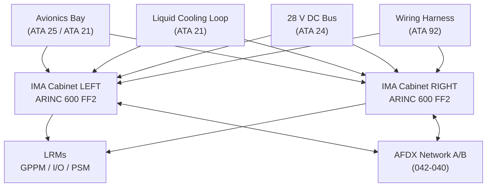
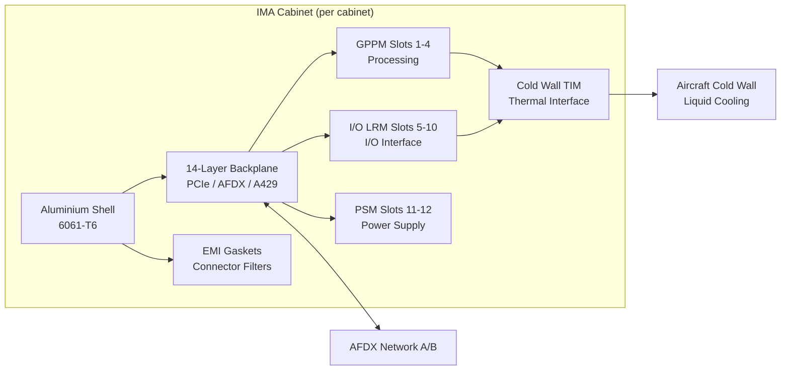
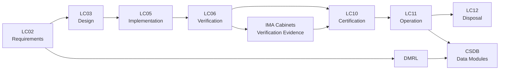

# ATLAS 040-049 · Section 04 · Subsection 042 · 010 — IMA Cabinets and Core Modules

## 0. Hyperlink Policy

All internal cross-references use relative Markdown links resolved within the Q+ATLANTIDE CSDB repository. External regulatory citations appear in §19 (Citations) and §20 (References) with identifiers marked  pending publication indexing. Parent context: [ATLAS 042 README](./README.md) · [042-000 General](./042-000-Integrated-Modular-Avionics-General.md).

---

## 1. Purpose

This document defines the physical cabinet architecture, structural mounting provisions, backplane interconnect design, EMI/EMC shielding strategy, and thermal management approach for the AMPEL360E IMA cabinets and their constituent Line Replaceable Modules (LRMs). It establishes the mechanical and electrical framework within which all IMA computing, I/O, and power supply modules are housed and interconnected.

The document governs:
- ARINC 600 cabinet mechanical and electrical specifications for the AMPEL360E IMA installation.
- Backplane signal routing architecture, connector standards, and signal segregation rules.
- EMI/EMC compliance approach per DO-160G Section 20 (Emission) and Section 19 (Susceptibility).
- Thermal management design including cold-wall conduction and convective airflow provisions.
- LRM accommodation rules including keying, polarisation, and extraction tool requirements.

---

## 2. Applicability

| Attribute | Value |
|-----------|-------|
| Aircraft Program | AMPEL360E eWTW |
| ATA Chapter | ATA 42 — Integrated Modular Avionics |
| Certification Basis | CS-25 Amendment 28; DO-160G Issue G |
| Applicable Standards | ARINC 600; ARINC 404A; MIL-HDBK-5400; MIL-STD-810H; DO-160G |
| Design Assurance Level | Cabinet Structure: DAL C; Backplane: DAL B; LRM Interface: DAL B |
| Configuration | AMPEL360E Build Standard 1.0 and above |

---

## 3. System / Function Overview

The AMPEL360E IMA installation comprises two physically independent cabinets designated IMA-CAB-LEFT and IMA-CAB-RIGHT installed in the forward avionics bay. Each cabinet is an ARINC 600 Form Factor 2 (FF2) enclosure accommodating up to 12 LRM slots on a single mid-plane backplane.

The cabinet backplane provides:
- High-speed differential serial interconnects between GPPM and I/O LRMs (PCIe Gen3 ×4 lanes per slot).
- AFDX end-system connections bridging internal slot backplane to external AFDX A/B network connectors.
- Power distribution rails (28 V DC, 5 V, 3.3 V, 1.8 V) from the Power Supply Module (PSM) to all LRM slots.
- Chassis ground bus and EMI bonding points per MIL-HDBK-1857.

The LRU/LRM distinction is fundamental: LRMs are not standalone functional units but rather modular resources managed by the IMA platform. A faulted LRM is replaced by an identical spare; the platform re-allocates its resources to restore hosted application services.

---

## 4. Scope

### 4.1 Included

- IMA cabinet structural shell, mounting rails, and rack attachment provisions.
- Backplane PCB design requirements, signal routing, and connector specifications.
- EMI/EMC shielding design for cabinet shell and connector panel.
- Cabinet thermal management: cold-wall heat spreading, airflow path, and thermal interface materials.
- LRM slot keying, polarisation, module extraction handle, and locking mechanism.
- Cabinet-to-aircraft bonding, grounding strap, and lightning protection provisions.
- Cabinet front-panel indicators and maintenance connector provisions.

### 4.2 Excluded

- Internal LRM design (covered in 042-020 for GPPMs, 042-050 for power/cooling LRMs).
- External AFDX network switches (covered in 042-040).
- Aircraft avionics bay structure and environmental control (covered in ATA 25 and ATA 21).
- Wiring harness routing from cabinet to aircraft systems (covered in ATA 92).

---

## 5. Architecture Description

**Cabinet Shell:** Each cabinet is constructed from 6061-T6 aluminium alloy with a nominal wall thickness of 3 mm, providing structural rigidity under DO-160G §8 vibration loads and §6 acceleration loads. The front face incorporates a full-perimeter EMI gasket compressing against the front panel EMI-sealed connector field.

**Backplane Architecture:** The mid-plane backplane uses a 14-layer PCB with controlled impedance differential pairs (100 Ω for PCIe, 120 Ω for ARINC 429). Power planes are segregated from signal planes by ground planes to achieve >40 dB isolation. Each of the 12 LRM slots presents a 240-pin ARINC 600-compliant connector pair (primary + secondary) with mechanical keying unique to each slot type (GPPM, I/O LRM, PSM).

**Segregation:** GPPM slots occupy positions 1–4; I/O LRM slots occupy positions 5–10; PSM slots occupy positions 11–12. Physical keying prevents incorrect LRM insertion. Signal pairs for power, AFDX, and ARINC 429 are routed in separate backplane layers.

**EMI/EMC:** The cabinet assembly achieves ≥60 dB shielding effectiveness from 10 kHz to 18 GHz per MIL-STD-461G RS103 and CS114. All external signal connectors include integral EMI filters (common-mode chokes + X2Y capacitors) rated for DO-160G §19 susceptibility levels Category B.

**Thermal Management:** LRMs use conduction cooling to the cabinet cold wall. The cold wall interfaces with the aircraft avionics bay liquid cooling loop via a quick-disconnect thermal bus bar. Thermal interface material (TIM) between LRM wedge locks and cold wall achieves ≤0.05 °C·cm²/W contact resistance. Maximum LRM baseplate temperature is 85°C at 55°C coolant inlet.

---

## 6. Functional Breakdown

| Function ID | Function Name | Description | DAL | Owner |
|-------------|---------------|-------------|-----|-------|
| F-042-01 | Cabinet Structural Support | Maintain LRM mechanical registration and structural integrity under CS-25 §25.301 load cases including 9g forward, 3g lateral, 6g downward | C | Q-MECHANICS |
| F-042-02 | Backplane Signal Routing | Route PCIe, AFDX, ARINC 429, discrete, and power signals between LRM slots with controlled impedance and crosstalk < -40 dB | B | Q-HPC |
| F-042-03 | EMI Shielding | Provide ≥60 dB shielding effectiveness to prevent radiated emissions and susceptibility non-compliances per DO-160G §19/§20 | B | Q-DATAGOV |
| F-042-04 | Thermal Management | Maintain LRM baseplate temperature ≤85°C under maximum load with 55°C inlet coolant, using cold-wall conduction to aircraft liquid loop | B | Q-MECHANICS |
| F-042-05 | LRM Accommodation | Provide keyed, polarised LRM slots with extraction handles; support no-tools LRM replacement within 15 min by avionics technician | B | Q-MECHANICS |

---

## 7. Mermaid — System Context Diagram

---

## 8. Mermaid — Internal Functional Architecture

---

## 9. Mermaid — Lifecycle Traceability

---

## 10. Interfaces

| Interface ID | Name | Type | Counterpart System | Protocol | Direction |
|--------------|------|------|--------------------|----------|-----------|
| IF-042-01 | Cabinet to Avionics Bay Structure | Mechanical | Aircraft Avionics Bay (ATA 25) | ARINC 600 rack rail, 4-point mount | Physical |
| IF-042-02 | Cabinet to Liquid Cooling | Thermal | Aircraft ECS Liquid Loop (ATA 21) | Quick-disconnect thermal bus bar | Thermal |
| IF-042-03 | Cabinet to Aircraft Power | Electrical | EPDC (ATA 24) | 28 V DC, MIL-W-22759 wiring | Input |
| IF-042-04 | Cabinet to AFDX Network | Data | AFDX Switches (042-040) | ARINC 664 Part 7 rear-panel connector | Bidirectional |
| IF-042-05 | Cabinet to Wiring Harness | Electrical/Data | Aircraft wiring (ATA 92) | MIL-DTL-38999 Series III connectors | Bidirectional |
| IF-042-06 | Cabinet to Ground Bus | Electrical | Aircraft Structure Ground (ATA 24) | MIL-HDBK-1857 bonding strap | Ground |

---

## 11. Operating Modes

| Mode | Name | Description | Entry Condition | Exit Condition |
|------|------|-------------|-----------------|----------------|
| M1 | Cold Standby | Cabinet powered down; cooling active; LRMs latched and secured | Aircraft power off | Power applied to PSM |
| M2 | Power-Up | PSM active; backplane rails energised; LRM power-on sequencing | Power applied | All LRM rails stable |
| M3 | Normal Operation | All LRMs operational; thermal within limits; EMI performance nominal | Power-up complete | Fault or power removal |
| M4 | Degraded | One PSM faulted; remaining PSM supporting reduced LRM set; thermal margins reduced | PSM fault detected | PSM replacement |
| M5 | Maintenance | Cabinet front panel accessible; LRM extraction possible; ground power only | Aircraft on ground, maintenance mode | Maintenance complete |

---

## 12. Monitoring and Diagnostics

- **Backplane Continuity Test:** At power-up, backplane signal continuity is verified by GPPM loopback test on each PCIe link; failed links are isolated and reported to CMC.
- **PSM Rail Monitoring:** Each PSM continuously monitors 28 V, 5 V, 3.3 V, and 1.8 V rails with ±2% tolerance windows; out-of-tolerance events trigger fault records.
- **Thermal Sensors:** Each LRM slot incorporates a calibrated NTC thermistor on the cold wall; temperatures logged at 1 Hz; alert threshold 80°C, shutdown threshold 90°C.
- **EMI Filter Status:** EMI filter insertion loss is verified at IBIT via network analyser stimulus on maintenance connector; degraded filter flagged for replacement.
- **LRM Seat Detection:** Hall-effect sensors on each slot latch confirm LRM fully seated; partial-seat condition prevents power application and generates CMC alert.
- **Cabinet Bonding Resistance:** Bonding resistance between cabinet chassis and aircraft structure verified at C-Check ≤2.5 mΩ per MIL-HDBK-1857.
- **Coolant Flow Monitoring:** Coolant flow sensor on liquid cooling quick-disconnect confirms minimum 2 L/min flow; low-flow condition triggers degraded thermal mode.
- **Vibration Monitoring:** Piezoelectric accelerometers on each cabinet corner log vibration spectrum; anomalous signature triggers PHM alert for structural inspection.

---

## 13. Maintenance Concept

| Task ID | Task Description | Interval | Access | Skill Level |
|---------|-----------------|----------|--------|-------------|
| MC-042-01 | Cabinet external visual inspection, bonding strap continuity check | Pre-flight / A-Check | Avionics Bay Access Panel | Line Mechanic |
| MC-042-02 | LRM seat detection and thermal sensor functional check | A-Check | Ground Support Terminal | Avionics Technician |
| MC-042-03 | LRM removal, inspection, and replacement | On-Condition | ARINC 600 slot extraction | Avionics Technician |
| MC-042-04 | Backplane visual inspection for contamination, corrosion, and contact wear | C-Check | Cabinet disassembly | Avionics Engineer |
| MC-042-05 | Thermal interface material (TIM) inspection and replacement | D-Check / On-Condition | LRM removal, TIM strip | Avionics Engineer |

---

## 14. S1000D / CSDB Mapping

| Data Module Code (DMC) | Title | Publication Type | SNS |
|------------------------|-------|-----------------|-----|
| QATL-A-042-01-00-00AAA-040A-A | IMA Cabinet Description | AMM | 042-010 |
| QATL-A-042-01-00-00AAA-520A-A | Cabinet BITE and Thermal Check Procedures | AMM | 042-010 |
| QATL-A-042-01-00-00AAA-920A-A | Cabinet Fault Isolation — PSM and Backplane | FIM | 042-010 |
| QATL-A-042-01-00-00AAA-941A-A | IMA Cabinet Illustrated Parts Data | IPD | 042-010 |

### Recommended DM Set

| DM Role | DMC Suffix | Content |
|---------|-----------|---------|
| System Overview | 040A | Cabinet architecture, backplane, thermal design |
| BITE Procedure | 520A | Thermal sensor check, PSM rail test, bonding check |
| Fault Isolation | 920A | Backplane fault codes, PSM fault isolation trees |
| IPD | 941A | Cabinet PN, LRM slot part numbers, TIM PN |

---

## 15. Footprints

### 15.1 Physical

| Item | Value |
|------|-------|
| Cabinet External Dimensions | 420 mm × 320 mm × 220 mm (W×H×D) |
| Cabinet Empty Mass | 8.5 kg |
| Cabinet Fully Populated Mass | ≤22 kg |
| Mounting Footprint | ARINC 600 FF2, 4 × M6 vibration isolators |

### 15.2 Electrical / Data

| Parameter | Value |
|-----------|-------|
| Backplane PCIe Bandwidth | 4 GB/s per GPPM slot (PCIe Gen3 ×4) |
| Backplane Power Rails | 28 V / 5 V / 3.3 V / 1.8 V DC |
| Connector Type (external) | MIL-DTL-38999 Series III |
| EMI Shielding Effectiveness | ≥60 dB, 10 kHz–18 GHz |

### 15.3 Maintenance

| Parameter | Value |
|-----------|-------|
| LRM Extraction Tool | None required (spring-loaded handle) |
| LRM Replacement Time | <15 min |
| Cabinet Disassembly Time | <45 min (C-Check access) |

### 15.4 Data

| Parameter | Value |
|-----------|-------|
| Thermal Log Retention | 72-hour rolling buffer in NVM |
| Backplane BITE Test Duration | <3 min at power-up |
| LRM Seat Sensor Resolution | Binary (seated / not-seated) |

---

## 16. Safety and Certification Considerations

- **Structural Loads:** Cabinet design demonstrates compliance with CS-25 §25.301 and §25.305 under 9g forward, 3g lateral, and 6g downward inertia loads per crash conditions in §25.561.
- **EMI/EMC Certification:** Cabinet-level EMI testing per DO-160G Sections 17–22 performed at qualified test facility; results submitted as part of ETSO-C119e compliance evidence.
- **Thermal Runaway Prevention:** Individual LRM over-temperature shutdown prevents thermal runaway propagating between LRMs; cabinet-level thermal analysis confirms no fire risk under single-LRM fault.
- **Flammability:** All cabinet materials comply with CS-25 §25.853 flammability requirements; materials test reports included in CSDB.
- **LRM Keying:** Physical keying on each LRM slot type prevents incorrect installation that could cause electrical damage; keying scheme documented in IPC/IPD.
- **Bonding and Lightning:** Cabinet-to-structure bonding resistance ≤2.5 mΩ ensures adequate lightning protection per CS-25 Appendix F, Part I; lightning indirect effect analysis demonstrates no upset of IMA functions.

---

## 17. Verification and Validation

| V&V ID | Requirement | Method | Evidence | Status |
|--------|-------------|--------|----------|--------|
| VV-042-01 | Cabinet withstands 9g forward crash load without LRM ejection | Test | Structural test report |  |
| VV-042-02 | Backplane PCIe links meet BER <10⁻¹² at max cable length | Test | Signal integrity measurement |  |
| VV-042-03 | Cabinet EMI shielding ≥60 dB across 10 kHz–18 GHz | Test | EMC test report per DO-160G §19/§20 |  |
| VV-042-04 | LRM baseplate ≤85°C at 55°C coolant, full load | Test | Thermal test report |  |
| VV-042-05 | LRM replacement time ≤15 min by single technician | Test | Human factors test |  |
| VV-042-06 | Cabinet bonding resistance ≤2.5 mΩ | Test | Bond resistance measurement |  |
| VV-042-07 | All cabinet materials pass CS-25 §25.853 flammability | Test | Flammability test reports |  |

---

## 18. Glossary

| Term | Acronym | Definition |
|------|---------|------------|
| ARINC 600 | — | Avionics standard defining physical form factors, connector types, and rack dimensions for avionics equipment |
| Line Replaceable Module | LRM | Modular plug-in unit designed for insertion into an IMA cabinet backplane slot |
| Line Replaceable Unit | LRU | Traditional avionics box; self-contained functional unit not hosted in a shared cabinet |
| Electromagnetic Interference | EMI | Unwanted electrical signals that can interfere with avionics equipment operation |
| Electromagnetic Compatibility | EMC | Ability of equipment to function without causing or suffering from EMI |
| Shielding Effectiveness | SE | Measure of reduction in electromagnetic field strength achieved by a shielding enclosure |
| Mid-Plane Backplane | MCM | Central PCB within IMA cabinet providing electrical interconnect between all LRM slots |
| Cold Wall | — | Cabinet thermal management surface that conducts heat from LRM base plates to aircraft cooling loop |
| Thermal Interface Material | TIM | Compound placed between LRM wedge lock and cold wall to minimise thermal contact resistance |
| MIL-HDBK-5400 | — | Military handbook for airborne electronic equipment design criteria |

---

## 19. Citations

| Ref ID | Standard / Document | Applicability | Status |
|--------|--------------------|-----------|----|
| CIT-042-01 | ARINC 600, Air Transport Avionics Equipment Interfaces | Cabinet form factor and connector standard |  |
| CIT-042-02 | RTCA DO-160G, Environmental Conditions and Test Procedures for Airborne Equipment | EMI, vibration, temperature testing |  |
| CIT-042-03 | MIL-HDBK-5400, Airborne Electronic Equipment | Cabinet structural and thermal design guidance |  |
| CIT-042-04 | MIL-HDBK-1857, Grounding, Bonding and Shielding Design Practices | Cabinet bonding and lightning protection |  |
| CIT-042-05 | EASA CS-25 §25.853, Compartment Interiors Flammability | Cabinet materials flammability |  |
| CIT-042-06 | EASA CS-25 §25.301/§25.305, Structural Loads | Cabinet crash load requirements |  |
| CIT-042-07 | MIL-STD-461G, Requirements for the Control of Electromagnetic Interference | EMI test requirements |  |
| CIT-042-08 | ARINC 404A, Air Transport Equipment Cases and Racking | Rack and connector dimensions |  |

---

## 20. References

| Ref ID | Document | Version | Status |
|--------|----------|---------|--------|
| REF-042-01 | AMPEL360E IMA Cabinet Interface Control Document | 1.0 |  |
| REF-042-02 | 042-000 IMA General | 1.0 |  |
| REF-042-03 | AMPEL360E Avionics Bay Structural Analysis | 1.0 |  |
| REF-042-04 | IMA Cabinet Thermal Analysis Report | 1.0 |  |

---

## 21. Open Issues

| Issue ID | Description | Owner | Status |
|----------|-------------|-------|--------|
| OI-042-01 | Backplane PCIe Gen3 vs Gen4 trade study pending; Gen4 preferred for bandwidth headroom | Q-HPC |  |
| OI-042-02 | Liquid cooling quick-disconnect specification to be agreed with ATA 21 team | Q-MECHANICS |  |
| OI-042-03 | TIM material selection pending thermal cycling endurance test results | Q-MECHANICS |  |

---

## 22. Change Log

| Version | Date | Author | Description |
|---------|------|--------|-------------|
| 1.0.0 | 2025-01-01 | Q+ Team/Amedeo Pelliccia + AI | Initial baseline release |  |
