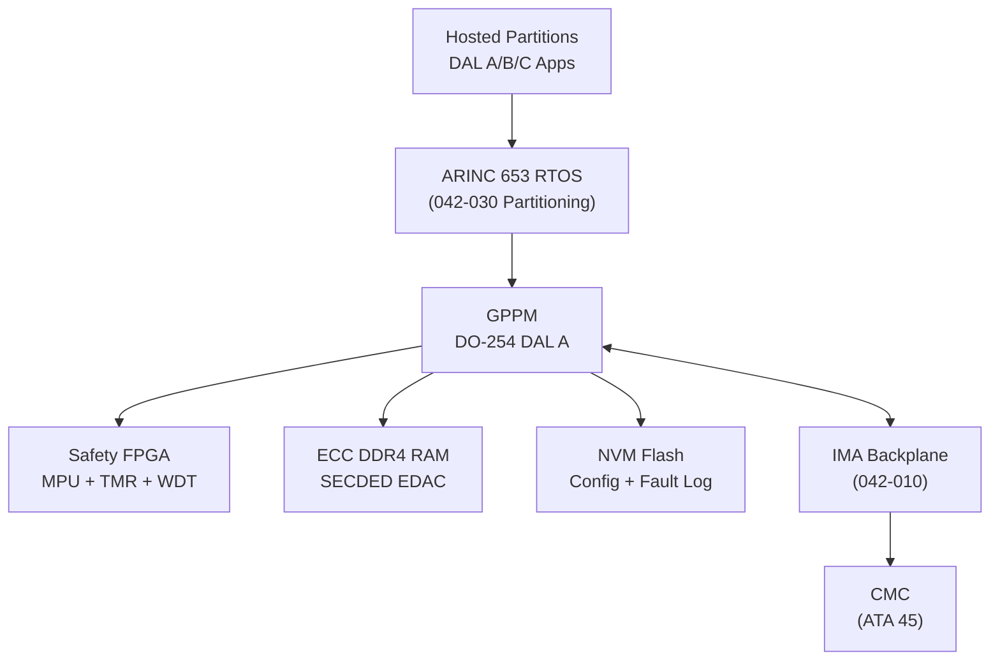
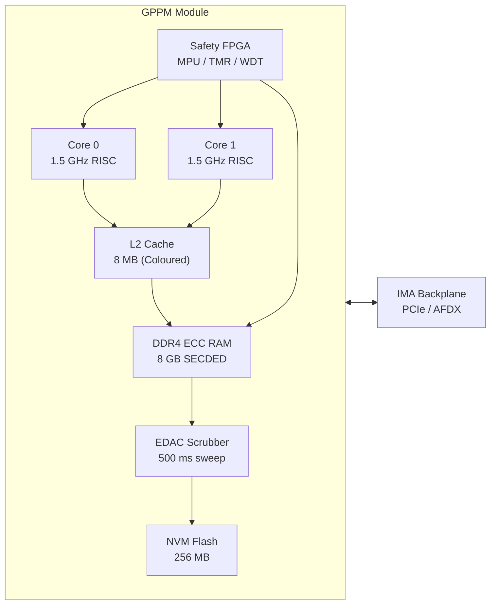
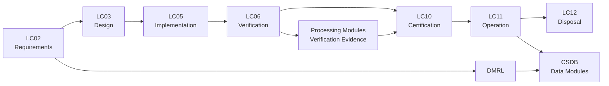

# ATLAS 040-049 · Section 04 · Subsection 042 · 020 — Processing Modules and Computing Resources

## 0. Hyperlink Policy

All internal cross-references use relative Markdown links within the Q+ATLANTIDE CSDB repository. External citations are in §19/§20 marked . Parent: [042 README](./README.md) · [042-000](./042-000-Integrated-Modular-Avionics-General.md).

---

## 1. Purpose

This document specifies the General-Purpose Processing Module (GPPM) and Core Processing I/O Module (CPIOM) architecture used in the AMPEL360E IMA system. It defines processing resource allocation, memory architecture, hardware redundancy strategies including Triple Modular Redundancy (TMR), FPGA safety configuration, and performance budgeting across hosted partitions. Compliance with DO-254 DAL A hardware assurance requirements is established for safety-critical processing elements.

Key governance areas:
- GPPM and CPIOM hardware architecture and DO-254 qualification evidence structure.
- Multi-core interference analysis per DO-297 §3.3 guidance on core-to-core interference channels.
- ECC RAM and Error Detection and Correction (EDAC) mechanisms protecting against Single Event Upsets (SEU).
- FPGA configuration management and DAL compliance for FPGA-implemented safety functions.
- MIPS/FLOPS budgeting methodology for partition CPU allocation.

---

## 2. Applicability

| Attribute | Value |
|-----------|-------|
| Aircraft Program | AMPEL360E eWTW |
| ATA Chapter | ATA 42 — Integrated Modular Avionics |
| Certification Basis | CS-25 Amendment 28 |
| Applicable Standards | DO-254 Issue C; DO-297; ARP4754B; JEDEC JESD89A (SEU) |
| Design Assurance Level | GPPM Hardware: DAL A; FPGA functions: DAL A; Memory EDAC: DAL A |
| Configuration | AMPEL360E Build Standard 1.0 and above |

---

## 3. System / Function Overview

Each AMPEL360E IMA cabinet houses four GPPMs. Each GPPM is a dual-core avionics processor module qualified to DO-254 DAL A providing:

- **Primary Processor:** Dual-core 64-bit RISC processor at 1.5 GHz per core (target 3000 MIPS aggregate per GPPM). Deterministic instruction cache (fixed mapping, no speculative prefetch) to ensure WCET analysability.
- **Safety FPGA:** Co-resident safety FPGA implementing hardware memory protection, watchdog timer, and TMR voter functions. FPGA configured from authenticated bitstream stored in write-protected OTP flash.
- **ECC RAM:** 8 GB DDR4 ECC SDRAM with SECDED (Single Error Correct, Double Error Detect) EDAC per JEDEC JESD79-4C. MBU (multi-bit upset) detection supplemented by scrubbing daemon.
- **Local NVM:** 256 MB NAND flash (write-levelled) for configuration data, fault logs, and software loading staging.
- **TMR Voter:** Hardware TMR voter implemented in safety FPGA for DAL A command outputs; majority vote with disagreement detection and channel isolation.

CPIOM modules provide combined processing and direct I/O capability for lower-latency sensor interfaces (ARINC 429, discrete) where I/O LRM path latency is unacceptable.

---

## 4. Scope

### 4.1 Included

- GPPM processor core, cache, and memory subsystem architecture.
- Safety FPGA design requirements and DO-254 qualification approach.
- ECC RAM and EDAC implementation, SEU sensitivity analysis.
- TMR voter architecture for DAL A hosted application outputs.
- Processing resource allocation and MIPS budgeting methodology.
- Multi-core interference analysis methodology and mitigation measures.
- GPPM thermal dissipation requirements and cold-wall interface.

### 4.2 Excluded

- Hosted application software design (covered by application-specific DO-178C plans).
- ARINC 653 RTOS scheduling (covered in 042-030 Partitioning).
- I/O LRM hardware design (covered in 042-010).
- FPGA-based I/O processing detailed design (covered in 042-050).

---

## 5. Architecture Description

**Processor Core:** The AMPEL360E GPPM employs a dual-core deterministic RISC processor with separate instruction and data caches (32 kB each, direct-mapped). Speculative execution is disabled to prevent non-deterministic cache miss behaviour that would invalidate WCET analysis. Inter-core communication uses shared L2 cache with hardware coherency disabled; partitions accessing L2 are allocated non-overlapping cache sets via the ARINC 653 cache colouring mechanism.

**Multi-Core Interference Mitigation:** Following DO-297 §3.3 guidance, interference channels identified include shared L2 cache, memory bus arbitration, and PCIe DMA controller contention. Mitigations are: (1) cache colouring assigning unique cache sets per partition; (2) memory bus time-division multiplexing enforced by FPGA memory arbiter; (3) DMA transfers restricted to partition-allocated time windows in the ARINC 653 major frame.

**FPGA Safety Functions:** The co-resident Xilinx Ultrascale+ FPGA (radiation-tolerant package) implements: hardware memory protection unit (MPU) enforcing ARINC 653 spatial partitioning at hardware level (supplementary to MMU); dual-redundant watchdog timer; and TMR voter for DAL A command channels. FPGA development follows DO-254 DAL A planning with design capture in VHDL, formal verification of MPU state machine, and hardware/software integration testing.

**EDAC:** DDR4 ECC SDRAM corrects single-bit upsets inline. The scrubbing daemon (implemented in FPGA) sweeps all RAM pages every 500 ms, correcting accumulated SEUs before double-bit errors occur. EDAC events are logged to NVM and reported to CMC.

**MIPS Budget:** Total GPPM compute budget is 3000 MIPS. ARINC 653 schedule allocates: 40% to DAL A flight-critical partitions, 35% to DAL B operational partitions, 15% to DAL C cabin partitions, 10% reserved as scheduling margin. Peak utilisation is verified ≤80% at platform qualification.

---

## 6. Functional Breakdown

| Function ID | Function Name | Description | DAL | Owner |
|-------------|---------------|-------------|-----|-------|
| F-042-01 | Processing Resource Allocation | Allocate CPU time-slices, cache sets, and memory regions to ARINC 653 partitions per approved schedule | A | Q-HPC |
| F-042-02 | Memory Management | Enforce hardware memory protection between partitions; provide EDAC-protected DDR4 memory with <10⁻⁹/FH probability of undetected multi-bit error | A | Q-HPC |
| F-042-03 | Hardware Redundancy Management | Operate TMR voter for DAL A command outputs; detect voter disagreement and isolate faulted channel within one major frame | A | Q-DATAGOV |
| F-042-04 | FPGA Configuration Control | Authenticate FPGA bitstream from OTP flash at power-up; reject unauthorised configurations; log configuration events to NVM | A | Q-DATAGOV |
| F-042-05 | Performance Monitoring | Measure and log CPU utilisation, memory access latency, and cache miss rate per partition at 100 ms intervals; alert HM if budget exceeded | B | Q-HPC |

---

## 7. Mermaid — System Context Diagram

---

## 8. Mermaid — Internal Functional Architecture

---

## 9. Mermaid — Lifecycle Traceability

---

## 10. Interfaces

| Interface ID | Name | Type | Counterpart System | Protocol | Direction |
|--------------|------|------|--------------------|----------|-----------|
| IF-042-01 | GPPM to Backplane | Data/Power | IMA Backplane (042-010) | PCIe Gen3 ×4; 28 V DC | Bidirectional |
| IF-042-02 | GPPM to ARINC 653 RTOS | Software | RTOS Platform (042-030) | APEX API (ARINC 653) | Bidirectional |
| IF-042-03 | FPGA to CPU Interrupt | Hardware | GPPM CPU Cores | IRQ line (FPGA to CPU) | Output |
| IF-042-04 | GPPM to CMC | Data | CMC (ATA 45) | ARINC 429 via backplane | Output |
| IF-042-05 | GPPM to Data Loader | Data | DLCS (042-060) | ARINC 615A Ethernet via backplane | Bidirectional |
| IF-042-06 | GPPM to Cold Wall | Thermal | Cabinet Cold Wall (042-010) | Conduction via wedge locks | Output (heat) |

---

## 11. Operating Modes

| Mode | Name | Description | Entry Condition | Exit Condition |
|------|------|-------------|-----------------|----------------|
| M1 | Power-On Self Test | Test CPU cores, L2 cache integrity, FPGA bitstream authentication, DDR4 EDAC | Power applied | POST pass or fault |
| M2 | FPGA Configuration | Load and authenticate FPGA bitstream from OTP flash; verify CRC | POST pass | FPGA DONE asserted |
| M3 | Normal Processing | RTOS running; partitions executing per ARINC 653 schedule; EDAC scrubbing active | FPGA configured | Fault or power-down |
| M4 | Degraded — Single Core | One CPU core faulted; RTOS schedule adjusted to single-core execution; reduced throughput | Core fault detected | Core replacement or maintenance |
| M5 | Maintenance | IBIT running; FPGA loopback; RAM march test; performance benchmark | Ground power; maintenance mode | Maintenance complete |

---

## 12. Monitoring and Diagnostics

- **EDAC Event Counting:** Single-bit correction events counted per 100 ms window; rate >10/s triggers CMC fault record; double-bit detection triggers immediate partition halt and report.
- **CPU Utilisation Monitor:** FPGA performance counter measures instructions retired per partition per major frame; >80% utilisation triggers CMC advisory.
- **WCET Overrun Detection:** FPGA partition timer detects temporal partition budget overrun; overrun triggers HM action (partition restart) and CMC fault log entry.
- **TMR Voter Monitoring:** Voter disagreement rate logged; >0.1% disagreement rate in one hour triggers CMC caution and engineering investigation request.
- **FPGA Configuration Integrity:** FPGA readback verification executed every 60 seconds via JTAG interface; mismatch triggers immediate FPGA reconfiguration and CMC alert.
- **Scrubber Health:** EDAC scrubber pass completion logged every 500 ms; scrubber stall (no completion within 1 s) triggers CMC fault and partition suspension.
- **Thermal Die Temperature:** On-die thermal sensors on CPU and FPGA provide die temperature at 100 ms; >95°C triggers thermal throttling and CMC caution.
- **SEU Rate Trend:** PHM algorithm tracks long-term SEU rate; increasing trend (>2σ above baseline) triggers RUL degradation advisory for GPPM replacement scheduling.

---

## 13. Maintenance Concept

| Task ID | Task Description | Interval | Access | Skill Level |
|---------|-----------------|----------|--------|-------------|
| MC-042-01 | EDAC event log download and analysis | A-Check | Ground Support Terminal | Avionics Technician |
| MC-042-02 | GPPM IBIT execution (RAM march test, CPU benchmark) | A-Check | Ground Support Terminal | Avionics Technician |
| MC-042-03 | GPPM removal and replacement | On-Condition | ARINC 600 slot extraction | Avionics Technician |
| MC-042-04 | FPGA bitstream version verification | Per SB | Software data loader | Avionics Technician |
| MC-042-05 | NVM flash wear-level and error rate inspection | C-Check | Ground Support Terminal | Avionics Engineer |

---

## 14. S1000D / CSDB Mapping

| Data Module Code (DMC) | Title | Publication Type | SNS |
|------------------------|-------|-----------------|-----|
| QATL-A-042-02-00-00AAA-040A-A | GPPM Processing Module Description | AMM | 042-020 |
| QATL-A-042-02-00-00AAA-520A-A | GPPM IBIT and EDAC Log Procedures | AMM | 042-020 |
| QATL-A-042-02-00-00AAA-920A-A | GPPM Fault Isolation — CPU/FPGA/RAM | FIM | 042-020 |
| QATL-A-042-02-00-00AAA-941A-A | GPPM Illustrated Parts Data | IPD | 042-020 |

### Recommended DM Set

| DM Role | DMC Suffix | Content |
|---------|-----------|---------|
| System Overview | 040A | GPPM architecture, FPGA, EDAC, TMR design |
| BITE Procedure | 520A | RAM march test, CPU benchmark, FPGA readback |
| Fault Isolation | 920A | SEU fault isolation, TMR disagreement analysis |
| IPD | 941A | GPPM PN, FPGA PN, RAM module PN |

---

## 15. Footprints

### 15.1 Physical

| Item | Value |
|------|-------|
| GPPM LRM Dimensions | 233.4 mm × 194.0 mm × 22.5 mm (ARINC 600 3MCU) |
| GPPM Mass | ≤1.2 kg |
| Quantity per Cabinet | 4 GPPMs |
| Total GPPM Mass per Cabinet | ≤4.8 kg |

### 15.2 Electrical / Data

| Parameter | Value |
|-----------|-------|
| GPPM Power Consumption | ≤35 W per module (nominal); ≤45 W (peak) |
| DDR4 Memory Bandwidth | 25.6 GB/s per GPPM |
| FPGA Logic Cells | 500 k (Ultrascale+) |
| NVM Endurance | 100,000 write cycles minimum |

### 15.3 Maintenance

| Parameter | Value |
|-----------|-------|
| GPPM Replacement Time | <10 min |
| EDAC Log Download Time | <2 min |
| IBIT Complete Duration | <5 min |

### 15.4 Data

| Parameter | Value |
|-----------|-------|
| EDAC Event Log Capacity | 10,000 events, FIFO with timestamp |
| CPU Utilisation Sample Rate | 10 Hz |
| FPGA Readback Period | 60 s |

---

## 16. Safety and Certification Considerations

- **DO-254 DAL A:** GPPM hardware development is planned and evidenced per DO-254 DAL A life cycle including requirements capture, design, implementation, and verification with 100% structural coverage (MC/DC at circuit level).
- **SEU Mitigation:** EDAC and FPGA scrubbing together achieve a residual undetected multi-bit error rate <1×10⁻⁹ per flight hour per GPPM, acceptable for DAL A hosted functions.
- **Multi-Core Interference:** Cache colouring and memory bus TDM demonstrated by worst-case execution time (WCET) measurement tests to bound interference below 5% of nominal execution time.
- **TMR Voter Independence:** TMR channels reside on physically separate GPPM modules in opposite cabinet halves; CCA confirms no common cause failure can defeat the voter.
- **FPGA Security:** OTP flash prevents runtime FPGA bitstream modification; configuration readback detects single event latch-up in FPGA fabric within one readback period.
- **Disposal:** GPPM NVM contains no classified data; wiping procedure per NIST SP 800-88 applied before disposal to protect sensitive algorithm parameters.

---

## 17. Verification and Validation

| V&V ID | Requirement | Method | Evidence | Status |
|--------|-------------|--------|----------|--------|
| VV-042-01 | EDAC corrects all single-bit upsets in DDR4 | Test (fault injection) | SEU injection test report |  |
| VV-042-02 | FPGA MPU prevents cross-partition memory access | Test | MPU boundary test suite |  |
| VV-042-03 | Multi-core interference bounded to ≤5% WCET impact | Analysis + Test | WCET measurement report |  |
| VV-042-04 | TMR voter isolates faulted channel within one major frame | Test (fault injection) | TMR voter test report |  |
| VV-042-05 | CPU utilisation ≤80% at full hosted application load | Test | Platform load test |  |
| VV-042-06 | FPGA bitstream authentication rejects corrupted bitstream | Test | Security test report |  |
| VV-042-07 | GPPM power consumption ≤45 W peak across DO-160G temperature range | Test | Power measurement report |  |

---

## 18. Glossary

| Term | Acronym | Definition |
|------|---------|------------|
| General-Purpose Processing Module | GPPM | IMA LRM providing dual-core processing, FPGA safety functions, and ECC memory |
| Core Processing I/O Module | CPIOM | Combined processing and direct I/O LRM for low-latency sensor interfacing |
| Triple Modular Redundancy | TMR | Fault-tolerance technique using three identical channels with hardware majority voting |
| Error Correction Code | ECC | Memory protection technique detecting and correcting bit errors using redundant bits |
| Field-Programmable Gate Array | FPGA | Programmable logic device used for safety functions (MPU, TMR voter, WDT) |
| Single Event Upset | SEU | Bit flip in memory or logic caused by ionising radiation (cosmic ray) |
| Multi-Bit Upset | MBU | Simultaneous upset of multiple bits in a single memory word due to high-energy particle |
| Millions of Instructions Per Second | MIPS | Measure of processor throughput used for CPU budget allocation |
| Error Detection and Correction | EDAC | Hardware mechanism correcting SEU in RAM and detecting MBU |
| DDR4 SDRAM | DDR4 | Double Data Rate 4 Synchronous Dynamic RAM; JEDEC standard for high-bandwidth memory |

---

## 19. Citations

| Ref ID | Standard / Document | Applicability | Status |
|--------|--------------------|-----------|----|
| CIT-042-01 | RTCA DO-254, Design Assurance Guidance for Airborne Electronic Hardware | GPPM DAL A hardware qualification |  |
| CIT-042-02 | RTCA DO-297, Integrated Modular Avionics Development Guidance | Multi-core interference analysis |  |
| CIT-042-03 | JEDEC JESD89A, Measurement and Reporting of Alpha Particle and Terrestrial Cosmic Ray-Induced SEU | SEU rate analysis methodology |  |
| CIT-042-04 | JEDEC JESD79-4C, DDR4 SDRAM Standard | Memory device specification |  |
| CIT-042-05 | ARINC 653 Part 1, Avionics Application Software Standard Interface | Cache colouring and partition memory allocation |  |
| CIT-042-06 | SAE ARP4754B, Guidelines for Development of Civil Aircraft and Systems | DAL allocation for processing modules |  |
| CIT-042-07 | NIST SP 800-88 Rev 1, Guidelines for Media Sanitization | NVM disposal wiping procedure |  |
| CIT-042-08 | EUROCAE ED-80 / RTCA DO-254 Harmonised | FPGA development assurance |  |

---

## 20. References

| Ref ID | Document | Version | Status |
|--------|----------|---------|--------|
| REF-042-01 | 042-000 IMA General | 1.0 |  |
| REF-042-02 | 042-030 Partitioning and Hosted Applications | 1.0 |  |
| REF-042-03 | AMPEL360E IMA GPPM Hardware Design Description | 1.0 |  |
| REF-042-04 | AMPEL360E IMA Multi-Core Interference Analysis | 1.0 |  |

---

## 21. Open Issues

| Issue ID | Description | Owner | Status |
|----------|-------------|-------|--------|
| OI-042-01 | FPGA vendor selection (Xilinx vs Microchip RTAX) pending radiation tolerance trade study | Q-HPC |  |
| OI-042-02 | Cache colouring methodology for tri-core vs dual-core RTOS schedule to be finalised | Q-HPC |  |
| OI-042-03 | MIPS budget reallocation required if FMS navigation function migrates to DAL A | Q-DATAGOV |  |

---

## 22. Change Log

| Version | Date | Author | Description |
|---------|------|--------|-------------|
| 1.0.0 | 2025-01-01 | Q-HPC | Initial baseline release |  |
