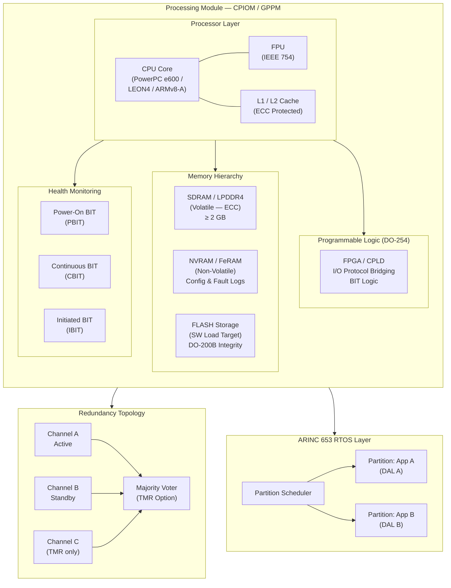

# ATLAS 040-049 · Section 04 · Subsection 042 · 020 — Processing Modules and Computing Resources

## 1. Purpose

This document characterises the processing modules and computing resources that form the computational core of the IMA platform within the Q+ATLANTIDE ATLAS framework. It covers General Purpose Processing Modules (GPPMs) and Core Processing and I/O Modules (CPIOMs), the processor architectures qualified for safety-critical avionics use, the memory hierarchy design, hardware health monitoring, and the redundancy topologies applied to meet the integrity and availability requirements mandated by CS-25 and ARP4754A.

The processing resource layer is the most critical hardware tier within the IMA platform, directly influencing the achievable Design Assurance Level (DAL) mix of hosted applications, the spatial and temporal partitioning effectiveness, and the overall dependability of the avionics system. Compliance with RTCA DO-254 is required at the hardware design level, and compatibility with ARINC 653 runtime environments must be demonstrated as a prerequisite to hosted application qualification.

## 2. Scope

This subject covers:

- GPPM and CPIOM module types, architectures, and qualification lineage.
- Processor families approved for safety-critical aviation: Freescale/NXP PowerPC e500/e600, Cobham LEON3/LEON4 (SPARC V8), and emerging ARMv8-A safety-configured variants.
- Memory hierarchy: volatile SDRAM/LPDDR4, non-volatile NVRAM/FeRAM, and FLASH storage for software and configuration data.
- DO-254 applicability: hardware design assurance for programmable logic devices (FPGAs, ASICs) embedded in processing modules.
- Built-in Test (BIT) / health monitoring architecture: power-on BIT, continuous BIT, and initiated BIT.
- Redundancy schemes: dual-redundant (active-standby), triple modular redundancy (TMR), and cross-channel data comparison.
- Interface to the ARINC 653 real-time operating system and partition scheduling engine.

## 3. Glossary

| Term / Acronym | Definition |
|---|---|
| GPPM | General Purpose Processing Module — an IMA processing card providing computational resources (CPU, memory, local I/O) to multiple hosted application partitions, defined in the RTCA DO-297 IMA framework. |
| CPIOM | Core Processing and I/O Module — an IMA module variant combining processing resources with direct I/O capabilities (ARINC 429 receivers/transmitters, discretes), reducing the need for separate I/O modules in some architectures. |
| LEON | A SPARC V8-architecture radiation-tolerant processor developed by ESA and commercialised by Cobham (formerly Aeroflex Gaisler); widely used in safety-critical avionics and space applications due to its deterministic pipeline and open design. |
| TMR | Triple Modular Redundancy — a fault-tolerance technique in which three independent processing channels compute the same function and a majority-voting circuit selects the correct output, masking single-point hardware failures. |
| DO-254 | RTCA DO-254 / EUROCAE ED-80 — "Design Assurance Guidance for Airborne Electronic Hardware", applicable to FPGAs, ASICs, and complex electronic hardware within IMA processing modules. |
| NVRAM | Non-Volatile Random Access Memory — a memory technology (e.g., FeRAM, MRAM) that retains stored data without power, used in IMA modules for configuration tables, fault logs, and critical state storage. |
| BIT | Built-In Test — a self-diagnostic capability embedded in hardware to detect and isolate internal faults, classified as Power-On BIT (PBIT), Continuous BIT (CBIT), and Initiated BIT (IBIT). |
| Memory Scrubbing | A periodic background process that reads and corrects single-bit errors in DRAM using Error Correcting Code (ECC) to prevent soft-error accumulation in long-duration flights. |
| Active-Standby | A dual-redundancy configuration in which one processing channel (active) executes the live application while the second (standby) remains synchronised and ready to assume control upon failure detection. |
| ARMv8-A | A 64-bit processor architecture from Arm Holdings; safety-configured variants (e.g., Arm Cortex-R82, Cortex-A55 with Safety Island) are under evaluation for high-performance safety-critical avionics applications. |

## 4. Diagram (Mermaid)

## 5. Footprint

| Metric | Value |
|---|---|
| Architecture | `ATLAS` — Aircraft Top Level Architecture Schema/System (controlled term) |
| Master range | `000–099` |
| Code range | `040-049` |
| Section | `04` — Aviónica, Información & APU |
| Subsection | `042` — Integrated Modular Avionics |
| Subsubject | `020` — Processing Modules and Computing Resources |
| Primary Q-Division | Q-DATAGOV[^qdiv] |
| Support Q-Divisions | Q-AIR, Q-SPACE, Q-HPC |
| ORB support | ORB-PMO, ORB-LEG |
| Governance class | `baseline`[^gov] |
| Folder path | `Q+ATLANTIDE/000-099_ATLAS/040-049_Avionica-Informacion-y-APU/042_Integrated-Modular-Avionics/` |
| Document | `042-020-Processing-Modules-and-Computing-Resources.md` (this file) |
| Parent subsection | [`README.md`](./README.md) |
| Parent section | [`../../README.md`](../../README.md) |
| Parent architecture | [`../../../README.md`](../../../README.md) |
| Parent baseline | [`organization/Q+ATLANTIDE.md`](../../../../organization/Q+ATLANTIDE.md) |

## 6. References & Citations

[^baseline]: Q+ATLANTIDE controlled baseline (v1.0.0) — the governing programme baseline document for all ATLAS architecture artefacts. Maintained under configuration management per the Q+ATLANTIDE governance framework.

[^qdiv]: Q-Division authority — Q-DATAGOV holds primary governance authority over IMA architecture documentation, data integrity, and configuration control within the Q+ATLANTIDE programme.

[^gov]: Governance class — `baseline` denotes that this document forms part of the formally controlled baseline configuration. Changes require formal change-request approval through ORB-PMO.

[^n001]: Note N-001 — Processor qualification data packages (PHAC, TAS, HDR) for all processing modules shall be maintained in the IMA Hardware Design Record (HDR-042-020) under Q-HPC configuration management.

[^do254]: RTCA DO-254 / EUROCAE ED-80 — "Design Assurance Guidance for Airborne Electronic Hardware", RTCA Inc., 2000. The primary certification guidance for FPGA, ASIC, and other complex programmable electronic hardware within IMA modules.

[^arp4754a]: SAE ARP4754A — "Guidelines for Development of Civil Aircraft and Systems", SAE International, 2010. Defines the system-level development process for IMA platform hardware, including redundancy architecture and failure analysis requirements.

[^do297]: RTCA DO-297 / EUROCAE ED-124 — "Integrated Modular Avionics (IMA) Development Guidance and Certification Considerations". Defines GPPM and CPIOM qualification requirements and the relationship between platform and hosted application certification.

[^do178c]: RTCA DO-178C / EUROCAE ED-12C — "Software Considerations in Airborne Systems and Equipment Certification". Applied to the RTOS and partition management software executing on the processing module.
