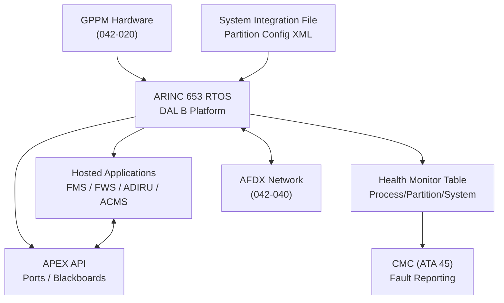
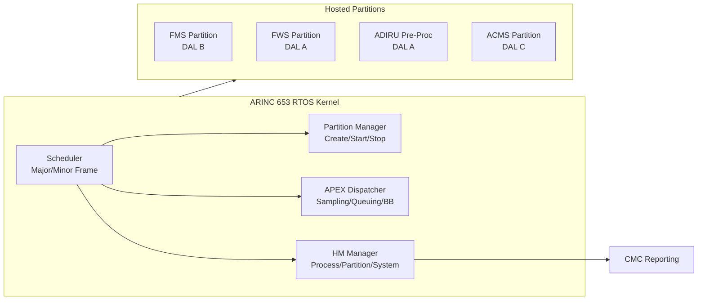
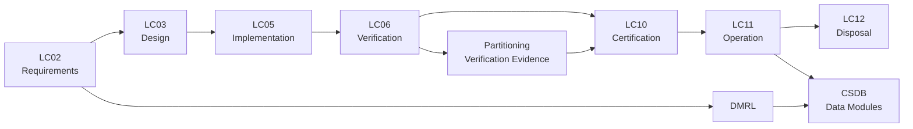

# ATLAS 040-049 · Section 04 · Subsection 042 · 030 — Partitioning and Hosted Applications

## 0. Hyperlink Policy

All internal cross-references use relative Markdown links within the Q+ATLANTIDE CSDB repository. External citations in §19/§20 marked . Parent: [042 README](./README.md) · [042-000](./042-000-Integrated-Modular-Avionics-General.md).

---

## 1. Purpose

This document defines the ARINC 653 partitioning framework, APEX API services, hosted application catalogue, and IMA Platform Qualification approach for the AMPEL360E IMA system. It establishes the evidence boundary between the Platform (IMA integrator responsibility) and Hosted Applications (individual application supplier responsibility), consistent with DO-297 guidance and EASA AMC 20-152A.

The document governs:
- ARINC 653 Part 1 spatial and temporal partitioning implementation on AMPEL360E GPPM platform.
- APEX API (Application Executive) service provision for inter-partition communication (sampling ports, queuing ports, blackboards).
- Mixed-DAL (A/B/C) hosted application co-residency isolation evidence.
- IMA Platform Qualification Plan (PQP) structure and Hosted Application Acceptance (HAA) process.
- Health Monitor (HM) table structure, recovery action hierarchy, and error propagation prevention.

---

## 2. Applicability

| Attribute | Value |
|-----------|-------|
| Aircraft Program | AMPEL360E eWTW |
| ATA Chapter | ATA 42 — Integrated Modular Avionics |
| Certification Basis | CS-25 Amendment 28; AMC 20-152A |
| Applicable Standards | ARINC 653 Part 1/2/3; DO-297; DO-178C; DO-254; ARP4754B |
| Design Assurance Level | RTOS Platform: DAL B; Mixed hosted apps: DAL A–C |
| Configuration | AMPEL360E Build Standard 1.0 and above |

---

## 3. System / Function Overview

The AMPEL360E IMA platform RTOS implements ARINC 653 Part 1 services on each GPPM. The partition configuration is defined in an XML configuration file (the ARINC 653 System Integration File, SIF) loaded at power-up. The SIF specifies partition memory regions, time windows (minor/major frame), port definitions, and HM table entries.

**Spatial Partitioning:** Each partition receives an exclusive memory region enforced by the hardware MPU (FPGA-implemented) and software MMU. Any partition attempt to access another partition's memory causes an immediate partition-level HM action (partition restart) without affecting other partitions.

**Temporal Partitioning:** The RTOS scheduler enforces a fixed major frame (typically 128 ms) divided into minor frames. Each partition's time windows are non-overlapping and non-interruptible by other partitions (preemption only occurs within a partition's own time window). Temporal overrun causes a partition-level HM action.

**APEX API:** Partitions communicate exclusively through ARINC 653 APEX inter-partition communication services: SAMPLING_PORT (periodic signals, no buffering), QUEUING_PORT (message queues, FIFO), and BLACKBOARD (shared data with read-many). All ports are declared in the SIF; runtime creation of ports is forbidden.

**Mixed-DAL Co-residency:** DO-297 §3.5 guidance requires demonstration that a DAL C partition cannot corrupt or unduly delay a DAL A partition. Isolation evidence includes: MPU hardware protection test (042-020), temporal overrun test, and HM recovery time measurement ensuring DAL A restart completes within partition budget.

---

## 4. Scope

### 4.1 Included

- ARINC 653 RTOS services: partitioning, scheduling, APEX API, HM.
- IMA Platform Qualification Plan structure and evidence catalogue.
- Hosted Application Acceptance (HAA) process, checklists, and compliance matrix.
- Partition configuration file (SIF) schema, validation, and change control.
- Mixed-DAL isolation demonstration methodology and test requirements.
- RTOS software development per DO-178C DAL B (platform software only).

### 4.2 Excluded

- Individual hosted application internal software architecture (application supplier responsibility).
- GPPM hardware design (covered in 042-020).
- AFDX network configuration (covered in 042-040).
- Software data loading (covered in 042-060).

---

## 5. Architecture Description

**RTOS Software Architecture:** The ARINC 653 RTOS kernel executes at the highest software priority level. The kernel consists of: scheduler (major/minor frame), partition manager (create/start/stop/restart), APEX service dispatcher, and HM manager. Kernel code size is ≤512 KB, verified per DO-178C DAL B with MC/DC coverage.

**SIF Validation:** The SIF is an authenticated XML file validated at load time against an XSD schema. Validation checks include: total partition time windows ≤ major frame; no overlapping memory regions; all referenced port IDs unique; HM actions reference valid partition IDs. Invalid SIF causes system-level HM action (cabinet power cycle).

**HM Table Hierarchy:** The ARINC 653 HM table has three levels: (1) Process-level: process fault → process restart; (2) Partition-level: partition fault → partition restart; (3) System-level: system fault → module reset. Recovery escalates through levels if lower-level recovery fails within the recovery time budget.

**Hosted Application Catalogue (AMPEL360E Build Standard 1.0):**
- FMS/FMGC (DAL B, GPPM-L1): Flight management and guidance computation.
- FWS/FWC (DAL A, GPPM-L2 + TMR): Flight warning computation.
- ADIRU Pre-Processing (DAL A, GPPM-L1 + GPPM-R1): Air data/inertial pre-processing.
- ACMS Data Aggregation (DAL C, GPPM-R2): Aircraft condition monitoring aggregation.
- Cabin Management (DAL C, GPPM-R2): IFE/cabin system interface.

**DO-297 Incremental Certification Credit:** Platform qualification evidence (PQP, PSA) is submitted to EASA as certification credit for hosted application developers. Application developers reference PSA services and document compliance with Hosted Application Requirements (HAR) in their PSAC.

---

## 6. Functional Breakdown

| Function ID | Function Name | Description | DAL | Owner |
|-------------|---------------|-------------|-----|-------|
| F-042-01 | Spatial Partitioning Enforcement | Enforce hardware MPU and MMU memory isolation between all partitions; detect and respond to access violations within one scheduler cycle | A | Q-DATAGOV |
| F-042-02 | Temporal Scheduling | Execute ARINC 653 major/minor frame schedule with ≤10 µs jitter per partition window boundary; log overruns to HM | B | Q-HPC |
| F-042-03 | APEX API Service Provision | Provide SAMPLING_PORT, QUEUING_PORT, and BLACKBOARD APEX services; enforce port direction, message size, and period constraints declared in SIF | B | Q-DATAGOV |
| F-042-04 | Hosted App Isolation | Demonstrate through test evidence that fault in any partition does not propagate to or corrupt state of higher-DAL co-resident partitions | A | Q-DATAGOV |
| F-042-05 | Platform Health Supervision | Monitor partition liveness (heartbeat), APEX service response time, and HM table execution; escalate to system-level action if partition-level recovery fails | B | Q-DATAGOV |

---

## 7. Mermaid — System Context Diagram

---

## 8. Mermaid — Internal Functional Architecture

---

## 9. Mermaid — Lifecycle Traceability

---

## 10. Interfaces

| Interface ID | Name | Type | Counterpart System | Protocol | Direction |
|--------------|------|------|--------------------|----------|-----------|
| IF-042-01 | RTOS to GPPM Hardware | Software/Hardware | GPPM MPU/MMU (042-020) | MMU page table; FPGA MPU register | Bidirectional |
| IF-042-02 | RTOS to Hosted Applications | Software | FMS/FWS/ADIRU/ACMS | APEX API (ARINC 653 Part 1) | Bidirectional |
| IF-042-03 | RTOS to SIF | Data | Data Loader (042-060) | XML file via NVM | Input |
| IF-042-04 | HM to CMC | Data | CMC (ATA 45) | ARINC 429 HS via IOM | Output |
| IF-042-05 | RTOS to AFDX ES | Data | AFDX End-System (042-040) | PCIe to AFDX ES; VL scheduling | Bidirectional |
| IF-042-06 | RTOS to Time Source | Data | PTP Grandmaster (042-070) | IEEE 1588 PTP over AFDX | Input |

---

## 11. Operating Modes

| Mode | Name | Description | Entry Condition | Exit Condition |
|------|------|-------------|-----------------|----------------|
| M1 | SIF Load and Validation | Load and authenticate SIF from NVM; validate schema and constraint rules | POST complete | SIF valid or SIF fault |
| M2 | Partition Initialisation | Create partitions, allocate memory regions, initialise APEX port structures | SIF valid | All partitions READY |
| M3 | Normal Execution | All partitions executing per ARINC 653 schedule; APEX services available | Init complete | Fault or power-down |
| M4 | Partition Restart | One partition restarting due to HM action; other partitions unaffected | Partition HM triggered | Partition RUNNING again |
| M5 | System HM — Module Reset | Cabinet-level reset due to unrecoverable HM condition; all partitions halted | System HM triggered | Power cycle complete |

---

## 12. Monitoring and Diagnostics

- **Partition Heartbeat:** Each partition must call GET_PARTITION_STATUS within its time window; HM timer triggers partition restart if heartbeat missed for two consecutive major frames.
- **APEX Port Overflow:** QUEUING_PORT overflow events (buffer full) logged to HM fault log at 100 ms rate; persistent overflow triggers CMC advisory for application supplier investigation.
- **Schedule Overrun:** FPGA temporal monitor flags partition time budget overrun; first overrun logged; third consecutive overrun triggers partition restart and CMC fault.
- **SIF Integrity Check:** SIF CRC verified at each power-up and after any software load; mismatch triggers SIF fault and fallback to previous validated SIF version.
- **HM Recovery Timer:** Time from HM trigger to partition RUNNING state monitored; >200 ms recovery triggers escalation to system-level HM and CMC caution.
- **Memory Scrub Events:** MPU violation events logged to partition HM fault log; rate >1/hour triggers CMC advisory for memory investigation.
- **Partition CPU Budget Tracking:** CPU utilisation per partition accumulated every major frame; trending towards 100% triggers advance CMC advisory for re-scheduling review.
- **Platform DO-297 Compliance Monitoring:** HM table compliance matrix updated after each SIF change to ensure HM actions remain within DO-297 §4.3 requirements.

---

## 13. Maintenance Concept

| Task ID | Task Description | Interval | Access | Skill Level |
|---------|-----------------|----------|--------|-------------|
| MC-042-01 | SIF version verification and CRC check | A-Check | Ground Support Terminal | Avionics Technician |
| MC-042-02 | Partition HM fault log download and analysis | A-Check | Ground Support Terminal | Avionics Technician |
| MC-042-03 | RTOS software load via ARINC 615A | Per SB | Portable Data Loader | Avionics Technician |
| MC-042-04 | Full partition isolation IBIT (spatial and temporal) | C-Check | Ground Support Terminal | Avionics Engineer |
| MC-042-05 | HM table review and update following SIF modification | Per SB | Engineering Tool | Software Engineer |

---

## 14. S1000D / CSDB Mapping

| Data Module Code (DMC) | Title | Publication Type | SNS |
|------------------------|-------|-----------------|-----|
| QATL-A-042-03-00-00AAA-040A-A | IMA Partitioning and Hosted Applications Description | AMM | 042-030 |
| QATL-A-042-03-00-00AAA-520A-A | Partition HM Log Download and SIF Check Procedures | AMM | 042-030 |
| QATL-A-042-03-00-00AAA-920A-A | Partition Fault Isolation — HM Recovery Failures | FIM | 042-030 |
| QATL-A-042-03-00-00AAA-941A-A | RTOS and Hosted Application Software Part Numbers | IPD | 042-030 |

### Recommended DM Set

| DM Role | DMC Suffix | Content |
|---------|-----------|---------|
| System Overview | 040A | RTOS architecture, SIF, APEX API, HM table |
| BITE Procedure | 520A | HM log retrieval, SIF CRC check, partition status |
| Fault Isolation | 920A | HM escalation fault isolation trees |
| IPD | 941A | RTOS SW PN, SIF version, HAA acceptance certificates |

---

## 15. Footprints

### 15.1 Physical

| Item | Value |
|------|-------|
| RTOS Software Footprint | ≤512 KB code; ≤128 KB data |
| SIF File Size | ≤4 MB per cabinet |
| Partition Configuration Objects | ≤64 partitions per cabinet |
| APEX Port Count | ≤512 ports per partition |

### 15.2 Electrical / Data

| Parameter | Value |
|-----------|-------|
| RTOS Kernel CPU Overhead | ≤5% of major frame |
| APEX Service Latency | ≤50 µs (sampling port read/write) |
| HM Recovery Time (partition) | ≤200 ms |
| SIF Load Time | ≤10 s at power-up |

### 15.3 Maintenance

| Parameter | Value |
|-----------|-------|
| RTOS Software Load Time | <15 min via ARINC 615A |
| HM Log Download Time | <2 min |
| Partition IBIT Duration | <10 min per partition |

### 15.4 Data

| Parameter | Value |
|-----------|-------|
| HM Fault Log Capacity | 5,000 events per partition |
| SIF Version History | Last 5 versions retained in NVM |
| APEX Port Message Size | Up to 8192 bytes per message |

---

## 16. Safety and Certification Considerations

- **DO-297 Platform Qualification:** IMA platform qualification evidence package (PQP, PSA, PPSL) submitted to EASA provides Incremental Certification Credit (ICC) for all hosted applications; reduces application DP effort by eliminating re-qualification of RTOS services.
- **Mixed-DAL Isolation:** Isolation test suite demonstrates DAL C partition cannot corrupt DAL A partition state; test evidence per DO-297 Appendix A submitted as part of SSA substantiation.
- **APEX API Safety Constraints:** Forbidden APEX services (CREATE_PROCESS at runtime, SET_PARTITION_MODE to IDLE from partition) are blocked at kernel level; attempts generate system HM action.
- **RTOS DO-178C DAL B:** RTOS software is developed and verified per DO-178C DAL B; structural coverage (MC/DC) achieved for all RTOS kernel modules; SOI review records included in CSDB.
- **SIF Configuration Control:** SIF is a configuration item under DO-200B data management; each SIF change requires re-validation and re-acceptance review before operational deployment.
- **HM Completeness:** HM table completeness review ensures every identified failure mode has an assigned HM action; gaps are tracked as open issues until resolved before first flight.

---

## 17. Verification and Validation

| V&V ID | Requirement | Method | Evidence | Status |
|--------|-------------|--------|----------|--------|
| VV-042-01 | Spatial partitioning prevents cross-partition memory access | Test | MPU boundary test, fault injection |  |
| VV-042-02 | Temporal partitioning overrun triggers HM within major frame | Test | Overrun injection test |  |
| VV-042-03 | DAL C fault does not affect DAL A partition state | Test | Mixed-DAL isolation test suite |  |
| VV-042-04 | APEX SAMPLING_PORT latency ≤50 µs | Test | Port latency measurement |  |
| VV-042-05 | HM partition recovery completes within 200 ms | Test | Recovery time measurement |  |
| VV-042-06 | Invalid SIF rejected at load | Test | SIF corruption injection test |  |
| VV-042-07 | RTOS MC/DC coverage ≥ DAL B per DO-178C | Analysis | DO-178C coverage report |  |

---

## 18. Glossary

| Term | Acronym | Definition |
|------|---------|------------|
| ARINC 653 | — | Avionics standard defining spatial/temporal partitioning RTOS API for IMA platforms |
| APEX API | APEX | Application Executive API; set of RTOS service calls defined by ARINC 653 for partition use |
| Partition | — | Isolated execution environment within IMA platform with dedicated memory and CPU time |
| Health Monitor | HM | ARINC 653 mechanism monitoring partition health and executing recovery actions |
| Real-Time Operating System | RTOS | Operating system providing deterministic scheduling and ARINC 653 services |
| Sampling Port | — | APEX port type for periodic signals; newest value always available; no buffering |
| Queuing Port | — | APEX port type providing FIFO message queue with configurable depth |
| HM Table | — | Configuration table mapping fault conditions to recovery actions at process/partition/system level |
| Inter-Partition Communication | IPC | Data exchange between ARINC 653 partitions exclusively via APEX port services |
| Watchdog Timer | WDT | Hardware timer detecting partition liveness failure; triggers HM action on expiry |

---

## 19. Citations

| Ref ID | Standard / Document | Applicability | Status |
|--------|--------------------|-----------|----|
| CIT-042-01 | ARINC 653 Part 1, Avionics Application Software Standard Interface | RTOS partitioning and APEX API |  |
| CIT-042-02 | ARINC 653 Part 2, Extended Services | APEX extended port types |  |
| CIT-042-03 | ARINC 653 Part 3, Conformity Test | RTOS conformity test plan |  |
| CIT-042-04 | RTCA DO-297, IMA Development Guidance and Certification Considerations | Platform qualification and ICC |  |
| CIT-042-05 | RTCA DO-178C, Software Considerations in Airborne Systems | RTOS DAL B software qualification |  |
| CIT-042-06 | EASA AMC 20-152A, Development Assurance of Airborne Electronic Systems | Mixed-DAL hosted app acceptance |  |
| CIT-042-07 | SAE ARP4754B, Guidelines for Development of Civil Aircraft and Systems | System DAL allocation |  |
| CIT-042-08 | EASA CS-25 §25.1309, Equipment, Systems and Installations | Safety requirements for IMA hosted functions |  |

---

## 20. References

| Ref ID | Document | Version | Status |
|--------|----------|---------|--------|
| REF-042-01 | 042-000 IMA General | 1.0 |  |
| REF-042-02 | 042-020 Processing Modules | 1.0 |  |
| REF-042-03 | AMPEL360E IMA Platform Qualification Plan (PQP) | 1.0 |  |
| REF-042-04 | AMPEL360E Hosted Application Acceptance Checklist | 1.0 |  |

---

## 21. Open Issues

| Issue ID | Description | Owner | Status |
|----------|-------------|-------|--------|
| OI-042-01 | SIF XML schema version to be harmonised with IMA platform supplier tool chain | Q-DATAGOV |  |
| OI-042-02 | HM table completeness review not yet started for FWS DAL A partition | Q-AIR |  |
| OI-042-03 | EASA position on APEX BLACKBOARD use for DAL A cross-channel synchronisation pending | Q-DATAGOV |  |

---

## 22. Change Log

| Version | Date | Author | Description |
|---------|------|--------|-------------|
| 1.0.0 | 2025-01-01 | Q-DATAGOV | Initial baseline release |  |
