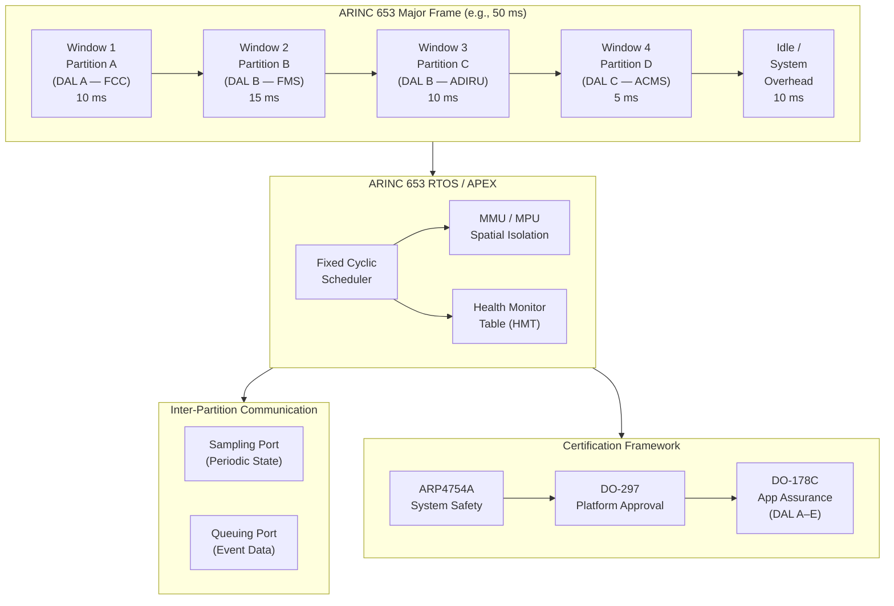

# ATLAS 040-049 · Section 04 · Subsection 042 · 030 — Partitioning and Hosted Applications

## 1. Purpose

This document defines the ARINC 653 partitioning model and hosted application framework within the IMA platform, as governed by the Q+ATLANTIDE ATLAS baseline. Robust partitioning is the cornerstone of the IMA safety argument: it enables multiple avionics applications of different Design Assurance Levels (DALs) to coexist on shared processing hardware without compromising each other's integrity or availability. This document establishes the technical and certification requirements for spatial isolation, temporal isolation, partition scheduling, inter-partition communication, and the migration of hosted applications between IMA platform versions.

The ARINC 653-1 standard, together with its companion parts (ARINC 653-2 for testing and ARINC 653-3 for conformance), forms the contractual interface between the IMA platform (RTOS and hardware) and the hosted application software. The correct interpretation and application of these standards, within the context of RTCA DO-178C development assurance and RTCA DO-297 IMA certification, is essential for achieving regulatory acceptance from EASA and FAA for aircraft-level safety objectives.

## 2. Scope

This subject covers:

- ARINC 653 partitioning model: spatial separation (memory protection) and temporal separation (time-partitioned scheduling).
- Partition scheduling: Major Frame (MF), Minor Frame (mF), and partition time windows; fixed cyclic schedule execution.
- Inter-partition communication via ARINC 653 Sampling Ports and Queuing Ports.
- Hosted application Design Assurance Level (DAL) mix and the independence arguments required per ARP4754A.
- Certification credit mechanisms: platform certification, application certification, and incremental approval.
- Hypervisor and Type-1 RTOS concepts applicable to mixed-criticality IMA implementations.
- Application migration: re-hosting procedures, regression test requirements, and Configuration Index management.
- Health monitoring at partition level: partition watchdog, Health Monitor Table (HMT), and recovery actions.

## 3. Glossary

| Term / Acronym | Definition |
|---|---|
| ARINC 653 | ARINC Specification 653 — "Avionics Application Software Standard Interface", defining the partitioning operating system API (APEX), scheduling model, and inter-partition communication mechanisms for IMA platforms. |
| APEX | Application EXecutive — the standardised API defined in ARINC 653-1 that provides services for partition management, process management, time management, and inter-partition communication to hosted applications. |
| Spatial Partitioning | Hardware-enforced memory protection preventing any partition from reading or writing to memory regions allocated to another partition, typically implemented via Memory Management Unit (MMU) or Memory Protection Unit (MPU). |
| Temporal Partitioning | Scheduler-enforced allocation of CPU time to each partition within a fixed cyclic schedule (Major Frame / Minor Frame structure), preventing any partition from consuming CPU resources allocated to another. |
| Major Frame | The repeating cycle duration of the ARINC 653 partition schedule, typically in the range of 10–100 ms for avionics applications; all partition time windows are defined relative to the Major Frame boundary. |
| Sampling Port | An ARINC 653 inter-partition communication mechanism that holds the most recently written message, which the receiving partition reads at any time; suitable for periodic state data (e.g., sensor values). |
| Queuing Port | An ARINC 653 inter-partition communication mechanism that holds a FIFO queue of messages, ensuring that every message produced by a sender is consumed by the receiver; suitable for event-driven data. |
| HMT | Health Monitor Table — an ARINC 653-defined configuration table that maps detected error events (partition watchdog expiry, memory errors, etc.) to corrective actions (restart partition, reset module, report fault). |
| Incremental Approval | A certification strategy defined in DO-297 whereby the IMA platform is qualified independently of hosted applications, and each hosted application is subsequently approved by demonstrating compliance within the platform's defined resource envelope. |
| Hypervisor | A Type-1 virtualisation layer that can provide additional isolation and resource management above the hardware, used in next-generation IMA implementations to support mixed-criticality guest RTOS environments. |

## 4. Diagram (Mermaid)

## 5. Footprint

| Metric | Value |
|---|---|
| Architecture | `ATLAS` — Aircraft Top Level Architecture Schema/System (controlled term) |
| Master range | `000–099` |
| Code range | `040-049` |
| Section | `04` — Aviónica, Información & APU |
| Subsection | `042` — Integrated Modular Avionics |
| Subsubject | `030` — Partitioning and Hosted Applications |
| Primary Q-Division | Q-DATAGOV[^qdiv] |
| Support Q-Divisions | Q-AIR, Q-SPACE, Q-HPC |
| ORB support | ORB-PMO, ORB-LEG |
| Governance class | `baseline`[^gov] |
| Folder path | `Q+ATLANTIDE/000-099_ATLAS/040-049_Avionica-Informacion-y-APU/042_Integrated-Modular-Avionics/` |
| Document | `042-030-Partitioning-and-Hosted-Applications.md` (this file) |
| Parent subsection | [`README.md`](./README.md) |
| Parent section | [`../../README.md`](../../README.md) |
| Parent architecture | [`../../../README.md`](../../../README.md) |
| Parent baseline | [`organization/Q+ATLANTIDE.md`](../../../../organization/Q+ATLANTIDE.md) |

## 6. References & Citations

[^baseline]: Q+ATLANTIDE controlled baseline (v1.0.0) — the governing programme baseline document for all ATLAS architecture artefacts. Maintained under configuration management per the Q+ATLANTIDE governance framework.

[^qdiv]: Q-Division authority — Q-DATAGOV holds primary governance authority over IMA architecture documentation, data integrity, and configuration control within the Q+ATLANTIDE programme.

[^gov]: Governance class — `baseline` denotes that this document forms part of the formally controlled baseline configuration. Changes require formal change-request approval through ORB-PMO.

[^n001]: Note N-001 — The IMA Partition Schedule (IPS-042-030) and Health Monitor Table (HMT-042-030) are configuration-controlled documents subject to formal change review per ARP4754A Section 5.

[^arinc653]: ARINC Specification 653P1-5 — "Avionics Application Software Standard Interface, Part 1 — Required Services", Airlines Electronic Engineering Committee, 2019. Defines the APEX API and partitioning model mandatory for ARINC 653-compliant IMA platforms.

[^do297]: RTCA DO-297 / EUROCAE ED-124 — "Integrated Modular Avionics (IMA) Development Guidance and Certification Considerations". Defines incremental approval strategy and the allocation of certification responsibilities between platform and hosted application developers.

[^do178c]: RTCA DO-178C / EUROCAE ED-12C — "Software Considerations in Airborne Systems and Equipment Certification", RTCA Inc., 2011. Specifies the software development and verification objectives for hosted application software at each DAL.

[^arp4754a]: SAE ARP4754A / EUROCAE ED-79A — "Guidelines for Development of Civil Aircraft and Systems". Provides system-level safety assessment methodology used to derive DAL assignments for each hosted application and independence arguments for the partitioning mechanism.
