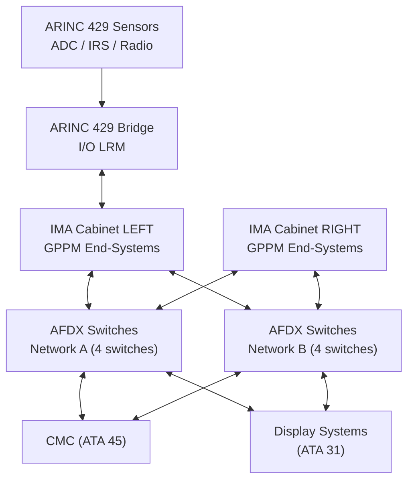
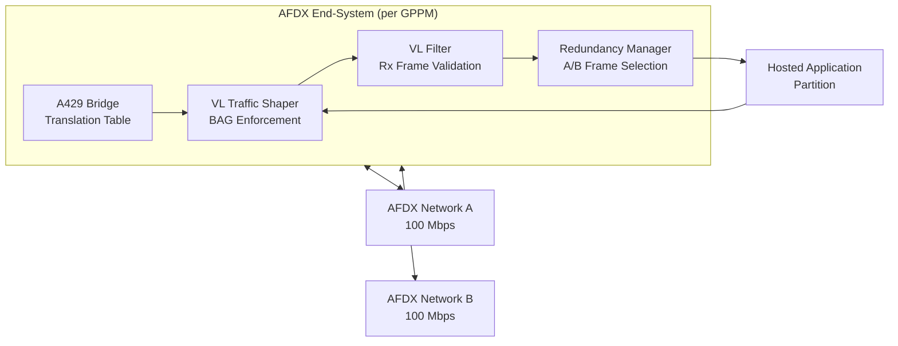
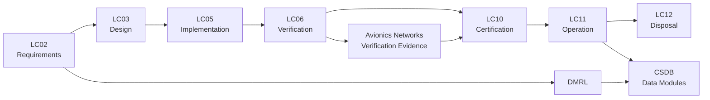

# ATLAS 040-049 · Section 04 · Subsection 042 · 040 — Avionics Networks and Data Communication

## 0. Hyperlink Policy

All internal cross-references use relative Markdown links within the Q+ATLANTIDE CSDB repository. External citations in §19/§20 marked . Parent: [042 README](./README.md) · [042-000](./042-000-Integrated-Modular-Avionics-General.md).

---

## 1. Purpose

This document defines the [PROGRAMME-AIRCRAFT] avionics data communication network architecture including AFDX/ARINC 664 Part 7 switched Ethernet, Virtual Link (VL) configuration, Bandwidth Allocation Gap (BAG) scheduling, legacy ARINC 429 bridge interfaces, dual-redundant network topology, end-system configuration, and network integrity monitoring. It establishes the deterministic communication fabric interconnecting all IMA cabinets, hosted applications, and aircraft systems.

---

## 2. Applicability

| Attribute | Value |
|-----------|-------|
| Aircraft Program | programme-defined aircraft type |
| ATA Chapter | ATA 42 — Integrated Modular Avionics |
| Certification Basis | CS-25 Amendment 28 |
| Applicable Standards | ARINC 664 Part 7; ARINC 664 Part 2; ARINC 429; DO-160G; IEEE 802.3 100BASE-TX |
| Design Assurance Level | AFDX End-System: DAL A; Switches: DAL B; ARINC 429 bridge: DAL B |
| Configuration | [PROGRAMME-AIRCRAFT] Build Standard 1.0 and above |

---

## 3. System / Function Overview

The [PROGRAMME-AIRCRAFT] avionics network implements ARINC 664 Part 7 (AFDX) as the primary avionics data bus. The network comprises:

- **Two fully redundant networks (Network A and Network B):** Each is a switched 100 Mbps full-duplex Ethernet network. All critical end-systems are connected to both networks. Data is simultaneously transmitted on both; receiving end-systems perform integrity checking and select the valid frame.
- **AFDX Switches:** Four switches per network (eight total) arranged in a spine-leaf topology. Switches are non-blocking 100 Mbps with configurable VL filter tables.
- **Virtual Links (VLs):** Each unidirectional data flow is allocated a VL with defined BAG (Bandwidth Allocation Gap: 1 ms to 128 ms in powers of 2), maximum frame size (up to 1471 bytes payload), and dedicated bandwidth guarantee.
- **End-Systems (ES):** Implemented in IMA GPPM and I/O LRM hardware (FPGA-based AFDX MAC). Each ES enforces VL bandwidth limits (traffic shaping) and performs integrity checks (VL filter, frame integrity, sequence number).
- **ARINC 429 Bridge:** Legacy ARINC 429 sensors and actuators are interfaced via ARINC 429 protocol bridge I/O LRMs. Bridge LRMs convert ARINC 429 words to AFDX messages and vice versa per defined translation tables.

---

## 4. Scope

### 4.1 Included

- AFDX network topology and switch configuration.
- Virtual Link design: BAG, max frame size, latency budget per VL.
- AFDX end-system implementation in IMA LRMs.
- ARINC 429 protocol bridge LRM architecture.
- Network integrity monitoring and failure detection.
- AFDX network configuration management and VLAN assignment.

### 4.2 Excluded

- Application-level message content and encoding (covered by ICD per application).
- ARINC 429 sensor/actuator hardware not part of IMA (covered by applicable ATA chapters).
- Aircraft-level wiring harness routing (ATA 92).
- ACARS, ATC datalink, and cabin wireless networks (ATA 23 / ATA 46).

---

## 5. Architecture Description

**AFDX Topology:** The [PROGRAMME-AIRCRAFT] AFDX network uses a two-tier spine-leaf architecture. Two spine switches (SW-SPINE-A1, SW-SPINE-A2 on Network A; duplicated on Network B) provide high-availability interconnect. Eight leaf switches (four per network) connect to end-system clusters. This topology provides ≤2-hop path between any two end-systems.

**VL Traffic Shaping:** Each end-system enforces VL bandwidth contracts at transmission. A VL with BAG=8 ms may transmit at most one frame of ≤max_frame_size every 8 ms. Violation attempts are blocked by the ES and logged. This ensures the theoretical maximum network utilisation does not exceed 65% on any link, providing headroom for burst management.

**End-to-End Latency:** Worst-case end-to-end latency analysis per ARINC 664 Part 7 §5.3 is performed for all VLs. Results demonstrate all safety-critical VLs meet their application-specified latency requirements (typically ≤10 ms for control functions, ≤50 ms for monitoring functions).

**ARINC 429 Bridge:** The I/O LRM ARINC 429 bridge supports 32 receive channels at 100 kbps and 16 transmit channels at 100 kbps per LRM. Translation tables map ARINC 429 label/SDI to AFDX VL message and define refresh rates. Bridge latency is ≤500 µs for receive-to-AFDX conversion.

**Redundancy Management:** Dual-network redundancy is managed at the receiving end-system. The ES implements the ARINC 664 Part 7 redundancy management function: frames received on Network A and Network B within the redundancy window (≤30 ms) are compared; the first valid received frame is delivered to the application partition; duplicate frames are discarded.

---

## 6. Functional Breakdown

| Function ID | Function Name | Description | DAL | Owner |
|-------------|---------------|-------------|-----|-------|
| F-042-01 | VL Traffic Shaping | Enforce BAG and max frame size per VL at transmitting end-system; block over-bandwidth transmission attempts and log violations | A | Q-DATAGOV |
| F-042-02 | Network Redundancy Management | Receive frames on Network A and B; apply ARINC 664 P7 redundancy window; deliver first valid frame to partition; discard duplicate | A | Q-DATAGOV |
| F-042-03 | ARINC 429 Protocol Bridging | Convert ARINC 429 labels to AFDX VL messages per translation table; enforce label refresh rate and data validity | B | Q-AIR |
| F-042-04 | End-System Configuration | Load and validate ES VL filter tables from authenticated ES configuration file; reject frames from undeclared VLs | B | Q-DATAGOV |
| F-042-05 | Network Integrity Monitoring | Monitor switch port statistics (frame error rate, utilisation); detect network partition/asymmetry; report to CMC via dedicated management VL | B | Q-DATAGOV |

---

## 7. Mermaid — System Context Diagram

---

## 8. Mermaid — Internal Functional Architecture

---

## 9. Mermaid — Lifecycle Traceability

---

## 10. Interfaces

| Interface ID | Name | Type | Counterpart System | Protocol | Direction |
|--------------|------|------|--------------------|----------|-----------|
| IF-042-01 | AFDX Network A to All End-Systems | Data Network | All AFDX-connected LRMs and systems | ARINC 664 Part 7, 100BASE-TX | Bidirectional |
| IF-042-02 | AFDX Network B to All End-Systems | Data Network | All AFDX-connected LRMs and systems (redundant) | ARINC 664 Part 7, 100BASE-TX | Bidirectional |
| IF-042-03 | ARINC 429 Bridge to Sensors | Data | ADC, IRS, Radio Altimeter sensors | ARINC 429, 100 kbps | Input |
| IF-042-04 | Network Management to CMC | Data | CMC (ATA 45) | Dedicated management VL over AFDX | Output |
| IF-042-05 | ES Config to Data Loader | Data | DLCS (042-060) | ARINC 615A Ethernet | Input |
| IF-042-06 | AFDX Switch to Aircraft Structure | Power/Physical | Aircraft Avionics Bay | 28 V DC; MIL-DTL-38999 | Input |

---

## 11. Operating Modes

| Mode | Name | Description | Entry Condition | Exit Condition |
|------|------|-------------|-----------------|----------------|
| M1 | ES Initialisation | Load and validate ES VL filter tables from NVM; configure hardware VL shaper registers | Power applied | Table valid and loaded |
| M2 | Network Convergence | AFDX spanning tree convergence; switch forward tables populated | ES init complete | All paths active |
| M3 | Normal Operation | Dual-network A/B active; all VLs transmitting per BAG schedule; redundancy manager operational | Convergence complete | Fault or power-down |
| M4 | Single-Network Degraded | One AFDX network failed; all VLs operating on surviving network; no redundancy | Network fault detected | Network recovery |
| M5 | Maintenance | Network analyser connected; VL loopback tests; switch port statistics download | Ground, maintenance mode | Maintenance complete |

---

## 12. Monitoring and Diagnostics

- **VL Frame Error Rate:** ES monitors CRC error rate per VL; rate >10⁻⁶ triggers CMC advisory for cable/connector inspection.
- **VL Utilisation:** Switch port utilisation logged per VL per second; sustained >80% utilisation on any port triggers CMC advisory for VL re-planning.
- **Network A/B Asymmetry:** Redundancy manager detects persistent asymmetry (>100 ms without A or B frame); generates CMC fault for network path investigation.
- **ARINC 429 Bridge Validity:** Bridge monitors ARINC 429 label refresh intervals; stale label (>2× refresh rate) generates data invalid flag to receiving partitions and CMC log.
- **Switch Health:** SNMP traps from managed AFDX switches forwarded to network management VL; switch temperature, port link status, and FCS error counters monitored.
- **ES Config Integrity:** ES configuration file CRC checked at power-up; mismatch triggers ES fault and fallback to stored baseline config.
- **Sequence Number Monitoring:** ARINC 664 Part 7 frame sequence number discontinuities detected by receiving ES; rate >1% logged to CMC for investigation.
- **End-to-End Latency Measurement:** Timestamped frames on diagnostic VL measure end-to-end latency for selected VLs during IBIT; results compared to WCLA budget.

---

## 13. Maintenance Concept

| Task ID | Task Description | Interval | Access | Skill Level |
|---------|-----------------|----------|--------|-------------|
| MC-042-01 | AFDX network connectivity check (ping all ES) | A-Check | Ground Support Terminal | Avionics Technician |
| MC-042-02 | Switch port statistics download and review | A-Check | SNMP management tool | Avionics Technician |
| MC-042-03 | ARINC 429 bridge label validity test | A-Check | Ground Support Terminal | Avionics Technician |
| MC-042-04 | VL latency measurement via IBIT | C-Check | Network analyser | Avionics Engineer |
| MC-042-05 | ES VL filter table reload following network redesign | Per SB | Portable Data Loader | Avionics Engineer |

---

## 14. S1000D / CSDB Mapping

| Data Module Code (DMC) | Title | Publication Type | SNS |
|------------------------|-------|-----------------|-----|
| QATL-A-042-04-00-00AAA-040A-A | Avionics Networks and AFDX Description | AMM | 042-040 |
| QATL-A-042-04-00-00AAA-520A-A | AFDX Network Connectivity and BITE Procedures | AMM | 042-040 |
| QATL-A-042-04-00-00AAA-920A-A | AFDX Network Fault Isolation | FIM | 042-040 |
| QATL-A-042-04-00-00AAA-941A-A | AFDX Switch and ES Parts Data | IPD | 042-040 |

### Recommended DM Set

| DM Role | DMC Suffix | Content |
|---------|-----------|---------|
| System Overview | 040A | AFDX topology, VL design, ES architecture |
| BITE Procedure | 520A | Network connectivity test, VL loopback, ARINC 429 bridge test |
| Fault Isolation | 920A | Network A/B fault isolation, switch replacement |
| IPD | 941A | Switch PN, ES LRM PN, cable assembly PN |

---

## 15. Footprints

### 15.1 Physical

| Item | Value |
|------|-------|
| AFDX Switch Dimensions (per switch) | 194 mm × 100 mm × 25 mm (ARINC 600 2MCU) |
| Switch Mass | ≤0.9 kg per switch |
| Total Switches | 8 (4 per network) |
| Cable Type | CAT6A, MIL-W-22759/87 twisted pair, screened |

### 15.2 Electrical / Data

| Parameter | Value |
|-----------|-------|
| Network Bandwidth | 100 Mbps per port, full-duplex |
| Maximum VL Count | 4096 per network |
| Maximum Frame Size | 1518 bytes (Ethernet standard) |
| Maximum VL Latency (WCLA) | ≤500 µs switch delay per hop |

### 15.3 Maintenance

| Parameter | Value |
|-----------|-------|
| Cable Connector | MIL-DTL-38999 Series III, size 17 |
| Switch Replacement Time | <20 min |
| ES LRM Replacement Time | <15 min |

### 15.4 Data

| Parameter | Value |
|-----------|-------|
| ES Configuration File Size | ≤2 MB per ES |
| Switch Log Retention | 1000 SNMP trap events |
| VL Error Log Rate | Per-VL counters updated every 1 s |

---

## 16. Safety and Certification Considerations

- **ARINC 664 Part 7 Determinism:** Virtual Link BAG mechanism guarantees bounded latency and bandwidth; this determinism is foundational to IMA system predictability for safety-critical functions.
- **Dual-Network Independence:** Network A and B physical paths are routed in separate conduits on opposite sides of the fuselage; CCA confirms no single physical event disables both networks simultaneously.
- **ES DAL A Qualification:** AFDX end-system hardware (FPGA) is qualified per DO-254 DAL A for safety-critical VLs; filter table authentication prevents rogue traffic injection.
- **ARINC 429 Bridge Data Validity:** Bridge monitors sensor label staleness and provides data invalid flag to applications; prevents use of stale sensor data by flight-critical functions.
- **Network Availability:** With dual-network, single-switch failure, single-cable failure, or single-ES failure does not result in loss of any VL data flow; dual-network path diversity is verified by network availability analysis.
- **VLAN Security:** Management VLAN for switch SNMP access is logically isolated from safety-critical VLs; no bridge between management VLAN and safety VL space is permitted.

---

## 17. Verification and Validation

| V&V ID | Requirement | Method | Evidence | Status |
|--------|-------------|--------|----------|--------|
| VV-042-01 | All safety-critical VLs meet WCLA latency budget | Analysis | WCLA analysis report |  |
| VV-042-02 | VL traffic shaper prevents over-bandwidth transmission | Test | ES traffic shaper injection test |  |
| VV-042-03 | Dual-network redundancy delivers data on single-network failure | Test | Network fault injection test |  |
| VV-042-04 | ARINC 429 bridge latency ≤500 µs receive to AFDX | Test | Bridge latency measurement |  |
| VV-042-05 | ES rejects frames from undeclared VLs | Test | VL filter injection test |  |
| VV-042-06 | Network availability ≥ 99.9999% per FH per VL | Analysis | Network availability analysis |  |
| VV-042-07 | DO-160G §17 susceptibility test passed for ES LRM | Test | DO-160G CS101/CS114 test report |  |

---

## 18. Glossary

| Term | Acronym | Definition |
|------|---------|------------|
| Avionics Full-Duplex Switched Ethernet | AFDX | Avionics data network based on ARINC 664 Part 7; uses Virtual Links for deterministic communication |
| Virtual Link | VL | Unidirectional logical connection from one source end-system to one or more destination end-systems with guaranteed bandwidth (BAG) |
| Bandwidth Allocation Gap | BAG | Minimum inter-frame gap for a VL, constraining the maximum transmit rate; ranges from 1 ms to 128 ms |
| ARINC 664 | — | ARINC standard series defining Aircraft Data Network; Part 7 defines AFDX |
| End-System | ES | AFDX network node implementing traffic shaping, VL filtering, and redundancy management |
| Switch | SW | AFDX network switch performing VL-based forwarding; non-blocking 100 Mbps per port |
| Simple Network Management Protocol | SNMP | Protocol for switch health monitoring and statistics collection |
| Virtual LAN | VLAN | Logical network segmentation within AFDX infrastructure for management isolation |
| Jitter | — | Variation in frame arrival time at destination; AFDX bounds jitter to ≤max_frame_size × 8 / 100 Mbps per switch |
| Worst-Case Latency Analysis | WCLA | Analysis method per ARINC 664 Part 7 Appendix D computing maximum end-to-end frame delivery time |

---

## 19. Citations

| Ref ID | Standard / Document | Applicability | Status |
|--------|--------------------|-----------|----|
| CIT-042-01 | ARINC 664 Part 7, Avionics Full-Duplex Switched Ethernet Network | AFDX network protocol specification |  |
| CIT-042-02 | ARINC 664 Part 2, Ethernet Physical and Data Link Layers | Physical layer specification |  |
| CIT-042-03 | ARINC 429 Part 1, Digital Information Transfer | ARINC 429 bridge source protocol |  |
| CIT-042-04 | IEEE 802.3-2022, Ethernet Standard | 100BASE-TX physical layer |  |
| CIT-042-05 | RTCA DO-254, Design Assurance Guidance for Airborne Electronic Hardware | ES FPGA DAL A qualification |  |
| CIT-042-06 | RTCA DO-160G §17, Conducted Susceptibility | ES EMC compliance |  |
| CIT-042-07 | EASA CS-25 §25.1309 | Network availability safety requirement |  |
| CIT-042-08 | EUROCAE ED-77, AFDX Certification Guidance | AFDX type acceptance basis |  |

---

## 20. References

| Ref ID | Document | Version | Status |
|--------|----------|---------|--------|
| REF-042-01 | 042-000 IMA General | 1.0 |  |
| REF-042-02 | [PROGRAMME-AIRCRAFT] AFDX Network Design Description | 1.0 |  |
| REF-042-03 | [PROGRAMME-AIRCRAFT] VL Configuration Database | 1.0 |  |
| REF-042-04 | [PROGRAMME-AIRCRAFT] ARINC 429 Bridge Translation Tables | 1.0 |  |

---

## 21. Open Issues

| Issue ID | Description | Owner | Status |
|----------|-------------|-------|--------|
| OI-042-01 | WCLA analysis not yet performed for all non-safety VLs; to be completed at PDR | Q-DATAGOV |  |
| OI-042-02 | Switch supplier evaluation between Astronics and Curtiss-Wright in progress | Q-AIR |  |
| OI-042-03 | ARINC 429 bridge translation table format to be agreed with sensor suppliers | Q-AIR |  |

---

## 22. Change Log

| Version | Date | Author | Description |
|---------|------|--------|-------------|
| 1.0.0 | 2025-01-01 | Q+ Team/Amedeo Pelliccia + AI | Initial baseline release |  |
