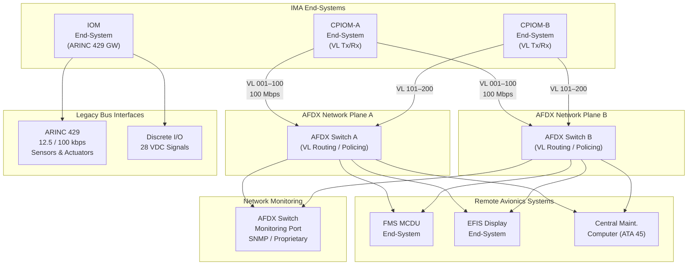

# ATLAS 040-049 · Section 04 · Subsection 042 · 040 — Avionics Networks and Data Communication

## 1. Purpose

This document defines the avionics data network architecture supporting IMA inter-module and inter-system communication within the Q+ATLANTIDE ATLAS baseline. The primary network technology is the Avionics Full-Duplex Switched Ethernet (AFDX), standardised as ARINC 664 Part 7, which provides deterministic, bounded-latency data transport between IMA modules and connected avionics systems. This document also addresses the legacy ARINC 429 interface retained for compatibility with non-IMA sensors and actuators, network redundancy topologies, traffic shaping, and network monitoring requirements.

The deterministic behaviour of AFDX is central to the IMA safety case. Unlike standard commercial Ethernet, AFDX employs Virtual Links (VLs) with enforced Bandwidth Allocation Gap (BAG) parameters to guarantee that no single transmitting end-system can monopolise the shared medium. This determinism is a prerequisite for satisfying the worst-case end-to-end latency budgets allocated to safety-critical avionics functions per ARP4754A system-level requirements.

## 2. Scope

This subject covers:

- AFDX (ARINC 664 Part 7) network architecture: Virtual Links, BAG, maximum frame size, and integrity levels.
- End-system implementation in IMA modules: transmit regulator, integrity checker, redundancy management.
- AFDX network switch design: store-and-forward architecture, VL routing tables, filtering, and policing.
- Network redundancy: dual-star topology and the end-system redundancy management protocol.
- Worst-case end-to-end latency analysis methodology per ARINC 664 Part 7 Annex D.
- Legacy ARINC 429 interfaces: word structure, encoding, electrical characteristics, and gateway modules.
- ARINC 629 (where applicable), RS-422/RS-485 serial interfaces, and discrete I/O managed through IMA I/O modules.
- Network monitoring: AFDX switch monitoring, Virtual Link conformance checking, and fault reporting.

## 3. Glossary

| Term / Acronym | Definition |
|---|---|
| AFDX | Avionics Full-Duplex Switched Ethernet — a deterministic Ethernet-based avionics network defined in ARINC 664 Part 7, providing guaranteed bandwidth and bounded latency through Virtual Link (VL) management. |
| Virtual Link (VL) | An AFDX unidirectional logical connection from one source end-system to one or more destination end-systems, characterised by a fixed Bandwidth Allocation Gap (BAG) and maximum frame size (Lmax). |
| BAG | Bandwidth Allocation Gap — the minimum time interval between consecutive frames on a Virtual Link, ranging from 1 ms to 128 ms in powers of two, enforcing a maximum transmission rate for each VL. |
| End-System | An AFDX network node (implemented in an IMA module or avionics LRU) that contains the transmit regulator, integrity checker, and redundancy management function for sending and receiving VL frames. |
| Network Switch | An AFDX active network component that performs VL-based frame forwarding, traffic policing (filtering non-conformant frames), and port isolation between end-systems in a dual-star topology. |
| ARINC 429 | ARINC Specification 429 — "Mark 33 Digital Information Transfer System (DITS)", defining a widely used unidirectional serial bus at 12.5 or 100 kbps used for point-to-point avionics data transfer in legacy and hybrid IMA architectures. |
| Latency Budget | The maximum allowable end-to-end data transport delay for a specific IMA data flow, derived from the hosted application's timing requirements and allocated across network switch hops and end-system processing. |
| Traffic Shaping | The enforcement of VL BAG and burst-size parameters at the transmitting end-system to prevent a misbehaving application partition from injecting non-conformant traffic into the AFDX network. |
| Dual-Star Topology | The standard AFDX redundancy architecture consisting of two fully independent network planes (Network A and Network B), each with its own switch; the end-system transmits identically on both and selects the valid received frame. |
| Skew Management | The AFDX redundancy management function that discards duplicate frames received on both network planes, accepting only the first valid copy and suppressing the delayed duplicate based on sequence number. |

## 4. Diagram (Mermaid)

## 5. Footprint

| Metric | Value |
|---|---|
| Architecture | `ATLAS` — Aircraft Top Level Architecture Schema/System (controlled term) |
| Master range | `000–099` |
| Code range | `040-049` |
| Section | `04` — Aviónica, Información & APU |
| Subsection | `042` — Integrated Modular Avionics |
| Subsubject | `040` — Avionics Networks and Data Communication |
| Primary Q-Division | Q-DATAGOV[^qdiv] |
| Support Q-Divisions | Q-AIR, Q-SPACE, Q-HPC |
| ORB support | ORB-PMO, ORB-LEG |
| Governance class | `baseline`[^gov] |
| Folder path | `Q+ATLANTIDE/000-099_ATLAS/040-049_Avionica-Informacion-y-APU/042_Integrated-Modular-Avionics/` |
| Document | `042-040-Avionics-Networks-and-Data-Communication.md` (this file) |
| Parent subsection | [`README.md`](./README.md) |
| Parent section | [`../../README.md`](../../README.md) |
| Parent architecture | [`../../../README.md`](../../../README.md) |
| Parent baseline | [`organization/Q+ATLANTIDE.md`](../../../../organization/Q+ATLANTIDE.md) |

## 6. References & Citations

[^baseline]: Q+ATLANTIDE controlled baseline (v1.0.0) — the governing programme baseline document for all ATLAS architecture artefacts. Maintained under configuration management per the Q+ATLANTIDE governance framework.

[^qdiv]: Q-Division authority — Q-DATAGOV holds primary governance authority over IMA architecture documentation, data integrity, and configuration control within the Q+ATLANTIDE programme.

[^gov]: Governance class — `baseline` denotes that this document forms part of the formally controlled baseline configuration. Changes require formal change-request approval through ORB-PMO.

[^n001]: Note N-001 — The AFDX Virtual Link Allocation Table (VLAT-042-040) is a configuration-controlled document defining all VL parameters; changes require formal impact assessment per ARP4754A.

[^arinc664]: ARINC Specification 664P7-1 — "Aircraft Data Network, Part 7 — Avionics Full Duplex Switched Ethernet (AFDX) Network", Airlines Electronic Engineering Committee, 2009. The normative standard for AFDX network design and end-system implementation.

[^arinc429]: ARINC Specification 429P1-17 — "Mark 33 Digital Information Transfer System (DITS)", AEEC, 2004. Defines the electrical and protocol characteristics of the ARINC 429 serial data bus widely used for legacy avionics interfaces.

[^do160g]: RTCA DO-160G / EUROCAE ED-14G — "Environmental Conditions and Test Procedures for Airborne Equipment". Sections 15, 17, 20, and 21 apply to AFDX switch and end-system EMC and power qualification.

[^arp4754a]: SAE ARP4754A — "Guidelines for Development of Civil Aircraft and Systems". Defines the framework for allocating latency budgets and performing functional hazard assessment on AFDX network failure conditions.
