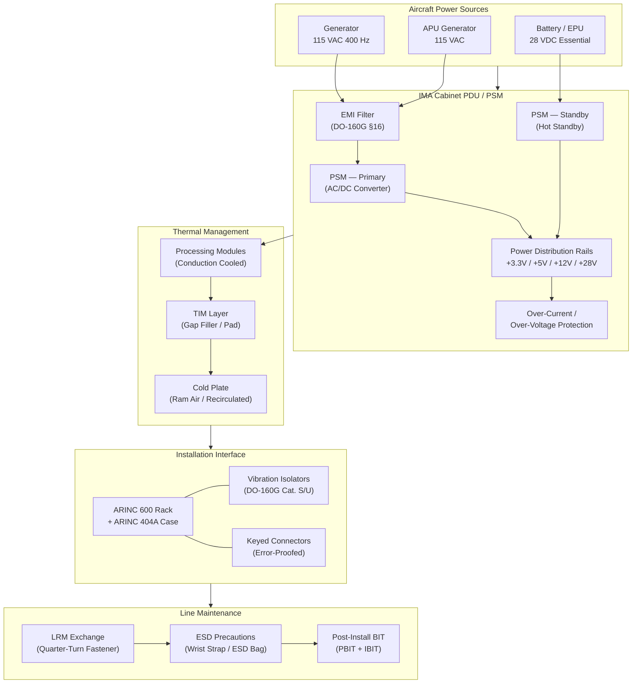

# ATLAS 040-049 · Section 04 · Subsection 042 · 050 — IMA Power, Cooling and Installation Interfaces

## 1. Purpose

This document establishes the power conversion, distribution, and cooling architecture for the IMA platform within the Q+ATLANTIDE ATLAS baseline. It defines the electrical power interface requirements, internal power distribution unit (PDU) design, thermal management solutions, cabinet installation standards, connector keying provisions, and LRU/LRM exchange procedures. These interfaces are critical for ensuring the IMA system's continued safe operation across the full range of aircraft operating environments, including extreme temperature, altitude, humidity, vibration, and electromagnetic conditions.

The IMA power and cooling architecture must satisfy the environmental qualification requirements of RTCA DO-160G while complying with the aircraft power system characteristics defined under ATA Chapter 24 and the installation geometry constraints imposed by ARINC 600 and ARINC 404A. Thermal management is of particular importance given the high-density processing environment of IMA cabinets, where conduction-cooled module designs and liquid or ram-air cooling interfaces must be carefully engineered to maintain junction temperatures within the operating limits of all semiconductor devices.

## 2. Scope

This subject covers:

- Aircraft power bus interface: 28 VDC primary power, 115 VAC 400 Hz single-phase or three-phase, and essential bus considerations.
- IMA Power Supply Module (PSM) and Power Distribution Unit (PDU): conversion, filtering, over-current protection, and current sensing.
- DO-160G Section 16 power input qualification: normal and abnormal voltage conditions, surge, spike, and loss of power.
- Thermal design: conduction-cooled cold plate interface, airflow-cooled designs, thermal interface material (TIM) selection.
- Airflow management: internal cabinet ducting, air inlet/outlet positioning, and fan-assisted versus ram-air cooling trade-offs.
- Cabinet installation standards per ARINC 600 and ARINC 404A: rack mounting, vibration isolator selection, and shock mounting.
- Connector keying and polarisation: error-proofing provisions to prevent incorrect module installation.
- LRU and LRM exchange procedures: no-tools or quarter-turn fasteners, electrostatic discharge (ESD) precautions, and post-installation BIT verification.

## 3. Glossary

| Term / Acronym | Definition |
|---|---|
| PDU | Power Distribution Unit — a module or sub-assembly within the IMA cabinet that receives primary aircraft power and distributes conditioned, protected power rails to each installed processing and I/O module. |
| PSM | Power Supply Module — an IMA Line Replaceable Module that converts aircraft bus power (28 VDC or 115 VAC) to the regulated secondary voltages (typically +3.3 V, +5 V, +12 V) required by the cabinet's processing and I/O modules. |
| Cold Plate | An aluminium or copper heat exchanger mounted within the IMA cabinet structure, cooled by ram air or recirculated cabin air, to which conduction-cooled modules transfer their heat via mechanical card-edge contact. |
| TIM | Thermal Interface Material — a compliant, thermally conductive compound, pad, or gap-filler used between a module's heat spreader and the cabinet cold plate to minimise contact thermal resistance. |
| DO-160G §16 | Section 16 of RTCA DO-160G — "Power Input", specifying normal operating voltage ranges, abnormal condition limits (under-voltage, over-voltage, surges, spikes, interruptions), and qualification test procedures for airborne equipment. |
| Essential Bus | An aircraft electrical bus supplied by multiple independent sources (generator and battery) ensuring continuity of power to flight-critical avionics during partial power generation failures. |
| Connector Keying | A mechanical feature on IMA module connectors and cabinet backplane receptacles that physically prevents incorrect module installation in the wrong slot, reducing maintenance errors. |
| ESD | Electrostatic Discharge — the sudden flow of electricity between electrically charged objects, capable of damaging sensitive electronic components; IMA module exchange procedures require ESD precautions (wrist straps, ESD bags). |
| Quarter-Turn Fastener | A captive fastener used on IMA LRM module faceplates that can be locked or released with a 90° rotation, enabling rapid, tool-free module replacement at the flight line. |
| Vibration Isolator | A resilient mechanical mount, typically elastomeric, used between the IMA cabinet and the aircraft structure to attenuate the transmission of airframe vibration into the avionics equipment, per DO-160G Category requirements. |

## 4. Diagram (Mermaid)

## 5. Footprint

| Metric | Value |
|---|---|
| Architecture | `ATLAS` — Aircraft Top Level Architecture Schema/System (controlled term) |
| Master range | `000–099` |
| Code range | `040-049` |
| Section | `04` — Aviónica, Información & APU |
| Subsection | `042` — Integrated Modular Avionics |
| Subsubject | `050` — IMA Power, Cooling and Installation Interfaces |
| Primary Q-Division | Q-DATAGOV[^qdiv] |
| Support Q-Divisions | Q-AIR, Q-SPACE, Q-HPC |
| ORB support | ORB-PMO, ORB-LEG |
| Governance class | `baseline`[^gov] |
| Folder path | `Q+ATLANTIDE/000-099_ATLAS/040-049_Avionica-Informacion-y-APU/042_Integrated-Modular-Avionics/` |
| Document | `042-050-IMA-Power-Cooling-and-Installation-Interfaces.md` (this file) |
| Parent subsection | [`README.md`](./README.md) |
| Parent section | [`../../README.md`](../../README.md) |
| Parent architecture | [`../../../README.md`](../../../README.md) |
| Parent baseline | [`organization/Q+ATLANTIDE.md`](../../../../organization/Q+ATLANTIDE.md) |

## 6. References & Citations

[^baseline]: Q+ATLANTIDE controlled baseline (v1.0.0) — the governing programme baseline document for all ATLAS architecture artefacts. Maintained under configuration management per the Q+ATLANTIDE governance framework.

[^qdiv]: Q-Division authority — Q-DATAGOV holds primary governance authority over IMA architecture documentation, data integrity, and configuration control within the Q+ATLANTIDE programme.

[^gov]: Governance class — `baseline` denotes that this document forms part of the formally controlled baseline configuration. Changes require formal change-request approval through ORB-PMO.

[^n001]: Note N-001 — The IMA Thermal Analysis Report (TAR-042-050) and Power Budget Document (PBD-042-050) are configuration-controlled deliverables maintained under Q-AIR.

[^do160g]: RTCA DO-160G / EUROCAE ED-14G — "Environmental Conditions and Test Procedures for Airborne Equipment", RTCA Inc., 2010. Section 16 (Power Input) is the primary reference for IMA power qualification; Sections 8 (Vibration) and 14/15 (Humidity/Fluid Susceptibility) are also applicable.

[^arinc600]: ARINC Specification 600-22 — "Air Transport Avionics Equipment Interfaces". Defines the mechanical envelope, rack dimensions, and connector standards governing IMA cabinet and module installation.

[^arinc404a]: ARINC Specification 404A — "Air Transport Equipment Cases and Racking". Provides the standard equipment case dimensions and aircraft racking provisions applied to IMA cabinet installation.

[^ata24]: ATA iSpec 2200 Chapter 24 — "Electrical Power". Defines the aircraft electrical power system characteristics (bus voltages, frequency, quality) to which IMA power input interfaces must comply.
