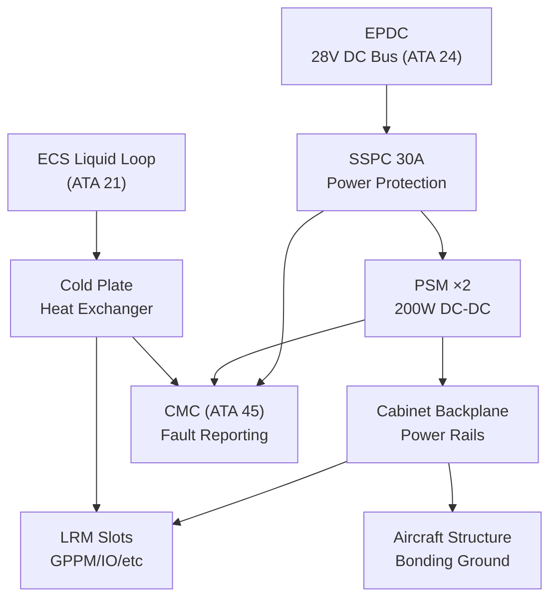
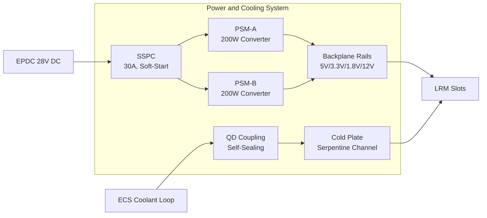
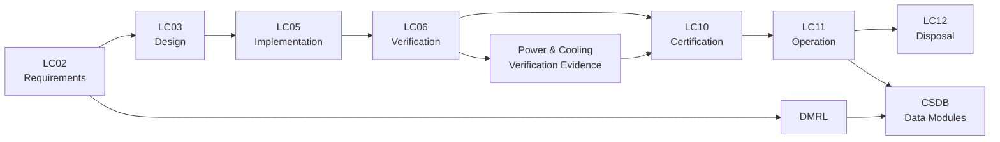

# ATLAS 040-049 · Section 04 · Subsection 042 · 050 — IMA Power, Cooling and Installation Interfaces

## 0. Hyperlink Policy

All internal cross-references use relative Markdown links within the Q+ATLANTIDE CSDB repository. External citations in §19/§20 marked . Parent: [042 README](./README.md) · [042-000](./042-000-Integrated-Modular-Avionics-General.md).

---

## 1. Purpose

This document defines the power distribution, cooling, cable routing, grounding, bonding, and installation interface requirements for the AMPEL360E IMA system. It covers the Power Supply Module (PSM) and Power Distribution Unit (PDU) architecture, cold plate liquid cooling design, DO-160G Section 16 power quality compliance, cable routing and shielding per MIL-W-22759, grounding and bonding per MIL-HDBK-1857, and Solid State Power Controller (SSPC) integration.

---

## 2. Applicability

| Attribute | Value |
|-----------|-------|
| Aircraft Program | AMPEL360E eWTW |
| ATA Chapter | ATA 42 — Integrated Modular Avionics |
| Certification Basis | CS-25 Amendment 28; DO-160G Issue G |
| Applicable Standards | DO-160G §16; MIL-W-22759; MIL-HDBK-1857; ARINC 600; SAE AS50881 |
| Design Assurance Level | PSM: DAL B; PDU: DAL B; Cooling: DAL C |
| Configuration | AMPEL360E Build Standard 1.0 and above |

---

## 3. System / Function Overview

The AMPEL360E IMA power architecture provides 28 V DC primary power and 115 V AC 400 Hz secondary power to each IMA cabinet from the aircraft Essential Power Distribution Centre (EPDC). Each cabinet has two independently powered PSMs (PSM-A and PSM-B) providing N+1 redundancy. Each PSM accepts 28 V DC input and generates regulated 5 V, 3.3 V, and 1.8 V DC rails for LRM supply via the cabinet backplane.

Liquid cooling is provided by the aircraft Environmental Control System (ECS) liquid cooling loop operating at 40–55°C coolant inlet temperature. The IMA cold plate is a dedicated aluminium extrusion cold wall within each cabinet, interfacing with the aircraft liquid loop via a self-sealing quick-disconnect coupling (QD coupling). Thermal resistance from LRM junction to coolant is ≤0.8°C/W per LRM slot under maximum load.

Cable routing follows SAE AS50881 Rev F requirements for avionics wiring. All IMA signal cables use shielded twisted pairs (MIL-W-22759/87) with shield grounding at the cabinet end to provide Faraday cage effect. Power cables use MIL-W-22759/16 at appropriate gauge for ≤3% voltage drop at maximum load.

---

## 4. Scope

### 4.1 Included

- PSM and PDU architecture, input power specifications, and output rail regulation.
- SSPC integration for IMA power feed protection and remote control.
- Cold plate liquid cooling design, QD coupling, and thermal analysis.
- Cable routing rules, minimum bend radius, conduit, and fire wall penetration requirements.
- Grounding strap specification and bonding resistance requirements.
- EMI filter design on power inputs (DO-160G §16 power quality compliance).

### 4.2 Excluded

- Aircraft-level EPDC and bus tie breaker configuration (ATA 24).
- ECS liquid cooling loop pumps and heat exchanger (ATA 21).
- Aircraft structural mounting provisions for cabinets (ATA 53/57).

---

## 5. Architecture Description

**PSM Architecture:** Each PSM is a 200 W, 28 V DC input, multi-output regulated DC-DC converter with >90% efficiency. Output rails: 5 V @ 20 A, 3.3 V @ 30 A, 1.8 V @ 25 A, 12 V @ 5 A. Input includes EMI filter (DO-160G §16), inrush current limiter, reverse polarity protection, and under-voltage lockout at 22 V. PSM output is current-limited and short-circuit protected; fault does not damage backplane or adjacent LRMs.

**SSPC Integration:** Each IMA cabinet power feed from EPDC passes through a Solid State Power Controller (SSPC) rated at 30 A, providing electronic circuit protection, soft-start inrush control, and remote on/off capability commanded from the IMA Health Monitor via ARINC 429 to the Power Management Bus (PMB). SSPC trip events are reported to CMC within 100 ms.

**Cold Plate Design:** The cold plate aluminium extrusion provides 12 slots of direct thermal contact with LRM wedge locks. Coolant flows through two parallel serpentine channels machined into the extrusion. Coolant inlet pressure ≤ 0.5 bar gauge; flow rate ≥ 2 L/min. QD couplings are self-sealing on disconnect to prevent coolant spillage in the avionics bay.

**Cable Routing:** Power cables routed on the left side of the avionics bay conduit; signal cables on the right side; minimum separation 50 mm to reduce crosstalk. All cables are clamped every 300 mm with EPDM-lined clamps and supported at each penetration through structure frames. Fire wall penetrations use fire-rated grommet assemblies.

**Bonding:** Cabinet chassis bonded to aircraft structure with a 25 mm² copper braid strap, maximum 2.5 mΩ measured per MIL-HDBK-1857. Additional EMI bonding straps (10 mm² minimum) at each cable shield termination point.

---

## 6. Functional Breakdown

| Function ID | Function Name | Description | DAL | Owner |
|-------------|---------------|-------------|-----|-------|
| F-042-01 | Power Distribution Management | Distribute 28 V DC from EPDC through SSPC to PSMs; regulate 5 V/3.3 V/1.8 V/12 V rails to LRMs with ≤2% regulation and ≤50 mV ripple | B | Q-MECHANICS |
| F-042-02 | Cooling Flow Regulation | Maintain LRM baseplate temperature ≤85°C via liquid cooling; monitor coolant flow rate and temperature; alert CMC on thermal fault | C | Q-MECHANICS |
| F-042-03 | Cable Routing and Shielding | Route IMA wiring per SAE AS50881; maintain shield continuity ≥60 dB insertion loss; protect cables from chafing, vibration, and heat sources | C | Q-MECHANICS |
| F-042-04 | Grounding Integrity Monitoring | Verify cabinet bonding resistance ≤2.5 mΩ; monitor SSPC ground fault current; alert CMC on grounding degradation | B | Q-MECHANICS |
| F-042-05 | Installation Interface Control | Manage PSM hot-swap capability; enforce cable connector keying; control SSPC state via PMB during maintenance mode | B | Q-MECHANICS |

---

## 7. Mermaid — System Context Diagram

---

## 8. Mermaid — Internal Functional Architecture

---

## 9. Mermaid — Lifecycle Traceability

---

## 10. Interfaces

| Interface ID | Name | Type | Counterpart System | Protocol | Direction |
|--------------|------|------|--------------------|----------|-----------|
| IF-042-01 | EPDC to SSPC | Electrical | EPDC (ATA 24) | 28 V DC, MIL-W-22759/16 | Input |
| IF-042-02 | SSPC to PSM | Electrical | PSM LRM | 28 V DC, backplane rail | Input |
| IF-042-03 | ECS to Cold Plate | Thermal/Fluid | ECS Liquid Loop (ATA 21) | Water-glycol, QD coupling, ≤0.5 bar | Input |
| IF-042-04 | PSM to LRM Slots | Electrical | All IMA LRMs | 5/3.3/1.8/12 V DC backplane rails | Output |
| IF-042-05 | SSPC to CMC | Data | CMC (ATA 45) | ARINC 429 trip status | Output |
| IF-042-06 | Cabinet to Aircraft Structure | Ground | Aircraft Structure | 25 mm² copper bonding strap | Ground |

---

## 11. Operating Modes

| Mode | Name | Description | Entry Condition | Exit Condition |
|------|------|-------------|-----------------|----------------|
| M1 | Power-Off | All rails de-energised; cold plate coolant circulating (ECS may remain active) | SSPC off | SSPC on |
| M2 | Soft-Start | SSPC limits inrush to 15 A peak; PSM rails rise in sequence (5V, 3.3V, 1.8V, 12V) | SSPC on | Rails stable ±2% |
| M3 | Normal Operation | Dual PSM-A and PSM-B active; load-shared; thermal within limits | Rails stable | Fault or power-off |
| M4 | Single PSM Degraded | PSM-A or PSM-B faulted; surviving PSM supports full load ≤180W with thermal derating | PSM fault | PSM replacement |
| M5 | Maintenance | SSPC remotely controllable; PSM hot-swap; coolant isolated via QD | Ground; maintenance mode | Maintenance complete |

---

## 12. Monitoring and Diagnostics

- **PSM Rail Voltage:** Each PSM monitors 5 V, 3.3 V, 1.8 V, and 12 V rails at 100 Hz; out-of-tolerance (±2%) events logged and reported to CMC within 50 ms.
- **PSM Temperature:** NTC thermistor on PSM heat sink monitors junction temperature; >95°C triggers CMC caution and PSM power derating.
- **SSPC Current Monitoring:** SSPC measures RMS current at 10 Hz; over-current (>30 A) triggers trip and CMC fault record; under-current (>50% below nominal) suggests LRM failure.
- **Coolant Flow Rate:** Turbine flow meter on cold plate inlet measures flow rate at 1 Hz; <2 L/min triggers CMC caution; <1 L/min triggers emergency thermal shutdown.
- **Coolant Temperature:** PT100 sensors at inlet and outlet; ΔT monitored to calculate heat dissipation; ΔT >15°C triggers CMC advisory.
- **Bonding Resistance:** Ground fault monitoring circuit in SSPC detects chassis-to-structure resistance >5 mΩ; generates CMC maintenance advisory.
- **Cable Integrity:** Automated continuity test on shielded cable shields during IBIT; open shield detected and reported to CMC as maintenance advisory.
- **PHM — PSM RUL:** PHM algorithm tracks PSM thermal cycling count and estimates RUL; alert dispatched when RUL <500 flight hours for proactive replacement.

---

## 13. Maintenance Concept

| Task ID | Task Description | Interval | Access | Skill Level |
|---------|-----------------|----------|--------|-------------|
| MC-042-01 | PSM rail voltage check and bonding resistance measurement | A-Check | Ground Support Terminal | Avionics Technician |
| MC-042-02 | Coolant flow and temperature ΔT check | A-Check | ECS maintenance panel | Systems Technician |
| MC-042-03 | PSM hot-swap replacement | On-Condition | Cabinet PSM slot | Avionics Technician |
| MC-042-04 | Cable routing inspection and clamp condition check | C-Check | Avionics Bay Full Access | Aircraft Technician |
| MC-042-05 | QD coupling inspection and replacement | C-Check | Cold plate access | Systems Technician |

---

## 14. S1000D / CSDB Mapping

| Data Module Code (DMC) | Title | Publication Type | SNS |
|------------------------|-------|-----------------|-----|
| QATL-A-042-05-00-00AAA-040A-A | IMA Power and Cooling Description | AMM | 042-050 |
| QATL-A-042-05-00-00AAA-520A-A | PSM Rail Check and Cooling Flow Test | AMM | 042-050 |
| QATL-A-042-05-00-00AAA-920A-A | PSM and Cooling Fault Isolation | FIM | 042-050 |
| QATL-A-042-05-00-00AAA-941A-A | PSM, QD Coupling, and Cable Assembly Parts Data | IPD | 042-050 |

### Recommended DM Set

| DM Role | DMC Suffix | Content |
|---------|-----------|---------|
| System Overview | 040A | PSM architecture, cold plate, cable routing, grounding |
| BITE Procedure | 520A | Rail voltage check, flow rate measurement, bonding test |
| Fault Isolation | 920A | PSM fault isolation, SSPC trip analysis |
| IPD | 941A | PSM PN, QD coupling PN, bonding strap PN |

---

## 15. Footprints

### 15.1 Physical

| Item | Value |
|------|-------|
| PSM LRM Dimensions | 233.4 mm × 194.0 mm × 22.5 mm (ARINC 600 3MCU) |
| PSM Mass | ≤0.8 kg |
| Cold Plate Mass | ≤2.5 kg per cabinet |
| QD Coupling Size | 12.7 mm (1/2 inch) tube, SAE J2064 |

### 15.2 Electrical / Data

| Parameter | Value |
|-----------|-------|
| Input Power (per cabinet) | 28 V DC, ≤25 A nominal; ≤30 A peak |
| Secondary Power | 115 V AC 400 Hz, ≤5 A (AFDX switch and display interface) |
| PSM Efficiency | ≥90% at full load |
| Output Ripple | ≤50 mV peak-to-peak on all rails |

### 15.3 Maintenance

| Parameter | Value |
|-----------|-------|
| PSM Hot-Swap Time | <5 min |
| QD Coupling Disconnect Time | <2 min (tool-free) |
| Bonding Strap Replacement Time | <10 min |

### 15.4 Data

| Parameter | Value |
|-----------|-------|
| PSM Fault Log Capacity | 500 events in NVM |
| Thermal Log Sample Rate | 1 Hz per sensor |
| SSPC Trip Event Reporting Latency | ≤100 ms to CMC |

---

## 16. Safety and Certification Considerations

- **DO-160G §16 Power Quality:** IMA PSMs are qualified to DO-160G Section 16 power quality levels; input filters ensure IMA does not generate conducted interference onto aircraft power bus.
- **SSPC Certification:** SSPCs used for IMA power feeds are qualified to ETSO-C179b; electronic over-current trip provides faster and more reliable protection than thermal circuit breakers.
- **Coolant Spillage Prevention:** Self-sealing QD couplings prevent coolant release on maintenance disconnect; eliminates avionics bay contamination risk from coolant leaks.
- **Flammability:** All cable insulation materials (MIL-W-22759) comply with CS-25 §25.853 flammability requirements; fire wall penetrations use approved fire-resistant grommet assemblies.
- **Lightning Indirect Effects:** Power cable EMI filters and bonding straps provide attenuation of lightning-induced transients; analysis per CS-25 §25.1316 demonstrates no upset to IMA functions.
- **Single Failure Tolerance:** Loss of PSM-A does not reduce IMA functionality (PSM-B provides full load); loss of coolant flow triggers orderly shutdown sequence before thermal damage occurs.

---

## 17. Verification and Validation

| V&V ID | Requirement | Method | Evidence | Status |
|--------|-------------|--------|----------|--------|
| VV-042-01 | PSM output rails within ±2% across load and temperature | Test | PSM qualification test report |  |
| VV-042-02 | DO-160G §16 power quality compliance | Test | DO-160G §16 test report |  |
| VV-042-03 | Thermal: LRM baseplate ≤85°C at 55°C coolant, full load | Test | Thermal test report |  |
| VV-042-04 | SSPC trips within 10 ms of sustained 35 A over-current | Test | SSPC over-current test |  |
| VV-042-05 | Bonding resistance ≤2.5 mΩ after 1000 thermal cycles | Test | Bond resistance measurement |  |
| VV-042-06 | QD coupling zero spillage on disconnect under 0.5 bar | Test | QD coupling disconnect test |  |
| VV-042-07 | All cables pass CS-25 §25.853 flammability | Test | Flammability certificate |  |

---

## 18. Glossary

| Term | Acronym | Definition |
|------|---------|------------|
| Power Supply Module | PSM | IMA LRM providing regulated DC power rails from 28 V DC input to all LRM slots in the cabinet |
| Power Distribution Unit | PDU | Aircraft-level unit distributing power from bus to multiple circuit feeds; upstream of IMA SSPC |
| Cold Plate | — | Aluminium extrusion with internal coolant channels providing conduction cooling for IMA LRMs |
| DO-160G | — | RTCA standard defining environmental conditions and test procedures for airborne equipment |
| Bonding Strap | — | Low-resistance copper braid connecting equipment chassis to aircraft structure for EMI and lightning protection |
| MIL-W-22759 | — | Military standard for fluoropolymer-insulated aircraft wire; fire-resistant and lightweight |
| Grounding | — | Connection of equipment to aircraft structure to provide common electrical reference and lightning path |
| Solid State Power Controller | SSPC | Electronic device replacing thermal circuit breakers; provides fast, precise over-current protection with remote control |
| EMI Filter | — | Passive LC network on power input attenuating conducted EMI between equipment and aircraft power bus |
| Thermal Resistance | — | Measure of resistance to heat flow; expressed in °C/W; lower value = better thermal conductivity |

---

## 19. Citations

| Ref ID | Standard / Document | Applicability | Status |
|--------|--------------------|-----------|----|
| CIT-042-01 | RTCA DO-160G §16, Power Input | PSM power quality qualification |  |
| CIT-042-02 | MIL-W-22759, Wire, Electric, Fluoropolymer-Insulated | IMA cable specification |  |
| CIT-042-03 | MIL-HDBK-1857, Grounding, Bonding and Shielding | Bonding strap design and verification |  |
| CIT-042-04 | SAE AS50881 Rev F, Wiring Aerospace Vehicle | Wiring routing and installation requirements |  |
| CIT-042-05 | EASA ETSO-C179b, Solid State Power Controllers | SSPC airworthiness qualification |  |
| CIT-042-06 | EASA CS-25 §25.853, Compartment Interiors Flammability | Cable flammability requirements |  |
| CIT-042-07 | EASA CS-25 §25.1316, System Lightning Protection | IMA power lightning indirect effects |  |
| CIT-042-08 | SAE J2064, R-134a Refrigerant Automotive Liquid Coupling | QD coupling specification basis |  |

---

## 20. References

| Ref ID | Document | Version | Status |
|--------|----------|---------|--------|
| REF-042-01 | 042-000 IMA General | 1.0 |  |
| REF-042-02 | AMPEL360E IMA Power Budget Analysis | 1.0 |  |
| REF-042-03 | AMPEL360E IMA Thermal Analysis Report | 1.0 |  |
| REF-042-04 | AMPEL360E Wiring Design Standard | 1.0 |  |

---

## 21. Open Issues

| Issue ID | Description | Owner | Status |
|----------|-------------|-------|--------|
| OI-042-01 | Coolant type (PAG-based vs water-glycol) to be confirmed with ATA 21 ECS team | Q-MECHANICS |  |
| OI-042-02 | PSM efficiency at partial load (<50W) below target; redesign under review | Q-MECHANICS |  |
| OI-042-03 | SSPC remote control interface (PMB) protocol version to be agreed with ATA 24 | Q-MECHANICS |  |

---

## 22. Change Log

| Version | Date | Author | Description |
|---------|------|--------|-------------|
| 1.0.0 | 2025-01-01 | Q-MECHANICS | Initial baseline release |  |
