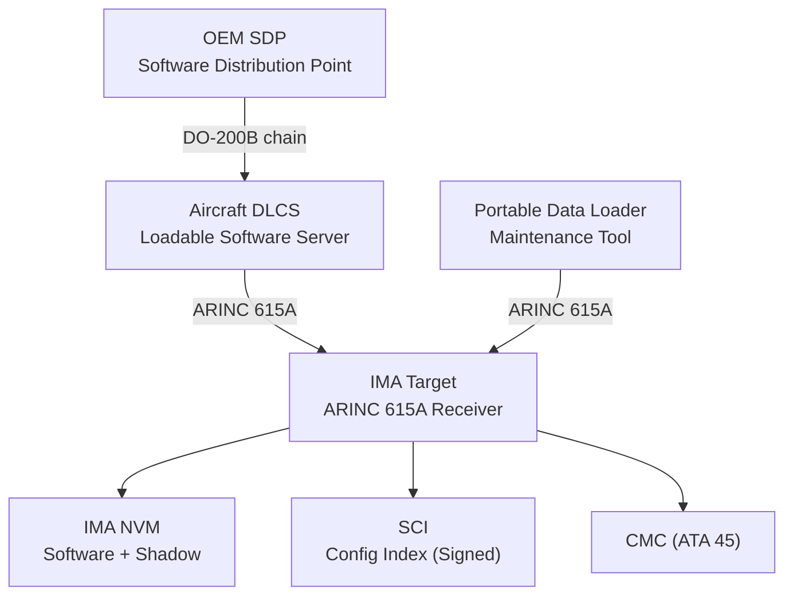
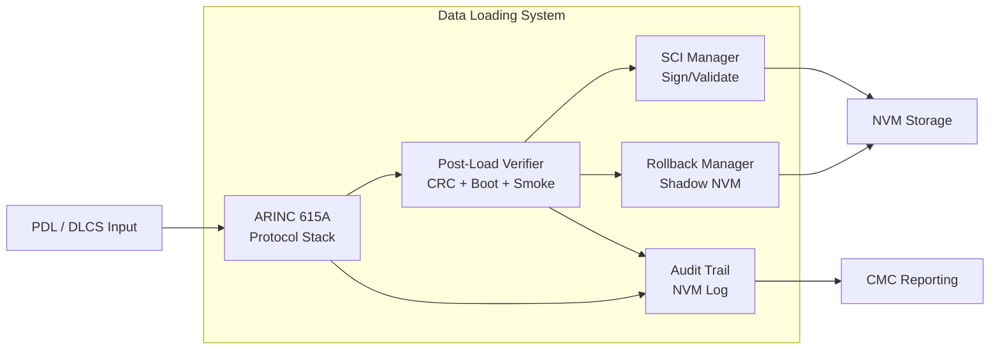
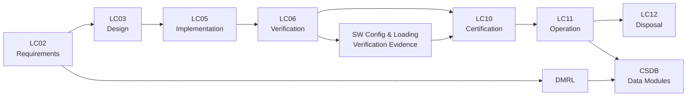

# ATLAS 040-049 · Section 04 · Subsection 042 · 060 — Software Configuration and Data Loading

## 0. Hyperlink Policy

All internal cross-references use relative Markdown links within Q+ATLANTIDE CSDB. External citations in §19/§20 marked . Parent: [042 README](./README.md).

---

## 1. Purpose

This document defines the software configuration management, data loading architecture, post-load verification, rollback procedures, and audit trail requirements for the AMPEL360E IMA system. It establishes compliance with ARINC 615A (data loading protocol), DO-200B (software data integrity), and AMC 20-21 (on-board loadable software) for the IMA platform and all hosted applications.

---

## 2. Applicability

| Attribute | Value |
|-----------|-------|
| Aircraft Program | AMPEL360E eWTW |
| ATA Chapter | ATA 42 — Integrated Modular Avionics |
| Certification Basis | CS-25 Amendment 28; AMC 20-21 |
| Applicable Standards | ARINC 615A; DO-200B; AMC 20-21; ARINC 665; DO-178C |
| Design Assurance Level | Software loading function: DAL B |
| Configuration | AMPEL360E Build Standard 1.0 and above |

---

## 3. System / Function Overview

The AMPEL360E IMA data loading architecture uses ARINC 615A over 100BASE-TX Ethernet as the primary data loading protocol. A Data Loading and Configuration System (DLCS) server on the aircraft maintenance network provides an authorised repository for all loadable software parts. Portable Data Loaders (PDLs) connect via the maintenance Ethernet jack in the avionics bay for off-aircraft loading operations.

Each IMA cabinet maintains a Software Configuration Index (SCI) identifying all software part numbers loaded on each GPPM and I/O LRM. The SCI is cryptographically signed by the OEM and validated by the IMA platform at each power-up. Post-load verification includes CRC32 of each loaded file, partition boot verification, and functional smoke test.

Rollback capability is provided by retaining the previous validated software set in NVM shadow storage. Rollback is triggered manually by maintenance or automatically by consecutive boot failure.

---

## 4. Scope

### 4.1 Included

- ARINC 615A data loading protocol implementation on IMA end-system.
- SCI generation, signing, distribution, and power-up validation.
- DO-200B software data integrity: CRC, digital signature, chain of custody.
- Post-load verification procedures (CRC verification, partition smoke test).
- Software rollback mechanism and rollback trigger criteria.
- Data loading audit trail and traceability to DO-178C configuration items.

### 4.2 Excluded

- Aircraft-level software delivery and depot processes (OEM program management).
- Navigation database loading (ARINC 424 data per ATA 34 scope).
- Display system software loading (ATA 31).

---

## 5. Architecture Description

**ARINC 615A Protocol:** The IMA end-system acts as ARINC 615A Target. The PDL or DLCS acts as Initiator. Protocol provides: file transfer with progress reporting, target identification, load target status, and CRC verification confirmation. All ARINC 615A transfers are logged by the target with timestamp, initiator ID, file name, size, CRC, and success/failure status.

**SCI Structure:** The SCI is an XML document listing all software part numbers, versions, and load addresses for each IMA LRM. The SCI is signed with a 256-bit ECDSA key held by the OEM configuration control authority. IMA validates the signature at power-up; invalid SCI prevents system start and generates CMC fault.

**DO-200B Compliance:** Software is distributed from the OEM Software Distribution Point (SDP) to aircraft DLCS with: SHA-256 hash verification at each transfer, digital signature of distribution package, and chain of custody log. The DLCS validates hash on receipt; corrupted packages are rejected and flagged for re-transfer.

**Post-Load Verification:** After loading new software, the IMA executes: (1) CRC32 verification of each loaded file against SCI-declared CRC; (2) FPGA bitstream CRC verification; (3) partition boot test (each partition starts and responds to APEX GET_PARTITION_STATUS within 30 s); (4) smoke test (defined set of APEX API calls exercising core services). Results logged to NVM and reported to PDL/DLCS.

**Rollback:** Previous software set retained in NVM shadow storage (minimum 1 prior version per LRM). Rollback triggered by: (a) maintenance command via PDL/DLCS; or (b) automatic after 3 consecutive post-load verification failures. Rollback to shadow set and re-verification executed automatically.

---

## 6. Functional Breakdown

| Function ID | Function Name | Description | DAL | Owner |
|-------------|---------------|-------------|-----|-------|
| F-042-01 | Loadable Software Delivery | Implement ARINC 615A target protocol; receive software files from PDL or DLCS with CRC verification; store in NVM staging area | B | Q-DATAGOV |
| F-042-02 | Configuration Index Management | Maintain and validate SCI; verify ECDSA signature at power-up; update SCI after successful load and post-load verification | B | Q-DATAGOV |
| F-042-03 | Post-Load Integrity Verification | Execute CRC32 file verification, FPGA bitstream check, partition boot test, and APEX smoke test after every software load | B | Q-DATAGOV |
| F-042-04 | Rollback Management | Retain previous validated software set in NVM shadow; execute rollback on maintenance command or after 3 consecutive verification failures | B | Q-DATAGOV |
| F-042-05 | Data Loading Audit Trail | Log all data loading events (initiator, file, CRC, result, timestamp) to NVM; report to CMC; retain for ≥1000 load events | B | Q-DATAGOV |

---

## 7. Mermaid — System Context Diagram

---

## 8. Mermaid — Internal Functional Architecture

---

## 9. Mermaid — Lifecycle Traceability

---

## 10. Interfaces

| Interface ID | Name | Type | Counterpart System | Protocol | Direction |
|--------------|------|------|--------------------|----------|-----------|
| IF-042-01 | IMA to PDL | Data | Portable Data Loader | ARINC 615A over 100BASE-TX | Bidirectional |
| IF-042-02 | IMA to DLCS | Data | Aircraft DLCS | ARINC 615A over AFDX VL | Bidirectional |
| IF-042-03 | SCI to OEM SDP | Data | OEM Software Distribution Point | Secure file transfer (SFTP + ECDSA) | Input |
| IF-042-04 | Load Audit to CMC | Data | CMC (ATA 45) | ARINC 429 load complete status | Output |
| IF-042-05 | Rollback to NVM | Data | IMA NVM (internal) | Internal NVM read/write | Bidirectional |
| IF-042-06 | PDL to Maintenance Jack | Physical | Avionics Bay Maintenance Connector | RJ45 Ethernet | Physical |

---

## 11. Operating Modes

| Mode | Name | Description | Entry Condition | Exit Condition |
|------|------|-------------|-----------------|----------------|
| M1 | Normal Flight | No data loading permitted; SCI validated at power-up; NVM read-only | Aircraft airborne or engines running | Ground with maintenance mode |
| M2 | Load Mode | ARINC 615A session active; software being received and staged in NVM | Ground; maintenance enable; PDL/DLCS connected | Load complete or abort |
| M3 | Verification Mode | Post-load CRC, boot, and smoke tests executing | Load complete | Verification pass or fail |
| M4 | Active (New SW) | New software set active after successful verification; previous set in shadow NVM | Verification pass | Next load cycle |
| M5 | Rollback Mode | Shadow software set being activated; new set invalidated | Rollback command or 3× verification failure | Rollback verification pass |

---

## 12. Monitoring and Diagnostics

- **Load Session Integrity:** Each ARINC 615A session is logged with initiator IP, session ID, file list, CRC results, and outcome; available for DLCS audit review.
- **SCI Signature Verification Failure:** Invalid SCI signature at power-up logged to NVM with timestamp and SCI version; CMC fault generated; system does not start until valid SCI loaded.
- **Post-Load CRC Mismatch:** CRC mismatch on any loaded file logged with filename and expected/actual CRC; load session marked FAILED; rollback initiated.
- **Partition Boot Timeout:** Partition failure to reach READY state within 30 s after new software load logged; triggers load failure action.
- **Rollback Event Logging:** Each rollback event logged with trigger reason (maintenance command vs automatic), software versions rolled from/to, and verification result.
- **NVM Shadow Storage Health:** Shadow NVM wear indicator checked monthly; >80% wear reported to CMC for NVM LRM replacement scheduling.
- **Audit Trail Capacity:** Audit trail NVM capacity monitored; >90% full generates CMC advisory to download and archive logs.
- **DO-200B Chain of Custody:** Each software delivery to DLCS verified by SHA-256 hash comparison against OEM-provided manifest; mismatch blocks loading.

---

## 13. Maintenance Concept

| Task ID | Task Description | Interval | Access | Skill Level |
|---------|-----------------|----------|--------|-------------|
| MC-042-01 | SCI version check and audit log download | A-Check | PDL / DLCS | Avionics Technician |
| MC-042-02 | Software load of new part numbers per SB | Per SB | PDL / DLCS | Avionics Technician |
| MC-042-03 | Post-load verification execution and result review | After every load | PDL display | Avionics Technician |
| MC-042-04 | Manual rollback initiation if verification fails | On-Condition | PDL command | Avionics Technician |
| MC-042-05 | NVM health check and audit log archive | C-Check | Ground Support Terminal | Avionics Engineer |

---

## 14. S1000D / CSDB Mapping

| Data Module Code (DMC) | Title | Publication Type | SNS |
|------------------------|-------|-----------------|-----|
| QATL-A-042-06-00-00AAA-040A-A | IMA Software Loading Description | AMM | 042-060 |
| QATL-A-042-06-00-00AAA-520A-A | Software Load and Verification Procedures | AMM | 042-060 |
| QATL-A-042-06-00-00AAA-920A-A | Load Failure Fault Isolation | FIM | 042-060 |
| QATL-A-042-06-00-00AAA-941A-A | Loadable Software Part Numbers | IPD | 042-060 |

### Recommended DM Set

| DM Role | DMC Suffix | Content |
|---------|-----------|---------|
| System Overview | 040A | ARINC 615A, SCI, DO-200B, rollback architecture |
| BITE Procedure | 520A | Load procedure, post-load verification steps |
| Fault Isolation | 920A | CRC mismatch isolation, SCI validation failure |
| IPD | 941A | Software PN catalogue, SCI version table |

---

## 15. Footprints

### 15.1 Physical

| Item | Value |
|------|-------|
| NVM Shadow Storage | 2× active software set capacity per LRM |
| PDL Connector | RJ45 Ethernet, avionics bay maintenance panel |
| DLCS Interface | AFDX maintenance VL, dedicated switch port |

### 15.2 Electrical / Data

| Parameter | Value |
|-----------|-------|
| ARINC 615A Transfer Rate | ≤100 Mbps (Ethernet-limited) |
| Practical Load Rate (NVM limited) | ≈20 MB/min per GPPM |
| SCI File Size | ≤4 MB |
| DO-200B Signature Algorithm | ECDSA P-256 / SHA-256 |

### 15.3 Maintenance

| Parameter | Value |
|-----------|-------|
| Full Software Load Time | <20 min per GPPM |
| Post-Load Verification Time | <5 min |
| Rollback Time | <10 min |

### 15.4 Data

| Parameter | Value |
|-----------|-------|
| Audit Trail Capacity | 1000 load events in NVM |
| Log Retention After Rollback | Both active and shadow logs retained |
| SCI History | Last 3 validated SCI versions in NVM |

---

## 16. Safety and Certification Considerations

- **AMC 20-21 Compliance:** IMA software loading system is designed to comply with AMC 20-21 requirements for on-board loadable software, including part number identification, loading integrity verification, and post-load check.
- **DO-200B Data Integrity:** End-to-end SHA-256 hashing and ECDSA signing ensures software cannot be modified between OEM SDP and IMA NVM without detection; eliminates risk of corrupted software deployment.
- **SCI Cryptographic Validation:** ECDSA signature on SCI prevents unauthorised software configurations from being loaded; private key held exclusively at OEM configuration control authority.
- **Post-Load Verification Completeness:** Three-tier verification (CRC, boot, smoke test) reduces probability of undetected corrupted software to < 10⁻¹⁰ per DO-178C guidance.
- **Rollback Safety:** Rollback preserves at least one previously validated software configuration, ensuring IMA always has a known-good state available for recovery.
- **Audit Trail Immutability:** Load audit trail written to write-once NVM sectors; cannot be modified or deleted by field maintenance; provides regulatory evidence of software configuration history.

---

## 17. Verification and Validation

| V&V ID | Requirement | Method | Evidence | Status |
|--------|-------------|--------|----------|--------|
| VV-042-01 | ARINC 615A load completes for all SW parts in <20 min | Test | Load time measurement |  |
| VV-042-02 | CRC mismatch detected and load aborted | Test | CRC injection fault test |  |
| VV-042-03 | Invalid SCI signature rejected at power-up | Test | SCI signature corruption test |  |
| VV-042-04 | Rollback restores previous validated SW within 10 min | Test | Rollback timing test |  |
| VV-042-05 | Audit trail captures all required load event fields | Inspection | Audit log review |  |
| VV-042-06 | Post-load smoke test detects partition boot failure | Test | Boot failure injection test |  |
| VV-042-07 | DO-200B chain of custody maintained from SDP to IMA | Analysis + Audit | DO-200B compliance review |  |

---

## 18. Glossary

| Term | Acronym | Definition |
|------|---------|------------|
| ARINC 615A | — | ARINC standard defining aircraft data loading protocol over Ethernet |
| Software Configuration Index | SCI | Document listing all software part numbers and versions loaded on an IMA cabinet; cryptographically signed |
| DO-200B | — | RTCA standard for software data integrity processes for aeronautical data |
| On-Board Loadable Software | OLC | Software designed to be loaded onto avionics equipment in service; per AMC 20-21 |
| Loadable Software Accomplishment Package | LSAP | Package of software and documentation required for AMC 20-21 on-board software qualification |
| Portable Data Loader | PED | Ground tool connecting to aircraft maintenance port for ARINC 615A data loading |
| Cyclic Redundancy Check | CRC | Algorithm computing a checksum over data to detect transmission errors or corruption |
| Digital Signature Package | DSP | Cryptographic package including ECDSA signature and public key certificate for software authenticity |
| Software Distribution Point | SDP | OEM-operated system for distributing approved loadable software to customers |
| Loadable Software Accomplishment Plan | LSAP | Plan documenting how software meets AMC 20-21 requirements for on-board loading |

---

## 19. Citations

| Ref ID | Standard / Document | Applicability | Status |
|--------|--------------------|-----------|----|
| CIT-042-01 | ARINC 615A-5, Airborne Software Loading | Data loading protocol |  |
| CIT-042-02 | RTCA DO-200B, Standards for Processing Aeronautical Data | SW data integrity end-to-end |  |
| CIT-042-03 | EASA AMC 20-21, On-Board Loadable Software | Loadable software airworthiness |  |
| CIT-042-04 | ARINC 665-3, Loadable Software Standards | Software packaging and part numbering |  |
| CIT-042-05 | RTCA DO-178C, Software Considerations | SW configuration item traceability |  |
| CIT-042-06 | NIST FIPS 186-4, Digital Signature Standard (ECDSA) | SCI digital signature algorithm |  |
| CIT-042-07 | NIST FIPS 180-4, Secure Hash Standard (SHA-256) | DO-200B hash algorithm |  |
| CIT-042-08 | EASA CS-25 §25.1309 | Software configuration safety impact |  |

---

## 20. References

| Ref ID | Document | Version | Status |
|--------|----------|---------|--------|
| REF-042-01 | 042-000 IMA General | 1.0 |  |
| REF-042-02 | AMPEL360E Software Configuration Management Plan | 1.0 |  |
| REF-042-03 | AMPEL360E LSAP | 1.0 |  |
| REF-042-04 | AMPEL360E DO-200B Data Management Plan | 1.0 |  |

---

## 21. Open Issues

| Issue ID | Description | Owner | Status |
|----------|-------------|-------|--------|
| OI-042-01 | DLCS architecture (on-aircraft server vs ground-side) to be decided | Q-DATAGOV |  |
| OI-042-02 | ECDSA key management and revocation procedure under development | Q-DATAGOV |  |
| OI-042-03 | Rollback trigger criteria for automatic (3× failure) to be validated with EASA | Q-AIR |  |

---

## 22. Change Log

| Version | Date | Author | Description |
|---------|------|--------|-------------|
| 1.0.0 | 2025-01-01 | Q-DATAGOV | Initial baseline release |  |
