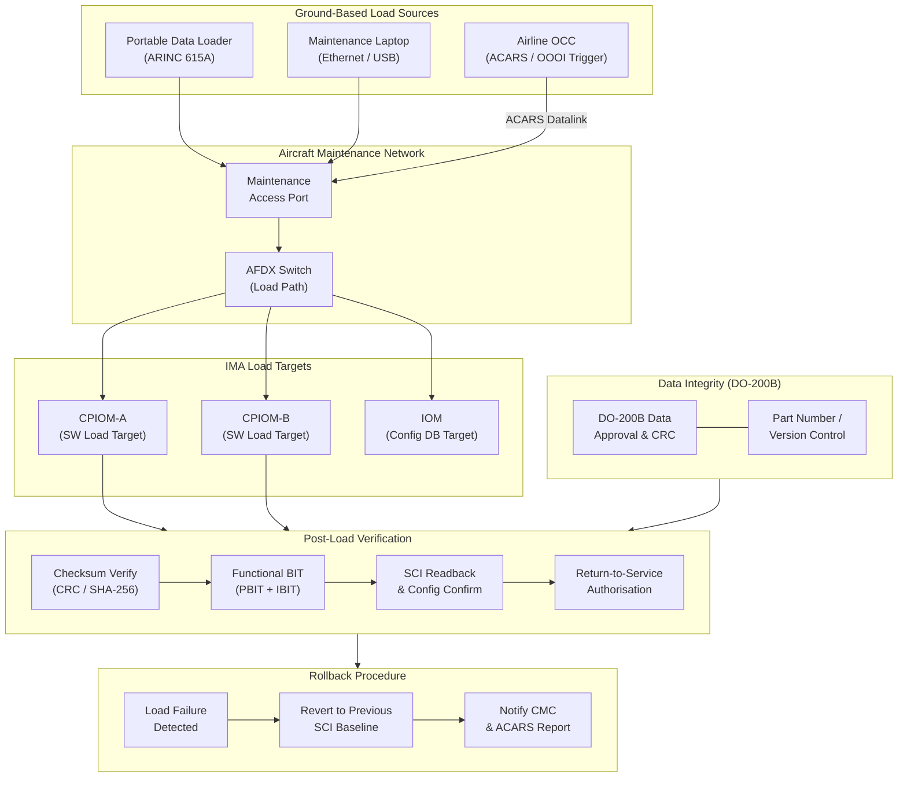

# ATLAS 040-049 · Section 04 · Subsection 042 · 060 — Software Configuration and Data Loading

## 1. Purpose

This document defines the software configuration management and data loading architecture for the IMA platform within the Q+ATLANTIDE ATLAS baseline. It covers the ARINC 615A airborne data loader protocol, the Software Configuration Index (SCI), configuration database management, post-load verification, data integrity requirements per RTCA DO-200B, and rollback procedures for recovery from failed or corrupted load operations.

The ability to reliably load, verify, and manage multiple software part numbers across a highly integrated IMA platform is essential for both initial aircraft entry into service and throughout the operational life of the aircraft. The data loading architecture must maintain strict traceability between certified software baselines and the operational configuration of each IMA module, providing auditable evidence of configuration conformance to support continued airworthiness oversight by regulatory authorities and aircraft operators alike.

## 2. Scope

This subject covers:

- ARINC 615A: ground-based and airborne data loading protocol, connection modes, file transfer, and status reporting.
- Data loading network topology: maintenance laptop, portable data loader (PDL), AFDX-connected and Ethernet-connected load targets.
- Aircraft Communication Addressing and Reporting System (ACARS) and OOOI-triggered automatic data loading.
- Software Configuration Index (SCI): structure, content, part number management, and certification credit.
- Configuration Database (CDB): aircraft-specific parameters, VL routing tables, partition schedules, and threshold settings.
- DO-200B data integrity: data validation, checksums, cyclic redundancy checks (CRC), and supplier data approval.
- Operational Load Control: authorisation, sequencing of load operations, and concurrent load restrictions.
- Post-load verification: functional test, configuration readback, and BIT pass criteria.
- Rollback procedures: detection of load failure, reversion to previous SCI, and return-to-service criteria.

## 3. Glossary

| Term / Acronym | Definition |
|---|---|
| ARINC 615A | ARINC Specification 615A — "Airborne Data Loader Using High Speed Data Bus", defining the protocol for transferring software and data to avionics load targets via an Ethernet or AFDX interface from a Portable Data Loader (PDL) or centralised network connection. |
| PDL | Portable Data Loader — a maintenance tool conforming to ARINC 615A that is connected to the aircraft maintenance network port or directly to an avionics LRU to transfer software load files. |
| SCI | Software Configuration Index — a formal document or electronic record listing all software part numbers, version identifiers, and load checksums constituting the approved operational software configuration of the IMA platform and hosted applications. |
| CDB | Configuration Database — a set of aircraft-specific data files loaded into the IMA platform to configure operational parameters such as AFDX Virtual Link routing tables, ARINC 653 partition schedules, system thresholds, and aircraft tail-number specific values. |
| DO-200B | RTCA DO-200B / EUROCAE ED-76A — "Standards for Processing Aeronautical Data", defining the data quality and integrity requirements for aeronautical data processed and loaded into airborne systems. |
| ACARS | Aircraft Communications Addressing and Reporting System — a VHF/SATCOM digital datalink used to transmit operational messages and trigger automatic software load events from airline operations control centres to the aircraft. |
| Rollback | The procedure by which a previously certified software configuration is restored to an IMA module following detection of a failed, incomplete, or operationally unsuitable software load, ensuring return to a known-good configuration. |
| Load Checksum | A cryptographic hash or CRC value computed over the complete software load file, used to verify that the file received by the load target is identical to the certified baseline software and has not been corrupted during transfer. |
| OOOI | Out, Off, On, In — the four key aircraft gate/flight phase events (pushback, takeoff, landing, gate arrival) used as triggers for automatic data loading and configuration update operations via ACARS. |
| Part Number | A unique alphanumeric identifier assigned to each certified software component, configuration file, and data set, maintained in the SCI and traceable to the qualification evidence package. |

## 4. Diagram (Mermaid)

## 5. Footprint

| Metric | Value |
|---|---|
| Architecture | `ATLAS` — Aircraft Top Level Architecture Schema/System (controlled term) |
| Master range | `000–099` |
| Code range | `040-049` |
| Section | `04` — Aviónica, Información & APU |
| Subsection | `042` — Integrated Modular Avionics |
| Subsubject | `060` — Software Configuration and Data Loading |
| Primary Q-Division | Q-DATAGOV[^qdiv] |
| Support Q-Divisions | Q-AIR, Q-SPACE, Q-HPC |
| ORB support | ORB-PMO, ORB-LEG |
| Governance class | `baseline`[^gov] |
| Folder path | `Q+ATLANTIDE/000-099_ATLAS/040-049_Avionica-Informacion-y-APU/042_Integrated-Modular-Avionics/` |
| Document | `042-060-Software-Configuration-and-Data-Loading.md` (this file) |
| Parent subsection | [`README.md`](./README.md) |
| Parent section | [`../../README.md`](../../README.md) |
| Parent architecture | [`../../../README.md`](../../../README.md) |
| Parent baseline | [`organization/Q+ATLANTIDE.md`](../../../../organization/Q+ATLANTIDE.md) |

## 6. References & Citations

[^baseline]: Q+ATLANTIDE controlled baseline (v1.0.0) — the governing programme baseline document for all ATLAS architecture artefacts. Maintained under configuration management per the Q+ATLANTIDE governance framework.

[^qdiv]: Q-Division authority — Q-DATAGOV holds primary governance authority over IMA architecture documentation, data integrity, and configuration control within the Q+ATLANTIDE programme.

[^gov]: Governance class — `baseline` denotes that this document forms part of the formally controlled baseline configuration. Changes require formal change-request approval through ORB-PMO.

[^n001]: Note N-001 — The Software Configuration Index (SCI-042-060) and Configuration Database Master Record (CDMR-042-060) are controlled documents subject to formal revision approval per DO-297 Section 6 and ARP4754A.

[^arinc615a]: ARINC Specification 615A-3 — "Airborne Data Loader Using High Speed Data Bus", AEEC, 2004. Defines the Ethernet-based data loading protocol, file transfer procedures, and status reporting used for IMA software loading.

[^do200b]: RTCA DO-200B / EUROCAE ED-76A — "Standards for Processing Aeronautical Data", RTCA Inc., 2015. Specifies the data quality requirements and approval process for aeronautical data loaded into airborne navigation and avionics systems.

[^do178c]: RTCA DO-178C / EUROCAE ED-12C — "Software Considerations in Airborne Systems and Equipment Certification", RTCA Inc., 2011. Governs the software development lifecycle for all IMA hosted application software and the RTOS, including configuration management and change control.

[^do297]: RTCA DO-297 / EUROCAE ED-124 — "Integrated Modular Avionics (IMA) Development Guidance and Certification Considerations". Section 6 covers the Configuration Index structure and the incremental approval process for IMA software changes.
