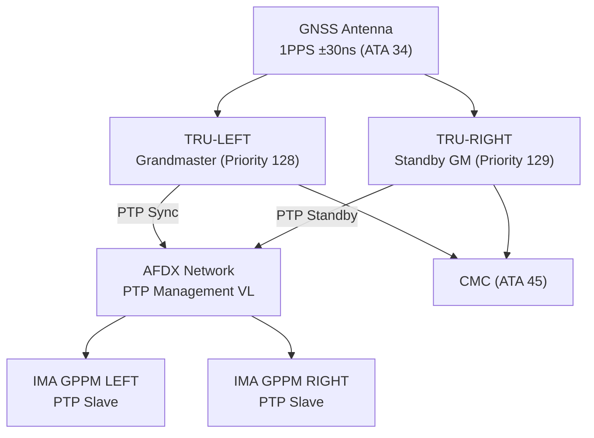
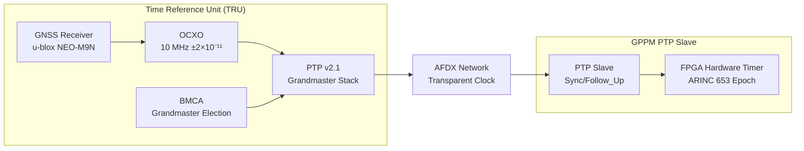
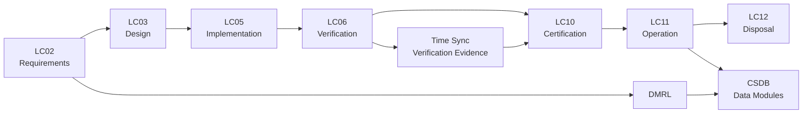

# ATLAS 040-049 · Section 04 · Subsection 042 · 070 — Time Synchronization and Deterministic Execution

## 0. Hyperlink Policy

All internal cross-references use relative Markdown links within Q+ATLANTIDE CSDB. External citations in §19/§20 marked . Parent: [042 README](./README.md).

---

## 1. Purpose

This document defines the time synchronization architecture, IEEE 1588 Precision Time Protocol (PTP) implementation, GPS-disciplined Oven-Controlled Crystal Oscillator (OCXO) holdover capability, Time Division Multiple Access (TDMA) schedule enforcement, and jitter monitoring for the AMPEL360E IMA system. Accurate and coherent time reference across all IMA partitions and AFDX end-systems is foundational to deterministic data exchange and fault correlation.

---

## 2. Applicability

| Attribute | Value |
|-----------|-------|
| Aircraft Program | AMPEL360E eWTW |
| ATA Chapter | ATA 42 — Integrated Modular Avionics |
| Certification Basis | CS-25 Amendment 28 |
| Applicable Standards | IEEE 1588-2019 (PTP v2.1); ARINC 664 Part 7; DO-160G; GNSS ICD-GPS-200D |
| Design Assurance Level | Time synchronization: DAL B; OCXO: DAL C |
| Configuration | AMPEL360E Build Standard 1.0 and above |

---

## 3. System / Function Overview

The AMPEL360E IMA time reference architecture uses IEEE 1588 Precision Time Protocol (PTP) to distribute a common time base across all AFDX end-systems and IMA modules. A GPS-disciplined OCXO in the dedicated Time Reference Unit (TRU) acts as the PTP Grandmaster Clock, traceable to International Atomic Time (TAI).

The TRU maintains GPS lock for primary synchronisation. On GPS loss, the OCXO holdover function maintains time accuracy within ±1 µs per hour for up to 4 hours, sufficient for longest expected GPS outage in normal operations. All IMA modules act as PTP Slaves, synchronising to the Grandmaster within ±100 ns under normal conditions.

ARINC 653 temporal partitioning is tied to the PTP-synchronised time base via the GPPM FPGA hardware timer. This ensures all AFDX VL transmission windows (TDMA schedules) are coherent across all end-systems, enabling coordinated data exchange with bounded latency.

---

## 4. Scope

### 4.1 Included

- Time Reference Unit (TRU) architecture with GPS and OCXO.
- IEEE 1588 PTP v2.1 Grandmaster and Slave implementation.
- TDMA schedule enforcement using PTP-synchronised hardware timer.
- Jitter measurement and monitoring across all IMA partitions.
- Holdover performance specification and GPS loss detection.

### 4.2 Excluded

- GPS antenna installation and GNSS signal processing (ATA 34).
- AFDX switch transparent clock implementation (covered in 042-040).
- Aircraft-wide timing for FMS and navigation functions (ATA 34).

---

## 5. Architecture Description

**TRU Architecture:** The TRU is an IMA I/O LRM hosting: a u-blox NEO-M9N GNSS receiver providing 1PPS with ±30 ns accuracy; an Oscilloquartz OCXO (10 MHz, phase noise < −130 dBc/Hz at 10 Hz offset); and a PTP Grandmaster software stack (IEEE 1588 v2.1, Boundary Clock profile, ARINC 664 annex). The TRU presents a Best Master Clock Algorithm (BMCA) priority 128 (primary) or 129 (standby TRU).

**PTP Distribution:** PTP Sync and Follow_Up messages are distributed via a dedicated PTP management AFDX VL (BAG=1 ms) to all GPPM end-systems. The AFDX switches implement IEEE 1588 Transparent Clock (TC) mode, adding residence time corrections to PTP messages to eliminate switch queuing jitter. Slave clocks achieve ±100 ns synchronisation accuracy.

**TDMA Integration:** Each GPPM FPGA hardware timer is disciplined by the PTP slave. The ARINC 653 major frame start is derived from this timer, aligned to a network-wide epoch at the start of each UTC second. All AFDX VL BAG windows start from the same epoch, ensuring coordinated simultaneous transmission and eliminating inter-frame collision.

**Holdover:** On GPS loss, TRU OCXO enters holdover mode. OCXO Allan deviation: ≤2×10⁻¹¹ at 1 s averaging time, providing ±1 µs holdover accuracy per hour. CMC advisory generated at GPS loss; WARNING generated if holdover exceeds 2 hours.

---

## 6. Functional Breakdown

| Function ID | Function Name | Description | DAL | Owner |
|-------------|---------------|-------------|-----|-------|
| F-042-01 | Grandmaster Clock Selection | Execute IEEE 1588 BMCA to elect Grandmaster from TRU-LEFT (priority 128) or TRU-RIGHT (priority 129); switch Grandmaster on primary failure | B | Q-HPC |
| F-042-02 | PTP Synchronization Distribution | Distribute PTP Sync/Follow_Up messages on management VL at 1 ms intervals; achieve ±100 ns slave synchronisation | B | Q-HPC |
| F-042-03 | OCXO Holdover Management | Maintain time accuracy ≤±1 µs/h on GPS loss via OCXO; alert CMC at GPS loss; generate WARNING at >2 h holdover | C | Q-HPC |
| F-042-04 | TDMA Schedule Enforcement | Align ARINC 653 major frame start to PTP-synchronised epoch; enforce AFDX VL BAG windows from common reference | B | Q-HPC |
| F-042-05 | Jitter Monitoring | Measure and log ARINC 653 major frame start jitter per partition at 10 Hz; alert HM if jitter >10 µs | B | Q-HPC |

---

## 7. Mermaid — System Context Diagram

---

## 8. Mermaid — Internal Functional Architecture

---

## 9. Mermaid — Lifecycle Traceability

---

## 10. Interfaces

| Interface ID | Name | Type | Counterpart System | Protocol | Direction |
|--------------|------|------|--------------------|----------|-----------|
| IF-042-01 | GNSS to TRU | Data/Electrical | GNSS Antenna/Receiver (ATA 34) | 1PPS pulse + NMEA serial | Input |
| IF-042-02 | TRU to AFDX PTP VL | Data | AFDX Network (042-040) | IEEE 1588 PTP v2.1 over UDP/IPv4/AFDX | Output |
| IF-042-03 | AFDX TC to PTP Messages | Data | AFDX Switches (042-040) | IEEE 1588 Transparent Clock correction | In-network |
| IF-042-04 | PTP Slave to FPGA Timer | Hardware | GPPM FPGA (042-020) | Hardware phase-lock loop discipline | Output |
| IF-042-05 | TRU to CMC | Data | CMC (ATA 45) | ARINC 429 time status | Output |
| IF-042-06 | TRU BMCA to AFDX | Data | Standby TRU | IEEE 1588 Announce messages over AFDX | Bidirectional |

---

## 11. Operating Modes

| Mode | Name | Description | Entry Condition | Exit Condition |
|------|------|-------------|-----------------|----------------|
| M1 | GPS Locked | TRU Grandmaster synchronised to GPS 1PPS; PTP distributing ±100 ns accuracy | GPS signal valid | GPS loss |
| M2 | OCXO Holdover | GPS lost; OCXO maintaining time within ±1 µs/h; CMC advisory | GPS loss | GPS recovered or holdover limit |
| M3 | Holdover Degraded | Holdover >2 h; time accuracy degraded; CMC WARNING; non-critical time references suspended | Holdover >2 h | GPS recovered |
| M4 | Grandmaster Failover | Primary TRU failed; BMCA elects standby TRU as Grandmaster; transient sync disruption <500 ms | Primary TRU fault | Standby GM active |
| M5 | Maintenance | TRU replaced; PTP re-synchronisation; OCXO warm-up period | Ground; TRU replaced | PTP locked and stable |

---

## 12. Monitoring and Diagnostics

- **PTP Slave Offset:** Slave clock offset from Grandmaster measured per sync interval (1 ms); >500 ns triggers CMC advisory; >1 µs triggers CMC caution.
- **GPS Signal Quality:** GNSS receiver reports signal quality (C/N₀) and number of satellites; <4 satellites tracked triggers CMC advisory; loss of fix triggers holdover mode.
- **OCXO Stability:** OCXO Allan deviation measured over 100 s window; degradation >2× nominal triggers CMC advisory for TRU replacement scheduling.
- **TDMA Frame Jitter:** ARINC 653 major frame start jitter measured per partition per major frame; >10 µs triggers HM advisory and CMC log.
- **Grandmaster Election Events:** BMCA Grandmaster changes logged with timestamp, old and new GM identity, and reason; repeated GM changes trigger CMC caution.
- **Holdover Duration Tracking:** Cumulative holdover time logged per flight; long holdover events reported to ACMS for antenna/receiver investigation.
- **PTP Message Loss:** PTP Sync message loss rate monitored per slave; >1% loss rate in 1 min triggers CMC advisory for AFDX VL investigation.
- **TAI-UTC Offset:** TRU monitors TAI-UTC offset from GNSS leap second notification; applies correction at midnight to maintain TAI continuity.

---

## 13. Maintenance Concept

| Task ID | Task Description | Interval | Access | Skill Level |
|---------|-----------------|----------|--------|-------------|
| MC-042-01 | PTP slave offset check and TRU status download | A-Check | Ground Support Terminal | Avionics Technician |
| MC-042-02 | GNSS receiver satellite count and signal quality check | A-Check | GNSS management tool | Avionics Technician |
| MC-042-03 | TRU replacement (LRM swap) | On-Condition | ARINC 600 slot | Avionics Technician |
| MC-042-04 | OCXO stability calibration check | C-Check | TRU calibration tool | Avionics Engineer |
| MC-042-05 | PTP network loopback and TC correction verification | C-Check | Network analyser | Avionics Engineer |

---

## 14. S1000D / CSDB Mapping

| Data Module Code (DMC) | Title | Publication Type | SNS |
|------------------------|-------|-----------------|-----|
| QATL-A-042-07-00-00AAA-040A-A | IMA Time Synchronization Description | AMM | 042-070 |
| QATL-A-042-07-00-00AAA-520A-A | PTP Status Check and TRU BITE Procedures | AMM | 042-070 |
| QATL-A-042-07-00-00AAA-920A-A | Time Synchronization Fault Isolation | FIM | 042-070 |
| QATL-A-042-07-00-00AAA-941A-A | TRU and OCXO Parts Data | IPD | 042-070 |

### Recommended DM Set

| DM Role | DMC Suffix | Content |
|---------|-----------|---------|
| System Overview | 040A | TRU, OCXO, PTP, TDMA, holdover architecture |
| BITE Procedure | 520A | PTP offset measurement, GPS status check, jitter test |
| Fault Isolation | 920A | GM election failure, PTP slave timeout isolation |
| IPD | 941A | TRU PN, OCXO PN, GNSS receiver PN |

---

## 15. Footprints

### 15.1 Physical

| Item | Value |
|------|-------|
| TRU LRM Dimensions | 233.4 mm × 194.0 mm × 22.5 mm (ARINC 600 3MCU) |
| TRU Mass | ≤0.7 kg |
| Quantity | 2 TRUs per aircraft (one per cabinet) |

### 15.2 Electrical / Data

| Parameter | Value |
|-----------|-------|
| TRU Power | ≤15 W |
| OCXO Warm-Up Time | ≤300 s to specification performance |
| PTP Grandmaster Sync Accuracy | ±30 ns (GPS-locked) |
| PTP Slave Accuracy | ±100 ns (Transparent Clock corrected) |

### 15.3 Maintenance

| Parameter | Value |
|-----------|-------|
| TRU Replacement Time | <10 min |
| OCXO Warm-Up After Replacement | 5 min to ±100 ns; 15 min to ±30 ns |
| PTP Re-Convergence Time | <2 s after Grandmaster failover |

### 15.4 Data

| Parameter | Value |
|-----------|-------|
| PTP Offset Log Sample Rate | 1 Hz |
| GPS Status Update Rate | 1 Hz via ARINC 429 to CMC |
| Holdover Log Retention | 500 holdover events with start/end timestamps |

---

## 16. Safety and Certification Considerations

- **Determinism Dependency:** ARINC 653 temporal partitioning and AFDX VL BAG enforcement depend on accurate PTP synchronisation; loss of synchronisation for >500 ms triggers CMC WARNING and partition schedule suspense review.
- **Dual TRU Independence:** TRU-LEFT and TRU-RIGHT are physically independent (separate cabinets); CCA demonstrates no common cause failure disables both simultaneously.
- **Holdover Specification:** OCXO holdover ±1 µs/h is compatible with AFDX worst-case latency budgets for up to 4 hours of GPS outage, covering all expected operational scenarios.
- **PTP Security:** PTP management VL is access-controlled via AFDX ES VL filter; no external system can inject Announce messages to corrupt BMCA election.
- **Leap Second Handling:** TAI-UTC offset management prevents time step at leap second events, maintaining ARINC 653 major frame continuity; applications use TAI-referenced time stamps.
- **GNSS Vulnerability:** GNSS spoofing/jamming vulnerability acknowledged; OCXO holdover provides mitigation; additional cross-validation with IRS time reference is planned.

---

## 17. Verification and Validation

| V&V ID | Requirement | Method | Evidence | Status |
|--------|-------------|--------|----------|--------|
| VV-042-01 | PTP slave synchronisation accuracy ±100 ns | Test | Timing analyser measurement |  |
| VV-042-02 | OCXO holdover ≤±1 µs after 1 hour without GPS | Test | Holdover accuracy test |  |
| VV-042-03 | Grandmaster failover completes within 500 ms | Test | Failover timing measurement |  |
| VV-042-04 | TDMA frame jitter ≤10 µs at all GPPM nodes | Test | Frame jitter measurement |  |
| VV-042-05 | GPS loss triggers CMC advisory within 1 s | Test | GPS antenna disconnect test |  |
| VV-042-06 | PTP message injection attack does not corrupt GM election | Test | Security penetration test |  |
| VV-042-07 | Leap second handling does not interrupt ARINC 653 schedule | Test | Leap second simulation |  |

---

## 18. Glossary

| Term | Acronym | Definition |
|------|---------|------------|
| Precision Time Protocol | PTP | IEEE 1588 network protocol for sub-microsecond time distribution over Ethernet |
| Oven-Controlled Crystal Oscillator | OCXO | High-stability crystal oscillator in a temperature-controlled oven for holdover accuracy |
| Time Division Multiple Access | TDMA | Time-slotted access scheme aligning AFDX VL transmissions to a common epoch |
| IEEE 1588 | — | IEEE standard for Precision Clock Synchronization Protocol for Networked Measurement and Control |
| Grandmaster | GM | PTP hierarchy node providing the primary time reference to all slave clocks |
| Holdover | — | Mode in which an oscillator maintains time accuracy without external reference |
| Jitter | — | Short-term timing variation of a periodic signal; expressed in nanoseconds peak-to-peak or RMS |
| Stratum | — | Hierarchy level in a time reference chain (Stratum 0 = atomic; Stratum 1 = GPS-disciplined) |
| International Atomic Time | TAI | Continuous atomic time scale; does not include leap second corrections (unlike UTC) |
| Global Navigation Satellite System | GNSS | Satellite-based positioning and timing system (GPS, Galileo, GLONASS, BeiDou) |

---

## 19. Citations

| Ref ID | Standard / Document | Applicability | Status |
|--------|--------------------|-----------|----|
| CIT-042-01 | IEEE 1588-2019, Precision Clock Synchronization Protocol | PTP Grandmaster and Slave implementation |  |
| CIT-042-02 | ARINC 664 Part 7, Avionics Full-Duplex Switched Ethernet | AFDX PTP VL and TC implementation |  |
| CIT-042-03 | ICD-GPS-200D, GPS Interface Control Document | GNSS 1PPS specification |  |
| CIT-042-04 | RTCA DO-160G §16, Power Input | TRU power quality |  |
| CIT-042-05 | ARINC 653 Part 1, Avionics Application Software Standard Interface | RTOS major frame epoch synchronisation |  |
| CIT-042-06 | IERS Bulletin C, Leap Second Announcements | TAI-UTC offset management |  |
| CIT-042-07 | ITU-T G.8265.1, Frequency Synchronization in Packet Networks | AFDX frequency synchronisation profile reference |  |
| CIT-042-08 | EASA CS-25 §25.1309 | Timing system reliability |  |

---

## 20. References

| Ref ID | Document | Version | Status |
|--------|----------|---------|--------|
| REF-042-01 | 042-000 IMA General | 1.0 |  |
| REF-042-02 | 042-040 Avionics Networks | 1.0 |  |
| REF-042-03 | AMPEL360E TRU Interface Control Document | 1.0 |  |
| REF-042-04 | AMPEL360E IMA Timing Budget Analysis | 1.0 |  |

---

## 21. Open Issues

| Issue ID | Description | Owner | Status |
|----------|-------------|-------|--------|
| OI-042-01 | GNSS anti-spoofing capability (authentication signal) to be evaluated for AMPEL360E | Q-HPC |  |
| OI-042-02 | IRS cross-validation for PTP holdover accuracy assessment methodology to be defined | Q-DATAGOV |  |
| OI-042-03 | OCXO vendor qualification testing schedule to be aligned with IMA platform PDR | Q-HPC |  |

---

## 22. Change Log

| Version | Date | Author | Description |
|---------|------|--------|-------------|
| 1.0.0 | 2025-01-01 | Q-HPC | Initial baseline release |  |
