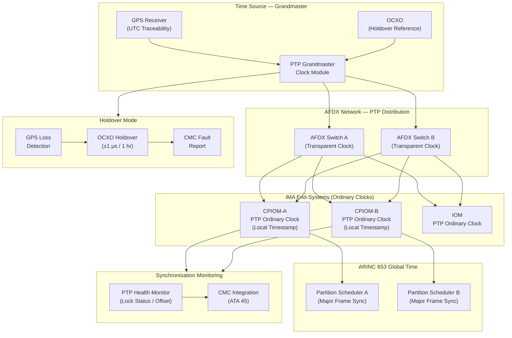

# ATLAS 040-049 · Section 04 · Subsection 042 · 070 — Time Synchronization and Deterministic Execution

## 1. Purpose

This document defines the time synchronisation architecture and deterministic execution requirements for the IMA platform within the Q+ATLANTIDE ATLAS baseline. Coherent, system-wide time synchronisation is a fundamental prerequisite for the correct operation of time-triggered network protocols (AFDX Virtual Link scheduling), ARINC 653 partition scheduling across multiple IMA cabinets, sensor data fusion, and flight data recording. This document establishes how IEEE 1588 Precision Time Protocol (PTP) is implemented over the AFDX network, how the GPS-disciplined grandmaster clock provides traceability to UTC, and how holdover accuracy is maintained in the event of GPS signal loss.

Deterministic execution, the guarantee that software tasks complete within their allocated time windows regardless of system load, is the temporal complement of spatial partitioning. This document addresses the combined requirements of ARINC 653 temporal partitioning, AFDX worst-case transmission delay (WCDT) budgets, and the jitter and accuracy requirements specified in ARINC 664 Part 7 for time-triggered applications. Together these mechanisms enable engineers and certification authorities to verify by analysis that no timing violation can propagate between partitions or avionics functions.

## 2. Scope

This subject covers:

- IEEE 1588v2 Precision Time Protocol (PTP): grandmaster, boundary clock, and transparent clock roles in the AFDX network.
- GPS-disciplined grandmaster clock: architecture, GPS receiver qualification, and UTC traceability.
- Time distribution network: PTP message flow over AFDX, synchronisation accuracy budget, and end-system timestamping.
- Holdover performance: oscillator stability (OCXO, TCXO), holdover duration, and accuracy degradation model.
- ARINC 664 Part 7 time-triggered extensions: TDMA (Time-Division Multiple Access) slot allocation, frame schedule synchronisation.
- ARINC 653 global time: platform-wide epoch reference, partition time-base alignment, and cross-cabinet synchronisation.
- Jitter analysis: sources of jitter, measurement methodology, and acceptable bounds for DAL A applications.
- Synchronisation monitoring: PTP health monitoring, out-of-lock detection, and fault reporting to CMC.
- Failure modes and safety analysis: single-point failure of grandmaster, Byzantine clock fault, and mitigation strategies.

## 3. Glossary

| Term / Acronym | Definition |
|---|---|
| IEEE 1588 | IEEE Standard 1588-2008 (PTPv2) — "IEEE Standard for a Precision Clock Synchronization Protocol for Networked Measurement and Control Systems", providing sub-microsecond time synchronisation across Ethernet-based networks. |
| PTP | Precision Time Protocol — the IEEE 1588 synchronisation protocol; in IMA implementations it is carried over the AFDX network to distribute a common time reference to all IMA end-systems and cabinets. |
| Grandmaster Clock | The PTP network node that is the authoritative source of time for all other nodes; in avionics IMA, the grandmaster is typically a GPS-disciplined oscillator providing UTC-traceable time. |
| Boundary Clock | A PTP node that synchronises its local clock to an upstream grandmaster and re-distributes time to downstream ordinary clocks, used in multi-switch AFDX topologies to minimise synchronisation error accumulation. |
| Transparent Clock | A PTP-aware network switch that measures and corrects for the residence time of PTP messages as they traverse the switch, maintaining synchronisation accuracy without requiring the switch to participate in the PTP master-slave hierarchy. |
| Holdover | The ability of a local oscillator to maintain time accuracy within specification after loss of the external synchronisation reference (GPS or PTP master), critical during GPS outages or AFDX network failure. |
| OCXO | Oven-Controlled Crystal Oscillator — a precision frequency reference in which the crystal resonator is maintained at a constant temperature, providing high short-term frequency stability suitable for IMA holdover applications. |
| TDMA | Time-Division Multiple Access — a channel access method in which each network participant is allocated a fixed, non-overlapping time slot for transmission, providing deterministic, collision-free access to the shared medium. |
| Jitter | The variation in the timing of a recurring event (e.g., periodic message transmission, partition activation) from its nominal schedule; jitter must be bounded and within the tolerance of receiving applications and network scheduling. |
| Epoch | The reference point in time from which the IMA platform's global time counter is measured; all partitions across all cabinets are aligned to the same epoch to enable coherent data fusion and fault correlation. |

## 4. Diagram (Mermaid)

## 5. Footprint

| Metric | Value |
|---|---|
| Architecture | `ATLAS` — Aircraft Top Level Architecture Schema/System (controlled term) |
| Master range | `000–099` |
| Code range | `040-049` |
| Section | `04` — Aviónica, Información & APU |
| Subsection | `042` — Integrated Modular Avionics |
| Subsubject | `070` — Time Synchronization and Deterministic Execution |
| Primary Q-Division | Q-DATAGOV[^qdiv] |
| Support Q-Divisions | Q-AIR, Q-SPACE, Q-HPC |
| ORB support | ORB-PMO, ORB-LEG |
| Governance class | `baseline`[^gov] |
| Folder path | `Q+ATLANTIDE/000-099_ATLAS/040-049_Avionica-Informacion-y-APU/042_Integrated-Modular-Avionics/` |
| Document | `042-070-Time-Synchronization-and-Deterministic-Execution.md` (this file) |
| Parent subsection | [`README.md`](./README.md) |
| Parent section | [`../../README.md`](../../README.md) |
| Parent architecture | [`../../../README.md`](../../../README.md) |
| Parent baseline | [`organization/Q+ATLANTIDE.md`](../../../../organization/Q+ATLANTIDE.md) |

## 6. References & Citations

[^baseline]: Q+ATLANTIDE controlled baseline (v1.0.0) — the governing programme baseline document for all ATLAS architecture artefacts. Maintained under configuration management per the Q+ATLANTIDE governance framework.

[^qdiv]: Q-Division authority — Q-DATAGOV holds primary governance authority over IMA architecture documentation, data integrity, and configuration control within the Q+ATLANTIDE programme.

[^gov]: Governance class — `baseline` denotes that this document forms part of the formally controlled baseline configuration. Changes require formal change-request approval through ORB-PMO.

[^n001]: Note N-001 — The IMA Time Synchronisation Budget (TSB-042-070) and Worst-Case Timing Analysis (WCTA-042-070) are configuration-controlled deliverables maintained under Q-DATAGOV.

[^ieee1588]: IEEE Std 1588-2008 — "IEEE Standard for a Precision Clock Synchronization Protocol for Networked Measurement and Control Systems", IEEE, 2008. The normative standard for PTP implementation in IMA AFDX networks.

[^arinc664]: ARINC Specification 664P7-1 — "Aircraft Data Network, Part 7 — Avionics Full Duplex Switched Ethernet (AFDX) Network", AEEC, 2009. Annex D provides the worst-case end-to-end latency calculation methodology applicable to time-triggered AFDX applications.

[^arinc653]: ARINC Specification 653P1-5 — "Avionics Application Software Standard Interface, Part 1", AEEC, 2019. Defines the APEX time services and partition scheduling model that must be aligned with the IMA global synchronised time base.

[^do178c]: RTCA DO-178C / EUROCAE ED-12C — "Software Considerations in Airborne Systems and Equipment Certification". Timing analysis objectives applicable to PTP synchronisation software and partition scheduler at the relevant DAL.
