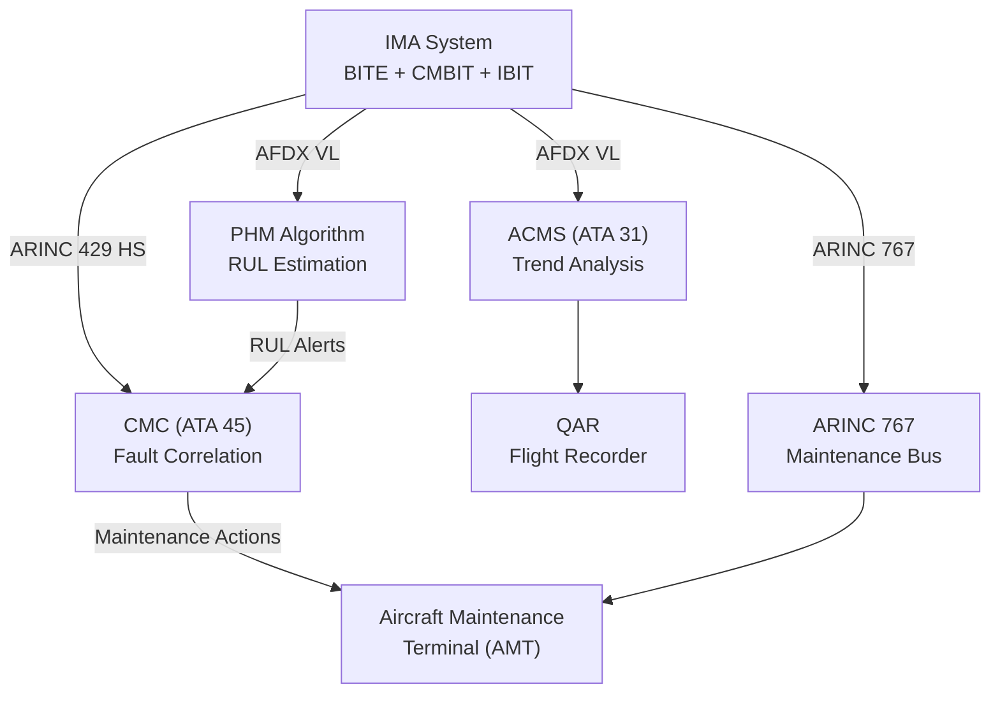
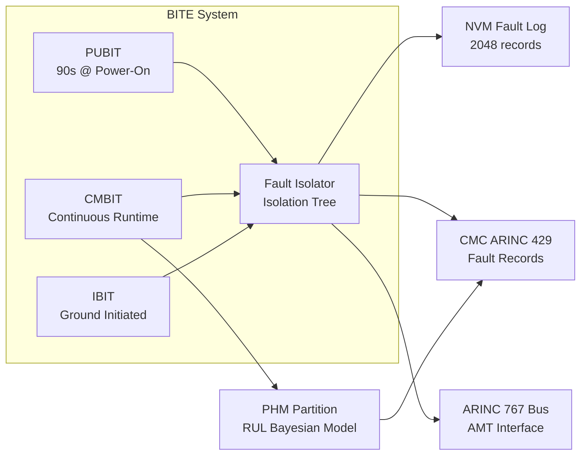
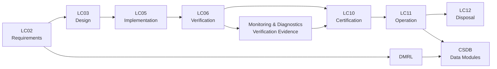

# ATLAS 040-049 · Section 04 · Subsection 042 · 080 — IMA Monitoring, Diagnostics and Control Interfaces

## 0. Hyperlink Policy

All internal cross-references use relative Markdown links within Q+ATLANTIDE CSDB. External citations in §19/§20 marked . Parent: [042 README](./README.md).

---

## 1. Purpose

This document defines the Built-In Test Equipment (BITE) architecture, Central Maintenance Computer (CMC) integration, Aircraft Condition Monitoring System (ACMS) data provision, ARINC 767 maintenance bus interface, Prognostic Health Management (PHM) data collection, fault isolation procedures, and Aircraft Maintenance Terminal (AMT) interface for the [PROGRAMME-AIRCRAFT] IMA system. It establishes the complete monitoring and diagnostics framework enabling efficient on-condition maintenance.

---

## 2. Applicability

| Attribute | Value |
|-----------|-------|
| Aircraft Program | programme-defined aircraft type |
| ATA Chapter | ATA 42 — Integrated Modular Avionics |
| Certification Basis | CS-25 Amendment 28 |
| Applicable Standards | ARINC 429; ARINC 767; ARINC 604A; DO-160G; ATA MSG-3 |
| Design Assurance Level | BITE: DAL B; PHM: DAL C; CMC interface: DAL B |
| Configuration | [PROGRAMME-AIRCRAFT] Build Standard 1.0 and above |

---

## 3. System / Function Overview

The [PROGRAMME-AIRCRAFT] IMA BITE architecture provides three complementary test modes:

- **Power-Up BITE (PUBIT):** Executed at each power-on within the first 90 s; validates hardware integrity before hosted applications start.
- **Continuous Monitoring BITE (CMBIT):** Runtime monitoring of all IMA subsystems at defined rates; generates fault records and CMC reports.
- **Interactive BITE (IBIT):** Ground-initiated comprehensive diagnostic suite exercising all IMA functions; results stored and reported.

CMC integration is via dual ARINC 429 high-speed buses and an AFDX maintenance VL. IMA reports fault words, BITE test results, LRM status, and parameter data to CMC in standardised formats per ARINC 604A Chapter 4. CMC correlates IMA faults with other aircraft system faults and dispatches maintenance actions to the AMT.

ACMS receives performance parameter data (CPU load, memory utilisation, AFDX link quality) from IMA via dedicated AFDX VL for trend analysis, exceedance recording, and QAR recording.

PHM algorithms running on a dedicated ACMS partition analyse IMA BITE data streams to estimate remaining useful life (RUL) for GPPMs, LRMs, and power supply modules. PHM alerts dispatched to CMC trigger pro-active replacement scheduling before in-service failure.

---

## 4. Scope

### 4.1 Included

- PUBIT, CMBIT, and IBIT test suite architecture and coverage requirements.
- CMC interface: ARINC 429, AFDX VL, fault word format, and ARINC 604A compliance.
- ACMS parameter data provision: data set definition, rate, and encoding.
- ARINC 767 maintenance data bus interface for AMT access.
- PHM algorithm data inputs, outputs, and RUL model basis.
- Fault isolation procedure structure and dispatch to AMT.

### 4.2 Excluded

- CMC internal architecture (ATA 45).
- ACMS QAR recording hardware (ATA 31).
- AMT hardware and software (third-party maintenance tool).
- Hosted application BITE (application supplier responsibility, referenced by HAA).

---

## 5. Architecture Description

**BITE Test Coverage:** PUBIT covers: GPPM CPU core test (built-in self-test), DDR4 ECC march test (subset, ≤30 s), FPGA bitstream CRC, PSM rail voltage, backplane PCIe loopback, AFDX ES ring test, and ARINC 429 bridge loopback. CMBIT covers: partition heartbeat, CPU utilisation, memory ECC rate, AFDX frame error rate, PSM voltage trend, thermal sensors. IBIT covers: full DDR4 march test, FPGA full loopback, AFDX end-to-end VL test, ARINC 429 full channel test, PTP synchronisation check, and PSM efficiency measurement.

**CMC Interface:** IMA transmits status on ARINC 429 HS bus to CMC at 10 Hz for BITE results and 1 Hz for parameter data. Fault records include: system/LRM/function identifier, fault code, severity (WARNING/CAUTION/ADVISORY), isolation certainty (%), timestamp, and recommended maintenance action. ARINC 604A Chapter 4 fault word format is used.

**ARINC 767:** ARINC 767 high-speed maintenance bus provides direct AMT access to IMA for: real-time parameter monitoring, IBIT initiation and result retrieval, fault log download, and software load initiation. ARINC 767 HSDB connector is located on the avionics bay maintenance panel.

**PHM Architecture:** PHM runs on a dedicated DAL C partition on GPPM-R2. Input data: BITE event streams, EDAC event counts, thermal cycling history, power cycle count, and performance trend data. Output: RUL estimates (hours to next recommended maintenance action) for each monitored LRM. PHM model uses Bayesian degradation model calibrated against fleet data.

---

## 6. Functional Breakdown

| Function ID | Function Name | Description | DAL | Owner |
|-------------|---------------|-------------|-----|-------|
| F-042-01 | Power-Up BITE Execution | Execute PUBIT suite within 90 s of power-on; validate all LRM hardware; report results to CMC before hosted applications start | B | Q-DATAGOV |
| F-042-02 | Continuous Monitoring BITE | Monitor partition heartbeats, ECC events, AFDX errors, PSM voltages, and thermal sensors at defined rates; generate fault records on anomaly detection | B | Q-DATAGOV |
| F-042-03 | Interactive BITE | Execute full IBIT suite on maintenance command; store results in NVM; report to CMC and AMT via ARINC 767 | B | Q-DATAGOV |
| F-042-04 | PHM Data Collection | Collect BITE event streams, ECC counts, thermal history, and performance trends; compute RUL estimates; dispatch alerts to CMC | C | Q-DATAGOV |
| F-042-05 | Fault Isolation and Reporting | Apply fault isolation tree to BITE results; determine faulted LRM with ≥95% isolation certainty; dispatch corrective maintenance action to CMC | B | Q-DATAGOV |

---

## 7. Mermaid — System Context Diagram

---

## 8. Mermaid — Internal Functional Architecture

---

## 9. Mermaid — Lifecycle Traceability

---

## 10. Interfaces

| Interface ID | Name | Type | Counterpart System | Protocol | Direction |
|--------------|------|------|--------------------|----------|-----------|
| IF-042-01 | IMA to CMC | Data | CMC (ATA 45) | ARINC 429 HS, 100 kbps, ARINC 604A format | Output |
| IF-042-02 | IMA to ACMS | Data | ACMS (ATA 31) | AFDX maintenance VL | Output |
| IF-042-03 | IMA to AMT | Data | Aircraft Maintenance Terminal | ARINC 767 HSDB | Bidirectional |
| IF-042-04 | IMA to QAR | Data | QAR (ATA 31) | AFDX maintenance VL via ACMS | Output |
| IF-042-05 | PHM to CMC | Data | CMC (ATA 45) | AFDX VL RUL alert messages | Output |
| IF-042-06 | CMC to IMA IBIT | Data | CMC / AMT (ATA 45) | ARINC 429 IBIT initiation command | Input |

---

## 11. Operating Modes

| Mode | Name | Description | Entry Condition | Exit Condition |
|------|------|-------------|-----------------|----------------|
| M1 | PUBIT | Executes full PUBIT suite; IMA not yet operational | Power applied | PUBIT complete (pass/fail) |
| M2 | Normal Flight CMBIT | Continuous background monitoring; no crew action | PUBIT pass | Power removal or maintenance mode |
| M3 | Ground IBIT | Full interactive BITE on maintenance command; IMA suspended | Ground; AMT command | IBIT complete |
| M4 | PHM Collection | PHM data collection active in background during normal operation | Normal operation | Power removal |
| M5 | Maintenance Reporting | Fault logs and PHM reports downloaded to AMT | Ground; AMT connected | Download complete |

---

## 12. Monitoring and Diagnostics

- **PUBIT Pass Rate Trending:** PUBIT pass/fail results trended per tail number; declining pass rate triggers engineering investigation before in-service failure.
- **CMBIT Fault Rate:** CMBIT fault record generation rate monitored; increasing rate triggers CMC advisory for preventive maintenance scheduling.
- **IBIT Coverage Tracking:** IBIT test coverage calculated as percentage of IMA hardware exercised; coverage <90% after test suite update requires review.
- **PHM RUL Trend:** PHM RUL estimates trended per LRM; declining RUL triggers maintenance action dispatch when RUL <200 flight hours.
- **CMC Report Format Validation:** CMC fault report format validated at system test against ARINC 604A template; format deviations flagged for correction before certification.
- **AMT Session Logging:** Each AMT session logged with user ID, session start/end time, commands issued, and data downloaded; immutable audit trail in NVM.
- **ACMS Parameter Exceedance:** ACMS monitors for parameter exceedances (CPU >85%, AFDX error rate >10⁻⁶); exceedances logged as fleet data for engineering analysis.
- **Fault Isolation Certainty Tracking:** Fault isolation certainty (%) logged per fault type; certainty <80% triggers fault tree update for next software release.

---

## 13. Maintenance Concept

| Task ID | Task Description | Interval | Access | Skill Level |
|---------|-----------------|----------|--------|-------------|
| MC-042-01 | PUBIT result review and fault log download | A-Check | AMT / CMC display | Avionics Technician |
| MC-042-02 | IBIT execution and result review | A-Check | AMT via ARINC 767 | Avionics Technician |
| MC-042-03 | PHM RUL report download and review | A-Check | AMT | Avionics Technician |
| MC-042-04 | Fault isolation execution per FIM dispatch | On-Condition | AMT + maintenance tools | Avionics Technician |
| MC-042-05 | ACMS trend data review and fleet data upload | C-Check | Ground Support Terminal | Avionics Engineer |

---

## 14. S1000D / CSDB Mapping

| Data Module Code (DMC) | Title | Publication Type | SNS |
|------------------------|-------|-----------------|-----|
| QATL-A-042-08-00-00AAA-040A-A | IMA Monitoring and Diagnostics Description | AMM | 042-080 |
| QATL-A-042-08-00-00AAA-520A-A | IMA BITE and CMC Reporting Procedures | AMM | 042-080 |
| QATL-A-042-08-00-00AAA-920A-A | IMA Fault Isolation — BITE-Dispatched Actions | FIM | 042-080 |
| QATL-A-042-08-00-00AAA-941A-A | IMA BITE and PHM Software Parts Data | IPD | 042-080 |

### Recommended DM Set

| DM Role | DMC Suffix | Content |
|---------|-----------|---------|
| System Overview | 040A | BITE architecture, CMC, ACMS, ARINC 767, PHM |
| BITE Procedure | 520A | PUBIT/CMBIT/IBIT execution, log download |
| Fault Isolation | 920A | Fault code index, isolation trees, replacement actions |
| IPD | 941A | BITE SW PN, PHM model PN, ACMS data set PN |

---

## 15. Footprints

### 15.1 Physical

| Item | Value |
|------|-------|
| BITE Software Footprint | ≤128 KB code; ≤64 KB data |
| PHM Partition Memory | ≤256 MB RAM |
| AMT Connector | ARINC 767 HSDB, avionics bay panel |

### 15.2 Electrical / Data

| Parameter | Value |
|-----------|-------|
| CMC ARINC 429 Bus Speed | 100 kbps HS |
| ACMS AFDX VL Data Rate | ≤10 kB/s average |
| IBIT Duration | <8 min complete suite |
| PHM RUL Update Rate | Every 10 flight hours |

### 15.3 Maintenance

| Parameter | Value |
|-----------|-------|
| Fault Log Download Time | <2 min via ARINC 767 |
| IBIT Initiation Method | AMT GUI or CMC command |
| PHM Report Format | JSON over ARINC 767 |

### 15.4 Data

| Parameter | Value |
|-----------|-------|
| NVM Fault Log Capacity | 2048 records (CMBIT + PUBIT combined) |
| ACMS Exceedance Buffer | 500 exceedance records |
| PHM Model Version | Managed under CSDB configuration control |

---

## 16. Safety and Certification Considerations

- **BITE Coverage Requirement:** BITE detection coverage ≥95% per ATA MSG-3 analysis; gaps filled by scheduled maintenance tasks; coverage analysis maintained in CSDB.
- **CMC ARINC 604A Compliance:** Fault word format strictly per ARINC 604A Chapter 4; deviations require CMC supplier agreement and EASA notification.
- **IBIT Safety Interlock:** IBIT initiation is inhibited when aircraft is airborne (weight-on-wheels switch) or engines running; IBIT cannot suspend safety-critical partitions in flight.
- **PHM DAL C Isolation:** PHM partition is DAL C; spatial partitioning ensures PHM cannot interfere with DAL A/B IMA functions; PHM fault does not affect IMA operational availability.
- **AMT Access Control:** ARINC 767 AMT access requires maintenance mode activation (key-switch or CMC command); prevents accidental diagnostic commands during flight.
- **Fault Isolation Accuracy:** False alarm rate (FAR) from BITE is monitored; FAR >1% triggers BITE algorithm review; unnecessary LRM removals impact dispatch reliability.

---

## 17. Verification and Validation

| V&V ID | Requirement | Method | Evidence | Status |
|--------|-------------|--------|----------|--------|
| VV-042-01 | PUBIT completes within 90 s of power-on | Test | PUBIT timing measurement |  |
| VV-042-02 | BITE detection coverage ≥95% vs FMEA | Analysis | BITE coverage analysis |  |
| VV-042-03 | Fault isolation certainty ≥95% for CMC-dispatched actions | Analysis + Test | Fault isolation tree validation |  |
| VV-042-04 | IBIT inhibited when airborne (WoW switch open) | Test | IBIT inhibit interlock test |  |
| VV-042-05 | PHM RUL estimate within ±20% of actual at validation fleet | Analysis | PHM model validation report |  |
| VV-042-06 | ARINC 604A fault format validated against CMC interface | Test | CMC interface test |  |
| VV-042-07 | AMT ARINC 767 download completes in <2 min | Test | Download timing measurement |  |

---

## 18. Glossary

| Term | Acronym | Definition |
|------|---------|------------|
| Built-In Test Equipment | BITE | Automated diagnostic hardware/software within a system performing self-test and fault isolation |
| Power-Up BITE | PUBIT | BITE executed at each power-on cycle before operational start |
| Continuous Monitoring BITE | CMBIT | Runtime BITE monitoring system health parameters continuously during operation |
| Interactive BITE | IBIT | Comprehensive diagnostic suite initiated by maintenance on ground |
| Central Maintenance Computer | CMC | Aircraft system correlating faults from all avionics systems and dispatching maintenance actions |
| Aircraft Condition Monitoring System | ACMS | System recording aircraft parameters for trend analysis, exceedance recording, and QAR data |
| Prognostic Health Management | PHM | System predicting remaining useful life of components using condition monitoring data |
| Remaining Useful Life | RUL | Estimated time remaining before a component requires maintenance action |
| ARINC 767 | — | ARINC standard defining high-speed data bus for aircraft maintenance system access |
| Fault Detection Effectiveness | FDE | Measure of BITE ability to detect faults; expressed as percentage of FMEA failure modes detected |

---

## 19. Citations

| Ref ID | Standard / Document | Applicability | Status |
|--------|--------------------|-----------|----|
| CIT-042-01 | ARINC 604A, Guidance for Design and Use of Built-In Test Equipment | BITE design guidance |  |
| CIT-042-02 | ARINC 767, High-Speed Aircraft Maintenance Bus | AMT interface standard |  |
| CIT-042-03 | ARINC 429 Part 1, Digital Information Transfer | CMC fault reporting bus |  |
| CIT-042-04 | ATA MSG-3, Operator/Manufacturer Scheduled Maintenance | BITE coverage for MSG-3 |  |
| CIT-042-05 | SAE JA6268, Prognostics and Health Management | PHM algorithm framework |  |
| CIT-042-06 | RTCA DO-297, IMA Qualification | BITE for IMA platform |  |
| CIT-042-07 | EASA CS-25 §25.1309 | BITE DAL requirements |  |
| CIT-042-08 | ARINC 665, Loadable Software Standards | PHM software part identification |  |

---

## 20. References

| Ref ID | Document | Version | Status |
|--------|----------|---------|--------|
| REF-042-01 | 042-000 IMA General | 1.0 |  |
| REF-042-02 | [PROGRAMME-AIRCRAFT] CMC Interface Control Document | 1.0 |  |
| REF-042-03 | [PROGRAMME-AIRCRAFT] BITE Coverage Analysis | 1.0 |  |
| REF-042-04 | [PROGRAMME-AIRCRAFT] PHM System Concept | 1.0 |  |

---

## 21. Open Issues

| Issue ID | Description | Owner | Status |
|----------|-------------|-------|--------|
| OI-042-01 | PHM model training data availability from first [PROGRAMME-AIRCRAFT] aircraft to be planned | Q-DATAGOV |  |
| OI-042-02 | IBIT execution time budget for expanded test suite may exceed 8 min; optimisation required | Q-DATAGOV |  |
| OI-042-03 | False alarm rate target (≤1%) to be validated against FMEA before first flight test | Q-AIR |  |

---

## 22. Change Log

| Version | Date | Author | Description |
|---------|------|--------|-------------|
| 1.0.0 | 2025-01-01 | Q+ Team/Amedeo Pelliccia + AI | Initial baseline release |  |
