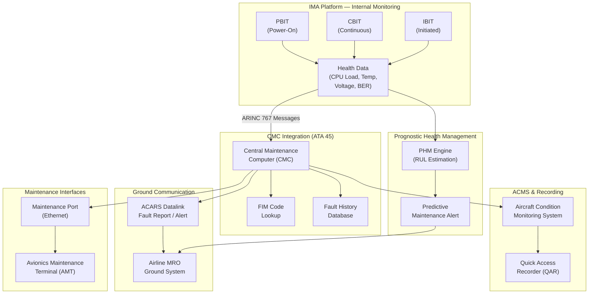

# ATLAS 040-049 · Section 04 · Subsection 042 · 080 — IMA Monitoring, Diagnostics and Control Interfaces

## 1. Purpose

This document defines the Built-In Test Equipment (BITE) architecture, health and usage monitoring, diagnostic message structures, and maintenance control interfaces for the IMA platform within the Q+ATLANTIDE ATLAS baseline. It establishes how IMA self-monitoring data flows to the Central Maintenance Computer (CMC) per ATA Chapter 45, the Aircraft Condition Monitoring System (ACMS), and the Avionics Maintenance Terminal (AMT), and how ground maintenance personnel access diagnostic information through the aircraft's maintenance data network.

Effective monitoring and diagnostics are critical to maintaining the dispatch reliability and continued airworthiness of IMA-equipped aircraft. The IMA platform generates a continuous stream of health data — including processing loads, memory utilisation, communication bus quality metrics, power rail voltages, and thermal readings — that must be correlated, compressed, and reported in structured diagnostic message formats per ARINC 767. This document also covers prognostic health management (PHM) concepts that extend beyond reactive fault detection to predictive failure alerting, reducing unscheduled maintenance events and improving airline operational economics.

## 2. Scope

This subject covers:

- IMA BITE architecture: Power-On BIT (PBIT), Continuous BIT (CBIT), Initiated BIT (IBIT), and their coverage and false-alarm rate requirements.
- Health and Usage Monitoring System (HUMS) interface: data parameters, sampling rates, and transmission to ground.
- CMC integration (ATA 45): fault message format, Fault Isolation Manual (FIM) code structure, and LRU-level fault isolation.
- Aircraft Condition Monitoring System (ACMS): exceedance monitoring, trend analysis, and Quick Access Recorder (QAR) interface.
- Maintenance port: physical and logical interface (Ethernet, RS-232), access control, and session management.
- Avionics Maintenance Terminal (AMT): operator interface, menu structure, and real-time diagnostic display.
- Diagnostic message structure per ARINC 767: message categories, fields, encoding, and transport.
- ACARS fault reporting: automatic ground notification of IMA faults and prognostic alerts.
- Prognostic Health Management (PHM): failure prediction models, remaining useful life (RUL) estimation, and alert thresholds.
- Fault isolation procedure: fault tree analysis linkage, isolation to module level, and replacement authority.

## 3. Glossary

| Term / Acronym | Definition |
|---|---|
| BITE | Built-In Test Equipment — the self-test hardware and software embedded within IMA modules to detect, isolate, and report internal faults without requiring external test equipment, classified as PBIT, CBIT, and IBIT. |
| CMC | Central Maintenance Computer — the aircraft-level maintenance computer (ATA 45) that aggregates fault messages from all avionics LRUs and IMA modules, correlates them, and presents consolidated maintenance information to ground crews. |
| ACMS | Aircraft Condition Monitoring System — an onboard system that records and analyses aircraft operational parameters, sensor exceedances, and system health data for transmission to airline operations and maintenance via QAR or ACARS datalink. |
| HUMS | Health and Usage Monitoring System — an onboard system that continuously monitors structural and mechanical parameters (vibration, loads, temperatures) and avionics health data to support predictive maintenance and fleet management. |
| AMT | Avionics Maintenance Terminal — an onboard or portable display and control unit used by licensed aircraft maintenance engineers to interact with the IMA diagnostic system, initiate BIT, retrieve fault histories, and configure maintenance parameters. |
| ARINC 767 | ARINC Specification 767 — "Advanced Diagnostic and Maintenance Concept (ADMC)", defining the message structure, categories, encoding, and transport protocol for avionics diagnostic data exchange between IMA modules, CMC, and ground systems. |
| PHM | Prognostic Health Management — an engineering discipline that applies data analytics, physics-of-failure models, and machine learning to predict component degradation and estimate Remaining Useful Life (RUL) before functional failure occurs. |
| RUL | Remaining Useful Life — the estimated time or cycles until a component is predicted to reach a failure threshold, used by PHM systems to schedule predictive maintenance interventions. |
| FIM | Fault Isolation Manual — an aircraft maintenance document that provides step-by-step fault isolation procedures linking CMC fault codes to physical root-cause failures and prescribing the appropriate LRU or LRM replacement actions. |
| QAR | Quick Access Recorder — a flight data recording device that stores digitised aircraft operational data accessible without removing the unit from the aircraft, used for ACMS data retrieval and airline flight operations quality assurance (FOQA) programmes. |

## 4. Diagram (Mermaid)

## 5. Footprint

| Metric | Value |
|---|---|
| Architecture | `ATLAS` — Aircraft Top Level Architecture Schema/System (controlled term) |
| Master range | `000–099` |
| Code range | `040-049` |
| Section | `04` — Aviónica, Información & APU |
| Subsection | `042` — Integrated Modular Avionics |
| Subsubject | `080` — IMA Monitoring, Diagnostics and Control Interfaces |
| Primary Q-Division | Q-DATAGOV[^qdiv] |
| Support Q-Divisions | Q-AIR, Q-SPACE, Q-HPC |
| ORB support | ORB-PMO, ORB-LEG |
| Governance class | `baseline`[^gov] |
| Folder path | `Q+ATLANTIDE/000-099_ATLAS/040-049_Avionica-Informacion-y-APU/042_Integrated-Modular-Avionics/` |
| Document | `042-080-IMA-Monitoring-Diagnostics-and-Control-Interfaces.md` (this file) |
| Parent subsection | [`README.md`](./README.md) |
| Parent section | [`../../README.md`](../../README.md) |
| Parent architecture | [`../../../README.md`](../../../README.md) |
| Parent baseline | [`organization/Q+ATLANTIDE.md`](../../../../organization/Q+ATLANTIDE.md) |

## 6. References & Citations

[^baseline]: Q+ATLANTIDE controlled baseline (v1.0.0) — the governing programme baseline document for all ATLAS architecture artefacts. Maintained under configuration management per the Q+ATLANTIDE governance framework.

[^qdiv]: Q-Division authority — Q-DATAGOV holds primary governance authority over IMA architecture documentation, data integrity, and configuration control within the Q+ATLANTIDE programme.

[^gov]: Governance class — `baseline` denotes that this document forms part of the formally controlled baseline configuration. Changes require formal change-request approval through ORB-PMO.

[^n001]: Note N-001 — The IMA BITE Test Coverage Analysis (TCA-042-080) and ARINC 767 Message Catalogue (MSG-042-080) are configuration-controlled documents maintained under Q-DATAGOV.

[^arinc767]: ARINC Specification 767 — "Advanced Diagnostic and Maintenance Concept (ADMC)", AEEC. Defines the message structure and transport protocol for avionics diagnostic data exchange between IMA modules, the CMC, and ground maintenance systems.

[^ata45]: ATA iSpec 2200 Chapter 45 — "On-Board Maintenance System (OMS)". Defines the aircraft-level maintenance system architecture, CMC interfaces, fault message formats, and maintenance display requirements.

[^do297]: RTCA DO-297 / EUROCAE ED-124 — "Integrated Modular Avionics (IMA) Development Guidance and Certification Considerations". Section 4 addresses IMA platform health monitoring requirements and BITE architecture guidance.

[^arp4754a]: SAE ARP4754A — "Guidelines for Development of Civil Aircraft and Systems". Section 8 addresses the requirements for monitoring and maintenance provisions in safety-critical avionics systems including IMA platforms.
