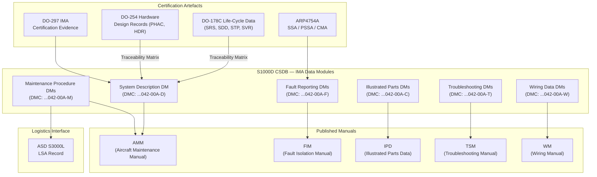

# ATLAS 040-049 · Section 04 · Subsection 042 · 090 — S1000D CSDB Mapping and Traceability

## 1. Purpose

This document defines the S1000D Issue 5.0 data module architecture, Common Source DataBase (CSDB) mapping, and traceability framework for the IMA subsystem within the Q+ATLANTIDE ATLAS baseline. It establishes how IMA technical documentation — including system descriptions, maintenance procedures, fault reporting, illustrated parts breakdown, and wiring data — is structured as S1000D Data Modules (DMs) within the CSDB, and how these DMs trace to the DO-178C and DO-254 qualification artefacts, the DO-297 IMA certification evidence, and the ASD S3000L logistics support analysis.

The adoption of S1000D Issue 5.0 as the technical documentation standard for the IMA subsystem ensures that all maintenance, operations, and training publications are produced from a single controlled source, eliminating the duplication and inconsistency risks associated with document-centric approaches. The CSDB-centric workflow enables automatic generation of publication types — Aircraft Maintenance Manual (AMM), Fault Isolation Manual (FIM), Illustrated Parts Data (IPD), Troubleshooting Manual (TSM), and Wiring Manual (WM) — from reusable, version-controlled data modules.

## 2. Scope

This subject covers:

- S1000D Issue 5.0 Data Module Code (DMC) structure for the IMA subsystem: model identification code, system/subsystem codes, and information code allocation.
- Data Module Requirements List (DMRL): IMA-specific DM types, publication applicability, and review responsibility.
- System Description Data Module (SD-DM): IMA architecture narrative and functional description.
- Maintenance Procedure Data Module (MP-DM): IMA line and base maintenance task structures.
- Fault Reporting Manual Data Module (FR-DM): fault code to DM mapping and CMC fault message linkage.
- Illustrated Parts Data Module (IP-DM): IMA LRU and LRM part catalogue with effectivity codes.
- Traceability matrix: mapping from DO-178C life-cycle data artefacts and DO-254 hardware design records to S1000D DMs.
- Publication types: AMM, FIM, IPD, TSM, and WM content allocation from the IMA CSDB.
- CSDB governance: issue control, applicability management, and CMS integration with the Q+ATLANTIDE configuration management system.
- ASD S3000L interface: IMA maintenance task data exchange with the Logistics Support Analysis (LSA) record.

## 3. Glossary

| Term / Acronym | Definition |
|---|---|
| S1000D | An international specification for the production of technical publications using a Common Source DataBase (CSDB), maintained by the ASD/AIA/ATA consortium; Issue 5.0 is the current major release applicable to IMA documentation. |
| CSDB | Common Source DataBase — the central, structured repository in which S1000D Data Modules, illustrations, multimedia, and applicability data are stored, managed, and published for all technical publications for the IMA subsystem. |
| DMC | Data Module Code — a structured, 17-character alphanumeric identifier uniquely identifying each S1000D Data Module, comprising model identification, system/subsystem/subsubsystem codes, assembly code, disassembly code, information code, and information code variant. |
| DMRL | Data Module Requirements List — the master planning document that inventories all required Data Modules for a given product, specifying their DMC, title, information type, publication applicability, and responsible author. |
| AMM | Aircraft Maintenance Manual — an S1000D publication type providing scheduled and unscheduled maintenance task procedures for aircraft systems and components, generated from maintenance procedure DMs in the CSDB. |
| FIM | Fault Isolation Manual — an S1000D publication type providing fault isolation procedures linking avionics fault codes (CMC messages) to physical root-cause faults and directing the maintenance engineer to corrective actions. |
| IPD | Illustrated Parts Data — an S1000D publication type providing illustrated parts catalogues with part numbers, quantities, effectivities, and vendor information for all IMA LRUs, LRMs, and associated components. |
| TSM | Troubleshooting Manual — an S1000D publication type providing symptom-based diagnostic procedures that guide maintenance engineers from observed failure symptoms to probable root causes without relying solely on CMC fault codes. |
| ASD S3000L | ASD Specification S3000L — "Logical Support Analysis", defining the data exchange format for logistics support analysis records, enabling IMA maintenance task data to be shared between the technical documentation CSDB and the LSA tool. |
| Traceability Matrix | A structured table mapping each certified software or hardware development artefact (DO-178C, DO-254, DO-297 evidence) to the corresponding S1000D Data Module that documents the operational or maintenance aspect of the same item. |

## 4. Diagram (Mermaid)

## 5. Footprint

| Metric | Value |
|---|---|
| Architecture | `ATLAS` — Aircraft Top Level Architecture Schema/System (controlled term) |
| Master range | `000–099` |
| Code range | `040-049` |
| Section | `04` — Aviónica, Información & APU |
| Subsection | `042` — Integrated Modular Avionics |
| Subsubject | `090` — S1000D CSDB Mapping and Traceability |
| Primary Q-Division | Q-DATAGOV[^qdiv] |
| Support Q-Divisions | Q-AIR, Q-SPACE, Q-HPC |
| ORB support | ORB-PMO, ORB-LEG |
| Governance class | `baseline`[^gov] |
| Folder path | `Q+ATLANTIDE/000-099_ATLAS/040-049_Avionica-Informacion-y-APU/042_Integrated-Modular-Avionics/` |
| Document | `042-090-S1000D-CSDB-Mapping-and-Traceability.md` (this file) |
| Parent subsection | [`README.md`](./README.md) |
| Parent section | [`../../README.md`](../../README.md) |
| Parent architecture | [`../../../README.md`](../../../README.md) |
| Parent baseline | [`organization/Q+ATLANTIDE.md`](../../../../organization/Q+ATLANTIDE.md) |

## 6. References & Citations

[^baseline]: Q+ATLANTIDE controlled baseline (v1.0.0) — the governing programme baseline document for all ATLAS architecture artefacts. Maintained under configuration management per the Q+ATLANTIDE governance framework.

[^qdiv]: Q-Division authority — Q-DATAGOV holds primary governance authority over IMA architecture documentation, data integrity, and configuration control within the Q+ATLANTIDE programme.

[^gov]: Governance class — `baseline` denotes that this document forms part of the formally controlled baseline configuration. Changes require formal change-request approval through ORB-PMO.

[^n001]: Note N-001 — The IMA Data Module Requirements List (DMRL-042-090) is the master planning document for all S1000D IMA data modules and is maintained under Q-DATAGOV configuration control.

[^s1000d]: S1000D Issue 5.0 — "International Specification for Technical Publications Using a Common Source DataBase", ASD/AIA/ATA, 2016. The normative specification governing the structure, encoding, and management of all IMA technical documentation data modules.

[^asds3000l]: ASD Specification S3000L Issue 2.0 — "Logical Support Analysis", ASD, 2014. Defines the data format and exchange process between the S1000D CSDB and the Logistics Support Analysis record for IMA maintenance task integration.

[^do297]: RTCA DO-297 / EUROCAE ED-124 — "Integrated Modular Avionics (IMA) Development Guidance and Certification Considerations". Section 6 defines the certification evidence documentation requirements that form the basis of the IMA traceability matrix to S1000D DMs.

[^ataispec]: ATA iSpec 2200 — "Information Standards for Aviation Maintenance", Air Transport Association, 2012. Provides the chapter/system coding baseline (ATA 42) against which the S1000D DMC system-subsystem codes for IMA are mapped.
