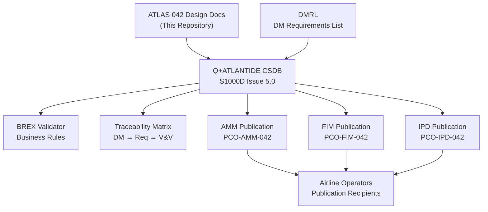
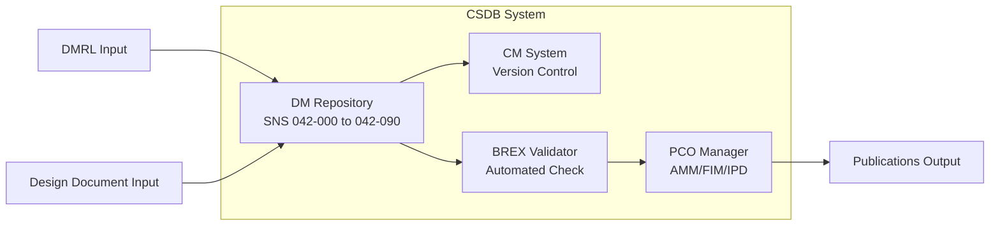
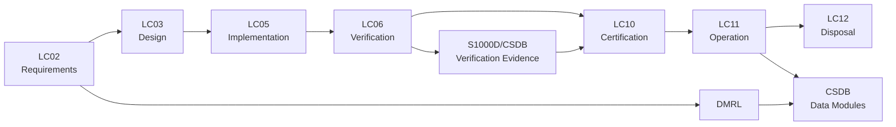

# ATLAS 040-049 · Section 04 · Subsection 042 · 090 — S1000D CSDB Mapping and Traceability

## 0. Hyperlink Policy

All internal cross-references use relative Markdown links within Q+ATLANTIDE CSDB. External citations in §19/§20 marked . Parent: [042 README](./README.md).

---

## 1. Purpose

This document defines the S1000D Issue 5.0 Data Module Code (DMC) scheme, Data Module Requirements List (DMRL), Business Rules Exchange (BREX) compliance, cross-document traceability, and publication configuration for the complete ATLAS 042 Integrated Modular Avionics subsection. It establishes the CSDB framework ensuring all technical publications for IMA are traceable to regulatory requirements, design documents, and verification evidence.

---

## 2. Applicability

| Attribute | Value |
|-----------|-------|
| Aircraft Program | AMPEL360E eWTW |
| ATA Chapter | ATA 42 — Integrated Modular Avionics |
| Certification Basis | CS-25 Amendment 28 |
| Applicable Standards | S1000D Issue 5.0; ATA iSpec 2200; ASD-STE100; DO-297; DO-178C; DO-254 |
| Documentation Class | Maintenance and Technical Publication |
| Configuration | AMPEL360E Build Standard 1.0 and above |

---

## 3. System / Function Overview

The Q+ATLANTIDE CSDB is an S1000D Issue 5.0-compliant Common Source Database managing all technical documentation for the AMPEL360E. For the IMA subsection (SNS 042-000 through 042-090), the CSDB contains Data Modules spanning:

- **AMM (Aircraft Maintenance Manual):** System descriptions, procedures, BITE, and fault isolation.
- **FIM (Fault Isolation Manual):** Fault code index, isolation trees, and corrective actions.
- **IPD (Illustrated Parts Data):** Part numbers, effectivity, and interchangeability data.
- **TSM (Troubleshooting Manual):** Fault scenario guides for complex multi-system faults.
- **SRM (Structural Repair Manual):** Cabinet structural repair data (minor repairs only).

The DMC scheme for IMA follows the pattern: `QATL-A-042-{SNS2}-{SNS3}-{SNS4}AAA-{ICN}-A` where SNS2=subsection (042), SNS3=sub-subject (00–09), SNS4=subject (00), and ICN defines the information code (040A=description, 520A=procedure, 920A=fault isolation, 941A=IPD).

The DMRL lists all approved DMs for ATLAS 042, with effective status, publication type, and traceability to AMPEL360E design documents. BREX compliance is enforced by the CSDB tool chain; all DMs must pass BREX validation before publication.

---

## 4. Scope

### 4.1 Included

- DMC scheme definition for SNS 042-000 through 042-090.
- DMRL structure, required DM list, and effective status per build standard.
- BREX rule set applicable to ATLAS 042 data modules.
- Cross-document traceability matrix from DMs to design documents and V&V evidence.
- Publication configuration (AMM/FIM/IPD/TSM/SRM) for ATLAS 042.
- Configuration management of CSDB DMs under S1000D CM framework.

### 4.2 Excluded

- CSDB tool chain implementation (managed by Q-DATAGOV IT).
- Publication delivery and distribution to airlines (OEM commercial process).
- Translation into languages other than English (covered by separate translation project).

---

## 5. Architecture Description

**DMC Scheme:** The AMPEL360E DMC structure follows S1000D Issue 5.0 Chapter 7.4. Model Identification Code (MIC): QATL; System Difference Code (SDC): A; SNS: 042-{sub}-{subject}-{variant}; Information Code (IC): per ATA iSpec 2200 mapping; Item Location Code (ILC): A. Full DMC example: `QATL-A-042-00-00-00AAA-040A-A` = IMA General, System Description.

**BREX:** The AMPEL360E BREX file defines: permitted SNS values for ATLAS 042, required metadata elements (applicability, language, issue date, security classification), prohibited information codes per publication type, and permitted markup elements. BREX validation is mandatory before DM acceptance into CSDB.

**Traceability Matrix:** Each DM is linked in the traceability matrix to: (a) source design document (ATLAS 042-xxx files in this repository); (b) regulatory requirement (CS-25 paragraph); (c) V&V evidence item (VV-042-xxx reference). Traceability is bi-directional and maintained in a dedicated CSDB traceability data module.

**Publication Configuration:** Publication Configuration Objects (PCOs) define the DM sets assembled for each publication: AMM PCO includes all 040A and 520A DMs for SNS 042-000 to 042-090; FIM PCO includes all 920A DMs; IPD PCO includes all 941A DMs. PCOs are version-controlled under CSDB CM.

---

## 6. Functional Breakdown

| Function ID | Function Name | Description | DAL | Owner |
|-------------|---------------|-------------|-----|-------|
| F-042-01 | DMC Scheme Management | Maintain and control the ATLAS 042 DMC scheme; issue new DMCs per DMRL additions; ensure uniqueness across CSDB | N/A | Q-DATAGOV |
| F-042-02 | DMRL Maintenance | Maintain the DMRL for SNS 042-000 to 042-090; track DM status (draft/review/approved/obsolete); update effectivity per build standard change | N/A | Q-DATAGOV |
| F-042-03 | BREX Compliance | Validate all ATLAS 042 DMs against AMPEL360E BREX before acceptance; maintain BREX rule set as IMA design evolves | N/A | Q-DATAGOV |
| F-042-04 | Cross-Document Traceability | Maintain bi-directional traceability matrix linking DMs to design documents, requirements, and V&V evidence; update at each design change | N/A | Q-DATAGOV |
| F-042-05 | Publication Configuration | Define and maintain AMM/FIM/IPD/TSM/SRM PCOs for ATLAS 042; generate publications from CSDB per release schedule | N/A | Q-DATAGOV |

---

## 7. Mermaid — System Context Diagram

---

## 8. Mermaid — Internal Functional Architecture

---

## 9. Mermaid — Lifecycle Traceability

---

## 10. Interfaces

| Interface ID | Name | Type | Counterpart System | Protocol | Direction |
|--------------|------|------|--------------------|----------|-----------|
| IF-042-01 | CSDB to Design Documents | Data | ATLAS Repository (this repo) | Git version control; Markdown → CSDB import | Input |
| IF-042-02 | CSDB to BREX Validator | Data | BREX tool chain | S1000D XML BREX file | Bidirectional |
| IF-042-03 | CSDB to Publication Engine | Data | Publication PDF/XML renderer | S1000D XML DMs | Output |
| IF-042-04 | CSDB to Airline EFB | Data | Airline Electronic Flight Bag | PDF / IETP XML delivery | Output |
| IF-042-05 | DMRL to CSDB CM | Data | CSDB configuration management | DMRL Excel/XML | Input |
| IF-042-06 | Traceability Matrix to EASA | Data | EASA type certificate authority | Traceability report | Output |

---

## 11. Operating Modes

| Mode | Name | Description | Entry Condition | Exit Condition |
|------|------|-------------|-----------------|----------------|
| M1 | Draft | DM in authoring; not yet BREX-validated; not in DMRL effective set | DM created | Review submitted |
| M2 | Review | DM under technical review; BREX validation running; traceability being populated | Review submitted | Review approved or rejected |
| M3 | Approved | DM approved; in DMRL effective set for current build standard; included in PCO | Review approved | Design change or obsolescence |
| M4 | Revised | DM under revision due to design change; new version in Draft while approved version remains active | Design change raised | Revised DM approved |
| M5 | Obsolete | DM superseded; no longer in effective set; retained in CSDB archive | New DM approved | Archive (permanent) |

---

## 12. Monitoring and Diagnostics

- **DMRL Completeness Check:** Automated CSDB tool checks that all SNS 042-000 to 042-090 DM slots defined in DMRL have at least one Approved DM; gaps generate DMRL deficiency report.
- **BREX Validation Rate:** BREX validation pass rate tracked per DM author; persistent failures trigger authoring training.
- **Traceability Coverage:** Traceability matrix coverage (percentage of DMs with ≥1 design doc link and ≥1 V&V link) reported monthly; target ≥98% before first publication.
- **DM Revision Cycle Time:** Time from design change initiation to DM revision approval tracked; >30-day cycle time triggers process review.
- **Publication Generation Time:** Time from PCO release to PDF/IETP generation tracked; >2-hour generation time triggers tool chain review.
- **BREX Rule Evolution:** BREX rule set version-controlled; each rule change tracked with justification and impact assessment on existing approved DMs.
- **Obsolete DM Tracking:** Obsolete DMs tracked in CSDB archive; accumulation >50 per subsection triggers archival tidy-up review.
- **Airline DM Download Statistics:** Publication download statistics collected per airline; zero-download DMs after 12 months reviewed for continued relevance.

---

## 13. Maintenance Concept

| Task ID | Task Description | Interval | Access | Skill Level |
|---------|-----------------|----------|--------|-------------|
| MC-042-01 | DMRL completeness audit | Each build standard release | CSDB tool | Technical Publications Engineer |
| MC-042-02 | BREX validation run on all SNS 042 DMs | Each DM update | CSDB automated tool | Technical Publications Engineer |
| MC-042-03 | Traceability matrix update following design change | Each design change | Traceability tool | Systems Engineer |
| MC-042-04 | Publication configuration update (PCO) for new build standard | Each build standard | CSDB PCO editor | Technical Publications Engineer |
| MC-042-05 | CSDB archive tidy-up and obsolete DM purge | Annually | CSDB admin | Technical Publications Manager |

---

## 14. S1000D / CSDB Mapping

| Data Module Code (DMC) | Title | Publication Type | SNS |
|------------------------|-------|-----------------|-----|
| QATL-A-042-09-00-00AAA-040A-A | S1000D CSDB Mapping and Traceability Description | AMM | 042-090 |
| QATL-A-042-09-00-00AAA-520A-A | DMRL Audit and BREX Validation Procedures | AMM | 042-090 |
| QATL-A-042-09-00-00AAA-920A-A | CSDB Fault Isolation — DM Traceability Gap Resolution | FIM | 042-090 |
| QATL-A-042-09-00-00AAA-941A-A | CSDB Publication Configuration Objects Parts List | IPD | 042-090 |

### Recommended DM Set

| DM Role | DMC Suffix | Content |
|---------|-----------|---------|
| System Overview | 040A | DMC scheme, BREX, DMRL, traceability framework |
| BITE Procedure | 520A | DMRL audit, BREX run, traceability check |
| Fault Isolation | 920A | Traceability gap isolation and resolution |
| IPD | 941A | PCO version catalogue, DMRL snapshot |

---

## 15. Footprints

### 15.1 Physical

| Item | Value |
|------|-------|
| CSDB Storage (SNS 042 DMs) | ≈ 150 MB XML + 500 MB graphics |
| DM Count (SNS 042-000 to 042-090) | ≈ 80 DMs (4 per sub-subject × 10 sub-subjects × 2 pub types) |
| DMRL Line Count | ≈ 200 lines |

### 15.2 Electrical / Data

| Parameter | Value |
|-----------|-------|
| S1000D Version | Issue 5.0 |
| BREX File Size | ≈ 2 MB XML |
| Traceability Matrix Size | ≈ 500 rows |
| PCO Publication Size | AMM ≈ 800 pages; FIM ≈ 300 pages |

### 15.3 Maintenance

| Parameter | Value |
|-----------|-------|
| BREX Validation Time | <5 min per DM (automated) |
| DMRL Audit Duration | <2 hours |
| Publication Generation Time | <2 hours for full AMM |

### 15.4 Data

| Parameter | Value |
|-----------|-------|
| DM Revision History Retention | Minimum 10 versions per DM |
| CSDB Backup Frequency | Daily incremental; weekly full |
| Traceability Matrix Format | S1000D DM (XML) + XLSX export |

---

## 16. Safety and Certification Considerations

- **Regulatory Traceability:** S1000D traceability matrix provides regulators with transparent link from each maintenance procedure to the design document and verification evidence justifying it; required for EASA Type Certificate.
- **BREX as Quality Gate:** BREX validation prevents non-compliant DMs entering the approved set; reduces risk of ambiguous or incorrect maintenance instructions reaching operators.
- **Configuration Control:** CSDB CM ensures that aircraft-specific effectivity data (build standard) is correctly reflected in publications; prevents incorrect parts or procedures being applied.
- **ASD-STE100 Language Compliance:** All procedural DMs use Simplified Technical English per ASD-STE100; reduces risk of maintenance errors due to language ambiguity.
- **Access Control:** CSDB write access is role-controlled; only qualified authors can create or modify DMs; separate approval roles for technical review and quality; audit trail of all changes.
- **Export Control:** IMA detailed design information classified as Export Controlled; CSDB access controls enforce export restrictions; DMs containing controlled content marked with ECCN/ITAR references.

---

## 17. Verification and Validation

| V&V ID | Requirement | Method | Evidence | Status |
|--------|-------------|--------|----------|--------|
| VV-042-01 | All SNS 042 DMs pass BREX validation | Automated test | BREX validation report |  |
| VV-042-02 | DMRL completeness ≥98% (all required DMs approved) | Audit | DMRL completeness report |  |
| VV-042-03 | Traceability coverage ≥98% (DMs linked to design + V&V) | Audit | Traceability matrix review |  |
| VV-042-04 | All procedural DMs comply with ASD-STE100 | Review | STE compliance audit |  |
| VV-042-05 | PCO generates correct DM set for AMM/FIM/IPD | Test | PCO generation test |  |
| VV-042-06 | CSDB CM audit trail captures all DM changes | Audit | CM audit trail review |  |
| VV-042-07 | Export-controlled DMs accessible only to authorised users | Test | Access control test |  |

---

## 18. Glossary

| Term | Acronym | Definition |
|------|---------|------------|
| S1000D | — | International specification for technical publications using a Common Source Database |
| Data Module Code | DMC | Unique identifier for each S1000D data module; structured per S1000D Chapter 7.4 |
| Data Module Requirements List | DMRL | List of all required data modules for a product, with status and effectivity |
| Business Rules Exchange | BREX | S1000D mechanism for defining and exchanging project-specific business rules governing DM content |
| Common Source Database | CSDB | Repository storing all S1000D data modules for a product |
| System Numbering Standard | SNS | ATA-based numbering system used in S1000D DMC to identify the system/subsystem |
| Aircraft Maintenance Manual | AMM | Publication containing system descriptions and maintenance procedures |
| Fault Isolation Manual | FIM | Publication containing fault codes, isolation trees, and corrective actions |
| Illustrated Parts Data | IPD | Publication containing part numbers, effectivity, and interchangeability data |
| Common Information Repository | CIR | S1000D shared data repository for common elements (warnings, cautions, parts) reused across DMs |

---

## 19. Citations

| Ref ID | Standard / Document | Applicability | Status |
|--------|--------------------|-----------|----|
| CIT-042-01 | S1000D Issue 5.0, International Specification for Technical Publications | CSDB and DM authoring framework |  |
| CIT-042-02 | ATA iSpec 2200, Information Standards for Aviation Maintenance | Information code mapping |  |
| CIT-042-03 | ASD-STE100, Simplified Technical English | Procedural DM language |  |
| CIT-042-04 | RTCA DO-297, IMA Development Guidance | DO-297 traceability to CSDB DMs |  |
| CIT-042-05 | RTCA DO-178C, Software Considerations | DO-178C evidence traceability in CSDB |  |
| CIT-042-06 | RTCA DO-254, Hardware Assurance Guidance | DO-254 evidence traceability in CSDB |  |
| CIT-042-07 | EASA CS-25 §25.1309 | Maintenance procedure traceability to safety requirement |  |
| CIT-042-08 | ATA MSG-3, Scheduled Maintenance Development | DMRL alignment with MSG-3 tasks |  |

---

## 20. References

| Ref ID | Document | Version | Status |
|--------|----------|---------|--------|
| REF-042-01 | 042-000 IMA General | 1.0 |  |
| REF-042-02 | AMPEL360E CSDB Business Rules | 1.0 |  |
| REF-042-03 | AMPEL360E DMRL Master | 1.0 |  |
| REF-042-04 | AMPEL360E Traceability Matrix — ATA 42 | 1.0 |  |

---

## 21. Open Issues

| Issue ID | Description | Owner | Status |
|----------|-------------|-------|--------|
| OI-042-01 | BREX rule set version for ATLAS 042 not yet baselined; pending Q+ATLANTIDE BREX governance review | Q-DATAGOV |  |
| OI-042-02 | DMRL completeness for TSM and SRM publications not yet achieved; authoring to begin at PDR | Q-DATAGOV |  |
| OI-042-03 | CSDB tool chain selection (Authoring tool) pending procurement decision | Q-DATAGOV |  |

---

## 22. Change Log

| Version | Date | Author | Description |
|---------|------|--------|-------------|
| 1.0.0 | 2025-01-01 | Q+ Team/Amedeo Pelliccia + AI | Initial baseline release |  |
