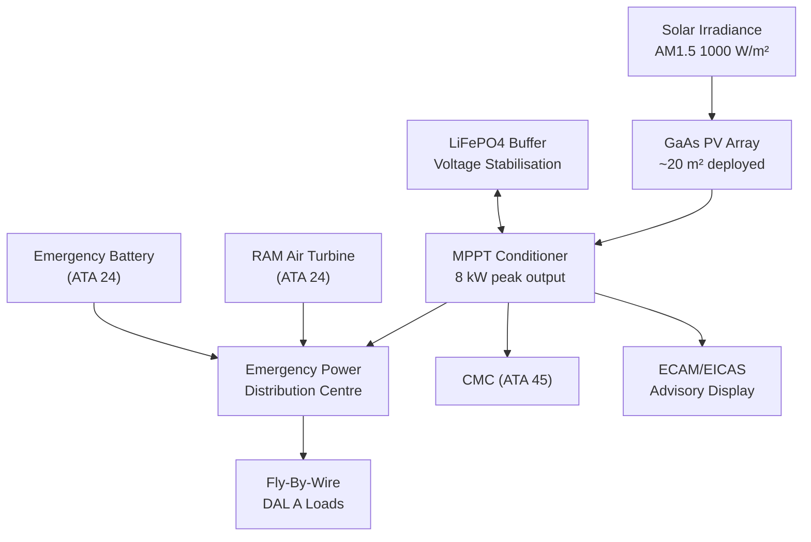
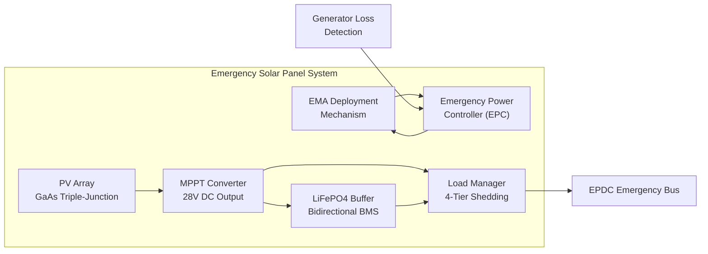
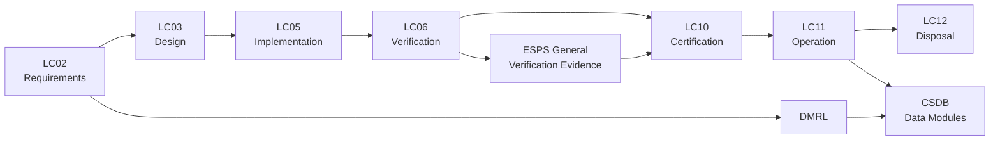

# ATLAS 040-049 · Section 04 · Subsection 043 · 000 — Emergency Solar Panel System General

## 0. Hyperlink Policy

All internal cross-references use relative Markdown links within the Q+ATLANTIDE CSDB repository. External regulatory citations in §19/§20 marked . Parent context: [ATLAS 043 README](./README.md).

---

## 1. Purpose

This document establishes the top-level concept, functional allocation, architectural rationale, safety philosophy, and compliance framework for the Emergency Solar Panel System (ESPS) of the AMPEL360E eWTW aircraft. The ESPS provides a supplementary emergency electrical power source activated automatically on loss of all engine-driven generators, supplementing the Ram Air Turbine (RAT) and emergency batteries to extend safe flight and landing capability.

Key governance areas:
- ESPS system boundaries, power generation capacity, and deployment philosophy.
- Compliance approach for CS-25 §25.1309, DO-160G, and DO-254/DO-178C for control functions.
- Interface conventions between ESPS and aircraft Emergency Power Distribution Centre (EPDC).
- Safety goals, DAL allocation per ARP4754B, and dual failure mode prevention.
- Qualification approach including photovoltaic cell qualification and deployment mechanism certification.

---

## 2. Applicability

| Attribute | Value |
|-----------|-------|
| Aircraft Program | AMPEL360E eWTW |
| ATA Chapter | ATA 43 (ATLAS 043) — Emergency Solar Panel System |
| Certification Basis | CS-25 Amendment 28; CS-25 §25.1309; DO-160G |
| Applicable Standards | DO-160G; DO-254; DO-178C; ARP4754B; IEC 61215 (PV qualification) |
| Design Assurance Level | System: DAL B; Deployment control: DAL B; PV cells: DAL C |
| Configuration | AMPEL360E Build Standard 1.0 and above |

---

## 3. System / Function Overview

The AMPEL360E ESPS is a deployable photovoltaic array integrated on the upper wing surface. Under normal flight conditions, the solar panels are stowed flush with the wing skin. On detection of total generator loss (all engine-driven generators and APU generator failed), the ESPS automatically deploys within 30 seconds, exposing the GaAs triple-junction photovoltaic array to ambient sunlight.

Key system parameters:
- **Peak power output:** 8 kW at AM1.5 solar irradiance (1000 W/m²), full array deployed.
- **Array area:** Approximately 20 m² of GaAs triple-junction cells (η ≥ 30%).
- **Supported endurance:** ≥30 minutes of emergency bus loads (FBW, instruments, comms, cabin safety).
- **Deployment time:** <30 seconds from generator loss detection to full array deployment.
- **Stow time:** <45 seconds on cockpit retract command (landing configuration).
- **Energy storage buffer:** LiFePO4 battery buffer integrated for bus voltage stabilisation and solar gap coverage (cloud shadow events).

The ESPS supplements but does not replace the RAT, which remains the primary emergency power source. The ESPS extends total emergency power endurance beyond RAT alone, increasing the safe flight time available for emergency landing.

---

## 4. Scope

### 4.1 Included

- ESPS photovoltaic array architecture and power generation capacity.
- Electromechanical deployment and retraction mechanism.
- Maximum Power Point Tracking (MPPT) power conditioning.
- LiFePO4 buffer battery and charge management.
- Emergency bus load prioritisation and distribution management.
- Panel position indication and ECAM/EICAS warning system integration.
- Thermal, environmental, and structural interfaces.
- BITE, monitoring, and CMC integration.

### 4.2 Excluded

- Ram Air Turbine (RAT) system (ATA 24).
- Emergency battery system (ATA 24) other than ESPS buffer.
- Aircraft electrical generation system (ATA 24).
- Wing primary structure design (ATA 57) other than ESPS hardpoints.

---

## 5. Architecture Description

**System Architecture:** The ESPS comprises three subsystem layers: (1) Energy Capture — GaAs PV array with bypass diodes and anti-reflective cover glass; (2) Power Conditioning — MPPT DC-DC converter regulating output to 28 V DC bus; (3) Energy Storage — LiFePO4 buffer battery with bidirectional charge controller.

**Deployment Architecture:** Electromechanical Actuators (EMAs) mounted at the wing-panel hinge line retract/deploy the panel assembly. Deployment is triggered automatically by the Emergency Power Controller (EPC) on generator loss detection (all generators failed, verified by triple redundant bus voltage monitoring). Stow command available from cockpit ESPS control panel and automatically commanded at weight-on-wheels for landing.

**Power Distribution:** ESPS output feeds the aircraft Emergency Bus via an OR-ing diode, sharing the bus with the RAT and emergency battery outputs. Load prioritisation is managed by the Emergency Power Distribution Centre (EPDC) which implements four load-shedding tiers controlled by the ESPS Load Management function.

**Safety Architecture:** The ESPS is a supplementary system; its failure must not create a hazardous condition. Failure modes include: failure to deploy (results in reduced emergency power endurance — Major failure condition), spurious deployment (results in aerodynamic drag increase — Hazardous condition if at high speed), and failure to stow (landing gear retraction may be affected — Hazardous condition). DAL B is assigned to deployment control consistent with Hazardous failure condition probability requirement of <10⁻⁷ /FH.

---

## 6. Functional Breakdown

| Function ID | Function Name | Description | DAL | Owner |
|-------------|---------------|-------------|-----|-------|
| F-043-01 | Emergency Power Generation | Generate up to 8 kW DC from GaAs PV array when deployed at AM1.5 irradiance; supply EPDC emergency bus via OR-ing diode | B | Q-GREENTECH |
| F-043-02 | System Health Monitoring | Continuously monitor PV array output, buffer battery SoC, deployment mechanism position, and power conditioner status; report to CMC | B | Q-DATAGOV |
| F-043-03 | Automatic Deployment Control | Detect total generator loss; command EMA deployment within 30 s; inhibit deployment when airspeed >300 kts or panels in maintenance stow-lock | B | Q-GREENTECH |
| F-043-04 | Power Conditioning | Operate MPPT algorithm to extract maximum power from PV array; regulate 28 V DC output; filter EMI per DO-160G §21 | B | Q-GREENTECH |
| F-043-05 | Load Management | Implement four-tier emergency load shedding to ensure FBW and flight instruments sustained for ≥30 min from combined ESPS + RAT + battery sources | B | Q-AIR |

---

## 7. Mermaid — System Context Diagram

---

## 8. Mermaid — Internal Functional Architecture

---

## 9. Mermaid — Lifecycle Traceability

---

## 10. Interfaces

| Interface ID | Name | Type | Counterpart System | Protocol | Direction |
|--------------|------|------|--------------------|----------|-----------|
| IF-043-01 | ESPS to EPDC Emergency Bus | Electrical | EPDC (ATA 24) | 28 V DC, OR-ing diode | Output |
| IF-043-02 | ESPS to RAT Power Bus | Electrical | RAT (ATA 24) | 28 V DC bus sharing | Shared |
| IF-043-03 | ESPS to CMC | Data | CMC (ATA 45) | ARINC 429 fault/status | Output |
| IF-043-04 | ESPS to ECAM/EICAS | Data | Display Systems (ATA 31) | AFDX VL; CAS messages | Output |
| IF-043-05 | ESPS to Cockpit Control Panel | Data | ESPS Control Panel | Discrete I/O; ARINC 429 | Bidirectional |
| IF-043-06 | ESPS to Wing Structure | Mechanical | Wing Upper Surface (ATA 57) | Panel hinge hardpoints, EMA mount | Physical |

---

## 11. Operating Modes

| Mode | Name | Description | Entry Condition | Exit Condition |
|------|------|-------------|-----------------|----------------|
| M1 | Normal Stowed | Panels flush with wing; system in standby monitoring; no power generation | Normal flight, generators operative | Generator loss detected |
| M2 | Auto-Deployment | EMA extending panels to deployed position; deployment in progress | Generator loss detected; airspeed <300 kts | Panels fully deployed |
| M3 | Emergency Power Generation | Panels deployed; MPPT active; power fed to EPDC; load management active | Deployment complete | Cockpit stow command or landing |
| M4 | Stowing | EMA retracting panels; cockpit-commanded or auto-stow at WoW | Stow command issued | Panels fully stowed |
| M5 | Maintenance Stow-Lock | Panels stowed and mechanically locked; ESPS powered down | Ground; maintenance mode | Stow-lock released |

---

## 12. Monitoring and Diagnostics

- **PV Array Output Monitoring:** Array current and voltage monitored at 10 Hz; power output logged and compared to expected output model (irradiance × η × area); deviation >20% triggers CMC advisory.
- **Deployment Position:** Dual Hall-effect sensors per panel confirm deployed/stowed position; position disagreement triggers CMC caution and inhibits further EMA commands.
- **Buffer Battery SoC:** LiFePO4 SoC estimated by coulomb counting at 1 Hz; SoC <20% triggers CMC advisory; SoC <10% triggers load shedding tier escalation.
- **MPPT Efficiency:** MPPT algorithm efficiency (P_out/P_theoretical_max) monitored; <90% efficiency triggers MPPT diagnostic cycle (I-V curve sweep).
- **EMA Current Monitoring:** EMA motor current monitored during deployment/retraction; over-current (>150% nominal) triggers EMA fault and CMC alert.
- **Thermal Monitoring:** Panel substrate temperature monitored per string; >85°C triggers power derating for thermal protection.
- **Structural Load Monitoring:** Strain gauges on panel hinge hardpoints monitor bending moments; >80% design limit triggers CMC advisory.
- **PHM — Degradation Rate:** PV cell power degradation rate tracked per flight; degradation rate >1%/year triggers PHM advisory for array inspection.

---

## 13. Maintenance Concept

| Task ID | Task Description | Interval | Access | Skill Level |
|---------|-----------------|----------|--------|-------------|
| MC-043-01 | ESPS visual inspection (panel surface, hinge, seals) | Pre-flight / A-Check | Wing upper surface access | Line Mechanic |
| MC-043-02 | ESPS BITE execution and output power check | A-Check | Ground Support Terminal | Avionics Technician |
| MC-043-03 | EMA functional test (deploy/retract cycle) | A-Check | Ground; EMA test mode | Avionics Technician |
| MC-043-04 | I-V curve sweep and string performance check | C-Check | Solar analyser tool | Avionics Engineer |
| MC-043-05 | LiFePO4 buffer battery capacity check and replacement | 2 years / On-Condition | Battery bay access | Avionics Technician |

---

## 14. S1000D / CSDB Mapping

| Data Module Code (DMC) | Title | Publication Type | SNS |
|------------------------|-------|-----------------|-----|
| QATL-A-043-00-00-00AAA-040A-A | ESPS System Description | AMM | 043-000 |
| QATL-A-043-00-00-00AAA-520A-A | ESPS BITE and Output Power Check Procedures | AMM | 043-000 |
| QATL-A-043-00-00-00AAA-920A-A | ESPS Fault Isolation | FIM | 043-000 |
| QATL-A-043-00-00-00AAA-941A-A | ESPS Illustrated Parts Data | IPD | 043-000 |

### Recommended DM Set

| DM Role | DMC Suffix | Content |
|---------|-----------|---------|
| System Overview | 040A | ESPS architecture, interfaces, operating modes |
| BITE Procedure | 520A | Output power check, EMA test, SoC check |
| Fault Isolation | 920A | Fault codes, isolation trees, corrective actions |
| IPD | 941A | Panel assembly PN, MPPT PN, battery PN |

---

## 15. Footprints

### 15.1 Physical

| Item | Value |
|------|-------|
| Panel Assembly Deployed Area | ≈ 20 m² (wing upper surface) |
| Panel Assembly Stowed Thickness | ≈ 12 mm (flush with wing skin) |
| Total ESPS System Mass | ≤ 48 kg (panels + EMA + conditioner + battery) |
| EMA Count | 8 (4 per wing panel) |

### 15.2 Electrical / Data

| Parameter | Value |
|-----------|-------|
| Peak Power Output | 8 kW at AM1.5 (1000 W/m², 25°C cell temperature) |
| Output Voltage | 28 V DC regulated |
| Buffer Battery Capacity | 2 kWh (LiFePO4) |
| MPPT Conversion Efficiency | ≥95% |

### 15.3 Maintenance

| Parameter | Value |
|-----------|-------|
| Panel Replacement Time | <4 hours (wing access required) |
| Battery Replacement Time | <1 hour |
| BITE Test Duration | <5 min |

### 15.4 Data

| Parameter | Value |
|-----------|-------|
| Power Log Sample Rate | 1 Hz continuous |
| Fault Log Capacity | 1000 events in NVM |
| I-V Curve Sweep Duration | <3 min per string |

---

## 16. Safety and Certification Considerations

- **CS-25 §25.1309 Compliance:** ESPS failure mode analysis demonstrates that failure to deploy is a Major failure condition (reduced emergency endurance); spurious deployment above 300 kts is a Hazardous condition prevented by airspeed inhibit; probability targets assigned accordingly.
- **DAL B Deployment Control:** Deployment control logic (EPC) is developed to DO-178C DAL B and hardware to DO-254 DAL B consistent with prevention of Hazardous failure conditions per ARP4754B.
- **Airspeed Inhibit:** Deployment is inhibited above 300 kts CAS (from ADIRU) to prevent structural overload of deployed panels; single failure of airspeed inhibit defeated by independent panel structural limit analysis.
- **PV Cell Flammability:** GaAs cells do not present flammability risk under CS-25 §25.853; EVA encapsulant passed flame spread test; emergency shutdown disconnects all PV strings from bus within 200 ms.
- **EMI Compatibility:** MPPT DC-DC converter qualified per DO-160G §21 (conducted EMI) and §20 (radiated EMI); does not interfere with IMA, navigation, or communication systems.
- **Disposal:** GaAs cells contain arsenic; disposal requires controlled hazardous materials process per applicable environmental regulations; disposal plan included in CSDB.

---

## 17. Verification and Validation

| V&V ID | Requirement | Method | Evidence | Status |
|--------|-------------|--------|----------|--------|
| VV-043-01 | ESPS deploys within 30 s of generator loss | Test | Iron-bird deployment timing test |  |
| VV-043-02 | Peak power ≥8 kW at AM1.5, 25°C cell temperature | Test | Solar simulator qualification test |  |
| VV-043-03 | Deployment inhibited above 300 kts CAS | Test | Airspeed inhibit test |  |
| VV-043-04 | Emergency bus sustained for ≥30 min (ESPS + RAT combined) | Analysis | Power budget analysis |  |
| VV-043-05 | MPPT efficiency ≥95% across 20–100% irradiance range | Test | MPPT efficiency measurement |  |
| VV-043-06 | Spurious deployment probability <10⁻⁷ /FH | Analysis | FHA + fault tree analysis |  |
| VV-043-07 | DO-160G §20/§21 EMI compliance | Test | DO-160G EMI test report |  |

---

## 18. Glossary

| Term | Acronym | Definition |
|------|---------|------------|
| Emergency Solar Panel System | ESPS | Deployable photovoltaic array providing emergency electrical power on total generator loss |
| Maximum Power Point Tracking | MPPT | Algorithm continuously adjusting PV operating point to extract maximum available power from array |
| Gallium Arsenide | GaAs | High-efficiency photovoltaic cell semiconductor material; η ≥ 30% in triple-junction configuration |
| Design Assurance Level | DAL | Classification A–E of rigour required for hardware/software development per ARP4754B |
| Photovoltaic Cell | PV Cell | Device converting solar irradiance directly to electrical DC power via photovoltaic effect |
| AM1.5 | — | Air Mass 1.5; standard solar spectrum at sea level, 48.2° solar zenith angle; 1000 W/m² total irradiance |
| Maximum Power Point | MPP | Operating point (V, I) on PV characteristic curve at which power output is maximised |
| Electromechanical Actuator | EMA | Motor-driven linear or rotary actuator used for ESPS panel deployment and retraction |
| State of Charge | SoC | Current energy level of battery expressed as percentage of rated capacity |
| Lithium Iron Phosphate | LiFePO4 | Lithium battery chemistry with high safety, cycle life, and thermal stability; used for ESPS buffer battery |

---

## 19. Citations

| Ref ID | Standard / Document | Applicability | Status |
|--------|--------------------|-----------|----|
| CIT-043-01 | EASA CS-25 §25.1309, Equipment, Systems and Installations | Safety probability requirements for ESPS |  |
| CIT-043-02 | RTCA DO-160G, Environmental Conditions and Test Procedures | ESPS environmental qualification |  |
| CIT-043-03 | RTCA DO-254, Design Assurance Guidance for Airborne Electronic Hardware | EPC hardware DAL B |  |
| CIT-043-04 | RTCA DO-178C, Software Considerations | EPC software DAL B |  |
| CIT-043-05 | SAE ARP4754B, Guidelines for Development of Civil Aircraft | System DAL allocation |  |
| CIT-043-06 | IEC 61215, Terrestrial PV Modules — Design Qualification | PV cell and module qualification |  |
| CIT-043-07 | IEC 61853, PV Module Performance Testing and Energy Rating | Performance at non-standard irradiance |  |
| CIT-043-08 | EASA CS-25 §25.629, Aeroelastic Stability Requirements | Flutter margin for deployed panels |  |

---

## 20. References

| Ref ID | Document | Version | Status |
|--------|----------|---------|--------|
| REF-043-01 | AMPEL360E Emergency Power Architecture | 1.0 |  |
| REF-043-02 | ATLAS 043 README — ESPS Subsection Index | 1.0 |  |
| REF-043-03 | AMPEL360E Functional Hazard Assessment — ESPS | 1.0 |  |
| REF-043-04 | AMPEL360E ESPS Power Budget Analysis | 1.0 |  |

---

## 21. Open Issues

| Issue ID | Description | Owner | Status |
|----------|-------------|-------|--------|
| OI-043-01 | GaAs triple-junction cell supplier qualification status to be confirmed | Q-GREENTECH |  |
| OI-043-02 | Interaction between ESPS deployment and wing aeroelastic response at cruise speed to be assessed | Q-AIR |  |
| OI-043-03 | LiFePO4 battery thermal management design for -55°C ground operation to be completed | Q-GREENTECH |  |

---

## 22. Change Log

| Version | Date | Author | Description |
|---------|------|--------|-------------|
| 1.0.0 | 2025-01-01 | Q-GREENTECH | Initial baseline release |  |
